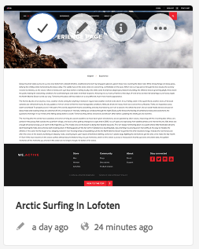
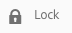
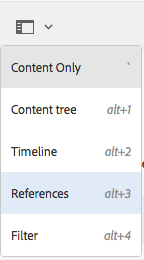
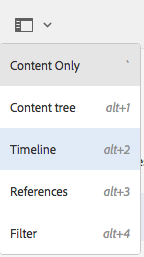

# Guía rápida para la creación de páginas{#quick-guide-to-authoring-pages}

Los siguientes procedimientos pretenden ser una guía rápida (de alto nivel) en la que se reflejan las acciones clave para crear el contenido de páginas en AEM.

Estos procedimientos:

* No son una cobertura integral.
* Proporcionan enlaces para una documentación detallada.

Para obtener más información sobre la creación con AEM, consulte:

* [Primeros pasos de creación](/help/sites-authoring/first-steps.md)
* [Creación de páginas](/help/sites-authoring/page-authoring.md)

## Algunas sugerencias rápidas {#a-few-quick-hints}

Antes de proporcionar la descripción general de los detalles, a continuación se muestran varias sugerencias y consejos generales que se deben tener en cuenta.

### Consola Sitios {#sites-console}

* **Crear**

   * Este botón está disponible en muchas consolas. Las opciones presentadas son sensibles al contexto, por lo que pueden variar en función del escenario.

* Reordenar las páginas en una carpeta

   * This can be done in [List View](/help/sites-authoring/basic-handling.md#list-view). The changes will be applied and be visible in other views.

#### Creación de páginas {#page-authoring}

* Vínculos de navegación 

   * ***No se puede navegar con vínculos*** cuando se está en el modo **Edición**. Para navegar con vínculos debe [acceder a una vista previa de la página](/help/sites-authoring/editing-content.md#previewing-pages) mediante una de las acciones siguientes:

      * [Modo de vista previa](/help/sites-authoring/editing-content.md#preview-mode)
      * [Ver tal y como aparece publicado](/help/sites-authoring/editing-content.md#view-as-published)

* Las versiones no se inician ni se crean en el editor de páginas; ahora se realiza desde la consola de sitios (a través de la opción **Crear** o la [línea de tiempo](/help/sites-authoring/basic-handling.md#timeline) de un recurso seleccionado).

>[!NOTE]
>
>Existen varios métodos abreviados del teclado que pueden hacer que la experiencia de creación sea más sencilla.
>
>* [Métodos abreviados de teclado al editar páginas](/help/sites-authoring/page-authoring-keyboard-shortcuts.md)
>* [Métodos abreviados de teclado para las consolas](/help/sites-authoring/keyboard-shortcuts.md)
>

### Encontrar su página {#finding-your-page}

Existen varios aspectos para encontrar una página; puede navegar o buscar:

1. Abra la consola **Sitios** (con la opción **Sitios** de [Navegación global](/help/sites-authoring/basic-handling.md#global-navigation): esto se activa (menú desplegable) al seleccionar el vínculo de Adobe Experience Manager (parte superior izquierda).

1. Desplácese por el árbol y toque o haga clic en la página adecuada. La manera en la que se presentan los recursos de la página depende de la vista que utilice: [Tarjeta, Lista o Columnas](/help/sites-authoring/basic-handling.md#viewing-and-selecting-resources):

   

1. Navigate up the tree using [the breadcrumb in the header](/help/sites-authoring/basic-handling.md#theheaderwithbreadcrumbs), which allows you to return to the selected location:

   

1. También puede [buscar](/help/sites-authoring/search.md) una página. Puede seleccionar la página en los resultados que se muestran.

   

### Creación de una nueva página {#creating-a-new-page}

Para [crear una nueva página](/help/sites-authoring/managing-pages.md#creating-a-new-page):

1. [Desplácese hasta la ubicación](#finding-your-page) en la que desee crear la nueva página.
1. Elija el icono **Crear** y seleccione **Página** en la lista:

   

1. Se abrirá el asistente que le guiará para recopilar la información necesaria cuando [cree su nueva página](/help/sites-authoring/managing-pages.md#creating-a-new-page). Siga las instrucciones que se muestran en la pantalla.

### Seleccionar su página para ejecutar acciones adicionales {#selecting-your-page-for-further-action}

Puede seleccionar una página para llevar a cabo otras acciones. Seleccionar una página permitirá actualizar automáticamente la barra de herramientas para mostrar las medidas relevantes para ese recurso.

Cómo seleccionar una página depende de la vista que se utilice en el panel:

1. Vista de columna:

   * Haga clic o toque en la miniatura del recurso en cuestión: la vista en miniatura mostrará una marca de verificación para indicar que se ha seleccionado.

1. Vista en lista:

   * Haga clic o toque en la miniatura del recurso en cuestión: la vista en miniatura mostrará una marca de verificación para indicar que se ha seleccionado.

1. Vista de tarjeta:

   * Indique el modo de selección [seleccionando el recurso necesario](/help/sites-authoring/basic-handling.md#viewingandselectingyourresources) con:

      * Dispositivo móvil: mantener pulsado
      * Escritorio: el icono de marca de verificación de [acción rápida](/help/sites-authoring/basic-handling.md#quick-actions):
   

   * En la tarjeta se superpondrá una marca de verificación que indica que se ha seleccionado la página.
   >[!NOTE]
   >
   >Una vez en modo de selección, el icono **Seleccionar** (visto) cambiará al icono **Desactivar** (cruz).

### Acciones rápidas (solo vista de tarjeta y escritorio) {#quick-actions-card-view-desktop-only}

Hay [acciones rápidas](/help/sites-authoring/basic-handling.md#quick-actions) disponibles:

1. [Desplácese hasta la página](#finding-your-page) sobre la que quiera llevar a cabo una acción.
1. Pase el puntero del ratón sobre la tarjeta que representa el recurso necesario; se mostrarán las acciones rápidas: 

   

### Edición del contenido de la página {#editing-your-page-content}

Para editar la página:

1. [Desplácese hasta la página](#finding-your-page) que quiera editar.
1. [Abra la página que quiera editar](/help/sites-authoring/managing-pages.md#opening-a-page-for-editing) con el icono Editar (lápiz):

   

   Puede acceder desde:

   * [Acciones rápidas (solo vista de tarjeta y escritorio)](#quick-actions-card-view-desktop-only) para el recurso adecuado.
   * La barra de herramientas, cuando [su página se haya seleccionado](#selectiingyourpageforfurtheraction).

1. Cuando se abre el editor puede:

   * [Añadir un componente nuevo a su página](/help/sites-authoring/editing-content.md#inserting-a-component) mediante las siguientes opciones:

      * Abrir el panel lateral
      * Seleccionar la pestaña de componentes (el [buscador de componentes](/help/sites-authoring/author-environment-tools.md#components-browser))
      * Arrastrar el componente requerido a su página
      El panel lateral se puede abrir (y cerrar) con:
   

   * [Editar el contenido de un componente existente](/help/sites-authoring/editing-content.md#edit-configure-copy-cut-delete-paste) en la página:

      * Abra la barra de herramientas de componentes haciendo clic sobre ella. Utilice el icono **Editar** (lápiz) para abrir el cuadro de diálogo.
      * Abra el editor para el componente haciendo clic y aguantando el puntero o con un doble clic. Se mostrarán las acciones disponibles (para algunos componentes se trata de una selección limitada).
      * Para ver todas las acciones disponibles, acceda al modo de pantalla completa utilizando:
   

   * [Configurar las propiedades de un componente existente](/help/sites-authoring/editing-content.md#component-edit-dialog)

      * Abra la barra de herramientas de componentes haciendo clic sobre ella. Utilice el icono **Configurar** (llave inglesa) para abrir el cuadro de diálogo.
   * [Desplazar un componente](/help/sites-authoring/editing-content.md#moving-a-component) mediante las siguientes opciones:

      * Arrastre el componente requerido hasta su nueva ubicación.
      * Open the component toolbar with either tap or click. Use the **Cut** then **Paste** icons where required.
   * [Copiar (y Pegar)](/help/sites-authoring/editing-content.md#edit-configure-copy-cut-delete-paste) un componente:

      * Open the component toolbar with either tap or click. Use the **Copy** then **Paste** icons as required.
   >[!NOTE]
   >
   >Puede **pegar** componentes en la misma página o en otra página. Si pega el componente en una página diferente que ya estaba abierta antes de la operación de cortar o copiar, tendrá que actualizase la página. 

   * [Eliminar](/help/sites-authoring/editing-content.md#edit-configure-copy-cut-delete-paste) un componente:

      * Open the component toolbar with either tap or click, then use the **Delete** icon.
   * [Añadir anotaciones](/help/sites-authoring/annotations.md#annotations) a la página:

      * Seleccione el modo **Anotar** (icono de bocadillo). Añada anotaciones utilizando el icono **Añadir anotación** (signo más). Salga del modo Anotar utilizando la X en la parte superior derecha.
   

   * [Vista previa de una página](/help/sites-authoring/editing-content.md#preview-mode) (para ver cómo aparecerá en el entorno donde se publicará):

      * Seleccione **Vista previa** en la barra de herramientas.
   * Volver al modo de edición (o seleccionar otro modo) haciendo clic en **Editar** en el selector desplegable.
   >[!NOTE]
   >
   >Para navegar mediante los vínculos en el contenido debe utilizar el [modo de vista previa](/help/sites-authoring/editing-content.md#preview-mode).

### Editar las Propiedades de la página {#editing-the-page-properties}

Existen dos métodos (principales) para [editar las propiedades de la página](/help/sites-authoring/editing-page-properties.md):

* Desde la consola **Sitios:**

   1. [Desplácese hasta la página](#finding-your-page) que quiera publicar.
   1. Seleccione el icono **Propiedades** desde:

      * [Acciones rápidas (solo vista de tarjeta y escritorio)](#quick-actions-card-view-desktop-only) para el recurso adecuado.
      * La barra de herramientas, cuando [su página se haya seleccionado](#selectiingyourpageforfurtheraction).
   

   1. Se mostrarán las propiedades de la página. Puede aplicar actualizaciones según sea necesario y, a continuación, seleccionar Guardar para preservarlas.

* Cuando [edite su página](#editing-your-page-content):

   1. Abra el menú **Información de la página.**
   1. Seleccione **Abrir propiedades** para abrir el cuadro de diálogo y editar las propiedades.
   

### Publicar su página (o eliminar la publicación) {#publishing-your-page-or-unpublishing}

Existen dos métodos principales para [publicar su página](/help/sites-authoring/publishing-pages.md) (y también para eliminar la publicación):

* Desde la consola **Sitios:**

   1. [Desplácese hasta la página](#finding-your-page) que quiera publicar.
   1. Select the **Quick Publish** icon from either:

      * [Acciones rápidas (solo vista de tarjeta y escritorio)](#quick-actions-card-view-desktop-only) para el recurso adecuado.
      * La barra de herramientas cuando su [página se haya seleccionado](#selectiingyourpageforfurtheraction) (también permite el acceso a [Publicar posteriormente](/help/sites-authoring/publishing-pages.md#main-pars-title-12)).
   

* Cuando [edite su página](#editing-your-page-content):

   1. Abra el menú **Información de la página.**
   1. Seleccione **Publicar página**.
   

* La cancelación de la publicación de una página desde la consola solo se puede realizar a través de la opción de **Administrar publicación**, que solo está disponible en la barra de herramientas (no a través de las acciones rápidas).

   La opción **Cancelar la publicación de página** todavía está disponible mediante el menú **Información de página del editor**.

   

   Consulte [Publicación de páginas](/help/sites-authoring/publishing-pages.md#unpublishing-pages) para obtener más información.

### Mover, copiar y pegar o eliminar su página {#move-copy-and-paste-or-delete-your-page}

Todas estas acciones pueden activarse del siguiente modo:

1. [Desplácese hasta la página](#finding-your-page) que quiera mover, copiar, pegar o eliminar.
1. Seleccione el icono Copiar (y después, Pegar), Mover o Eliminar mediante:

   * [Acciones rápidas (solo vista de tarjeta y escritorio)](#quick-actions-card-view-desktop-only) para el recurso necesario.
   * La barra de herramientas, cuando [su página se haya seleccionado](#selecting-your-page-for-further-action).
   A continuación, depende de la acción:

   * Copiar:

      * Desplácese hasta la nueva ubicación y péguelo allí.
   * Mover:

      * Se abrirá el asistente para recoger la información necesaria para mover la página. Siga las instrucciones que aparecen en la pantalla.
   * Eliminar:

      * Se le solicitará que confirme la acción.
   >[!NOTE]
   >
   >La opción Eliminar no se encuentra disponible como Acción rápida.

### Locking Your Page (then Unlocking) {#locking-your-page-then-unlocking}

[Bloquear una página](/help/sites-authoring/editing-content.md#locking-a-page) impide a otros autores que trabajen en ella al mismo tiempo que usted. El botón o icono Bloquear (y Desbloquear) se puede encontrar en:

* La barra de herramientas, cuando [su página se haya seleccionado](#selecting-your-page-for-further-action).
* Menú desplegable [Información de la página](#editing-the-page-properties) cuando edita la página.
* Barra de herramientas de la página cuando edita la página (cuando está bloqueada).

Por ejemplo, el icono de bloqueo presenta el siguiente aspecto:

### Acceder a las referencias de la página {#accessing-page-references}

[El acceso rápido a las referencias](/help/sites-authoring/author-environment-tools.md#references) hasta/desde una página está disponible en la Barra de referencias.

1. Seleccione **Referencias** mediante el icono de la barra de herramientas (antes o después de [ seleccionar su página](#selecting-your-page-for-further-action)): 

   

   Se muestra una lista de tipos de referencias:

   

1. Haga clic en el tipo de referencia requerido para mostrar más detalles y (cuando sea adecuado) poder llevar a cabo otras acciones.

### Crear una versión de su página {#creating-a-version-of-your-page}

Para crear una [versión](/help/sites-authoring/working-with-page-versions.md) de la página:

1. Para abrir el carril de línea de tiempo, seleccione **[Línea de tiempo](/help/sites-authoring/basic-handling.md#timeline)**con el icono de la barra de herramientas (antes o después de[seleccionar su página](#selecting-your-page-for-further-action)):

   

1. Haga clic/toque en la flecha que apunta hacia arriba, en la parte inferior derecha de la columna Línea de tiempo, para mostrar botones adicionales; como, por ejemplo, **Guardar como versión**.

   

1. Seleccione **Guardar como versión**, y después seleccione **Crear**.

### Restablecer o comparar una versión de su página {#restoring-comparing-a-version-of-your-page}

Se utiliza el mismo mecanismo básico cuando se restablecen y/o se comparan versiones de su página:

1. Seleccione **[Línea de tiempo](/help/sites-authoring/basic-handling.md#timeline)**mediante el icono de la barra de herramientas (antes o después de[seleccionar su página](#selecting-your-page-for-further-action)):

   

   Si ya se ha guardado una versión de su página, se indicará en la línea de tiempo.   

1. Haga clic en la versión que quiere restablecer y así se revelarán botones de acción adicionales:

   * **Volver a esta versión**

      * Se restablecerá la versión.
   * **Mostrar las diferencias**

      * La página se abrirá con las diferencias (entre las dos versiones) resaltadas.
