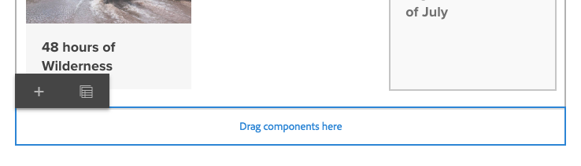
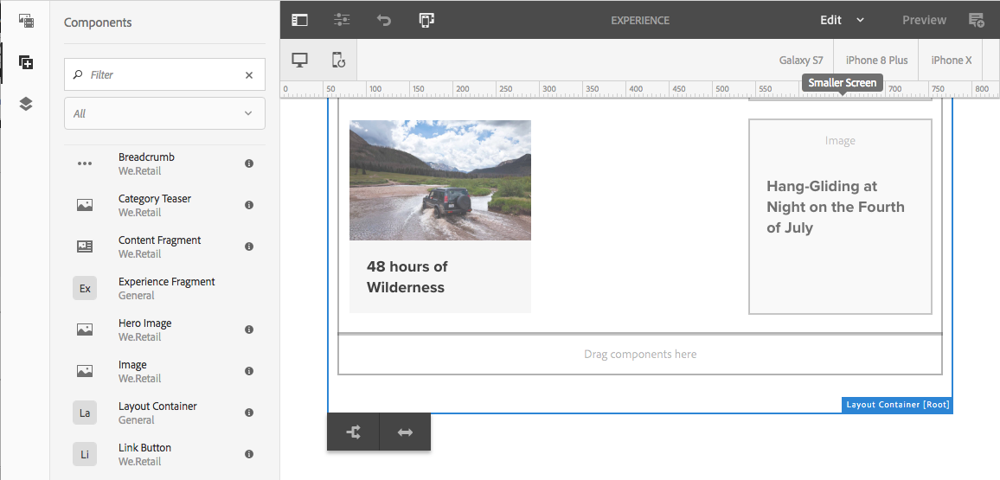

# Diseño interactivo{#responsive-layout}

AEM le permite disponer de un diseño interactivo para sus páginas mediante el uso del componente **Contenedor de diseño**.

Este componente proporciona un sistema de párrafos que le permite colocar componentes en una cuadrícula interactiva. Esta cuadrícula puede reorganizar el diseño en función del tamaño y formato del dispositivo o ventana. The component is used in conjunction with the [**Layout **mode](/help/sites-authoring/responsive-layout.md#defining-layouts-layout-mode), which allows you to create and edit your responsive layout dependent on device.

El contenedor de diseños:

* Proporciona un ajuste horizontal a la cuadrícula, además de la posibilidad de colocar componentes en la cuadrícula uno al lado de otro y de definir cuándo se deben contraer o redistribuir.
* Utiliza puntos de interrupción predefinidos (por ejemplo, para un teléfono, una tableta, etc.) que le permiten definir el comportamiento obligatorio del contenido para dispositivos relacionados/su orientación.

   * Por ejemplo, puede personalizar el tamaño del componente o si el componente se puede ver en determinados dispositivos.

* Se puede anidar para permitir el control de columnas.

El usuario puede utilizar el emulador para ver cómo se representará el contenido en determinados dispositivos.

>[!CAUTION]
>
>Aunque el componente Contenedor de diseño está disponible en la IU clásica, la funcionalidad completa solo está disponible y se admite en la IU táctil.

AEM realiza un diseño interactivo para sus páginas mediante una combinación de diferentes mecanismos:

* [**Contenedor **](#adding-a-layout-container-and-its-content-edit-mode)de diseño, componente

   This component is available in the [component browser](/help/sites-authoring/author-environment-tools.md#components-browser) and provides a grid-paragraph system to allow you to add and position components within a responsive grid. También se puede establecer como sistema de párrafos predeterminado en la página.

* [**Modo de diseño **](/help/sites-authoring/responsive-layout.md#defining-layouts-layout-mode)

   Once the layout container is positioned on your page you can use the **Layout** mode to position content within the responsive grid.

* [**Emulador **](#selecting-a-device-to-emulate)Esta opción le permite crear y editar sitios web interactivos que reorganizan el diseño en función del tamaño del dispositivo o la ventana, mediante el redimensionado activo de los componentes. El usuario puede utilizar el emulador para ver cómo se representará el contenido.

Estos mecanismos de cuadrícula interactiva le permiten:

* Utilizar puntos de interrupción para definir diferentes diseños de contenido según la anchura del dispositivo (en relación con el tipo de dispositivo y la orientación).
* Utilizar estos mismos puntos de interrupción y diseños de contenido para asegurarse de que el contenido es adaptable al tamaño de la ventana del navegador en el escritorio.
* Utilizar el ajuste horizontal a la cuadrícula que le permite colocar componentes en la cuadrícula, cambiar su tamaño según sea necesario y definir cuándo deben contraerse o redistribuirse lateralmente o arriba/abajo.
* Ocultar componentes de diseños de dispositivo específicos.
* Realizar el control de columnas.

Según el proyecto, el contenedor de diseños se puede usar como sistema de párrafos predeterminado para las páginas o como componente disponible para agregarse a la página a través del navegador de componentes (o ambos).

>[!NOTE]
>
>Adobe provides [GitHub documentation](https://adobe-marketing-cloud.github.io/aem-responsivegrid/) of the responsive layout as a reference that can be given to front-end developers allowing them to use the AEM grid outside of AEM, for example when creating static HTML mock-ups for a future AEM site.

>[!NOTE]
>
>El uso de los mecanismos anteriores se habilita en la configuración de la plantilla. See [Configuring Responsive Layout](/help/sites-administering/configuring-responsive-layout.md) for further information.

## Definiciones de diseños, emulación de dispositivos y puntos de interrupción {#layout-definitions-device-emulation-and-breakpoints}

Al crear el contenido de su sitio web desea asegurarse de que el contenido se muestre correctamente según el dispositivo utilizado para ello.

AEM le permite definir diseños en función de la anchura del dispositivo:

* El emulador le permite emular estos diseños en una serie de dispositivos. In addition to the device type, the orientation, selected by the **Rotate device** option, can impact the breakpoint selected as the width changes.
* Los puntos de interrupción son puntos que separan las definiciones de diseño.

   * Definen efectivamente la anchura máxima (en píxeles) de cualquier dispositivo que utilice un diseño específico.
   * Normalmente, los puntos de interrupción son válidos para una selección de dispositivos, en función del ancho de sus pantallas.
   * El alcance de un punto de interrupción se extiende hacia la izquierda hasta el siguiente punto de interrupción.
   * No puede seleccionar específicamente un punto de interrupción; al seleccionar el dispositivo y la orientación se selecciona automáticamente el punto de interrupción adecuado.

El dispositivo **Escritorio** no tiene una anchura específica y está relacionado con el punto de interrupción predeterminado (p. ej., todo lo que está por encima del último punto de interrupción configurado).

>[!NOTE]
>
>Es posible definir puntos de interrupción para cada dispositivo individual, pero esto incrementaría drásticamente los trabajos de definición de diseño y mantenimiento.

Al seleccionar en el emulador un dispositivo específico para emular y definir el diseño, el punto de interrupción relacionado también quedará resaltado. Todos los cambios que haga en el diseño se aplicarán a otros dispositivos a los que se aplique el punto de interrupción (por ejemplo, cualquier dispositivo posicionado a la izquierda del marcador de punto de interrupción activo, antes del siguiente marcador de punto de interrupción).

Por ejemplo, si selecciona el dispositivo **iPhone 6 Plus** (definido con una anchura de 540 píxeles) para emulación y diseño, se activará también el punto de interrupción **Teléfono** (definido como 768 píxeles). Cualquier cambio de diseño que realice para el **iPhone 6** se aplicará a los demás dispositivos que se encuentren bajo el punto de interrupción **Teléfonos**, como **iPhone 5** (definido como 320 píxeles).

## Selección de un dispositivo para emular {#selecting-a-device-to-emulate}

1. Abra la página deseada para editarla. Por ejemplo:

   `http://localhost:4502/editor.html/content/we-retail/us/en/experience.html`

1. Seleccione el icono **Emulador** de la barra de herramientas superior:

   

1. Se abrirá la barra de herramientas del emulador.

   

   La barra de herramientas del emulador muestra opciones de diseño adicionales:

   * **Rotar dispositivo**: le permite rotar un dispositivo de la orientación vertical a la horizontal y viceversa.
    

   * **Seleccionar dispositivo**: le permite definir un dispositivo específico para emular de una lista (consulte el paso siguiente para obtener detalles)
   

1. Al seleccionar un dispositivo específico para emular, puede efectuar cualquiera de las siguientes acciones:

   * Utilizar el icono Seleccionar dispositivo y seleccionarlo de un selector desplegable.
   * Tocar o hacer clic en el indicador del dispositivo de la barra de herramientas del emulador.
   

1. Una vez que haya seleccionado un dispositivo específico, puede:

   * See the active marker for the selected device, such as **iPad.**
   * See the active marker for the appropriate [breakpoint](/help/sites-authoring/responsive-layout.md#layout-definitions-device-emulation-and-breakpoints) such as **Tablet.**
   

   * La línea discontinua azul representa el *pliegue* para el dispositivo seleccionado (en este caso, un **iPhone 6**).
   

   * El pliegue también se puede considerar el salto de línea de la página (no confundir con los [puntos de interrupción](/help/sites-authoring/responsive-layout.md#layout-definitions-device-emulation-and-breakpoints)) del contenido. Esto se muestra para mostrar qué parte del contenido verá el usuario en el dispositivo antes de efectuar el desplazamiento.
   * La línea del pliegue no se mostrará si la altura del dispositivo que se emula es superior al tamaño de la pantalla.
   * El pliegue se muestra para la comodidad del autor y no aparece en la página publicada.

## Adición de un contenedor de diseño y su contenido (modo de edición) {#adding-a-layout-container-and-its-content-edit-mode}

Un **contenedor de diseño** es un sistema de párrafos que:

* Contiene otros componentes.
* Define el diseño.
* Responde a los cambios.

>[!NOTE]
>
>Si todavía no está disponible, el **contenedor de diseño** debe [activarse específicamente para un sistema de párrafos o página](/help/sites-administering/configuring-responsive-layout.md) (por ejemplo, usando el modo de [**diseño **](/help/sites-authoring/default-components-designmode.md)).

1. El **contenedor de diseños**[ está disponible como componente estándar en el navegador de componentes](/help/sites-authoring/author-environment-tools.md#components-browser). Puede arrastrarlo desde aquí hasta la ubicación deseada de la página. Después verá el marcador de posición **Arrastrar componentes aquí**.
1. A continuación, puede agregar componentes al contenedor de diseño. Estos componentes albergarán el contenido real:

   

## Selección y ejecución de una acción en un contenedor de diseños (modo de edición) {#selecting-and-taking-action-on-a-layout-container-edit-mode}

Al igual que con otros componentes, puede seleccionar un contenedor de diseños (cuando se encuentra en el modo de **edición**) y luego realizar una acción en él (copiar, cortar, eliminar):

>[!CAUTION]
>
>Dado que los contenedores de diseños son un sistema de párrafos, al eliminar el componente, se eliminará la cuadrícula de diseño y todos los componentes (y su contenido) incluidos en el contenedor.

1. Si pasa el puntero del ratón o toca el marcador de posición de la cuadrícula, se mostrará el menú de acciones.

   

   You need to select the **Parent** option.

   

1. Si el componente de diseño se encuentra anidado, la selección de la opción **Principal** presenta una lista desplegable de opciones que le permite seleccionar el contenedor de diseños anidado o sus elementos principales.

   Cuando pase el ratón sobre los nombres de contenedor de la lista desplegable, los contornos se mostrarán en la página.

   * El contenedor de diseños anidado en la parte inferior se mostrará en negro.
   * El siguiente contenedor de diseños anidado se mostrará de color gris oscuro.
   * Cada contenedor sucesivo aparecerá en un tono más claro de gris.
   

1. De esta forma se resaltará toda la cuadrícula con su contenido. The action toolbar will be shown, from where you can select an action such as **Delete.**

   

## Definición de diseños (modo de diseño) {#defining-layouts-layout-mode}

>[!NOTE]
>
>Puede definir un diseño distinto para cada [punto de interrupción](#layout-definitions-device-emulation-and-breakpoints) (tal y como determinan el tipo y la orientación del dispositivo emulado).

To configure the layout of a responsive grid implemented with the Layout Container you need to use the **Layout** mode.

El modo **Diseño** puede iniciarse de dos formas.

* By using the [mode menu in the toolbar](/help/sites-authoring/author-environment-tools.md#page-modes) and choosing **Layout** mode

   * Select the **Layout** mode just as you would switch to **Edit** mode or **Targeting** mode.
   * **El modo Diseño** permanece y no sale del modo **Presentación** hasta que se selecciona otro modo mediante el selector de modo.

* Al [editar un componente individual.](/help/sites-authoring/editing-content.md#edit-component-layout)

   * Mediante la opción **Diseño** del menú de acciones rápidas del componente, puede cambiar al modo **Diseño**.
   * El modo **Diseño** se mantiene durante la edición del componente, y se vuelve a acceder al modo **Editar** en cuanto el enfoque cambia a otro componente.

En el modo de diseño, puede ejecutar una serie de acciones a una cuadrícula:

* Redimensionar los componentes del contenido utilizando los puntos azules. Al redimensionar siempre se hará un ajuste a la cuadrícula. Al redimensionar se mostrará la cuadrícula de fondo como referencia para la alineación: 

   

   >[!NOTE]
   >
   >Se mantendrán las proporciones y relaciones al cambiar el tamaño de componentes como **Imágenes**.

* Haga clic o toque un componente de contenido. La barra de herramientas le permite efectuar las siguientes acciones:

   * **Principal**

      Permite seleccionar todo el componente de contenedor de diseño para realizar acciones en todo el contenido.

   * **Flotar a una línea nueva**

      El componente se moverá a una nueva línea, según el espacio disponible en la cuadrícula.

   * **Ocultar componente**

      El componente se volverá invisible (se puede restaurar desde la barra de herramientas del contenedor de diseño).
   

* In **Layout** mode you can tap/click on the **Drag components here** to select the entire component. Esto hará que se muestre la barra de herramientas de este modo.

   La barra de herramientas mostrará distintas opciones en función del estado del componente del diseño y de los componentes que pertenecen a él. Por ejemplo:

   * **Principal** : seleccione el componente principal.
   

   * **Mostrar componentes** ocultos: muestra todos o algunos componentes. El número indica cuántos componentes ocultos hay actualmente. El contador muestra cuántos componentes están ocultos.
   

   * **Revertir diseño** de punto de interrupción: vuelva al diseño predeterminado. Esto significa que no se impondrá ningún diseño personalizado.
   

   * **Flotar a una nueva línea** : Mueva el componente hacia arriba en una posición si el espaciado lo permite.
   

   * **Ocultar componente** : permite ocultar el componente actual.
   

   >[!NOTE]
   >
   >En el ejemplo anterior, las acciones de flotar y ocultar están disponibles porque este contenedor de diseño está anidado en un contenedor de diseño principal.

   * **Mostrar los componentes:** permite seleccionar los componentes principales para mostrar la barra de herramientas de acciones con la opción **Mostrar componentes ocultos**. En este ejemplo, hay dos componentes ocultos.
   

   Si se selecciona la opción **Mostrar componentes ocultos**, se mostrarán en azul los componentes que están ocultos actualmente en sus posiciones originales.

   

   La selección de la opción **Restaurar todo** permitirá que se muestren todos los componentes ocultos.

