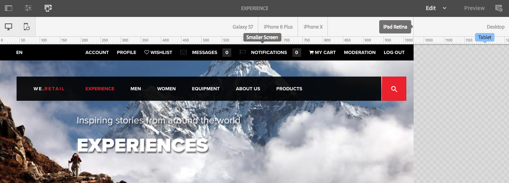
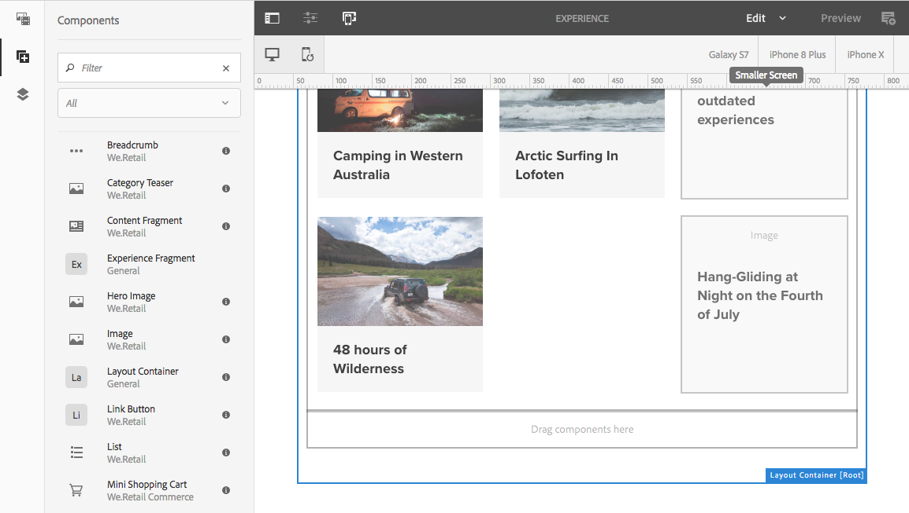
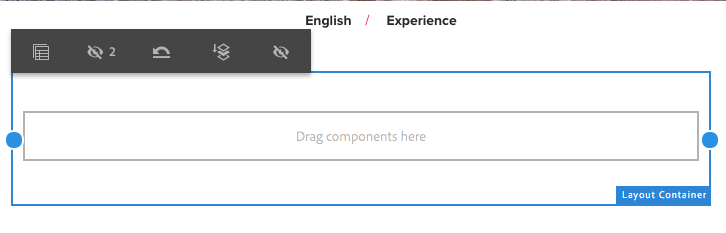

# Diseño adaptable{#responsive-layout}

AEM le permite tener un diseño interactivo para sus páginas mediante el uso de la variable **Contenedor de diseño** componente.

Proporciona un sistema de párrafos que le permite colocar componentes en una cuadrícula interactiva. Esta cuadrícula puede reorganizar el diseño según el tamaño y el formato del dispositivo o la ventana. Este componente se utiliza en combinación con el modo [**Diseño**](/help/sites-authoring/responsive-layout.md#defining-layouts-layout-mode), que le permite crear y editar el diseño interactivo en función del dispositivo.

El contenedor de diseño:

* Proporciona un ajuste horizontal a la cuadrícula, junto con la capacidad de colocar componentes en la cuadrícula en paralelo y definir cuándo deben contraerse o redistribuirse.
* Utiliza puntos de interrupción predefinidos (por ejemplo, para teléfono, tableta, etc.) para permitirle definir el comportamiento del contenido necesario para los dispositivos o la orientación relacionados.

   * Por ejemplo, puede personalizar el tamaño del componente o si este se puede ver en determinados dispositivos.

* Se puede anidar para permitir el control de columnas.

A continuación, el usuario puede ver cómo se representará el contenido para dispositivos específicos mediante el emulador.

>[!CAUTION]
>
>Aunque el componente Contenedor de diseño está disponible en la IU clásica, su funcionalidad completa solo está disponible y se admite en la IU táctil.

AEM realiza un diseño interactivo para sus páginas mediante una combinación de diferentes mecanismos:

* Componente [**Contenedor de diseño**](#adding-a-layout-container-and-its-content-edit-mode)

   Este componente está disponible en el [navegador de componentes](/help/sites-authoring/author-environment-tools.md#components-browser) y proporciona un sistema de párrafos de red que le permite añadir y colocar componentes en una cuadrícula interactiva. También se puede establecer como sistema de párrafos predeterminado en la página.

* [**Modo de diseño**](/help/sites-authoring/responsive-layout.md#defining-layouts-layout-mode)

   Después de colocar el contenedor de diseño en la página, puede usar el modo de **diseño** para colocar el contenido en la red interactiva.

* [**Emulador**](#selecting-a-device-to-emulate) Esta opción le permite crear y editar sitios web interactivos que reorganizan el diseño en función del tamaño del dispositivo o la ventana, mediante el redimensionado activo de los componentes. El usuario puede utilizar el emulador para ver cómo se representará el contenido.

Con estos mecanismos de cuadrícula adaptable puede:

* Utilice puntos de interrupción para definir diferentes diseños de contenido en función del ancho del dispositivo (en relación con el tipo y la orientación del dispositivo).
* Utilizar estos mismos puntos de interrupción y diseños de contenido para asegurarse de que el contenido es adaptable al tamaño de la ventana del navegador en el escritorio.
* Utilizar el ajuste horizontal a la cuadrícula que le permite colocar componentes en la cuadrícula, cambiar su tamaño según sea necesario y definir cuándo deben contraerse o redistribuirse lateralmente o arriba/abajo.
* Ocultar componentes de diseños de dispositivo específicos.
* Realizar el control de columnas.

En función del proyecto, el contenedor de diseño se puede utilizar como sistema de párrafos predeterminado para las páginas o como componente disponible para añadirse a su página mediante el explorador de componentes (o ambos).

>[!NOTE]
>
>Adobe proporciona [documentación de GitHub](https://adobe-marketing-cloud.github.io/aem-responsivegrid/) del diseño interactivo como referencia que se puede entregar a los desarrolladores de interfaces de usuario, lo cual les permite usar la cuadrícula de AEM fuera de AEM como, por ejemplo, para crear maquetas HTML estáticas para un sitio de AEM futuro.

>[!NOTE]
>
>El uso de los mecanismos anteriores se habilita en la configuración de la plantilla. Consulte [Configuración del diseño interactivo](/help/sites-administering/configuring-responsive-layout.md) para obtener más información.

## Definiciones de diseños, emulación de dispositivos y puntos de interrupción {#layout-definitions-device-emulation-and-breakpoints}

Al crear el contenido de su sitio web desea asegurarse de que el contenido se muestre correctamente según el dispositivo utilizado para ello.

AEM permite definir diseños en función de la anchura del dispositivo:

* El emulador le permite emular estos diseños en una serie de dispositivos. Además del tipo de dispositivo, la orientación, que se selecciona mediante la opción **Rotar dispositivo**, puede afectar al punto de interrupción seleccionado a medida que cambia la anchura.
* Los puntos de interrupción son puntos que separan las definiciones de diseño.

   * Definen efectivamente la anchura máxima (en píxeles) de cualquier dispositivo que utilice un diseño específico.
   * Normalmente, los puntos de interrupción son válidos para una selección de dispositivos, en función del ancho de sus pantallas.
   * El alcance de un punto de interrupción se extiende hacia la izquierda hasta el siguiente punto de interrupción.
   * No puede seleccionar específicamente un punto de interrupción; al seleccionar el dispositivo y la orientación se selecciona automáticamente el punto de interrupción adecuado.

El dispositivo **Escritorio** no tiene una anchura específica y está relacionado con el punto de interrupción predeterminado (p. ej., todo lo que está por encima del último punto de interrupción configurado).

>[!NOTE]
>
>Es posible definir puntos de interrupción para cada dispositivo individual, pero esto incrementaría drásticamente los trabajos de definición de diseño y mantenimiento.

Al seleccionar en el emulador un dispositivo específico para emular y definir el diseño, el punto de interrupción relacionado también quedará resaltado. Cualquier cambio de diseño que realice se aplicará a otros dispositivos a los que se aplique el punto de interrupción, es decir, cualquier dispositivo posicionado a la izquierda del marcador de punto de interrupción activo, pero antes del siguiente marcador de punto de interrupción.

Por ejemplo, si selecciona el dispositivo **iPhone 6 Plus** (definido con una anchura de 540 píxeles) para emulación y diseño, se activará también el punto de interrupción **Teléfono** (definido como 768 píxeles). Cualquier cambio de diseño que realice para la variable **iPhone 6** será aplicable a los demás dispositivos incluidos en el **Teléfonos** punto de interrupción, como **iPhone 5** (definido como 320 píxeles).

## Selección de un dispositivo para emular {#selecting-a-device-to-emulate}

1. Abra la página necesaria para editarla. Por ejemplo:

   `http://localhost:4502/editor.html/content/we-retail/us/en/experience.html`

1. Seleccione el icono **Emulador** de la barra de herramientas superior:

   

1. Se abrirá la barra de herramientas del emulador.

   

   La barra de herramientas del emulador muestra opciones de diseño adicionales:

   * **Rotar dispositivo** - Permite rotar un dispositivo de la orientación vertical a la horizontal y viceversa.

    

   * **Seleccionar dispositivo**: le permite definir un dispositivo específico para emular de una lista (consulte el paso siguiente para obtener detalles)

   

1. Para seleccionar un dispositivo específico para emular, puede:

   * Utilice el icono Seleccionar dispositivo y seleccione en un selector desplegable.
   * Toque o haga clic en el indicador del dispositivo en la barra de herramientas del emulador.

   

1. Una vez que haya seleccionado un dispositivo específico, puede:

   * Ver el marcador activo del dispositivo seleccionado; por ejemplo, **iPad.**
   * Ver el marcador activo del [punto de interrupción](/help/sites-authoring/responsive-layout.md#layout-definitions-device-emulation-and-breakpoints) adecuado; por ejemplo, **Tableta.**

   

   * La línea discontinua azul representa la variable *pliegue* para el dispositivo seleccionado (aquí un **iPhone 6**).

   

   * El pliegue también puede considerarse un salto de línea de página (no confundir con el [puntos de interrupción](/help/sites-authoring/responsive-layout.md#layout-definitions-device-emulation-and-breakpoints)) para el contenido. Esto se muestra para mostrar qué parte del contenido verá el usuario en el dispositivo antes de desplazarse.
   * La línea del pliegue no se mostrará si la altura del dispositivo que se emula es superior al tamaño de la pantalla.
   * El pliegue se muestra para la comodidad del autor y no aparece en la página publicada.

## Adición de un contenedor de diseño y su contenido (modo de edición) {#adding-a-layout-container-and-its-content-edit-mode}

Un **contenedor de diseño** es un sistema de párrafos que:

* Contiene otros componentes.
* Define el diseño.
* Responde a los cambios.

>[!NOTE]
>
>Si no está disponible, la variable **Contenedor de diseño** debe ser explícitamente [activado para un sistema de párrafos o una página](/help/sites-administering/configuring-responsive-layout.md) (por ejemplo, utilizando [**Diseño** mode](/help/sites-authoring/default-components-designmode.md)).

1. El **contenedor de diseño** está disponible como componente estándar en el [navegador de componentes](/help/sites-authoring/author-environment-tools.md#components-browser). Desde aquí puede arrastrarlo a la ubicación deseada en la página tras la cual verá el marcador de posición **Arrastrar componentes aquí**.
1. A continuación, puede agregar componentes al contenedor de diseño. Estos componentes albergarán el contenido real:

   

## Selección y ejecución de una acción en un contenedor de diseños (modo de edición) {#selecting-and-taking-action-on-a-layout-container-edit-mode}

Al igual que con otros componentes, puede seleccionar un contenedor de diseños (cuando se encuentra en el modo de **edición**) y luego realizar una acción en él (copiar, cortar, eliminar):

>[!CAUTION]
>
>Como un contenedor de diseño es un sistema de párrafos, al eliminar el componente se eliminará la cuadrícula de diseño y todos los componentes (y su contenido) que se mantengan dentro del contenedor.

1. Si pasa el ratón o toca el marcador de posición de la cuadrícula, se muestra el menú de acción.

   

   Debe seleccionar la opción **Principal**.

   

1. Si el componente de diseño está anidado, seleccione la opción **Principal** presenta una selección desplegable que le permite seleccionar el contenedor de diseño anidado o sus elementos principales.

   Cuando pase el ratón sobre los nombres de contenedor en la lista desplegable, sus contornos se mostrarán en la página.

   * El contenedor de diseño anidado más bajo se mostrará en negro.
   * El siguiente contenedor de diseño anidado en la parte inferior estará en gris oscuro.
   * Cada contenedor sucesivo estará en un tono más claro de gris.

   

1. De esta forma se resaltará toda la cuadrícula con su contenido. Se muestra la barra de herramientas de acciones, desde donde puede seleccionar una acción, como, por ejemplo, **Eliminar.**

   

## Definición de diseños (modo de diseño) {#defining-layouts-layout-mode}

>[!NOTE]
>
>Puede definir un diseño distinto para cada [punto de interrupción](#layout-definitions-device-emulation-and-breakpoints) (tal y como determinan el tipo y la orientación del dispositivo emulado).

Para configurar el diseño de una cuadrícula interactiva implementada con el contenedor de diseño, debe usar el modo **Diseño**.

El modo **Diseño** puede iniciarse de dos formas.

* Mediante el uso del [menú de modo de la barra de herramientas](/help/sites-authoring/author-environment-tools.md#page-modes) y seleccionando el modo **Diseño**.

   * Seleccione el modo **Diseño** del mismo modo que si desea cambiar al modo **Editar** o **Segmentación**.
   * El modo **Diseño** se mantiene y no abandona el modo **Diseño** hasta que se selecciona otro modo a través del selector correspondiente.

* When [editar un componente individual.](/help/sites-authoring/editing-content.md#edit-component-layout)

   * Usando la variable **Diseño** en el menú de acción rápida del componente, puede cambiar a **Diseño** en el menú contextual.
   * **Diseño** el modo persiste durante la edición del componente y vuelve a **Editar** una vez que el enfoque cambia a otro componente.

En el modo de diseño puede realizar varias acciones en una cuadrícula:

* Cambie el tamaño de los componentes de contenido con los puntos azules. El cambio de tamaño siempre se ajustará a la cuadrícula. Al cambiar el tamaño de la cuadrícula de fondo, se mostrará como ayuda para la alineación:

   

   >[!NOTE]
   >
   >Se mantendrán las proporciones y relaciones al cambiar el tamaño de componentes como **Imágenes**.

* Haga clic o toque un componente de contenido. La barra de herramientas le permite efectuar las siguientes acciones:

   * **Principal**

      Permite seleccionar todo el componente contenedor de diseño para realizar acciones en conjunto.

   * **Flotar a una línea nueva**

      El componente se moverá a una nueva línea, según el espacio disponible en la cuadrícula.

   * **Ocultar componente**

      El componente se volverá invisible (puede restaurarse desde la barra de herramientas del contenedor de diseño).
   

* En el modo **Diseño** puede pulsar o hacer clic en **Arrastrar componentes aquí** para seleccionar el componente completo. Se mostrará la barra de herramientas de este modo.

   La barra de herramientas tendrá diferentes opciones en función del estado del componente de diseño y de los componentes que le pertenecen. Por ejemplo:

   * **Principal**: seleccione el componente principal.

   

   * **Mostrar componentes ocultos** - Muestra todos los componentes o cada uno de ellos. El número indica cuántos componentes ocultos existen actualmente. El contador muestra cuántos componentes están ocultos.

   

   * **Revertir diseño del punto de interrupción**: permite recuperar el diseño predeterminado. Es decir, no se aplicará ningún diseño personalizado.

   

   * **Flotar hasta una nueva línea**: suba el componente una posición si el espacio lo permite.

   

   * **Ocultar componente**: oculte el componente actual.

   

   >[!NOTE]
   >
   >En el ejemplo anterior, las acciones de flotar y ocultar están disponibles porque este contenedor de diseño está anidado en un contenedor de diseño principal.

   * **Mostrar los componentes** 
Seleccione los componentes principales para mostrar la barra de herramientas de acciones con la 
Opción **Mostrar componentes ocultos**. En este ejemplo, hay dos componentes ocultos.
   

   Si se selecciona la opción **Mostrar componentes ocultos**, se mostrarán en azul los componentes que están ocultos actualmente en sus posiciones originales.

   

   La selección de la opción **Restaurar todo** permitirá que se muestren todos los componentes ocultos.
