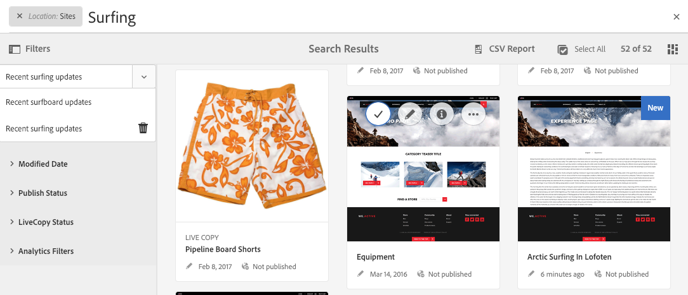

# Búsqueda{#searching}

El entorno de creación AEM ofrece varios mecanismos para buscar contenido, en función del tipo de recurso.

>[!NOTE]
>
>Fuera del entorno de creación también hay otros mecanismos disponibles para buscar, como [Query Builder](/help/sites-developing/querybuilder-api.md) y [CRXDE Lite](/help/sites-developing/developing-with-crxde-lite.md).

## Conceptos básicos de búsqueda {#search-basics}

La función de búsqueda está disponible en la barra de herramientas superior:

Con el carril de búsqueda puede:

* Busque una palabra clave concreta, una ruta o una etiqueta. 
* Filtre según criterios específicos de recurso, como fechas de modificación, estados de página, tamaño de archivo, etc.
* Defina y utilice una [búsqueda guardada](#saved-searches) según los criterios anteriores.

>[!NOTE]
>
>Search can also be invoked by using the hotkey `/` (forward slash) whenever the search rail is visible.

## Búsqueda y filtro {#search-and-filter}

Para buscar y filtrar sus recursos: 

1. Abra **Búsqueda** (con la lupa de la barra de herramientas) e introduzca el término de búsqueda. Se mostrarán sugerencias seleccionables:

   

   De forma predeterminada, los resultados de la búsqueda estarán limitados a su ubicación actual (es decir, la consola y el tipo de recurso relacionado): 

   

1. Si es necesario, puede quitar el filtro de ubicación (seleccione **X** en el filtro que se desea eliminar) para buscar en todas las consolas/tipos de recurso.
1. Los resultados se mostrarán agrupados según la consola y el tipo de recurso relacionado.

   Puede seleccionar un recurso específico (para realizar más acciones), o profundizar seleccionando el tipo de recurso necesario; por ejemplo **Ver todos los sitios**: 

   

1. Si desea explorar más en profundidad, seleccione el símbolo de carril (parte superior izquierda) para abrir el panel lateral **Filtros y opciones**.

   

   Según el tipo de recurso, la búsqueda mostrará una selección predefinida de criterios de búsqueda o de filtro.

   El panel lateral le permite seleccionar:

   * Búsquedas guardadas
   * Directorio de búsqueda
   * Etiquetas
   * Criterios de búsqueda; por ejemplo, fechas de modificación, estado de publicación o estado de Live Copy
   >[!NOTE]
   >
   >Los criterios de búsqueda pueden variar:
   >
   >
   >
   >    * Según el tipo de recurso que haya seleccionado; por ejemplo, los criterios de comunidades y recursos son comprensivamente especializados.
   >    * Su instancia, al igual que los [formularios de búsqueda](/help/sites-administering/search-forms.md), se puede personalizar (según la ubicación en AEM).

   

1. También se pueden agregar términos de búsqueda adicionales:

   

1. Cierre la función **Búsqueda** con la **X** (parte superior derecha).

>[!NOTE]
>
>Los criterios de búsqueda se mantienen al seleccionar un elemento en los resultados de la búsqueda.
>
>Cuando se selecciona un elemento en la página de resultados de la búsqueda, al volver a la página de búsqueda después de usar el botón Atrás del explorador, los criterios de búsqueda se mantienen. 

## Búsquedas guardadas {#saved-searches}

Además de buscar aplicando una amplia gama de criterios, también puede guardar una configuración de búsqueda determinada para poder recuperarla y utilizarla en otro momento:

1. Defina sus criterios de búsqueda y seleccione **Guardar**.

   

1. Asigne un nombre y, a continuación, utilice **Guardar** para confirmar la acción:

   

1. La próxima vez que acceda al panel de búsqueda, la búsqueda guardada estará disponible en el selector:

   

1. Una vez guardada, podrá:

   * Usar **x** (con el nombre de la búsqueda guardada) para iniciar una nueva consulta (la búsqueda guardada en sí no se eliminará).
   * Usar la opción **Editar búsqueda guardada**, cambiar las condiciones de búsqueda y, a continuación, usar **Guardar** nuevamente.

Las búsquedas guardadas pueden modificarse seleccionándolas y haciendo clic en **Editar búsqueda guardada** en la parte inferior del panel de búsqueda.

