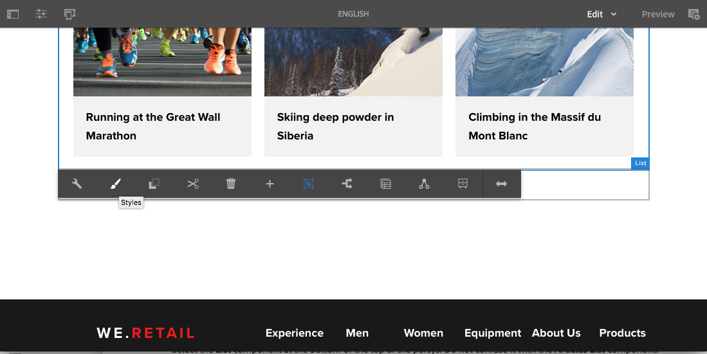
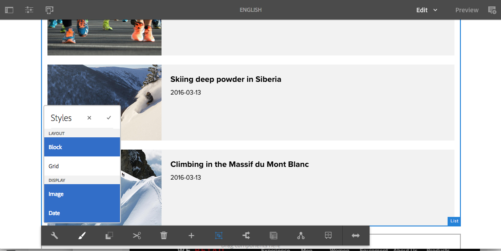
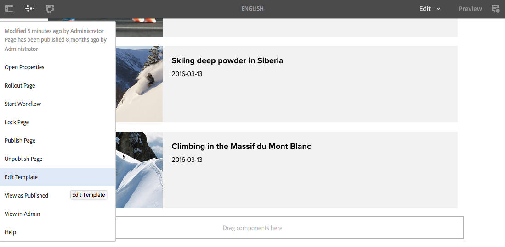

# Sistema de estilos{#style-system}

El sistema de estilos permite a un autor de plantillas definir clases de estilos en la política de contenido de un componente, de modo que un autor de contenido puede seleccionarlos al editar el componente en una página. Estos estilos pueden ser variaciones visuales alternativas de un componente, lo que hacen que este sea más flexible.

Esto elimina la necesidad de desarrollar un componente personalizado para cada estilo o de personalizar el cuadro de diálogo del componente para permitir dicha funcionalidad de estilo. De esta manera, más componentes reutilizables se pueden adaptar de forma rápida y sencilla a las necesidades de los autores de contenido sin ningún desarrollo final de AEM.

## Caso de uso {#use-case}

Los autores de plantillas no solo necesitan la posibilidad de configurar la forma en que los componentes funcionan para los autores de contenido, sino también de configurar diversas variaciones visuales alternativas de un componente.

Del mismo modo, los autores de contenido no solo necesitan la posibilidad de estructurar y organizar su contenido, sino también de seleccionar cómo se presenta visualmente.

El sistema de estilos proporciona una solución unificada a los requisitos del autor de plantillas y del autor de contenido:

* Los autores de plantillas pueden definir clases de estilos en la política de contenido de los componentes.
* Los autores de contenido pueden seleccionar estas clases en una lista desplegable al editar el componente en una página para aplicar los estilos correspondientes.

A continuación, la clase de estilos se inserta en el elemento envolvente de la decoración del componente, de modo que el desarrollador de componentes no se tenga que preocupar de administrar los estilos más allá de proporcionar sus reglas CSS.

## Información general {#overview}

Por lo general, el uso del sistema de estilos se lleva a cabo de la forma siguiente.

1. El diseñador web crea diferentes variaciones visuales de un componente.

1. Se proporciona al desarrollador de HTML la salida HTML de los componentes y las variaciones visuales deseadas que se van a implementar.

1. El desarrollador de HTML define las clases CSS que corresponden a cada variación visual y que se van a insertar en el elemento que ajusta los componentes.

1. El desarrollador de HTML implementa el código CSS correspondiente (y opcionalmente el código JS) para cada una de las variaciones visuales de modo que tengan el aspecto definido.

1. El desarrollador de AEM coloca el CSS proporcionado (y el JS opcional) en una [biblioteca de cliente](/help/sites-developing/clientlibs.md) y la implementa.

1. El desarrollador de AEM o el autor de la plantilla configura las plantillas de página y edita la política de cada componente con estilo, agregando las clases CSS definidas, dando nombres prácticos a cada estilo e indicando qué estilos se pueden combinar.

1. El autor de páginas de AEM puede seleccionar los estilos diseñados en el editor de página a través del menú Estilo de la barra de herramientas del componente.

Tenga en cuenta que, en realidad, solo los tres últimos pasos se llevan a cabo en AEM. Esto significa que todo el desarrollo de los CSS y JavaScript necesarios se puede realizar sin AEM.

Para implementar realmente los estilos solo hace falta la implementación en AEM y la selección en los componentes de las plantillas que desee.

En el diagrama siguiente, se ilustra la arquitectura del sistema de estilos.

## Uso {#use}

Para demostrar esta función, deben crearse estilos para un componente. Al contar como base con la implementación de [We.Retail](/help/sites-developing/we-retail.md) del [componente de la lista](https://helpx.adobe.com/experience-manager/core-components/using/list.html) del componente principal, puede instalar el paquete adjunto que contiene estilos para explorar la funcionalidad de la función.

Descargar el paquete de demostración del sistema de [estilo](assets/package_-_style_systemdemo.zip)

>[!NOTE]
>
>Con el paquete de demostración se pretende mostrar la forma en que los autores pueden utilizar el sistema de estilos, en lugar de plantearlo como una referencia de cómo implementarlo mejor.
>
>Este paquete solo será necesario hasta que We.Retail proporcione una implementación integrada de ejemplos y prácticas recomendadas.

En las secciones siguientes [Como autor de contenido](/help/sites-authoring/style-system.md#as-a-content-author) y [Como autor de plantillas](/help/sites-authoring/style-system.md#as-a-template-author) se describe cómo probar la funcionalidad del sistema de estilos mediante el paquete de demostración del sistema de estilos de We.Retail.

Si desea utilizar el sistema de estilos para sus propios componentes, haga lo siguiente:

1. Instale el CSS como bibliotecas de cliente, tal como se ha indicado en la sección [Información general](/help/sites-authoring/style-system.md#overview).
1. Configure las clases CSS que desea poner a disposición de los autores de contenido, tal como se describe en la sección [Como autor de plantillas](/help/sites-authoring/style-system.md#as-a-template-author).
1. A continuación, los autores de contenido pueden utilizar los estilos, tal como se describe en la sección [Como autor de contenido](/help/sites-authoring/style-system.md#as-a-content-author).

### Como autor de contenido {#as-a-content-author}

1. After installing the style system demo package, navigate to We.Retail&#39;s English language master home page at `http://localhost:4502/sites.html/content/we-retail/language-masters/en` and edit the page.
1. Seleccione el componente **Lista** en la parte inferior o superior del parsys. Do not confuse it with the **Articles List** component.

   

1. Toque o haga clic en el botón **Estilos** de la barra de herramientas del componente **Lista** para abrir el menú Estilo y cambiar el aspecto del componente.

   

   >[!NOTE]
   >
   >In this example, the **Layout** styles (**Block** and **Grid**) are mutually exclusive, while the **Display** options (**Image** or **Date**) can be combined. Esto se puede [configurar en la plantilla como el autor de plantillas](/help/sites-authoring/style-system.md#as-a-template-author).

### Como autor de plantillas {#as-a-template-author}

1. While editing We.Retail&#39;s English language master home page at `http://localhost:4502/sites.html/content/we-retail/language-masters/en`, edit the template of the page via **Page Information -> Edit Template**.

   

1. Para editar la política del componente **Lista**, toque o haga clic en el botón **Política** del componente. No lo confunda con el componente **Lista de artículos**.

   

1. En la pestaña Estilos de las propiedades, puede ver cómo se han configurado los estilos.

   

   * **Nombre del grupo**: los estilos se pueden agrupar en el menú Estilo que el autor de contenido verá al configurar el estilo del componente.
   * **Los estilos se pueden combinar**: permite que se seleccionen al mismo tiempo diversos estilos dentro de ese grupo.
   * **Nombre del estilo**: la descripción del estilo que se mostrará al autor de contenido al configurar el estilo del componente.
   * **Clases CSS**: el nombre real de la clase CSS asociada al estilo.
   Utilice los controles de arrastre para ordenar los grupos y los estilos dentro de los grupos. Utilice los iconos Añadir o Eliminar para añadir o quitar grupos y estilos dentro de los grupos.

>[!CAUTION]
>
>The CSS classes (as well as any necessary Javascript) configured as style properties of a component&#39;s policy must be deployed as [Client Libraries](/help/sites-developing/clientlibs.md) in order to work.

## Configuración {#setup}

>[!NOTE]
>
>La versión 2 de los componentes principales está totalmente preparada para aprovechar las ventajas del sistema de estilos y no requiere ninguna configuración adicional.
>
>A fin de utilizar la función, siga estos pasos para preparar el sistema de estilos para sus propios componentes personalizados o para ampliar los componentes principales de la versión 1.

Para que un componente funcione con el sistema de estilos de AEM y se muestre la pestaña Estilo en el cuadro de diálogo de diseño, el desarrollador de componentes debe incluir esa pestaña del producto y establecer el componente con las opciones de configuración siguientes:

* `path = "/mnt/overlay/cq/gui/components/authoring/dialog/style/tab_design/styletab"`
* `sling:resourceType = "granite/ui/components/coral/foundation/include"`

Con el componente configurado, AEM insertará automáticamente en el elemento de decoración que AEM ajusta automáticamente en cada componente editable los estilos que los autores de páginas hayan configurado. El componente en sí no tiene que hacer nada más para que esto ocurra.

### Estilos con nombres de elemento {#styles-with-element-names}

Un desarrollador también puede configurar una lista de nombres de elemento permitidos para los estilos del componente con la propiedad matriz de cadenas `cq:styleElements`. A continuación, en la pestaña Estilos de la política, dentro del cuadro de diálogo de diseño, el creador de plantillas también puede elegir un nombre de elemento para cada estilo. Esto definirá el nombre de elemento del elemento envolvente.

This property is set on the `cq:Component` node. Por ejemplo:

* `/apps/weretail/components/content/list@cq:styleElements=[div,section,span]`

>[!CAUTION]
>
>Evite definir los nombres de elemento para los estilos que se pueden combinar. Cuando se definen los nombres de varios elementos, el orden de prioridad es:
>
>1. HTL tiene prioridad sobre todo: `data-sly-resource="${'path/to/resource' @ decorationTagName='span'}`
>1. A continuación, entre diversos estilos activos, se toma el primer estilo de la lista de estilos configurados en la política del componente.
>1. Finally, the component&#39;s `cq:htmlTag`/ `cq:tagName` will be considered as a fallback value.
>

Esta capacidad para definir nombres de estilo resulta útil para los componentes muy genéricos, como el contenedor de diseño o el componente Fragmento de contenido, a fin de complementar su significado.

For instance it allows a Layout Container to be given semantics like `<main>`, `<aside>`, `<nav>`, etc.
