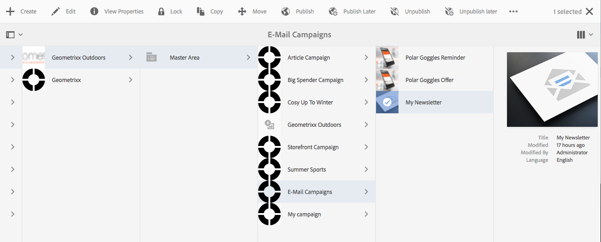

# Segmentación de Adobe Campaign{#targeting-your-adobe-campaign}

Para dirigirse al boletín de Adobe Campaign, primero debe configurar la segmentación, que solo está disponible en la IU clásica (para ClientContext). Después, puede crear experiencias segmentadas para Adobe Campaign. Ambas se describen en esta sección.

## Configuración de la segmentación en AEM {#setting-up-segmentation-in-aem}

Para configurar la segmentación, debe utilizar la IU clásica para configurar los segmentos. Los pasos restantes se pueden realizar en la interfaz de usuario estándar.

La configuración de la segmentación incluye la creación de segmentos, una marca, una campaña y experiencias.

>[!NOTE]
>
>El ID de segmento debe asignarse al de Adobe Campaign.

### Creación de segmentos {#creating-segments}

Para crear segmentos:

1. Abra el [consola de segmentación](http://localhost:4502/miscadmin#/etc/segmentation) at **&lt;host>:&lt;port>/miscadmin#/etc/segmentation**.
1. Cree una nueva página e introduzca un título (por ejemplo, **Segmentos AC**- y seleccione **Segmento (Adobe Campaign)** plantilla.
1. Seleccione la página creada en la vista de árbol en el lado izquierdo.
1. Cree un segmento, por ejemplo, dirigido a usuarios masculinos, creando una nueva página en el segmento que ha creado llamado Masculino y seleccione la opción **Segmento (Adobe Campaign)** plantilla.
1. Abra la página de segmentos creada y arrastre y suelte una **ID de segmento** de la barra de tareas a la página.
1. Haga doble clic en el rasgo, introduzca el ID que representa en este caso el segmento Masculino definido en Adobe Campaign; por ejemplo, **MASCULINO** - y haga clic en **OK**. Debería aparecer el siguiente mensaje: *`targetData.segmentCode == "MALE"`*
1. Repita los pasos para otro segmento, por ejemplo, un segmento dirigido a mujeres usuarios.

### Creación de una marca {#creating-a-brand}

Para crear una marca:

1. En **Sitios**, vaya a la **Campañas** (por ejemplo, en We.Retail).
1. Haga clic en **Crear página** y escriba un título para la página, por ejemplo We.Retail Brand y seleccione la variable **Marca** plantilla.

### Creación de una campaña {#creating-a-campaign}

Para crear una campaña:

1. Abra el **Marca** página que acaba de crear.
1. Haga clic en **Crear página** e introduzca un título para su página, por ejemplo, We.Retail Campaign, y seleccione la opción **Campaign** plantilla y haga clic en **Crear**.

### Creación de experiencias {#creating-experiences}

Para crear experiencias para segmentos:

1. Abra el **Campaign** página que acaba de crear.
1. Cree experiencias para sus segmentos haciendo clic en **Crear página** y al especificar un título para la página, por ejemplo, Masculino, ya que está creando una experiencia para el segmento Masculino, y seleccione la opción **Experiencia** plantilla.
1. Abra la página Experiencia creada.
1. Haga clic en **Editar** y, a continuación, debajo de Segmentos, haga clic en **Agregar elemento**.
1. Introduzca la ruta al segmento Masculino, por ejemplo **/etc/segmentation/ac-segments/male** y haga clic en **OK**. Debería aparecer el siguiente mensaje: *La experiencia está dirigida a: Hombre*
1. Repita los pasos anteriores para crear una experiencia para todos los segmentos, por ejemplo, el objetivo femenino.

## Creación de una newsletter con contenido de destino {#creating-a-newsletter-with-targeted-content}

Después de crear segmentos, una marca, una campaña y una experiencia, puede crear una newsletter con contenido de destino. Después de crear la experiencia, vincula las experiencias a sus segmentos.

>[!NOTE]
>
>[Los ejemplos de correo electrónico solo están disponibles en Geometrixx](/help/sites-developing/we-retail.md). Descargue el contenido de muestra de Package Share.

Para crear una newsletter con contenido de destino:

1. Cree una newsletter con contenido de destino: Debajo de Campañas de correo electrónico en Geometrixx Outdoors, toque o haga clic en **Crear** > **Página** y seleccione una de las plantillas de correo de Adobe Campaign.

   

1. En la newsletter, añada un componente Texto y personalización .
1. Agregue texto al componente Texto y personalización, como &quot;Este es el valor predeterminado&quot;.
1. Haga clic en la flecha situada junto a **Editar** y seleccione **Segmentación**.
1. Seleccione la marca en el menú desplegable Marca y seleccione la campaña. (Esta es la marca y la campaña que creó anteriormente).
1. Haga clic en **Iniciar segmentación**. Verá que sus segmentos aparecen en el área Audiencias . La experiencia predeterminada se utiliza si ninguno de los segmentos definidos coincide.

   >[!NOTE]
   >
   >De forma predeterminada, los ejemplos de correo electrónico incluidos en AEM utilizan Adobe Campaign como motor de targeting. Para los boletines personalizados, es posible que tenga que seleccionar Adobe Campaign como motor de targeting. Al segmentar, pulse o haga clic en + en la barra de herramientas, introduzca un título para la nueva actividad y seleccione **Adobe Campaign** como motor de orientación.

1. Haga clic en **Predeterminado** y, a continuación, el componente Texto y personalización que ha agregado y verá el Bullseye con una flecha en él. Haga clic en el icono para dirigirse a este componente.

   

1. Vaya a otro segmento (Masculino) y haga clic en **Añadir oferta** y haga clic en el icono +. A continuación, edite la oferta.
1. Vaya a otro segmento (Femenino) y haga clic en **Añadir oferta** y el icono +. A continuación, edite esta oferta.
1. Haga clic en **Siguiente** para ver Asignación, haga clic en **Siguiente** para ver Configuración, que no se aplica a Adobe Campaign, y haga clic en **Guardar**.

   AEM genera automáticamente el código de objetivo correcto para Adobe Campaign cuando el contenido se utiliza en una entrega dentro de Adobe Campaign

1. En Adobe Campaign, cree la entrega: seleccione **Envío de correo electrónico con contenido AEM** y seleccione la cuenta de AEM local, según corresponda, y confirme los cambios.

   En la vista del HTML, las diferentes experiencias de los componentes de destino se incluyen en el código de objetivo de Adobe Campaign.

   

   >[!NOTE]
   >
   >Si también establece los segmentos en Adobe Campaign, haga clic en **Vista previa** le mostrará las experiencias de cada segmento.
