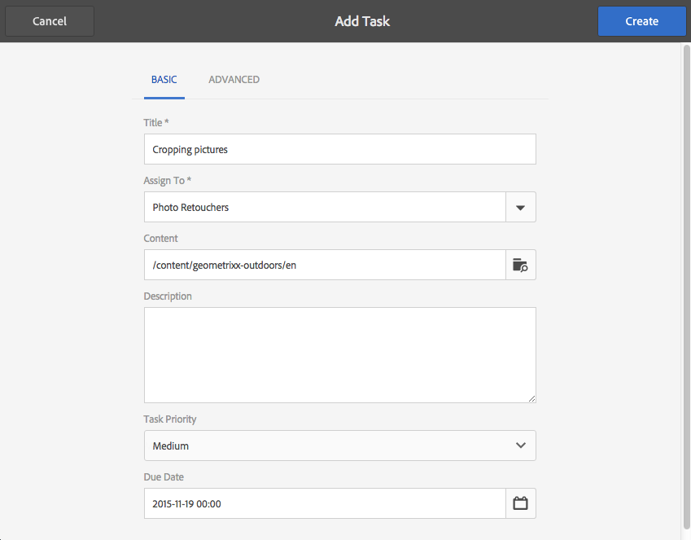
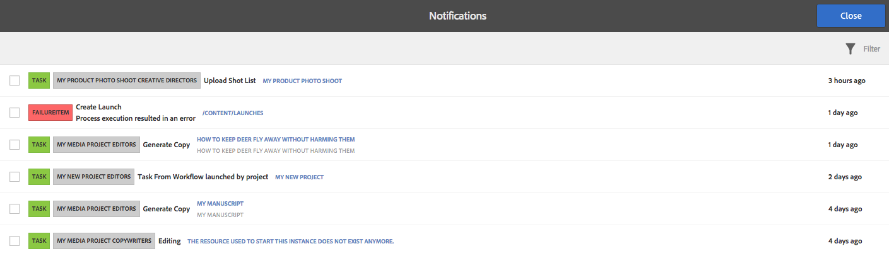

# Uso de tareas{#working-with-tasks}

Tareas representan elementos de trabajo que tienen que implementarse en el contenido. Cuando se le asigna una tarea, aparece en su Bandeja de entrada de Workflow. Los elementos de tarea tienen un valor de tareas en la columna Tipo.

Las tareas también se utilizan en los proyectos para determinar el nivel de conclusión de las tareas actuales, incluidas las tareas de flujo de trabajo.

## Seguimiento del progreso del proyecto {#tracking-project-progress}

Para realizar un seguimiento del progreso del proyecto, fíjese en las tareas activas/terminadas en un proyecto representadas en el mosaico **Tareas**. Los elementos siguientes sirven para determinar el progreso del proyecto:

* **** Mosaico de tareas: En el mosaico de tareas, disponible en la página de detalles del proyecto, se muestra un progreso general del proyecto.

* **** Lista de tareas: Al hacer clic en el mosaico Tarea, se muestra una lista de tareas. En esta lista se incluye información detallada sobre todas las tareas relacionadas con el proyecto.

Las tareas de flujo de trabajo de la lista, así como las tareas que cree directamente en el mosaico **Tareas**.

### Mosaico Tareas {#task-tile}

Si un proyecto contiene tareas relacionadas, en el proyecto se muestra un mosaico Tareas. En el mosaico Tareas se muestra el estado actual del proyecto. Esto se basa en tareas existentes en el flujo de trabajo y no incluye ninguna tarea que se genere en el futuro al ritmo del progreso del flujo de trabajo. La información siguiente está visible en el mosaico Tareas:

* Porcentaje de tareas completadas
* Porcentaje de tareas activas
* Porcentaje de tareas caducadas

### Ver o modificar las tareas en un proyecto {#viewing-or-modifying-the-tasks-in-a-project}

Además de realizar un seguimiento del progreso, puede que también desee ver más información sobre el proyecto o modificarlo.

#### Lista de tareas {#task-list}

Haga clic en los puntos suspensivos (…) en el mosaico Tareas para mostrar la lista de las tareas relacionadas con el proyecto. Las tareas se dividen por flujos de trabajo principales. Los detalles de la tarea se muestran junto con metadatos como la fecha de caducidad, el usuario asignado, la prioridad y el estado.

#### Detalles de la tarea {#task-details}

Para obtener más información sobre una tarea determinada en la lista de tareas, toque o haga clic en la tarea y abra **Detalles de la tarea**.

### Ver y modificar los comentarios de la tarea {#viewing-and-modifying-task-comments}

En Detalles de la tarea, puede editar o añadir comentarios. Además, todos los comentarios de un proyecto están visibles en el área de comentarios.

### Adición de tareas {#adding-tasks}

Puede añadir tareas nuevas a los proyectos. A continuación, estas tareas aparecen en el mosaico Tareas y están disponibles en la bandeja de entrada Notificaciones para realizar acciones con ellas.

Para añadir una tarea:

1. En el proyecto, en el mosaico **Tareas**, toque o haga clic en el icono +. Se abrirá la ventana **Añadir tarea**.
1. Introduzca la información sobre la tarea. El título de la tarea y el grupo al que está asignada son obligatorios. La información adicional, como la ruta de acceso del contenido, la descripción, la prioridad de tareas y la fecha de caducidad, es opcional. Además, puede seleccionar la pestaña **Avanzadas** para introducir el nombre de la tarea, que se utiliza para dar nombre a la dirección URL.

   

1. Toque o haga clic en **Crear**.

## Trabajo con tareas en la bandeja de entrada {#working-with-tasks-in-the-inbox}

Otra forma de acceder a las tareas es desde la bandeja de entrada. Puede abrir el contenido de la bandeja de entrada para implementar los cambios necesarios. Cuando haya terminado, cambie el estado de la tarea a Completada. Las tareas también aparecen en la bandeja de entrada cuando se asignen a un grupo de usuarios al que pertenece. En ese caso, cualquier miembro del grupo puede realizar el trabajo y completar la tarea.

Para completar una tarea, selecciónela y haga clic en **Completada**. Añada información a la tarea y, a continuación, haga clic en **Hecho**. Consulte la [bandeja de entrada](/help/sites-authoring/inbox.md) para obtener más información.

