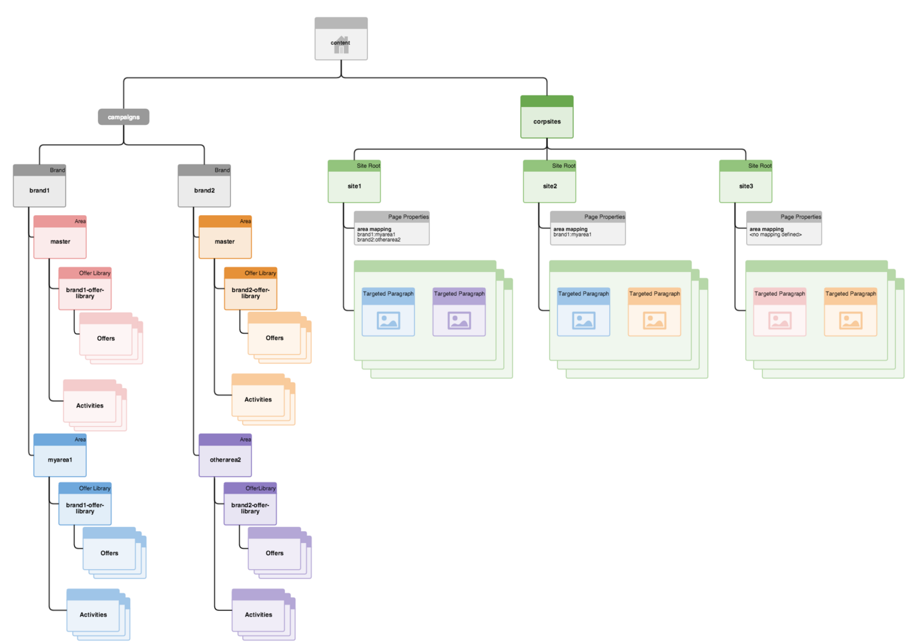

# Estructurar la administración de diversos sitios para el contenido segmentado{#how-multisite-management-for-targeted-content-is-structured}

En el siguiente diagrama se muestra la estructuración de la compatibilidad con el uso de varios sitios para contenido de destino

Las áreas aparecen debajo de **/content/campaigns/&lt;brand>** y, de forma predeterminada, cada marca tiene un área principal, que se crea automáticamente. Cada área tiene su propio conjunto de actividades, experiencias y ofertas.

Para contenido de destino, las páginas o los sitios pueden asignarse a un área. Si no ninguna área configurada, AEM utiliza el área principal para esta marca específica.

En el diagrama siguiente se muestra un ejemplo de cómo funciona la lógica para tres sitios, llamados site1, site2 y site3.

* El sitio site1 busca myarea1 para brand1 y otherarea2 para brand2 en función de la asignación de áreas.
* El sitio site2 busca myarea1 para brand1 y el área principal para brand2, dado que solo está definida la asignación de áreas para brand1.
* El sitio site3 busca el área principal para brand1 y brand2, ya que no se ha definido ninguna otra asignación de área para este sitio.
