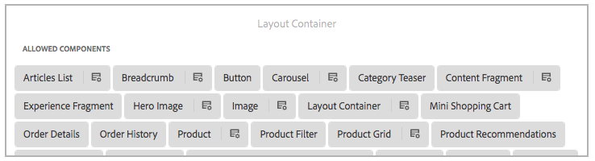

# Creación de plantillas de página  {#creating-page-templates}

Al crear una página, debe seleccionar una plantilla, que se utiliza como base para crear la nueva página. La plantilla define la estructura de la página resultante, cualquier contenido inicial y los componentes que se pueden utilizar.

Con el **Editor de plantillas**, la creación y el mantenimiento de plantillas ya no es una tarea exclusiva para desarrolladores. También puede participar un tipo de usuario avanzado, que se denomina **autor de la plantilla**. Los desarrolladores siguen necesitando configurar el entorno, crear bibliotecas de clientes y crear los componentes que se van a utilizar, pero una vez que estos conceptos básicos están establecidos, el **autor de la plantilla** tiene la flexibilidad de crear y configurar plantillas sin un proyecto de desarrollo.

La **consola de plantillas** permite a los autores de plantillas lo siguiente:

* Cree una plantilla o copie una plantilla existente.
* Administrar el ciclo de vida de la plantilla.

El **editor de plantillas** permite a los autores de plantillas:

* Agregue componentes a la plantilla y colóquelos en una cuadrícula adaptable.
* Preconfigurar los componentes. 
* Defina qué componentes se pueden editar en las páginas creadas con la plantilla.

Este documento explica cómo un **autor de plantillas** puede utilizar la consola y el editor de plantillas para crear y administrar plantillas editables.

Para obtener información detallada sobre cómo funcionan las plantillas editables en un nivel técnico, consulte el documento para desarrolladores [Plantillas de página: editables](/help/sites-developing/page-templates-editable.md) para obtener más información.

>[!NOTE]
>
>El **Editor de plantillas** no admite la segmentación directamente en el nivel de plantilla. Las páginas creadas a partir de una plantilla editable pueden estar segmentadas, pero no es posible segmentar las plantillas en sí.

>[!CAUTION]
>
>Páginas y plantillas creadas con **Consola de plantillas** no están pensados para utilizarse con la IU clásica y este uso no es compatible.

## Antes de comenzar {#before-you-start}

>[!NOTE]
>
>Un administrador debe configurar una carpeta de plantillas en el **Navegador de opciones de configuración** y aplicar los permisos adecuados para que un autor de una plantilla pueda crear una plantilla en esa carpeta.

Es importante tener en cuenta los siguientes puntos antes de comenzar:

* La creación de una plantilla requiere colaboración. Por este motivo, para cada tarea se indica la [Función.](#roles)

* AEM Según la configuración de la instancia, puede resultar útil tener en cuenta que ahora proporciona lo siguiente: [dos tipos básicos de plantilla](/help/sites-authoring/templates.md#editable-and-static-templates). Esto no afecta a cómo realmente [usar una plantilla para crear una página](#using-a-template-to-create-a-page), pero afecta al tipo de plantilla que puede crear y a cómo se relaciona una página con su plantilla.

### Funciones {#roles}

Creación de una plantilla con **Consola de plantillas** y el **Editor de plantillas** requiere la colaboración entre las siguientes funciones:

* **Administradores**:

   * Crea una nueva carpeta de plantillas y requiere derechos `admin` (de administración).

   * Estas tareas también las suele realizar un desarrollador

* **Desarrollador**:

   * Se centra en los detalles técnicos/internos
   * Debe tener experiencia en el entorno de desarrollo.
   * Proporciona al autor de plantillas la información necesaria.

* **Autor de plantillas**:

   * Se trata de un autor determinado que es miembro del grupo `template-authors`.

      * Esto le asigna los privilegios y los permisos necesarios.

   * Puede configurar el uso de componentes y otros detalles de alto nivel que requieran lo siguiente:

      * Algunos conocimientos técnicos

         * Por ejemplo, el uso de patrones al definir rutas.

      * Información técnica del desarrollador.

Debido a la naturaleza de algunas tareas, como crear una carpeta, es necesario un entorno de desarrollo, y esto requiere conocimiento y experiencia.

Las tareas detalladas en este documento se enumeran con la función de la persona responsable de llevarlas a cabo.

### Plantillas editables y estáticas {#editable-and-static-templates}

AEM ahora ofrece dos tipos básicos de plantillas:

* [Plantillas editables](/help/sites-authoring/templates.md#creatingandmanagingnewtemplates)

   * Puede ser [created](#creatinganewtemplate) y [editado](#editingatemplate) por autores de plantillas utilizando **Plantilla** consola y editor. El **Plantilla** se puede acceder a la consola de en **General** de la sección **Herramientas** consola.

   * Una vez creada la nueva página, se mantiene una conexión dinámica entre la página y la plantilla. Esto significa que los cambios en la estructura de la plantilla o en el contenido bloqueado se reflejarán en cualquier página creada con esa plantilla. Los cambios en el contenido desbloqueado (es decir, inicial) no se reflejarán.
   * Utilice directivas de contenido, que puede definir desde el editor de plantillas, para mantener las propiedades de diseño. El modo Diseño del editor de páginas ya no se utiliza para plantillas editables.

* Plantillas estáticas

   * AEM Las plantillas estáticas han estado disponibles para varias versiones de la aplicación de la.
   * Lo son [proporcionadas por los desarrolladores](/help/sites-developing/page-templates-static.md), por lo que los autores no pueden crearlos ni editarlos.
   * Se copian para crear la nueva página, pero después de esta no existe ninguna conexión dinámica (aunque el nombre de la plantilla esté registrado para obtener información).
   * Uso [Modo de diseño](/help/sites-authoring/default-components-designmode.md) para conservar las propiedades de diseño.
   * Como la edición de plantillas estáticas es una tarea exclusiva de un desarrollador, consulte el documento para desarrolladores [Plantillas de página: estáticas](/help/sites-developing/page-templates-static.md) para obtener más información.

Por definición, la consola y el editor de plantillas solo permiten la creación y edición de plantillas editables. Por lo tanto, este documento se centra exclusivamente en plantillas editables.

### Uso de una plantilla para crear una página {#using-a-template-to-create-a-page}

Cuando se usa una plantilla para lo siguiente [crear una página](/help/sites-authoring/managing-pages.md#creating-a-new-page) no hay ninguna diferencia visible ni ninguna indicación entre las plantillas estáticas y editables. Para el autor de la página, el proceso es transparente.

## Creación y gestión de plantillas {#creating-and-managing-templates}

Al crear una plantilla editable, debe hacer lo siguiente:

* Utilice la consola de **Plantilla**. Esta opción está disponible en la sección **General** de la consola de **Herramientas**.

   * O directamente en: [https://localhost:4502/libs/wcm/core/content/sites/templates.html/conf](https://localhost:4502/libs/wcm/core/content/sites/templates.html/conf)

* Puede [crear una carpeta para las plantillas](#creating-a-template-folder-admin), si lo necesita.
* [Creación de una plantilla](#creatinganewtemplateauthor), que inicialmente está vacío

* [Defina propiedades adicionales](#definingtemplatepropertiesauthor) para la plantilla, si es necesario
* [Editar la plantilla](#editingtemplates) para definir lo siguiente:

   * [Estructura](#editingatemplatestructureauthor): contenido predefinido que no se puede cambiar en las páginas creadas con la plantilla.
   * [Contenido inicial](#editing-a-template-initial-content-author): contenido predefinido que se puede cambiar en las páginas creadas con la plantilla.
   * [Diseño](#editingatemplatelayoutauthor): para una amplia gama de dispositivos.
   * [Estilos](/help/sites-authoring/style-system.md): defina los estilos que se van a utilizar con la plantilla y sus componentes.

* [Habilitar la plantilla](#enablingatemplateauthor) para usarla al crear una página
* [Permitir el uso de la plantilla](#allowing-a-template-author) para la página o rama requerida del sitio web
* [Publicar la plantilla](#publishingatemplateauthor) para que esté disponible en el entorno de publicación

>[!NOTE]
>
>A menudo, las **plantillas permitidas** se predefinen cuando su sitio web se configura inicialmente.

>[!CAUTION]
>
>No introduzca nunca la información necesaria [internacionalizado](/help/sites-developing/i18n.md) en una plantilla. Para fines de internalización, la variable [Funciones de localización de los componentes principales](https://experienceleague.adobe.com/docs/experience-manager-core-components/using/get-started/localization.html?lang=es) se recomiendan.

### Creación de una carpeta de plantillas: administrador {#creating-a-template-folder-admin}

Se debe crear una carpeta de plantillas para su proyecto que contenga las plantillas específicas del proyecto. Es una tarea de administración que se describe en el documento [Plantillas de página: editables](/help/sites-developing/page-templates-editable.md#template-folders).

### Creación de una plantilla nueva: autor de plantillas {#creating-a-new-template-template-author}

1. Abra la **Consola de plantillas** (que encontrará en **Herramientas ->** **General**) y navegue a la carpeta requerida.

   >[!NOTE]
   >
   >En una instancia estándar de AEM, la carpeta **Global** ya existe en la consola de plantillas. Contiene plantillas predeterminadas y actúa como alternativa en caso de que no se encuentre ninguna política ni ningún tipo de plantilla en la carpeta actual.
   >
   >
   >Una práctica recomendada es utilizar una [carpeta de plantillas creada para su proyecto](/help/sites-developing/page-templates-editable.md#template-folders).

1. Seleccione **Crear** y, a continuación, **Crear plantilla** para abrir el asistente.

1. Elija un **Tipo de plantilla**, luego seleccione **Siguiente**.

   >[!NOTE]
   >
   >Los tipos de plantilla son diseños predefinidos y se pueden considerar como plantillas. Los desarrolladores o el administrador del sistema predefinen estas plantillas. Encontrará más información en el documento para desarrolladores [Plantillas de página: editables](/help/sites-developing/page-templates-editable.md#template-type).

1. Complete los **Detalles de la plantilla**:

   * **Nombre de la plantilla**
   * **Descripción**

1. Seleccione **Crear**. Se mostrará una confirmación; seleccione **Abrir** para comenzar a editar la plantilla o **Listo** para volver a la consola de plantillas.

   >[!NOTE]
   >
   >Cuando se crea una plantilla nueva, se marca como **Borrador** en la consola; esto indica que aún no está disponible para que los autores de páginas la utilicen.

### Definición de las propiedades de la plantilla: autor de plantillas   {#defining-template-properties-template-author}

Una plantilla puede tener las siguientes propiedades:

* Imagen

   * Imagen que se utilizará como [miniatura de la plantilla](/help/sites-authoring/templates.md#template-thumbnail-image) para ayudar en la selección, como en el asistente Crear página.

      * Se puede cargar
      * Se puede generar en función del contenido de la plantilla

* Título

   * Un título utilizado para identificar la plantilla, como en el asistente **Crear página**.

* Descripción

   * Una descripción opcional para proporcionar más información acerca de la plantilla y su uso, que se puede ver, por ejemplo, en la **Crear página** asistente.

Para ver o editar las propiedades:

1. En la **Consola de plantillas**, seleccione la plantilla.
1. Para abrir el cuadro de diálogo, seleccione **Ver propiedades** en la barra de herramientas o en las opciones rápidas.
1. Ahora puede ver o editar las propiedades de la plantilla.

>[!NOTE]
>
>Las plantillas son herramientas útiles para optimizar el flujo de trabajo de creación de páginas. Sin embargo, demasiadas plantillas pueden saturar a los autores y hacer que la creación de páginas sea confusa. Una buena regla general es mantener el número de plantillas por debajo de 100.
>
>Adobe no recomienda tener más de 1000 plantillas debido a posibles impactos en el rendimiento.

>[!NOTE]
>
>El estado de una plantilla (borrador, activada o desactivada) se indica en la consola.

#### Imagen de miniatura de plantilla {#template-thumbnail-image}

Para definir la miniatura de la plantilla, haga lo siguiente:

1. Editar las propiedades de la plantilla.
1. Seleccione si desea cargar una miniatura o hacer que se genere a partir del contenido de la plantilla.

   * Si desea cargar una miniatura, toque o haga clic en **Cargar imagen**
   * Si desea generar una miniatura, toque o haga clic en **Generar previsualización**

1. Para ambos métodos se mostrará una previsualización de la miniatura.

   Si no es satisfactorio, toque o haga clic en **Borrar** para cargar otra imagen o volver a generar la miniatura.

1. Cuando esté satisfecho con la miniatura, toque o haga clic en **Guardar y cerrar**.

### Activación y autorización de una plantilla: autor de plantillas   {#enabling-and-allowing-a-template-template-author}

Para poder utilizar una plantilla al crear una página, debe:

* [Activar la plantilla](#enablingatemplate) para que esté disponible para utilizarla al crear páginas.
* [Permitir que la plantilla](#allowingatemplate) especifique las ramas de contenido en las que esta se puede utilizar.

#### Activación de una plantilla: autor de plantillas {#enabling-a-template-template-author}

Una plantilla se puede habilitar o deshabilitar para que esté disponible o no en el asistente **Crear página**.

>[!CAUTION]
>
>Una vez habilitada una plantilla, se mostrará una advertencia cuando el autor de la misma comience a actualizarla. Se informa al usuario de que se puede hacer referencia a la plantilla, por lo que cualquier cambio puede afectar a las páginas que hacen referencia a la plantilla.

1. En la **Consola de plantillas**, seleccione la plantilla.
1. Seleccione **Activar** o **Desactivar** en la barra de herramientas y, de nuevo, en el cuadro de diálogo de confirmación.
1. Ahora puede utilizar la plantilla cuando [creación de una página](/help/sites-authoring/managing-pages.md#creating-a-new-page), aunque es probable que desee [editar la plantilla](#editingatemplate) según sus propias necesidades.

>[!NOTE]
>
>El estado de una plantilla (borrador, activada o desactivada) se indica en la consola.

#### Autorización de una plantilla: autor {#allowing-a-template-author}

Una plantilla puede estar disponible o no disponible para determinadas ramas de la página.

1. Abra [Propiedades de la página](/help/sites-authoring/editing-page-properties.md) para la página raíz de la rama en que desea que la plantilla esté disponible.

1. Abra la pestaña **Avanzadas**.

1. En **Configuración de plantilla** use **Añadir campo** para especificar las rutas a las plantillas.

   La ruta puede ser explícita o utilizar patrones. Por ejemplo:

   `/conf/<your-folder>/settings/wcm/templates/.*`

   El orden de las rutas es irrelevante, se analizarán todas las rutas y se recuperarán las plantillas.

   >[!NOTE]
   >
   >Si la variable **Plantillas permitidas** La lista se deja vacía y el árbol se sube hasta encontrar un valor o una lista.
   >
   >
   >Consulte [Disponibilidad de plantillas](/help/sites-developing/templates.md#template-availability): los principios para las plantillas permitidas siguen siendo los mismos.

1. Haga clic en **Guardar** para guardar los cambios realizados en las propiedades de la página.

>[!NOTE]
>
>Con frecuencia, las plantillas permitidas se predefinen para todo el sitio al configurarlo.

### Publicación de una plantilla: autor de plantillas {#publishing-a-template-template-author}

Puesto que la plantilla se toma como referencia cuando se representa la página, la plantilla completamente configurada debe publicarse para que esté disponible en el entorno de publicación.

1. En la **Consola de plantillas**, seleccione la plantilla.
1. Seleccione **Publicar** en la barra de herramientas para abrir el asistente.
1. Seleccione las **Políticas de contenido** que deben publicarse en combinación.

1. Seleccione **Publicar** en la barra de herramientas para abrir el asistente.

## Edición de plantillas: autores de plantillas   {#editing-templates-template-authors}

Al crear o editar una plantilla, hay distintos aspectos que el autor de plantillas pueden definir. Editar plantillas es similar a crear páginas.

Los siguientes aspectos de una plantilla se pueden editar:

* [Estructura](#editingatemplatestructure)

  Los autores de la página no pueden mover/eliminar de las páginas resultantes los componentes añadidos aquí. Si desea que los autores de páginas puedan añadir y quitar componentes a las páginas resultantes, debe añadir un sistema de párrafos a la plantilla.

  Cuando los componentes están bloqueados, puede agregar contenido, que los autores de la página no pueden editar. Puede desbloquear componentes para poder definir [Contenido inicial](#editingatemplateinitialcontent).

  >[!NOTE]
  >
  >En el modo de estructura, no se puede mover, cortar ni eliminar cualquier componente que sea el principal de un componente desbloqueado.

* [Contenido inicial](#editingatemplateinitialcontent)

  Cuando un componente se ha desbloqueado, puede definir el contenido inicial que se copiará a las páginas resultantes, creadas a partir de la plantilla. Estos componentes desbloqueados se pueden editar en las páginas resultantes.

  >[!NOTE]
  >
  >Entrada **Contenido inicial** y en las páginas resultantes, cualquier componente desbloqueado que tenga un elemento principal accesible (es decir, componentes dentro de un contenedor de diseño) se puede eliminar.

* [Diseño](#editingatemplatelayout)

  Aquí puede predefinir el diseño de la plantilla para los formatos de dispositivo necesarios. El modo de **Diseño** para la creación de plantillas tiene la misma funcionalidad que el modo de [**Diseño** para la creación de páginas](/help/sites-authoring/responsive-layout.md#defining-layouts-layout-mode).

* [Políticas de la página](#editingatemplatepagepolicies)

  En directivas de página puede conectar directivas de página predefinidas a la página. Estas políticas de la página definen las diversas configuraciones de diseño.

* [Estilos](/help/sites-authoring/style-system.md)

  El sistema de estilos permite a un autor de plantillas definir clases de estilos en la política de contenido de un componente, de modo que un autor de contenido puede seleccionarlos al editar el componente en una página. Estos estilos pueden ser variaciones visuales alternativas de un componente, lo que hacen que este sea más flexible.

  Consulte la [documentación del sistema de estilos](/help/sites-authoring/style-system.md) para obtener más información.

El **Modo** selector de en la barra de herramientas permite seleccionar y editar la proporción adecuada de la plantilla:

* [Estructura](#editingatemplatestructure)
* [Contenido inicial](#editingatemplateinitialcontent)
* [Diseño](#editingatemplatelayout)

Mientras que el **Política de página** opción en la **Información de página** El menú permite [seleccionar las directivas de página requeridas](#editingatemplatepagepolicies):

>[!CAUTION]
>
>Si un autor empieza a editar una plantilla que ya se ha activado, se muestra una advertencia. Se informa al usuario de que se puede hacer referencia a la plantilla, por lo que cualquier cambio puede afectar a las páginas que hacen referencia a la plantilla.

### Edición de una plantilla: estructura, autor de plantillas {#editing-a-template-structure-template-author}

En el modo de **Estructura**, puede definir los componentes y el contenido de la plantilla, así como la política de la plantilla y sus componentes.

* Los componentes definidos en la estructura de la plantilla no se pueden mover a una página resultante ni eliminar de ninguna página resultante.
* Si desea que los autores de páginas puedan añadir y quitar componentes, agregue un sistema de párrafos a la plantilla.
* Los componentes se pueden volver a desbloquear y bloquear para que pueda definir [contenido inicial](#editingatemplateinitialcontent).

* Se definen las políticas de diseño para los componentes y la página.

Entrada **Estructura** modo del editor de plantillas:

* **Añadir componentes**

  Los siguientes mecanismos sirven para añadir componentes a la plantilla:

   * Desde el explorador de **Componentes** en el panel lateral.
   * Mediante el uso de **Insertar componente** opción (**+** ) disponibles en la barra de herramientas de los componentes que ya están en la plantilla o en el **Arrastre los componentes aquí** cuadro.

   * Al arrastrar un recurso (desde el **Assets** explorador en el panel lateral) directamente en la plantilla para generar el componente adecuado in situ.

  Una vez añadido, cada componente se marca con lo siguiente:

   * Un borde
   * Un marcador para mostrar el tipo de componente
   * Un marcador que se mostrará cuando se haya desbloqueado el componente

  >[!NOTE]
  >
  >Al añadir un componente **Título** predefinido a la plantilla, contendrá la **estructura** de texto predeterminado.
  >
  >
  >Si lo cambia, y añade su propio texto, este texto actualizado se utilizará cuando se cree una página a partir de la plantilla.
  >
  >
  >Si deja el texto predeterminado (estructura), el título tendrá de manera predeterminada el nombre de la página siguiente.

  >[!NOTE]
  >
  >Aunque no sea una operación idéntica, la adición de componentes y recursos a una plantilla tiene muchas similitudes con acciones similares que se llevan a cabo al [crear páginas](/help/sites-authoring/editing-content.md).

* **Acciones de componente**

  Realice acciones en los componentes una vez añadidos a la plantilla. Cada instancia individual tiene una barra de herramientas que le permite acceder a las acciones disponibles, la barra de herramientas depende del tipo de componente.

  

  También puede depender de las acciones realizadas, por ejemplo, cuando se ha asociado una política al componente, el icono de configuración de diseño está disponible.

* **Editar y configurar**

  Con estas dos acciones, puede añadir contenido a los componentes.

* **Borde para indicar la estructura**

  Cuando se trabaja en modo **Estructura**, un borde naranja indica el componente seleccionado actualmente. Una línea de puntos también indica el componente principal.

  Por ejemplo, en la captura de pantalla que aparece debajo de **Texto** El componente está seleccionado, dentro de un **Contenedor de diseño** (cuadrícula adaptable).

  

* **Política y propiedades (general)**

  Las políticas de contenido (o diseño) definen las propiedades de diseño de un componente. Por ejemplo, los componentes disponibles o las dimensiones mínimas/máximas. Se aplican a la plantilla (y a las páginas creadas con la plantilla).

  Cree una política de contenido, o seleccione una existente, para un componente. Esto permite definir los detalles del diseño.

   

  La ventana de configuración se divide en dos.

   * En la parte izquierda del cuadro de diálogo, debajo de la sección **Política**, puede seleccionar una política existente.
   * En el lado derecho del cuadro de diálogo, debajo de la sección **Propiedades**, puede establecer las propiedades específicas del tipo de componente.

  Las propiedades disponibles dependen del componente seleccionado. Por ejemplo, para un componente de texto, las propiedades definen las opciones de copia y pegado, las opciones de formato y el estilo de párrafo, entre otras opciones.

  ***Directiva***

  Las políticas de contenido (o diseño) definen las propiedades de diseño de un componente. Por ejemplo, los componentes disponibles o las dimensiones mínimas/máximas. Se aplican a la plantilla (y a las páginas creadas con la plantilla).

  En **Política**, puede seleccionar una política existente para aplicarla al componente a través de la lista desplegable.

  

  Para añadir una política nueva, seleccione el botón de adición situado junto a la lista desplegable **Seleccionar política.** Se debe proporcionar un título nuevo en el campo **Título de la política**.

  

  La política existente seleccionada en la lista desplegable **Seleccionar política** se puede copiar como una política nueva mediante el botón de copia situado al lado de la lista desplegable. Se debe proporcionar un título nuevo en el campo **Título de la política**. De forma predeterminada, la política copiada tendrá el título **Copia de X**, en que X es el título de la política copiada.

  

  En el campo **Descripción de la política**, se ofrece de manera opcional una descripción de la política.

  En la sección **Otras plantillas que también usan la política seleccionada**, puede ver con facilidad las otras plantillas que usan la política seleccionada en la lista desplegable **Seleccionar política**.

  

  >[!NOTE]
  >
  >Si se añaden diversos componentes del mismo tipo como contenido inicial, la misma política se aplica a todos los componentes. Esto refleja la misma restricción en [**Modo de diseño** para plantillas estáticas](/help/sites-authoring/default-components-designmode.md).

  ***Propiedades***

  En el encabezado **Propiedades**, se puede definir la configuración del componente. El encabezado tiene las siguientes dos pestañas:

   * Principal
   * Características

  *Principal*

  En la pestaña **Principal**, se definen las opciones de configuración más importantes del componente.

  Por ejemplo, para un componente de imagen, las anchuras permitidas se pueden definir junto con la activación de la carga diferida.

  Si una configuración permite varias configuraciones, toque o haga clic en el botón **Añadir** para añadir otra configuración.

  

  Para quitar una configuración, toque o haga clic en el botón **Eliminar** situado a la derecha de la configuración.

  Para quitar una configuración, toque o haga clic en el botón** Eliminar**.

  

  *Características*

  El **Funciones** La pestaña permite activar o desactivar funciones adicionales del componente.

  Por ejemplo, para un componente de imagen, puede definir la proporción del recorte, las orientaciones de imagen permitidas y si se permiten las cargas.

  

  >[!CAUTION]
  >
  >Tenga en cuenta que, en AEM, las proporciones de recorte se definen como **altura/anchura**. Esto es distinto de la definición convencional de anchura/altura y se realiza por motivos de compatibilidad con sistemas anteriores. Los usuarios de creación de páginas no notarán ninguna diferencia siempre que defina claramente el **Nombre**, ya que esto es lo que se muestra en la interfaz de usuario.

  >[!NOTE]
  >
  >[Las políticas de contenido para componentes que implementan el editor de texto](/help/sites-administering/rich-text-editor.md#main-pars-header-206036638) enriquecido solo se pueden definir para las opciones que RTE tiene disponibles en su configuración de interfaz de usuario.  

* **Política y propiedades (contenedor de diseño)**

  La configuración de la política y de las propiedades de un contenedor de diseño es similar al uso general, pero con algunas diferencias.

  >[!NOTE]
  >
  >La configuración de una directiva es obligatoria para los componentes del contenedor, ya que le permite definir los componentes que estarán disponibles en el contenedor.

  La ventana de configuración se divide en dos, al igual que en el uso general de la ventana.

  ***Directiva***

  Las políticas de contenido (o diseño) definen las propiedades de diseño de un componente. Por ejemplo, los componentes disponibles o las dimensiones mínimas/máximas. Se aplican a la plantilla (y a las páginas creadas con la plantilla).

  En **Política**, puede seleccionar una política existente para aplicarla al componente a través de la lista desplegable. Esto funciona igual que en el uso general de la ventana.

  ***Propiedades***

  En el encabezado **Propiedades**, puede elegir los componentes disponibles para el contenedor de diseño y definir sus opciones de configuración. El encabezado tiene tres pestañas:

   * Componentes permitidos
   * Componentes predeterminados
   * Configuración adaptable

  *Componentes permitidos*

  En la pestaña **Componentes permitidos**, defina los componentes disponibles para el contenedor de diseño.

   * Los componentes se clasifican por grupos de componentes, que pueden ampliarse y contraerse.
   * Es posible seleccionar un grupo completo al marcar la casilla del nombre del grupo, y se puede anular la selección de todo al desactivar la casilla de verificación.
   * Un signo menos representa que se ha seleccionado al menos uno de los elementos de un grupo, pero no todos.
   * Puede realizar búsquedas filtrando por el nombre de los componentes.
   * Los recuentos que aparecen a la derecha del nombre del grupo de componentes representan el número total de componentes seleccionados de dichos grupos, independientemente del filtro.

  

  *Componentes predeterminados*

  En la pestaña **Componentes predeterminados**, puede definir qué componentes se asocian automáticamente a determinados tipos de medios, de modo que cuando un autor arrastre un recurso desde el navegador de recursos, AEM sabe a qué componente debe asociarlo. Tenga en cuenta que solo los componentes con zonas desplegables están disponibles para esta configuración.

  Toque o haga clic en **Añadir asignación** para añadir un componente y una asignación de tipo MIME completamente nuevos.

  Seleccione un componente en la lista y pulse o haga clic en **Agregar tipo** para agregar un tipo MIME adicional a un componente ya asignado. Haga clic en el icono **Eliminar** para quitar un tipo MIME.

  

  *Configuración adaptable*

  En la pestaña **Configuración adaptable**, puede configurar el número de columnas de la cuadrícula resultante del contenedor de diseño.

* **Desbloquear/bloquear componentes**

  Puede desbloquear o bloquear componentes para definir si el contenido está disponible para el cambio en el modo de **Contenido inicial**.

  Cuando se ha desbloqueado un componente, se observa lo siguiente:

   * Se muestra un indicador en forma de candado abierto en el borde.
   * La barra de herramientas de componentes se ajustará en consecuencia.
   * Cualquier contenido que ya haya introducido dejará de mostrarse en el modo de **Estructura**.

      * El contenido que ya haya introducido se considera contenido inicial y solo es visible en el modo de **Contenido inicial**.

   * Los componentes raíz del componente desbloqueado no se pueden mover, cortar ni eliminar.

  

  Esto incluye el desbloqueo de componentes de contenedor para que se puedan añadir más componentes, ya sea en el modo **Contenido inicial** o en las páginas resultantes. Si ya ha añadido componentes o contenido al contenedor antes de desbloquearlo, estos ya no se muestran en **Estructura** modo, pero se muestran en **Contenido inicial** modo. En el modo **Estructura**, solo se muestra el componente del contenedor con su lista de **Componentes permitidos**.

  

  Para ahorrar espacio, el contenedor de diseño no aumenta para dar cabida a la lista de componentes permitidos. En su lugar, el contenedor se convierte en una lista por la que puede desplazarse.

  Los componentes que se pueden configurar se muestran con un icono de **directiva**, que se puede pulsar o hacer clic para editar la política y las propiedades de ese componente.

  

* **Relación con las páginas existentes**

  Si la estructura se actualiza después de crear páginas basadas en la plantilla, esas páginas reflejarán los cambios realizados en la plantilla. Se muestra una advertencia en la barra de herramientas para recordarle este hecho junto con los cuadros de diálogo de confirmación.

  

### Edición de una plantilla: contenido inicial, autor {#editing-a-template-initial-content-author}

El modo de **Contenido inicial** se utiliza con contenido definido que aparece cuando una página se crea por primera vez a partir de la plantilla. Los autores de la página pueden editar el contenido inicial.

Aunque todo el contenido creado en el modo de **Estructura** sea visible en el **contenido inicial**, solo los componentes que se han desbloqueado se pueden seleccionar y editar.

>[!NOTE]
>
>El modo de **Contenido inicial** puede considerarse un modo de edición para las páginas creadas con esa plantilla. Por tanto, las políticas no se definen en el modo de **Contenido inicial**, sino en el modo de [**Estructura**](/help/sites-authoring/templates.md#editing-a-template-structure-template-author).

* Se marcan los componentes desbloqueados que quedan disponibles para editarse. Cuando se seleccionan, tienen un borde azul:

  

* Los componentes desbloqueados tienen una barra de herramientas que le permite editar y configurar el contenido:

  

* Si un componente de contenedor se ha desbloqueado (en el modo de **Estructura**), puede añadir componentes nuevos al contenedor (en el modo de **Contenido inicial**). Los componentes añadidos en el modo de **Contenido inicial** se pueden mover o eliminar de las páginas resultantes.

  Puede añadir un componente mediante el área **Arrastrar componentes aquí** o la opción **Insertar nuevo componente** de la barra de herramientas del contenedor adecuado.

   

* Si el contenido inicial de la plantilla se actualiza después de que se creen las páginas a partir de esta, esas páginas no se verán afectadas por los cambios del contenido inicial en la plantilla.

>[!NOTE]
>
>El contenido inicial está diseñado para preparar componentes y el diseño de página, que sirven como punto de partida para la creación del contenido. No se prevé que el contenido real permanezca tal cual. Por este motivo, el contenido inicial no se puede traducir.
>
>Si necesita incluir texto traducible en la plantilla, como en encabezados o pies de página, puede utilizar las funciones de [localización de los componentes principales](https://experienceleague.adobe.com/docs/experience-manager-core-components/using/get-started/localization.html?lang=es).

### Edición de una plantilla: diseño, autor de plantillas {#editing-a-template-layout-template-author}

Puede definir el diseño de la plantilla para una amplia gama de dispositivos. El [diseño interactivo](/help/sites-authoring/responsive-layout.md) para las plantillas funciona tal como lo hace para la creación de páginas.

>[!NOTE]
>
>Los cambios en el diseño se reflejarán en el modo de **Contenido inicial**, pero no se observará ningún cambio en el modo de **Estructura**.

### Edición de una plantilla: diseño de página, autor/desarrollador de plantillas {#editing-a-template-page-design-template-author-developer}

El diseño de la página, incluidas las bibliotecas del lado del cliente y las políticas de página requeridas, se mantienen en la opción **Diseño de página** del menú **Información de la página**.

Para acceder a **Diseño de página** diálogo:

1. Desde el **Editor de plantillas**, seleccione **Información de página** en la barra de herramientas, **Diseño de página** para abrir el cuadro de diálogo.
1. El **Diseño de página** se abre y se divide en dos secciones:

   * En la mitad izquierda, se definen las [políticas de la página](/help/sites-authoring/templates.md#page-policies)
   * En la mitad derecha, se definen las [propiedades de página](/help/sites-authoring/templates.md#page-properties)

   

#### Políticas de la página {#page-policies}

Puede aplicar una política de contenido a la plantilla o a las páginas resultantes. De esta forma, se define la política de contenido para el sistema de párrafos principal de la página.

* Puede seleccionar una política existente para la página en el menú desplegable **Seleccionar política**.

  

  Para añadir una política nueva, seleccione el botón de adición situado junto a la lista desplegable **Seleccionar política.** Se debe proporcionar un título nuevo en el campo **Título de la política**.

  

  La política existente seleccionada en la lista desplegable **Seleccionar política** se puede copiar como una política nueva mediante el botón de copia situado al lado de la lista desplegable. Se debe proporcionar un título nuevo en el campo **Título de la política**. De forma predeterminada, la política copiada tendrá el título **Copia de X**, en que X es el título de la política copiada.

  

* Defina un título para la política en el campo **Título de la política**. Es necesario que una política tenga un título para que se pueda seleccionar fácilmente en la lista desplegable **Seleccionar política**.

  

* En el campo **Descripción de la política**, se ofrece de manera opcional una descripción de la política.
* En la sección **Otras plantillas que también usan la política seleccionada**, puede ver con facilidad las otras plantillas que usan la política seleccionada en la lista desplegable **Seleccionar política**.

  

#### Propiedades de página {#page-properties}

Con las propiedades de página, puede definir las bibliotecas del cliente necesarias mediante el cuadro de diálogo **Diseño de página**. Estas bibliotecas del cliente incluyen las hojas de estilo y el lenguaje Javascript que se van a cargar con la plantilla y las páginas creadas con esa plantilla.

* Especifique las bibliotecas del lado del cliente que desea aplicar a las páginas creadas con esta plantilla. Al introducir el nombre de una biblioteca en el campo de texto de la sección **Bibliotecas del cliente**.

  

* Si son necesarias diversas bibliotecas, haga clic en el botón Añadir para añadir un campo de texto adicional para el nombre de la biblioteca.

  

  Añada tantos campos de texto como sea necesario para las bibliotecas del cliente.

  

* Defina la posición relativa de las bibliotecas según sea necesario arrastrando los campos con el control de arrastre.

  

>[!NOTE]
>
>Aunque el autor de la plantilla puede especificar la directiva de página de la plantilla, debe obtener detalles del desarrollador de las bibliotecas del lado del cliente adecuadas.

### Edición de una plantilla: propiedades de la página inicial, autor {#editing-a-template-initial-page-properties-author}

Con la opción **Propiedades de la página inicial**, puede definir las [propiedades de la página](/help/sites-authoring/editing-page-properties.md) inicial que se deben utilizar al crear páginas resultantes.

1. En el editor de plantillas, seleccione **Información de página** en la barra de herramientas y, luego, **Propiedades de la página inicial** para abrir el cuadro de diálogo.

1. En el cuadro de diálogo, puede definir las propiedades que desee aplicar a las páginas creadas con esta plantilla.

   

1. Confirme las definiciones con **Listo**.

## Prácticas recomendadas   {#best-practices}

Al crear plantillas, debe tener en cuenta lo siguiente:

1. El impacto de los cambios realizados en la plantilla una vez que se han creado páginas a partir de esa plantilla.

   Esta es una lista de las diferentes operaciones posibles en las plantillas, así como la forma en que afectan a las páginas creadas a partir de ellas:

   * Cambios en la estructura:

      * Se aplican inmediatamente a las páginas resultantes.
      * La publicación de la plantilla modificada sigue siendo necesaria para que los visitantes vean los cambios.

   * Los cambios en las políticas de contenido y configuraciones de diseño:

      * Se aplican inmediatamente a las páginas resultantes.
      * Es necesaria la publicación de los cambios para que los visitantes puedan ver los cambios.

   * Los cambios en el contenido inicial:

      * Estos solo se aplican a las páginas creadas después de los cambios en la plantilla.

   * Los cambios en el diseño dependen de si el componente modificado forma parte de lo siguiente:

      * Solo de estructura: aplicado inmediatamente
      * Contiene contenido inicial: solo en las páginas creadas después del cambio

   Tenga especial precaución cuando ocurra lo siguiente:

   * Bloquee o desbloquee los componentes en las plantillas habilitadas.
   * Esto puede tener efectos secundarios, ya que las páginas existentes pueden estar usándolo. Típicamente ocurre lo siguiente:

      * Desbloquear componentes (que estaban bloqueados) no aparecerá en las páginas existentes.
      * Bloquear componentes (que se podían editar) ocultará ese contenido para que no se muestre en las páginas.

   >[!NOTE]
   >
   >AEM proporciona advertencias explícitas al cambiar el estado de bloqueo de los componentes de las plantillas que ya no son borradores.

1. [Creación de sus propias carpetas](#creatingatemplatefolderdeveloper) para las plantillas específicas del sitio.
1. [Publicación de sus plantillas](#publishingatemplateauthor) desde la consola **Plantillas**.
