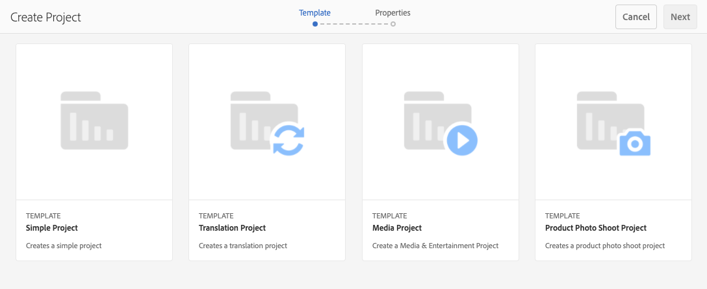
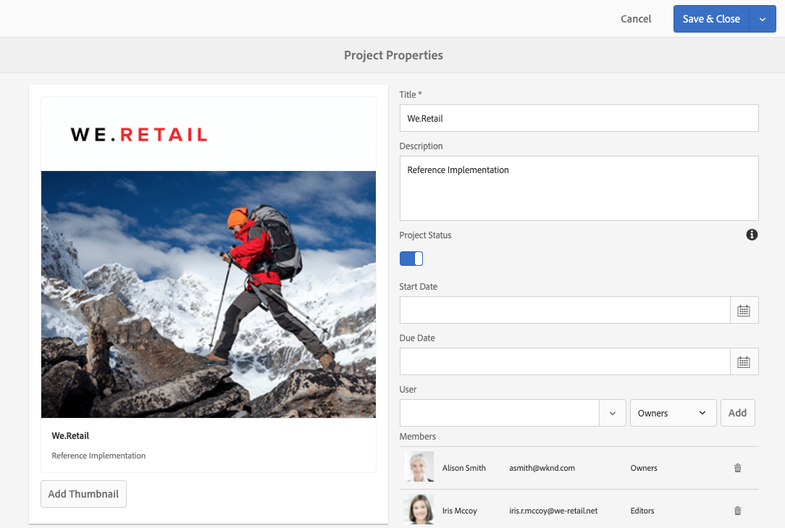

# Administración de proyectos {#managing-projects}

En el **Proyectos** , puede acceder a sus proyectos y gestionarlos.

Con la consola, puede crear un proyecto, asociar recursos al proyecto y también eliminar un proyecto o vínculos a recursos.

## Requisitos de acceso {#access-requirements}

AEM Los proyectos son una función estándar de la y no requieren ninguna configuración adicional.

Sin embargo, para que los usuarios de proyectos puedan ver a otros usuarios o grupos mientras utilizan Proyectos como, por ejemplo, al crear proyectos, crear tareas/flujos de trabajo o ver y administrar el equipo, dichos usuarios deben tener acceso de lectura a `/home/users` y `/home/groups`.

La forma más sencilla de hacerlo es dar el **projects-users** acceso de lectura de grupo a `/home/users` y `/home/groups`.

## Creación de un proyecto {#creating-a-project}

Siga estos pasos para crear un proyecto.

1. En el **Proyectos** consola, toque o haga clic en **Crear** para abrir **Crear proyecto** asistente.
1. Seleccione una plantilla y haga clic en **Siguiente**. Puede obtener más información sobre las plantillas de proyecto estándar [aquí.](/help/sites-authoring/projects.md#project-templates)

   

1. Defina el **Título** y **Descripción** y añada un **Miniatura** imagen si es necesario. También puede añadir o eliminar usuarios y a qué grupo pertenecen.

   

1. Toque o haga clic en **Crear**. La confirmación le solicitará si desea abrir el nuevo proyecto o volver a la consola.

El procedimiento para crear un proyecto es el mismo para todas las plantillas de proyecto. La diferencia entre los tipos de proyectos se relaciona con los proyectos disponibles [funciones de usuario](/help/sites-authoring/projects.md) y [flujos de trabajo.](/help/sites-authoring/projects-with-workflows.md)

### Asociación de recursos al proyecto {#associating-resources-with-your-project}

Los proyectos permiten agrupar recursos en una entidad para administrarlos en su conjunto. Por lo tanto, debe asociar recursos al proyecto. Estos recursos se agrupan dentro del proyecto como **Mosaicos**. Los tipos de recursos que puede añadir se describen en [Mosaicos del proyecto](/help/sites-authoring/projects.md#project-tiles).

Para asociar recursos al proyecto, haga lo siguiente:

1. Abra el proyecto desde la consola **Proyectos**.
1. Pulse o haga clic en **Añadir mosaico** y seleccione el mosaico que desea vincular a su proyecto. Puede seleccionar varios tipos de mosaicos.

   

1. Toque o haga clic en **Crear**. El recurso está vinculado al proyecto y, a partir de ahora, podrá acceder a él desde el proyecto.

### Adición de elementos a un mosaico {#adding-items-to-a-tile}

En algunos mosaicos, puede que desee añadir más de un elemento. Por ejemplo, puede tener más de un flujo de trabajo que se ejecuta al mismo tiempo o más de una experiencia.

Para agregar elementos a un mosaico:

1. Entrada **Proyectos**, vaya al proyecto y haga clic en el icono de cheurón descendente en la parte superior derecha del mosaico al que desee agregar un elemento y seleccione la opción adecuada.

   * La opción depende del tipo de mosaico. Por ejemplo, puede ser **Crear tarea** para el **Tareas** mosaico o **Iniciar flujo de trabajo** para el **Flujos de trabajo** mosaico.

   

1. Agregue el elemento al mosaico como lo haría al crear un mosaico. Se describen los mosaicos del proyecto [aquí.](/help/sites-authoring/projects.md#project-tiles)

## Visualización de información del proyecto {#viewing-project-info}

El propósito principal de los proyectos es agrupar la información asociada en un solo lugar para que sea más accesible y procesable. Existen varias formas de acceder a esta información.

### Apertura de un mosaico {#opening-a-tile}

Es posible que desee ver qué elementos se incluyen en un mosaico actual o modificar o eliminar elementos en el mosaico.

Para abrir un mosaico para poder ver o modificar elementos, haga lo siguiente:

1. Toque o haga clic en el icono de elipses en la parte inferior derecha del mosaico.

   

1. AEM Abre la consola para los tipos de elementos asociados con el mosaico y los filtros en función del proyecto seleccionado.

   

### Visualización de la cronología de un proyecto {#viewing-a-project-timeline}

La cronología del proyecto proporciona información sobre la última vez que se utilizaron los recursos del proyecto. Para ver la cronología del proyecto, siga estos pasos.

1. En el **Proyectos** consola, toque o haga clic en **Cronología** en el selector de raíl en la parte superior izquierda de la consola.
   
2. En la consola, seleccione el proyecto cuya cronología desee ver.
   

Los recursos se muestran en el carril. Utilice el selector de raíl para volver a la vista normal cuando haya terminado.

### Visualización de proyectos inactivos {#viewing-active-inactive-projects}

Para alternar entre su activo y [proyectos inactivos,](#making-projects-inactive-or-active) en el **Proyectos** consola, haga clic en **Alternar proyectos activos** en la barra de herramientas.

De forma predeterminada, la consola muestra los proyectos activos. Haga clic en **Alternar proyectos activos** icono una vez para cambiar a la vista de proyectos inactivos. Vuelva a hacer clic para volver a los proyectos activos.

## Organización de proyectos {#organizing-projects}

Hay varias opciones disponibles para ayudarle a organizar sus proyectos con el fin de mantener el **Proyectos** consola manejable.

### Carpetas de proyecto {#project-folders}

Puede crear carpetas en **Proyectos** para agrupar y organizar proyectos similares.

1. En el **Proyectos** pulse o haga clic en la consola **Crear** y luego **Crear carpeta**.

   

1. Asigne un título a la carpeta y haga clic en **Crear**.

1. La carpeta se agregará a la consola.

Ahora puede crear proyectos dentro de la carpeta. Puede crear varias carpetas y también anidar carpetas.

### Inactivando proyectos {#making-projects-inactive-or-active}

Es posible que desee marcar un proyecto como inactivo si se completa, pero aun así desea mantener la información sobre el proyecto. [Los proyectos inactivos ahora se muestran](#viewing-active-inactive-projects) de forma predeterminada, en la variable **Proyectos** consola.

Para que un proyecto quede inactivo, siga estos pasos.

1. Abra el **Propiedades del proyecto** del proyecto.
   * Puede hacerlo desde la consola de seleccionando el proyecto o desde el proyecto a través de la **Información del proyecto** mosaico.
1. En el **Propiedades del proyecto** ventana, cambie el **Estado del proyecto** deslizador desde **Activo** hasta **Inactivo**.

   

1. Haga clic o pulse **Guardar y cerrar** para guardar los cambios.

### Eliminación de proyectos {#deleting-a-project}

Siga estos pasos para eliminar un proyecto.

1. Vaya al nivel superior de la **Proyectos** consola.
1. Selección del proyecto en la consola.
1. Haga clic o pulse **Eliminar** en la barra de herramientas.
1. AEM Se pueden eliminar o modificar los datos de proyecto asociados al eliminar el proyecto. Seleccione las opciones que necesite en la **Eliminar proyecto** diálogo.
   * Eliminar los grupos y las funciones de proyecto
   * Eliminar carpeta de recursos del proyecto
   * Completar los flujos de trabajo del proyecto

   
1. Haga clic o pulse **Eliminar** para eliminar el proyecto con las opciones seleccionadas.

Para obtener más información sobre los grupos creados automáticamente por proyectos, consulte [Creación automática de grupos](/help/sites-authoring/projects.md#auto-group-creation) para obtener más información.
