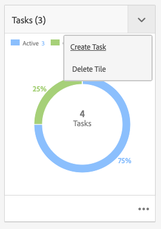

# Administración de proyectos {#managing-projects}

En el **Proyectos** , puede acceder a sus proyectos y administrarlos.

Con la consola, puede crear un proyecto, asociar recursos al proyecto y también eliminar un proyecto o vínculos a recursos.

## Requisitos de acceso {#access-requirements}

Planifica una función de AEM estándar y no requiere ninguna configuración adicional.

Sin embargo, para que los usuarios de los proyectos puedan ver a otros usuarios/grupos mientras utilizan Proyectos como, por ejemplo, al crear proyectos, crear tareas/flujos de trabajo, o al ver y administrar el equipo, dichos usuarios deben tener acceso de lectura en `/home/users` y `/home/groups`.

La forma más sencilla de hacerlo es dar a la variable **usuarios de proyectos** acceso de lectura de grupo a `/home/users` y `/home/groups`.

## Creación de un proyecto {#creating-a-project}

Siga estos pasos para crear un nuevo proyecto.

1. En el **Proyectos** consola, toque o haga clic **Crear** para abrir el **Crear proyecto** asistente.
1. Seleccione una plantilla y haga clic en **Siguiente**. Puede obtener más información sobre las plantillas de proyecto estándar [aquí.](/help/sites-authoring/projects.md#project-templates)

   

1. Defina el **Título** y la **Descripción** y añada una imagen en **miniatura** si es necesario. También puede añadir o eliminar a usuarios y al grupo al que pertenecen.

   

1. Toque o haga clic en **Crear**. La confirmación le preguntará si desea abrir el proyecto nuevo o regresar a la consola.

El procedimiento para crear un proyecto es el mismo para todas las plantillas de proyecto. La diferencia entre los tipos de proyectos se refiere a los proyectos disponibles [funciones de usuario](/help/sites-authoring/projects.md) y [flujos de trabajo.](/help/sites-authoring/projects-with-workflows.md)

### Asociación de recursos al proyecto {#associating-resources-with-your-project}

Los proyectos permiten agrupar los recursos en una entidad para administrarlos en su conjunto. Por lo tanto, debe asociar recursos al proyecto. Estos recursos se agrupan dentro del proyecto como **Mosaicos**. Los tipos de recursos que puede añadir se describen en [Mosaicos de proyecto](/help/sites-authoring/projects.md#project-tiles).

Para asociar recursos al proyecto:

1. Abra el proyecto en la consola **Proyectos**.
1. Toque o haga clic en **Añadir mosaico** y seleccione el mosaico que desea vincular al proyecto. Puede seleccionar varios tipos de mosaicos.

   

1. Toque o haga clic en **Crear**. El recurso está vinculado al proyecto y, a partir de ahora, podrá acceder a él desde el proyecto.

### Adición de elementos a un mosaico {#adding-items-to-a-tile}

En algunos mosaicos, puede que desee añadir más de un elemento. Por ejemplo, puede tener más de un flujo de trabajo que se ejecuta al mismo tiempo o más de una experiencia.

Para agregar elementos a un mosaico:

1. En **Proyectos**, vaya al proyecto, haga clic en el icono de cheurón que aparece abajo en la parte superior derecha del mosaico al que desea agregar un elemento y seleccione la opción adecuada.

   * La opción depende del tipo de mosaico. Por ejemplo, puede ser **Crear tarea** para el **Tareas** mosaico o **Iniciar flujo de trabajo** para el **Flujos de trabajo** mosaico.

   

1. Agregue el elemento al mosaico como lo haría al crear un nuevo mosaico. Se describen los mosaicos del proyecto [aquí.](/help/sites-authoring/projects.md#project-tiles)

## Visualización de la información del proyecto {#viewing-project-info}

El objetivo principal de los proyectos es agrupar la información asociada en un solo lugar para que sea más accesible y procesable. Tiene varias formas de acceder a esta información.

### Apertura de un mosaico {#opening-a-tile}

Puede que desee ver qué elementos se incluyen en un mosaico actual, o modificar o eliminar elementos del mosaico.

Para abrir un mosaico para que pueda ver o modificar elementos:

1. Toque o haga clic en el icono de elipses en la parte inferior derecha del mosaico.

   

1. AEM abre la consola para los tipos de elementos asociados con el mosaico y los filtros basados en el proyecto seleccionado.

   

### Visualización de una línea de tiempo del proyecto {#viewing-a-project-timeline}

La línea de tiempo del proyecto proporciona información sobre cuándo se utilizaron por última vez los recursos del proyecto. Para ver la cronología del proyecto, siga estos pasos.

1. En el **Proyectos** consola, toque o haga clic en **Cronología** en el selector de raíl situado en la parte superior izquierda de la consola.
   
2. En la consola, seleccione el proyecto para el que desea ver su línea de tiempo.
   

Los recursos se muestran en el carril . Utilice el selector de raíl para volver a la vista normal cuando termine.

### Visualización de proyectos inactivos {#viewing-active-inactive-projects}

Para alternar entre el activo y el [proyectos inactivos,](#making-projects-inactive-or-active) en el **Proyectos** de la consola, haga clic en **Alternar proyectos activos** en la barra de herramientas.

De forma predeterminada, la consola muestra proyectos activos. Haga clic en el **Alternar proyectos activos** una vez para cambiar a la visualización de proyectos inactivos. Vuelva a hacer clic en él para volver a los proyectos activos.

## Organización de proyectos {#organizing-projects}

Hay varias opciones disponibles para ayudarle a organizar sus proyectos y mantener la variable **Proyectos** consola manejable.

### Carpetas de proyecto {#project-folders}

Puede crear carpetas en la **Proyectos** para agrupar y organizar proyectos similares.

1. En el **Proyectos** toque o haga clic en la consola **Crear** y luego **Crear carpeta**.

   

1. Asigne un título a la carpeta y haga clic en **Crear**.

1. La carpeta se agrega a la consola.

Ahora puede crear proyectos dentro de la carpeta . Puede crear varias carpetas y anidarlas.

### Inactivación de proyectos {#making-projects-inactive-or-active}

Es posible que desee marcar un proyecto como inactivo si se ha completado, pero desea conservar la información sobre el proyecto. [Los proyectos inactivos ahora se muestran](#viewing-active-inactive-projects) de forma predeterminada, en la variable **Proyectos** consola.

Para que un proyecto esté inactivo, siga estos pasos.

1. Abra el **Propiedades del proyecto** del proyecto.
   * Puede hacerlo desde la consola seleccionando el proyecto o desde el proyecto a través de la **Información del proyecto** mosaico.
1. En el **Propiedades del proyecto** , cambie la **Estado del proyecto** deslizador desde **Activo** a **Inactivo**.

   

1. Toque o haga clic **Guardar y cerrar** para guardar los cambios.

### Eliminación de proyectos {#deleting-a-project}

Siga estos pasos para eliminar un proyecto.

1. Vaya al nivel superior del **Proyectos** consola.
1. Seleccionar el proyecto en la consola.
1. Toque o haga clic **Eliminar** en la barra de herramientas.
1. AEM eliminar o modificar los datos de proyecto asociados tras la eliminación del proyecto. Seleccione las opciones que necesita en la **Eliminar proyecto** diálogo.
   * Eliminar los grupos y las funciones de proyecto
   * Eliminar carpeta de recursos de proyecto
   * Completar los flujos de trabajo del proyecto

   
1. Toque o haga clic **Eliminar** para eliminar el proyecto con las opciones seleccionadas.

Para obtener más información sobre los grupos creados automáticamente por proyectos, consulte [Creación automática de grupos](/help/sites-authoring/projects.md#auto-group-creation) para obtener más información.
