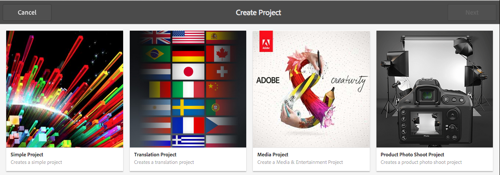
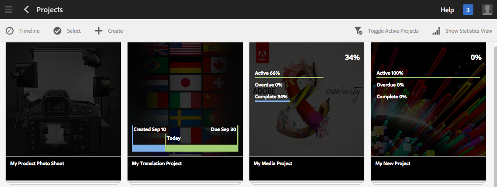

# Administración de proyectos{#managing-projects}

Proyectos le permite agrupar los recursos en una entidad para organizar el proyecto.

En la consola **Proyectos**, puede acceder a los proyectos y realizar acciones con ellos:

En Proyectos, puede crear un proyecto, asociar recursos al proyecto y, además, eliminar un proyecto o vínculos a recursos. Es posible que desee abrir un mosaico para ver su contenido, así como para añadir elementos a un mosaico. En este tema se describen estos procedimientos.

>[!NOTE]
>
>En la versión 6.2 se introdujo la capacidad para organizar Proyectos en carpetas. En la página Proyectos, tiene la posibilidad de crear un proyecto o una carpeta.
>
>Al crear una carpeta, el sistema dirige al usuario a esa carpeta, donde puede crear otra carpeta o un proyecto. Ayuda a organizar proyectos en carpetas basadas en categorías como campañas de productos, ubicación, idiomas traducidos, etcétera.
>
>Los proyectos y las carpetas pueden verse y buscarse en una vista de lista.

>[!CAUTION]
>
>Para que los usuarios de los proyectos puedan ver otros usuarios o grupos mientras utilizan la funcionalidad Proyectos, como crear proyectos, crear tareas/flujos de trabajo, ver y administrar el equipo, esos usuarios necesitan tener acceso de lectura en **/home/users** y **/home/groups**. La manera más fácil de implementar esto es darle al grupo **usuarios de proyectos** acceso de lectura a **/inicio/usuarios** y **/inicio/grupos**.

## Creación de un proyecto    {#creating-a-project}

En la versión básica, AEM proporciona estas plantillas para elegir al crear un proyecto:

* Proyecto simple
* Proyecto multimedia
* Proyecto de sesión fotográfica del producto
* Proyecto de traducción

El procedimiento para crear un proyecto es el mismo de un proyecto a otro. La diferencia entre los tipos de proyectos incluye las [funciones de usuario](/help/sites-authoring/projects.md) y los [flujos de trabajo](/help/sites-authoring/projects-with-workflows.md) disponibles. Para crear un nuevo proyecto:

1. En **Proyectos**, pulse o haga clic en **Crear** y abrirá el asistente **Crear proyecto**:
1. Seleccione una plantilla. De forma predeterminada, Simple Project, Media Project, [Translation Project](/help/sites-administering/tc-manage.md) y [Product Photo Shoot Product](/help/sites-authoring/managing-product-information.md) están disponibles y hacen clic en **Next**.

   

1. Defina el **Título** y la **Descripción** y agregue una **Imagen en miniatura** si es necesario. También puede añadir o eliminar a usuarios y al grupo al que pertenecen. Además, puede hacer clic en **Avanzadas** para añadir un nombre utilizado en la dirección URL.

   

1. Toque o haga clic en **Crear**. La confirmación le preguntará si desea abrir el proyecto nuevo o regresar a la consola.

### Asociación de recursos al proyecto  {#associating-resources-with-your-project}

Dado que los proyectos le permiten agrupar los recursos en una entidad, puede asociar recursos al proyecto. Estos recursos se denominan **Mosaicos**. Los tipos de recursos que puede añadir se describen en [Mosaicos de proyecto](/help/sites-authoring/projects.md#project-tiles).

Para asociar recursos al proyecto:

1. Abra el proyecto en la consola **Proyectos**.
1. Toque o haga clic en **Añadir mosaico** y seleccione el mosaico que desea vincular al proyecto. Puede seleccionar varios tipos de mosaicos.

   

   >[!NOTE]
   >
   >Los mosaicos de proyecto que se pueden asociar a un proyecto se describen detalladamente en [Mosaicos de proyecto.](/help/sites-authoring/projects.md#project-tiles)

1. Toque o haga clic en **Crear**. El recurso está vinculado al proyecto y, a partir de ahora, podrá acceder a él desde el proyecto.

### Eliminación de un proyecto o un vínculo a un recurso {#deleting-a-project-or-resource-link}

Para eliminar un proyecto desde la consola o un recurso vinculado desde el proyecto se utiliza el mismo método: 

1. Vaya a la ubicación adecuada:

   * Para eliminar un proyecto vaya al nivel superior de la consola **Proyectos**.
   * Para eliminar un vínculo a un recurso de un proyecto, abra el proyecto en la consola **Proyectos**.

1. Para introducir el modo de selección, haga clic en **Seleccionar** y seleccione el proyecto o el vínculo a un recurso.
1. Toque o haga clic en **Eliminar**.

1. Debe confirmar la eliminación en un cuadro de diálogo. Si se confirma, se elimina el proyecto o el vínculo a un recurso. Toque o haga clic en **Anular selección** para salir del modo de selección.

>[!NOTE]
>
>Al crear el proyecto y agregar usuarios a las distintas funciones, los grupos asociados con el proyecto se crean automáticamente para administrar los permisos asociados. Por ejemplo, un proyecto llamado Myproject tendría tres grupos: **Propietarios de Myproject**, **Editores de Myproject**, **Observadores de Myproject**. Sin embargo, si se elimina el proyecto, esos grupos no se eliminarán automáticamente. Un administrador tiene que eliminar manualmente los grupos en **Herramientas** > **Seguridad** > **Grupos**.

### Adición de elementos a un mosaico {#adding-items-to-a-tile}

En algunos mosaicos, puede que desee añadir más de un elemento. Por ejemplo, puede tener más de un flujo de trabajo que se ejecuta al mismo tiempo o más de una experiencia.

Para añadir elementos a un mosaico:

1. En **Proyectos**, vaya al proyecto y haga clic en el icono Añadir + del mosaico al que desee agregar un elemento.

   

1. Añada un elemento al mosaico como lo haría al crear un mosaico nuevo. Los mosaicos de proyecto se describen [aquí](/help/sites-authoring/projects.md#project-tiles). En este ejemplo, se ha añadido otro flujo de trabajo.

   

### Apertura de un mosaico {#opening-a-tile}

Puede que desee ver qué elementos se incluyen en un mosaico actual, o modificar o eliminar elementos del mosaico.

Para abrir un mosaico para que pueda ver o modificar elementos:

1. En la consola Proyectos, toque o haga clic en los puntos suspensivos (…).

   

1. AEM enumera los elementos de ese mosaico. Puede introducir el modo de selección para modificar o eliminar los elementos.

   

## Visualización de estadísticas del proyecto {#viewing-project-statistics}

Para ver las estadísticas del proyecto, en la consola **Proyectos**, haga clic en **Mostrar vista de estadísticas**. Se muestra el nivel de finalización de cada proyecto. Haga clic en **Mostrar Vista de estadísticas** nuevamente para ir a la consola **Proyectos**.

### Visualización de una línea de tiempo del proyecto {#viewing-a-project-timeline}

La línea de tiempo del proyecto proporciona información sobre cuándo se utilizaron por última vez los recursos del proyecto. Para realizar la vista de la línea de tiempo del proyecto, toque o haga clic en **Línea de tiempo**, luego ingrese al modo de selección y seleccione el proyecto. Los recursos se muestran en el panel izquierdo. Toque o haga clic **Línea de tiempo** para volver a la consola **Proyectos**.

### Visualización de proyectos activos/inactivos {#viewing-active-inactive-projects}

Para alternar entre los proyectos activos e inactivos, en la consola **Proyectos**, haga clic en **Alternar proyectos activos**. Si el icono tiene una marca junto a él, muestra los proyectos activos.

Si el icono tiene una x junto a él, muestra los proyectos inactivos.

## Hacer que los proyectos sean activos o inactivos {#making-projects-inactive-or-active}

Es posible que desee hacer que un proyecto sea inactivo si lo ha completado, pero desea mantener la información del proyecto.

Para hacer que un proyecto sea inactivo (o activo):

1. En la consola **Proyectos**, abra el proyecto y, a continuación, busque el mosaico **Información del proyecto**.

   >[!NOTE]
   Es posible que deba añadir este mosaico si aún no está en el proyecto. Consulte [Añadir mosaicos](#adding-items-to-a-tile).

1. Toque o haga clic **Editar**.
1. Cambie el selector de **Activo** a **Inactivo** (o viceversa).

   

1. Toque o haga clic en **Hecho** para guardar los cambios.

