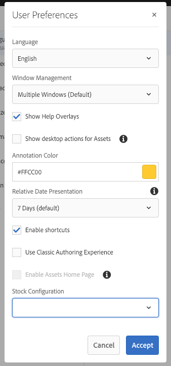

# Configuración del entorno de la cuenta  {#configuring-your-account-environment}

AEM le permite configurar su cuenta y ciertos aspectos del entorno de creación.

Mediante la opción [Usuario](/help/sites-authoring/user-properties.md#user-settings) del [encabezado](/help/sites-authoring/basic-handling.md#the-header) y el cuadro de diálogo [Mis preferencias](#userpreferences) asociado, puede modificar las opciones de usuario.

Para comenzar, acceda a la opción [Usuario](/help/sites-authoring/user-properties.md#user-settings) en el encabezado.

## Configuración de usuario {#user-settings}

El cuadro de diálogo de configuración **Usuario** le da acceso a lo siguiente:

* Suplantar como

   * Con la funcionalidad [Suplantar como](/help/sites-administering/security.md#impersonating-another-user), un usuario puede trabajar en nombre de otro usuario.

* Perfil

   * Ofrece un práctico vínculo a la [configuración de usuario](/help/sites-administering/security.md))

* [Mis preferencias](/help/sites-authoring/user-properties.md#my-preferences)

   * Especifique las distintas preferencias exclusivas al usuario 

### Mis preferencias {#my-preferences}

Puede acceder al cuadro de diálogo **Preferencias** a través de la opción [Usuario](/help/sites-authoring/user-properties.md#user-settings) en el encabezado.

Cada usuario puede establecer determinadas propiedades por sí mismo.

* **Idioma**

  Se trata del idioma que se utiliza para la IU del entorno de creación. Seleccione el idioma requerido de la lista disponible.

  Esta configuración también se utiliza para la IU clásica.

* **Gestión de ventanas**

  Esta opción permite definir el comportamiento o la apertura de las ventanas. Seleccione:

   * **Varias ventanas** (predeterminado)

      * Las páginas se abren en una nueva ventana.

   * **Ventana única**

      * Las páginas se abren en la ventana actual.

* **Mostrar las acciones del escritorio para Assets**

  AEM Esta opción requiere que utilice una aplicación de escritorio de la aplicación.

* **Color de anotación**

  Define el color predeterminado que se utiliza para realizar anotaciones.

   * Haga clic en el bloque de colores para poder abrir el selector de muestras y seleccionar un color.
   * Como alternativa, introduzca el código hexadecimal del color deseado en el campo. 

* **Presentación de fecha relativa**

  AEM Para mejorar la legibilidad, la función procesa las fechas dentro de los últimos siete días como fechas relativas (por ejemplo, hace tres días) y las fechas más antiguas como fechas exactas (por ejemplo, el 20 de marzo de 2017).

  Esta opción define el modo en que se muestran las fechas del sistema. Las opciones disponibles son las siguientes:

   * **Mostrar siempre la fecha exacta**: se muestra siempre la fecha exacta (nunca una fecha relativa).
   * **1 día**: se muestra la fecha relativa para las fechas dentro de un día; de lo contrario, se muestra una fecha exacta. 

   * **7 días (valor predeterminado)**: se muestra la fecha relativa para las fechas dentro de siete días; de lo contrario, se muestra una fecha exacta. 

   * **1 mes**: se muestra la fecha relativa para las fechas dentro de un mes; de lo contrario, se muestra una fecha exacta. 

   * **1 año**: se muestra la fecha relativa para las fechas dentro de un año; de lo contrario se muestra una fecha exacta. 

   * **Mostrar siempre la fecha relativa**: las fechas exactas nunca se muestran, y solo se muestran fechas relativas.

* **Habilitar métodos abreviados**

  AEM admite varios métodos abreviados del teclado para mejorar la eficacia de la creación de contenido.

   * [Métodos abreviados del teclado para editar páginas](/help/sites-authoring/page-authoring-keyboard-shortcuts.md)
   * [Métodos abreviados del teclado para las consolas](/help/sites-authoring/keyboard-shortcuts.md)

  Esta opción habilita los métodos abreviados de teclado. De forma predeterminada, están habilitadas, pero se pueden deshabilitar, por ejemplo, si un usuario tiene ciertos requisitos de accesibilidad.

* **Usar experiencia de creación clásica**

  Esta opción habilita la creación de páginas basada en la IU [clásica](/help/sites-classic-ui-authoring/classic-page-author-first-steps.md). De forma predeterminada, se utiliza la interfaz de usuario estándar.

* **Activar la página principal de los recursos**

  Esta opción solo está disponible si el administrador del sistema ha habilitado la experiencia de la página principal de Assets para toda la organización.

* **Configuración de Stock**

  Esta opción le permite especificar la configuración de Adobe Stock preferida y solo está disponible si el administrador del sistema ha habilitado la [integración de Adobe Stock](/help/assets/aem-assets-adobe-stock.md).
