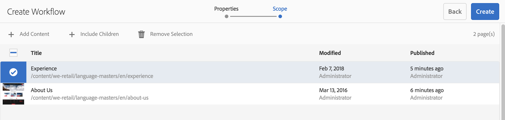
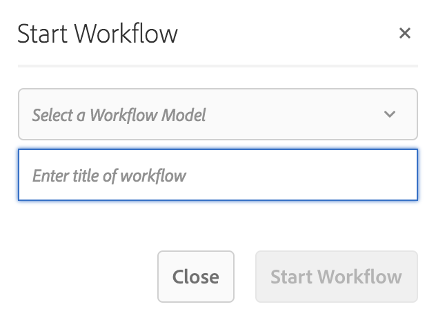

# Aplicación de flujos de trabajo a páginas{#applying-workflows-to-pages}

Al crear, puede invocar flujos de trabajo para realizar acciones en las páginas; también es posible aplicar más de un flujo de trabajo.

A la hora de aplicar el flujo de trabajo, puede especificar la siguiente información:

* El flujo de trabajo que desea aplicar.
Puede aplicar cualquier flujo de trabajo (a los que tiene acceso, según la asignación del administrador de AEM).
* De forma opcional, un título que ayuda a identificar la instancia de flujo de trabajo en la bandeja de entrada de un usuario.
* La carga útil de los flujos de trabajo; pueden ser una o varias páginas.

Los flujos de trabajo se pueden iniciar desde lo siguiente:

* [la consola **Sitios**](#starting-a-workflow-from-the-sites-console).
* [al editar una página, en **Información de la página **](#starting-a-workflow-from-the-page-editor).

>[!NOTE]
>
>Consulte también:
>
>* [Cómo aplicar flujos de trabajo a recursos DAM](/help/assets/assets-workflow.md).
>* [Uso de flujos de trabajo de proyecto](/help/sites-authoring/projects-with-workflows.md).
>

>[!NOTE]
>
>Los administradores de AEM pueden [iniciar flujos de trabajo mediante varios métodos](/help/sites-administering/workflows-starting.md).

## Inicio de un flujo de trabajo desde la consola Sitios {#starting-a-workflow-from-the-sites-console}

Puede iniciar un flujo de trabajo desde:

* [la opción **Crear** de la barra de herramientas del sitio](#starting-a-workflow-from-the-sites-toolbar).
* [el carril **Escala de tiempo** de la consola Sitios](#starting-a-workflow-from-the-timeline).

En ambos casos, tendrá que realizar lo siguiente:

* [Especificar los detalles del flujo de trabajo en el asistente Crear flujo de trabajo](#specifying-workflow-details-in-the-create-workflow-wizard).

### Inicio de un flujo de trabajo desde la barra de herramientas Sitios {#starting-a-workflow-from-the-sites-toolbar}

You can start a workflow from the toolbar of the **Sites** console:

1. Busque y seleccione la página deseada. 

1. From the **Create** option in the toolbar you can now select **Workflow**.

   

1. El asistente **Crear flujo de trabajo** le ayudará a [especificar los detalles del flujo de trabajo](#specifying-workflow-details-in-the-create-workflow-wizard).

### Inicio de un flujo de trabajo desde la escala de tiempo {#starting-a-workflow-from-the-timeline}

Desde **Escala de tiempo**, puede iniciar un flujo de trabajo para aplicarlo al recurso seleccionado.

1. [Seleccione el recurso](/help/sites-authoring/basic-handling.md#viewingandselectingyourresources) y abra la [línea de tiempo](/help/sites-authoring/basic-handling.md#timeline) (o abra la línea de tiempo y, a continuación, seleccione el recurso).
1. La punta de flecha junto al campo Comentario puede utilizarse para mostrar **Iniciar flujo de trabajo**:

   

1. El asistente **Crear flujo de trabajo** le ayudará a [especificar los detalles del flujo de trabajo](#specifying-workflow-details-in-the-create-workflow-wizard).

### Especificación de los detalles del flujo de trabajo en el asistente Crear flujo de trabajo {#specifying-workflow-details-in-the-create-workflow-wizard}

El asistente **Crear flujo de trabajo** ayuda a seleccionar el flujo de trabajo y especificar los detalles necesarios.

Después de abrir el asistente **Crear flujo de trabajo** desde:

* [la opción **Crear** de la barra de herramientas del sitio](#starting-a-workflow-from-the-sites-toolbar).
* [el carril **Escala de tiempo** de la consola Sitios](#starting-a-workflow-from-the-timeline).

Puede especificar los detalles:

1. En la etapa **Propiedades**, se definen las opciones básicas del flujo de trabajo:

   * **Modelo de flujo de trabajo**
   * **Título del flujo de trabajo**

      * Puede especificar un título para esta instancia, de modo que pueda identificarlo en una etapa posterior.
   Según el modelo de flujo de trabajo, también están disponibles las siguientes opciones. Estas permiten conservar el paquete creado como carga útil después de que se haya completado el flujo de trabajo.

   * **Conservar paquete de flujo de trabajo**
   * **Título del paquete**

      * Puede especificar un título para el paquete para ayudar en su identificación.
   >[!NOTE]
   >
   >La opción **Conservar paquete de flujo de trabajo** está disponible cuando el flujo de trabajo se ha configurado para la [Compatibilidad con varios recursos](/help/sites-developing/workflows-models.md#configuring-a-workflow-for-multi-resource-support) y se han seleccionado varios recursos.

   Cuando haya terminado, seleccione **Siguiente** para continuar.

   

1. En la etapa **Ámbito**, puede seleccionar lo siguiente:

   * **Agregar contenido** para abrir el explorador [de](/help/sites-authoring/author-environment-tools.md#path-browser) rutas y seleccionar recursos adicionales; en el navegador, toque o haga clic en **Seleccionar** para añadir contenido a la instancia de flujo de trabajo.

   * Un recurso existente para ver acciones adicionales:

      * **Incluir elementos secundarios** para especificar que en el flujo de trabajo se incluirán los elementos secundarios de ese recurso.
Se abrirá un cuadro de diálogo para que pueda ajustar la selección según lo siguiente:

         * Incluir solo los elementos secundarios inmediatos.
         * Incluir solo las páginas modificadas.
         * Incluir solo las páginas ya publicadas.
         Los elementos secundarios especificados se añaden a la lista de recursos a los que se aplicará el flujo de trabajo.

      * **Eliminar selección** para eliminar ese recurso del flujo de trabajo.
   

   >[!NOTE]
   >
   >Si se añaden recursos adicionales, se puede utilizar la opción **Atrás** para ajustar la configuración de **Conservar paquete de flujo de trabajo** en la etapa **Propiedades**.

1. Use **Create** to close the wizard and create the workflow instance. Se muestra una notificación en la consola Sitios.

## Inicio de un flujo de trabajo desde el Editor de página {#starting-a-workflow-from-the-page-editor}

Al editar una página, puede seleccionar **Información de la página** en la barra de herramientas. En el menú desplegable se incluye la opción **Iniciar en flujo de trabajo**. Se abrirá un cuadro de diálogo en el que puede especificar el flujo de trabajo necesario junto con un título, si fuera necesario: 

