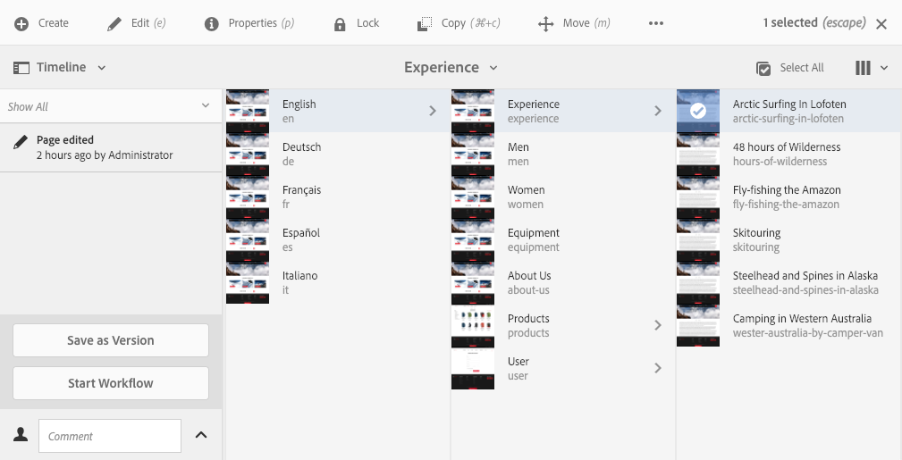

# Aplicación de flujos de trabajo a páginas{#applying-workflows-to-pages}

Durante la creación, puede invocar flujos de trabajo para realizar acciones en las páginas; también es posible aplicar más de un flujo de trabajo.

A la hora de aplicar el flujo de trabajo, se especifica la siguiente información:

* Flujo de trabajo que se va a aplicar.
Puede aplicar cualquier flujo de trabajo (al que tenga acceso, según lo haya asignado el administrador de AEM).
* De forma opcional, un título que ayude a identificar la instancia de flujo de trabajo en la bandeja de entrada del usuario.
* La carga útil de los flujos de trabajo; pueden ser una o varias páginas.

Los flujos de trabajo se pueden iniciar desde:

* [la consola Sitios](#starting-a-workflow-from-the-sites-console).
* [al editar una página, en Información de la página](#starting-a-workflow-from-the-page-editor). 

>[!NOTE]
>
>Consulte también lo siguiente:
>
>* [Cómo aplicar flujos de trabajo a recursos DAM](/help/assets/assets-workflow.md).
>* [Uso de flujos de trabajo de proyecto](/help/sites-authoring/projects-with-workflows.md).
>

>[!NOTE]
>
>AEM Los administradores de pueden [iniciar flujos de trabajo mediante varios métodos](/help/sites-administering/workflows-starting.md).

## Inicio de un flujo de trabajo desde la consola Sites {#starting-a-workflow-from-the-sites-console}

Puede iniciar un flujo de trabajo desde las ubicaciones siguientes:

* [la opción Crear de la barra de herramientas del sitio](#starting-a-workflow-from-the-sites-toolbar).
* [el carril Escala de tiempo de la consola Sitios](#starting-a-workflow-from-the-timeline).

En ambos casos deberá:

* [Especificar los detalles del flujo de trabajo en el asistente Crear flujo de trabajo](#specifying-workflow-details-in-the-create-workflow-wizard).

### Inicio de un flujo de trabajo desde la barra de herramientas de Sites {#starting-a-workflow-from-the-sites-toolbar}

Puede iniciar un flujo de trabajo desde la barra de herramientas de la consola **Sitios**:

1. Busque y seleccione la página deseada. 

1. En la opción **Crear** de la barra de herramientas, ahora puede seleccionar el **Flujo de trabajo**.

   

1. El asistente **Crear flujo de trabajo** le ayudará a [especificar los detalles del flujo de trabajo](#specifying-workflow-details-in-the-create-workflow-wizard).

### Inicio de un flujo de trabajo desde la cronología {#starting-a-workflow-from-the-timeline}

Desde la **Cronología** puede iniciar un flujo de trabajo para aplicarlo al recurso seleccionado.

1. [Seleccione el recurso](/help/sites-authoring/basic-handling.md#viewingandselectingyourresources) y abra [Cronología](/help/sites-authoring/basic-handling.md#timeline) (o abra Cronología y seleccione el recurso).
1. La punta de flecha junto al campo Comentario puede utilizarse para mostrar **Iniciar flujo de trabajo**:

   

1. El asistente **Crear flujo de trabajo** le ayudará a [especificar los detalles del flujo de trabajo](#specifying-workflow-details-in-the-create-workflow-wizard).

### Especificación de los detalles del flujo de trabajo en el asistente Crear flujo de trabajo {#specifying-workflow-details-in-the-create-workflow-wizard}

El asistente **Crear flujo de trabajo** le ayudará a seleccionar el flujo de trabajo y a especificar los detalles necesarios.

Después de abrir el asistente **Crear flujo de trabajo** desde:

* [la opción Crear de la barra de herramientas del sitio](#starting-a-workflow-from-the-sites-toolbar).
* [el carril Escala de tiempo de la consola Sitios](#starting-a-workflow-from-the-timeline).

Puede especificar los detalles:

1. En la etapa **Propiedades**, se definen las opciones básicas del flujo de trabajo:

   * **Modelo de flujo de trabajo**
   * **Título del flujo de trabajo**

      * Puede especificar un título para esta instancia, de modo que pueda identificarla en una etapa posterior.

   Según el modelo de flujo de trabajo, también están disponibles las siguientes opciones. Estas permiten conservar el paquete creado como carga útil después de que se haya completado el flujo de trabajo.

   * **Conservar paquete de flujo de trabajo**
   * **Título del paquete**

      * Puede especificar un título para el paquete para facilitar su identificación.

   >[!NOTE]
   >
   >El **Mantener paquete de flujo de trabajo** está disponible cuando el flujo de trabajo se ha configurado para [Compatibilidad con varios recursos](/help/sites-developing/workflows-models.md#configuring-a-workflow-for-multi-resource-support) y se han seleccionado varios recursos.

   Cuando haya terminado, seleccione **Siguiente** para continuar.

   

1. En la etapa **Ámbito**, puede seleccionar lo siguiente:

   * **Añadir contenido** para abrir [explorador de rutas](/help/sites-authoring/author-environment-tools.md#path-browser) y seleccione recursos adicionales; en el explorador, haga clic en **Seleccionar** para añadir el contenido a la instancia de flujo de trabajo.

   * Un recurso existente para ver acciones adicionales:

      * **Incluir elementos secundarios** para especificar que en el flujo de trabajo se incluirán los elementos secundarios de ese recurso.
Se abre un cuadro de diálogo, que le permite restringir la selección según lo siguiente:

         * Incluir solo los elementos secundarios inmediatos.
         * Incluir solo las páginas modificadas.
         * Incluir solo las páginas ya publicadas.

        Los elementos secundarios especificados se añaden a la lista de recursos a los que se aplicará el flujo de trabajo.

      * **Eliminar la selección** para eliminar ese recurso del flujo de trabajo.

   

   >[!NOTE]
   >
   >Si agrega recursos adicionales, puede utilizar **Atrás** para ajustar la configuración **Mantener flujo de trabajo del paquete** en el paso **Propiedades**.

1. Use la opción **Crear** para cerrar el asistente y crear la instancia de flujo de trabajo. Se muestra una notificación en la consola Sites.

## Inicio de un flujo de trabajo desde el Editor de página {#starting-a-workflow-from-the-page-editor}

Al editar una página, puede seleccionar **Información de página** en la barra de herramientas. El menú desplegable tiene la opción **Iniciar en flujo de trabajo**. Se abrirá un cuadro de diálogo en el que puede especificar el flujo de trabajo necesario, junto con un título si es necesario:

