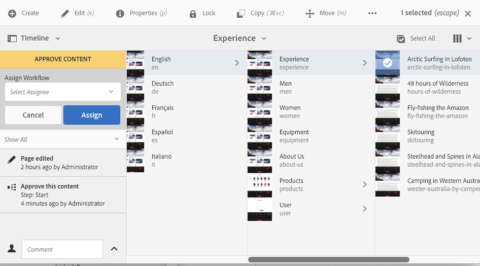

# Participación en flujos de trabajo{#participating-in-workflows}

Los flujos de trabajo suelen incluir pasos que requieren que una persona realice una actividad en una página o un recurso. El flujo de trabajo selecciona un usuario o grupo para realizar la actividad y asigna un elemento de trabajo a esa persona o grupo. El usuario recibe la notificación y puede realizar la acción correspondiente:

* [Visualización de notificaciones ](#notifications-of-available-workflow-actions)
* [Finalización de una etapa de participante ](#completing-a-participant-step)
* [Delegación de una etapa de participante ](#delegating-a-participant-step)
* [Realización de una etapa hacia atrás en una etapa de participante ](#performing-step-back-on-a-participant-step)
* [Apertura de un elemento de flujo de trabajo para ver los detalles (y tomar medidas) ](#opening-a-workflow-item-to-view-details-and-take-actions)
* [Visualización de la carga útil del flujo de trabajo (varios recursos) ](#viewing-the-workflow-payload-multiple-resources)

## Notificaciones de acciones de flujo de trabajo disponibles {#notifications-of-available-workflow-actions}

Cuando se le asigna un elemento de trabajo (por ejemplo, **Aprobar contenido**), aparecen varias alertas o notificaciones:

* Su [notificación](/help/sites-authoring/inbox.md) indicador (barra de herramientas) se incrementará:

   

* El elemento figurará en la [Bandeja de entrada](/help/sites-authoring/inbox.md) de notificaciones:

   

* Cuando utilice el editor de páginas, la barra de estado mostrará lo siguiente:

   * El nombre de los flujos de trabajo que se aplican a la página; por ejemplo, Solicitud de activación.
   * Cualquier acción disponible para el usuario actual para el paso actual del flujo de trabajo; por ejemplo, Completar, Delegar, Ver detalles.
   * Número de flujos de trabajo a los que está sujeta la página. Puede hacer lo siguiente:

      * utilice las flechas izquierda/derecha para navegar por la información de estado de los distintos flujos de trabajo.
      * toque o haga clic en el número real para abrir una lista desplegable de todos los flujos de trabajo aplicables y, a continuación, seleccione el flujo de trabajo que desee mostrar en la barra de estado.

   

   >[!NOTE]
   >
   >La barra de estado solo es visible para los usuarios con privilegios de flujo de trabajo; por ejemplo, los miembros del grupo `workflow-users`.
   >
   >
   >Las acciones se muestran cuando el usuario actual participa directamente en el paso actual del flujo de trabajo.

* When **Cronología** está abierto para el recurso, se mostrará el paso del flujo de trabajo. Al tocar o hacer clic en el banner de alerta, también se mostrarán las acciones disponibles:

   

### Finalización de una etapa de participante {#completing-a-participant-step}

Puede completar un elemento para permitir que el flujo de trabajo avance hasta el paso siguiente.

En esta acción puede indicar:

* **Paso siguiente**: el siguiente paso que debe darse; puede seleccionar una de las listas proporcionadas
* **Comentario**: si es necesario

Puede completar un paso del participante desde:

* [la bandeja de entrada](#completing-a-participant-step-inbox)
* [Editor de páginas](#completing-a-participant-step-page-editor)
* [Escala de cronología](#completing-a-participant-step-timeline)
* when [apertura de un elemento de flujo de trabajo para ver detalles](#opening-a-workflow-item-to-view-details-and-take-actions).

#### Finalización de una etapa de participante: bandeja de entrada {#completing-a-participant-step-inbox}

Utilice el siguiente procedimiento para completar el elemento de trabajo:

1. Abra la **[Bandeja de entrada AEM](/help/sites-authoring/inbox.md)**.
1. Seleccione el elemento de flujo de trabajo sobre el que desea realizar la acción (toque o haga clic en la miniatura).
1. Seleccione **Completar** en la barra de herramientas.
1. Se abre el cuadro de diálogo **Completar elemento de trabajo**. Seleccione **Siguiente paso** del selector desplegable y añada un comentario en el campo **Comentario**, si fuera necesario.
1. Utilice **Aceptar** para completar el paso (o **Cancelar** para anular la acción).

#### Finalización de una etapa de participante: editor de páginas {#completing-a-participant-step-page-editor}

Utilice el siguiente procedimiento para completar el elemento de trabajo:

1. Abra el [página para edición](/help/sites-authoring/managing-pages.md#opening-a-page-for-editing).
1. Seleccione **Completar** de la barra de estado situada en la parte superior.
1. Se abre el cuadro de diálogo **Completar elemento de trabajo**. Seleccione **Siguiente paso** del selector desplegable y añada un comentario en el campo **Comentario**, si fuera necesario.
1. Utilice **Aceptar** para completar el paso (o **Cancelar** para anular la acción).

#### Finalización de una etapa de participante: línea de tiempo {#completing-a-participant-step-timeline}

También puede utilizar la cronología para completar y avanzar un paso:

1. Seleccione la página necesaria y abra **Cronología** (o abra **Cronología** y seleccione la página).

   

1. Toque o haga clic en el banner de alerta para mostrar las acciones disponibles. Select **Avance**:

   

1. Según el flujo de trabajo, puede seleccionar la siguiente etapa:

   

1. Select **Avance** para confirmar la acción.

### Delegación de una etapa de participante {#delegating-a-participant-step}

Si se le ha asignado un paso, pero por cualquier razón no puede realizar ninguna acción, puede delegar el paso a otro usuario o grupo.

Los usuarios que están disponibles para la delegación dependen de quién haya asignado el elemento de trabajo:

* Si el elemento de trabajo se asignó a un grupo, los miembros del grupo estarán disponibles.
* Si el elemento de trabajo se ha asignado a un grupo y luego se ha delegado a un usuario, los miembros del grupo y el grupo están disponibles.
* Si el elemento de trabajo se asignó a un solo usuario, no se puede delegar el elemento de trabajo.

En esta acción puede indicar:

* **Usuario**: el usuario al que desee delegar; puede seleccionar una de las listas proporcionadas
* **Comentario**: si es necesario

Puede delegar un paso de participante desde:

* [la bandeja de entrada](#delegating-a-participant-step-inbox)
* [Editor de páginas](#delegating-a-participant-step-page-editor)
* [Escala de cronología](#delegating-a-participant-step-timeline)
* when [apertura de un elemento de flujo de trabajo para ver detalles](#opening-a-workflow-item-to-view-details-and-take-actions).

#### Delegación de una etapa de participante: bandeja de entrada {#delegating-a-participant-step-inbox}

Utilice el siguiente procedimiento para delegar un elemento de trabajo:

1. Abra la **[Bandeja de entrada AEM](/help/sites-authoring/inbox.md)**.
1. Seleccione el elemento de flujo de trabajo sobre el que desea realizar la acción (toque o haga clic en la miniatura).
1. Seleccione **Delegar** en la barra de herramientas.
1. Se abrirá el cuadro de diálogo. Especifique el **Usuario** del selector desplegable (también puede ser un grupo) y añada un comentario en el campo **Comentario**, si fuera necesario.
1. Utilice **Aceptar** para completar el paso (o **Cancelar** para anular la acción).

#### Delegación de una etapa de participante: editor de páginas {#delegating-a-participant-step-page-editor}

Utilice el siguiente procedimiento para delegar un elemento de trabajo:

1. Abra el [página para edición](/help/sites-authoring/managing-pages.md#opening-a-page-for-editing).
1. Seleccione **Delegar** de la barra de estado situada en la parte superior.
1. Se abrirá el cuadro de diálogo. Especifique el **Usuario** del selector desplegable (también puede ser un grupo) y añada un comentario en el campo **Comentario**, si fuera necesario.
1. Utilice **Aceptar** para completar el paso (o **Cancelar** para anular la acción).

#### Delegación de una etapa de participante: línea de tiempo {#delegating-a-participant-step-timeline}

También puede utilizar la cronología para delegar o asignar un paso:

1. Seleccione la página necesaria y abra **Cronología** (o abra **Cronología** y seleccione la página).
1. Toque o haga clic en el banner de alerta para mostrar las acciones disponibles. Select **Cambiar usuario asignado**:

   

1. Especifique un nuevo usuario para la asignación:

   

1. Seleccione **Asignar** para confirmar la acción.

### Realización de una etapa hacia atrás en una etapa de participante {#performing-step-back-on-a-participant-step}

Si descubre que es necesario repetir un paso o una serie de pasos, puede retroceder. Esto le permite seleccionar un paso, que se produjo anteriormente en el flujo de trabajo, para volver a procesarlo. El flujo de trabajo vuelve al paso especificado y continúa desde allí.

En esta acción puede indicar:

* **Paso anterior**: el paso que se devolverá a; puede seleccionar una de las listas proporcionadas
* **Comentario**: si es necesario

Puede retroceder en un paso del participante desde:

* [la bandeja de entrada](#performing-step-back-on-a-participant-step-inbox)
* [Editor de páginas](#performing-step-back-on-a-participant-step-page-editor)
* [Escala de cronología](#performing-step-back-on-a-participant-step-timeline)
* when [apertura de un elemento de flujo de trabajo para ver detalles](#opening-a-workflow-item-to-view-details-and-take-actions).

#### Realización de una etapa hacia atrás en una etapa de participante: bandeja de entrada {#performing-step-back-on-a-participant-step-inbox}

Utilice el siguiente procedimiento para volver al paso anterior:

1. Abra la **[Bandeja de entrada AEM](/help/sites-authoring/inbox.md)**.
1. Seleccione el elemento de flujo de trabajo sobre el que desea realizar la acción (toque o haga clic en la miniatura).
1. Seleccione **Retroceder** para abrir el cuadro de diálogo. 

1. Especifique un valor en **Etapa anterior** y añada un comentario en el campo **Comentario**, si fuera necesario.
1. Utilice **Aceptar** para completar el paso (o **Cancelar** para anular la acción).

#### Realización de una etapa hacia atrás en una etapa de participante: editor de páginas {#performing-step-back-on-a-participant-step-page-editor}

Utilice el siguiente procedimiento para volver al paso anterior:

1. Abra el [página para edición](/help/sites-authoring/managing-pages.md#opening-a-page-for-editing).
1. Seleccione **Retroceder** de la barra de estado situada en la parte superior.
1. Especifique un valor en **Etapa anterior** y añada un comentario en el campo **Comentario**, si fuera necesario.
1. Utilice **Aceptar** para completar el paso (o **Cancelar** para anular la acción).

#### Realización de una etapa hacia atrás en una etapa de participante: línea de tiempo {#performing-step-back-on-a-participant-step-timeline}

También puede utilizar la línea de tiempo para revertir a un paso anterior:

1. Seleccione la página necesaria y abra **Cronología** (o abra **Cronología** y seleccione la página).
1. Toque o haga clic en el banner de alerta para mostrar las acciones disponibles. Select **Reversión**:

   

1. Especifique la etapa a la que debe restablecerse el flujo de trabajo:

   

1. Seleccione **Restablecer** para confirmar la acción.

### Apertura de un elemento de flujo de trabajo para ver los detalles (y tomar medidas) {#opening-a-workflow-item-to-view-details-and-take-actions}

Vea detalles del elemento de trabajo del flujo de trabajo y realice las acciones adecuadas.

Los detalles del flujo de trabajo se muestran en pestañas y las acciones adecuadas están disponibles en la barra de herramientas:

* Ficha **ELEMENTO DE TRABAJO:**

   

* Pestaña **INFORMACIÓN DEL FLUJO DE TRABAJO**:

   

   If [Etapas del flujo de trabajo](/help/sites-developing/workflows.md#workflow-stages) se han configurado para el modelo, puede ver el progreso según estos elementos:

   

* Pestaña **COMENTARIOS**:

   

Puede abrir los detalles del elemento de trabajo desde las ubicaciones siguientes:

* [la bandeja de entrada](#performing-step-back-on-a-participant-step-inbox)
* [Editor de páginas](#performing-step-back-on-a-participant-step-page-editor)

#### Apertura de detalles del flujo de trabajo: bandeja de entrada {#opening-workflow-details-inbox}

Para abrir un elemento de flujo de trabajo y ver los detalles:

1. Abra la **[Bandeja de entrada AEM](/help/sites-authoring/inbox.md)**.
1. Seleccione el elemento de flujo de trabajo sobre el que desea realizar la acción (toque o haga clic en la miniatura).
1. Seleccione **Abrir** para abrir las pestañas de información. 

1. Si fuera necesario, seleccione la acción adecuada, proporcione los detalles necesarios y confirme con **Aceptar** (o **Cancelar**).
1. Utilice las opciones **Guardar** o **Cancelar** para salir.

#### Apertura de detalles del flujo de trabajo: editor de páginas {#opening-workflow-details-page-editor}

Para abrir un elemento de flujo de trabajo y ver los detalles:

1. Abra el [página para edición](/help/sites-authoring/managing-pages.md#opening-a-page-for-editing).
1. Seleccione **Ver detalles** de la barra de estado para abrir las pestañas de información. 

1. Si fuera necesario, seleccione la acción adecuada, proporcione los detalles necesarios y confirme con **Aceptar** (o **Cancelar**).
1. Utilice las opciones **Guardar** o **Cancelar** para salir.

### Visualización de la carga útil del flujo de trabajo (varios recursos) {#viewing-the-workflow-payload-multiple-resources}

Puede ver los detalles de la carga útil asociada a la instancia de flujo de trabajo. Inicialmente se muestran los recursos del paquete y puede explorar en profundidad para mostrar las páginas individuales.

Para ver la carga útil y los recursos de la instancia de flujo de trabajo:

1. Abra la **[Bandeja de entrada AEM](/help/sites-authoring/inbox.md)**.
1. Seleccione el elemento de flujo de trabajo sobre el que desea realizar la acción (toque o haga clic en la miniatura).
1. Seleccione **Ver carga útil** de la barra de herramientas para abrir el cuadro de diálogo. 

   Como un paquete de flujo de trabajo es simplemente una colección de punteros a rutas dentro del repositorio, puede añadir, quitar o modificar las entradas aquí para ajustar lo que el paquete de flujo de trabajo hace referencia. Utilice la variable **Definición de recurso** para añadir nuevas entradas.

   

1. Los vínculos se pueden utilizar para abrir páginas individuales.
