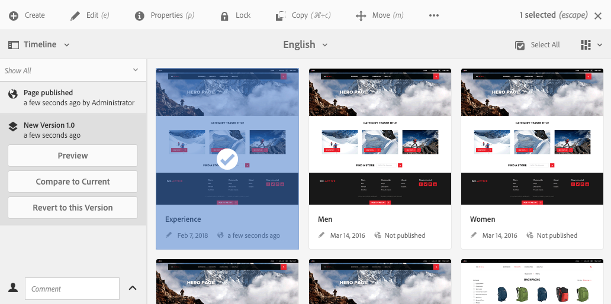

# Uso de versiones de página  {#working-with-page-versions}

Al generar una versión, se crea una “instantánea” de una página en un momento determinado. Con las versiones, se pueden realizar las siguientes operaciones:

* Crear una versión de la página.
* Restaurar una página a una versión anterior; por ejemplo:
   * para deshacer un cambio realizado en la página.
* Comparar la versión actual de una página con una versión anterior:
   * para resaltar diferencias en el texto y las imágenes.

## Creación de una nueva versión   {#creating-a-new-version}

Puede crear una versión de su recurso desde:

* el [Carril de cronología](#creating-a-new-version-timeline)
* el [Crear](#creating-a-new-version-create-with-a-selected-resource) opción (cuando hay un recurso seleccionado)

### Crear una nueva versión: línea de tiempo {#creating-a-new-version-timeline}

1. Desplácese hasta mostrar la página para la que desea crear una versión.
1. Seleccione la página en [modo de selección](/help/sites-authoring/basic-handling.md#viewing-and-selecting-resources).
1. Abra el **Cronología** columna.
1. Toque o haga clic en la punta de flecha junto al campo de comentarios para mostrar las opciones:

   

1. Seleccione **Guardar como versión**.
1. Introduzca una **Etiqueta** y **Comentario** si es necesario.

   

1. Confirme la nueva versión con **Crear**.

   La información en la cronología se actualizará para indicar la nueva versión.

### Crear una nueva versión: creación con un recurso seleccionado {#creating-a-new-version-create-with-a-selected-resource}

1. Desplácese hasta mostrar la página para la que desea crear una versión.
1. Seleccione la página en [modo de selección](/help/sites-authoring/basic-handling.md#viewing-and-selecting-resources).
1. Seleccione el **Crear** en la barra de herramientas para abrir el cuadro de diálogo.
1. En el cuadro de diálogo, puede introducir un **Etiqueta** y una **Comentario**, si es necesario:

   

1. Confirme la nueva versión con **Crear**.

   La cronología se abre con la información actualizada para indicar la nueva versión.

## Restablecimiento de versiones {#reinstating-versions}

Una vez creada una versión de la página, existen varios métodos para restablecer una versión anterior:

* la opción **Revertir a esta versión** del carril [Cronología](/help/sites-authoring/basic-handling.md#timeline)

  Restablezca una versión anterior de una página seleccionada.

* las opciones **Restaurar** de la parte superior de la [barra de herramientas acciones](/help/sites-authoring/basic-handling.md#actions-toolbar)

   * **Restaurar versión**

     Restablecer versiones de páginas especificadas dentro de la carpeta seleccionada actualmente; esto también puede incluir la restauración de páginas que se han eliminado anteriormente.

   * **Restaurar árbol**

     Restablecer una versión de todo un árbol en una fecha y hora especificadas; esto puede incluir páginas que se han eliminado anteriormente.

>[!NOTE]
>
>Al restablecer una página, la versión creada formará parte de una rama nueva.
>
>Como ejemplo:
>
>1. Cree una versión de una página cualquiera.
>1. Las etiquetas y los nombres de nodo iniciales serán 1.0, 1.1, 1.2, etc.
>1. Restablezca la primera versión; en este caso, 1.0.
>1. Vuelva a crear las versiones.
>1. Las etiquetas y los nombres de nodo generados ahora serán 1.0.0, 1.0.1, 1.0.2, etc.

### Volver a esta versión {#revert-to-a-version}

Hasta **Revertir** la página seleccionada a una versión anterior:

1. Desplácese hasta mostrar la página que desea revertir a una versión anterior.
1. Seleccione la página en [modo de selección](/help/sites-authoring/basic-handling.md#viewing-and-selecting-resources).
1. Abra la columna **Cronología** y seleccione **Mostrar todo** o **Versiones**. Se enumerarán las versiones de página de la página seleccionada.
1. Seleccione la versión a la que desea revertir. Se muestran las opciones posibles:

   

1. Seleccione **Revertir a esta versión**. La versión seleccionada se restaura y la información se actualiza en la cronología.

### Restaurar versión {#restore-version}

Este método se puede utilizar para restaurar versiones de páginas especificadas dentro de la carpeta actual; esto también puede incluir la restauración de páginas que se han eliminado anteriormente:

1. Vaya a, y [seleccione](/help/sites-authoring/basic-handling.md#viewing-and-selecting-resources), la carpeta requerida.

1. Seleccione **Restaurar**, luego **Restaurar versión** desde la parte superior de la [barra de herramientas acciones](/help/sites-authoring/basic-handling.md#actions-toolbar).

   >[!NOTE]
   >
   >Si:
   >
   >* ha seleccionado una sola página que nunca ha tenido páginas secundarias,
   >* o ninguna de las páginas de la carpeta tiene versiones,
   >
   >A continuación, la pantalla está vacía, ya que no hay versiones aplicables.

1. Se muestran las versiones disponibles:

   

1. Para una página específica, utilice el selector desplegable en **RESTAURAR A VERSIÓN** para seleccionar la versión requerida para esa página.

   

1. En la pantalla principal, seleccione la página requerida para la restauración:

   

1. Seleccione **Restaurar** para la versión seleccionada, de la página seleccionada, que se restaurará como la versión actual.

>[!NOTE]
>
>El orden en que se selecciona una página requerida y la versión relacionada son intercambiables.

### Restaurar árbol {#restore-tree}

Este método puede utilizarse para restaurar una versión de un árbol en una fecha y hora especificadas; esto puede incluir páginas que se han eliminado anteriormente:

1. Vaya a, y [seleccione](/help/sites-authoring/basic-handling.md#viewing-and-selecting-resources), la carpeta requerida.

1. Seleccione **Restaurar**, luego **Restaurar árbol** desde la parte superior de la [barra de herramientas acciones](/help/sites-authoring/basic-handling.md#actions-toolbar). Se mostrará la última versión del árbol:

   

1. Utilice el selector de fecha y hora en **Últimas versiones en la fecha** para seleccionar otra versión del árbol: la que se va a restaurar.

1. Establecer el indicador **Conservar páginas sin versiones** según sea necesario:

   * Si está activo (seleccionado), las páginas sin versiones se mantienen y no se ven afectadas por la restauración.

   * Si está inactivo (sin seleccionar), las páginas sin versiones se eliminarán, ya que no existían en el árbol con versiones.

1. Seleccione **Restaurar** para que la versión seleccionada del árbol se restaure como la versión *actual*.

## Vista previa de una versión   {#previewing-a-version}

Puede obtener una vista previa de una versión específica:

1. Desplácese hasta mostrar la página que desea comparar.
1. Seleccione la página en [modo de selección](/help/sites-authoring/basic-handling.md#viewing-and-selecting-resources).
1. Abra la columna **Línea de tiempo** y seleccione **Mostrar todo** o **Versiones**.
1. Se muestran las versiones de la página. Seleccione la versión que desee previsualizar:

   

1. Seleccione **Vista previa**. La página se muestra en una nueva pestaña.

   >[!CAUTION]
   >
   >Si se ha movido una página, ya no podrá realizar vistas previas en ninguna versión realizada antes del movimiento.
   >
   >* Si tiene problemas con la vista previa, consulte la [Cronología](/help/sites-authoring/basic-handling.md#timeline) de la página para ver si se ha movido.

## Comparar una versión con la página actual {#comparing-a-version-with-current-page}

Para comparar una versión anterior con la página actual, haga lo siguiente:

1. Desplácese hasta mostrar la página que desea comparar.
1. Seleccione la página en [modo de selección](/help/sites-authoring/basic-handling.md#viewing-and-selecting-resources).
1. Abra la columna **Línea de tiempo** y seleccione **Mostrar todo** o **Versiones**.
1. Se muestran las versiones de la página. Seleccione la versión que desea comparar:

   

1. Seleccione **Comparar con actual**. El [diferencia de página](/help/sites-authoring/page-diff.md) se abre para mostrar las diferencias.

## Deformación de tiempo   {#timewarp}

Deformación de tiempo es una función diseñada para simular el estado *publicado* de una página en periodos específicos en el pasado.

>[!TIP]
>
>[La Deformación de tiempo también se puede utilizar con Lanzamientos para previsualizar el futuro](/help/sites-authoring/launches.md) AEM al ejecutar la versión 6.5.10.0 o posterior de la versión de.

La creación de contenido es un proceso continuo y colaborativo. El propósito de Deformación de tiempo es permitir que los autores rastreen el sitio web publicado con el paso del tiempo, para ayudarles a comprender cómo ha cambiado el contenido. Esta función emplea las versiones de página para determinar el estado del entorno de publicación:

* El sistema busca la versión de página que estaba activa en el momento seleccionado.
   * Se creó/activó esta versión de la página *antes* el punto temporal seleccionado en Deformación de tiempo.
* Al navegar a una página que se haya eliminado, también se procesa, siempre que las versiones anteriores de la página estén disponibles en el repositorio.
* Si no se encuentra ninguna versión publicada, Deformación de tiempo vuelve al estado actual de la página en el entorno de creación (para evitar una página de error/404, lo que impediría el examen).

### Utilizar la Deformación de tiempo {#using-timewarp}

Deformación de tiempo es un [modo](/help/sites-authoring/author-environment-tools.md#page-modes) del editor de páginas. Para iniciarlo, basta con activarlo como cualquier otro modo.

1. Inicie el editor para la página donde desea iniciar Deformación de tiempo y, a continuación, seleccione **Deformación de tiempo** en la selección de modo.

   

1. En el cuadro de diálogo, establezca una fecha y una hora de destino y toque o haga clic en **Establecer fecha**. Si no selecciona una hora, la hora actual se toma como predeterminada.

   

1. La página se muestra en función de la fecha establecida. El modo Deformación de tiempo se indica mediante la barra de estado azul en la parte superior de la ventana. Utilice los vínculos de la barra de estado para seleccionar una nueva fecha objetivo o salir del modo Deformación de tiempo.

   

### Limitaciones de Deformación de tiempo {#timewarp-limitations}

Deformación de tiempo realiza el mejor esfuerzo para reproducir una página en un punto temporal seleccionado. AEM Sin embargo, debido a las complejidades de la creación continua de contenido en el espacio de trabajo, esto no siempre es posible. Estas limitaciones deben tenerse en cuenta al utilizar Deformación de tiempo.

* **Deformación de tiempo funciona dependiendo de las páginas publicadas**: deformación de tiempo solo funciona a la perfección si ya ha publicado la página. Si no es así, Deformación de tiempo muestra la página actual en el entorno de creación.
* **Deformación de tiempo emplea las versiones de página**: si se desplaza a una página que se ha eliminado del repositorio, se procesa correctamente si aún hay versiones antiguas de la página en el repositorio.
* **Las versiones eliminadas afectan a la función Deformación de tiempo**: si las versiones se eliminan del repositorio, Deformación de tiempo no puede mostrar resultados correctos.

* **Deformación de tiempo es de solo lectura**: no se puede editar la versión antigua de la página. Tan solo pueden visualizarse. Si desea restaurar la versión anterior, debe hacerlo manualmente mediante [restaurar](#reverting-to-a-page-version).

* **Deformación de tiempo solo se basa en el contenido de la página** : Si los elementos para procesar el sitio web han cambiado, la vista difiere de la que era originalmente, ya que esos elementos no están versionados en el repositorio. Estos elementos incluyen código, css, activos/imágenes, entre otros.

>[!CAUTION]
>
>Deformación de tiempo está diseñada como una herramienta para ayudar a los creadores a comprender y crear su contenido. No se trata de un registro de auditoría ni de un registro jurídico.
