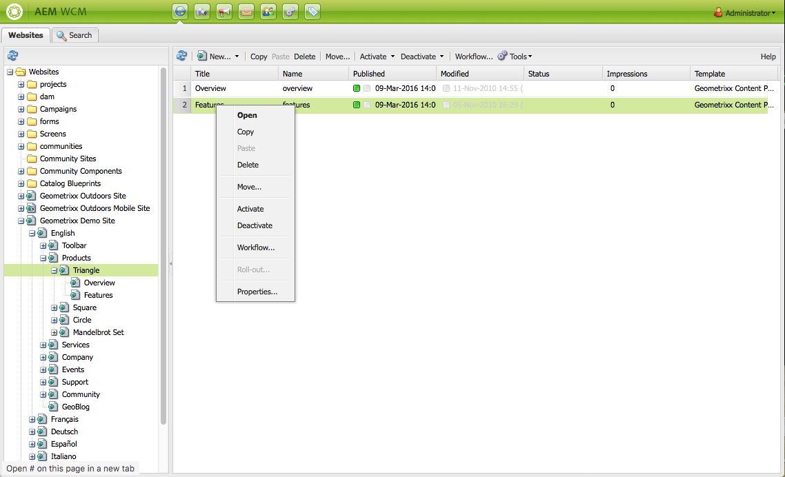

# Gestión básica{#basic-handling}

>[!NOTE]
>
>* Esta página se ha diseñado para ofrecer una descripción general de la gestión básica cuando se utiliza el entorno de creación AEM. Utiliza la consola **Sitios** como base. 
   >
   >
* Algunas funciones no están disponibles en todas las consolas u otras funciones están disponibles en determinadas consolas. La información específica sobre consolas concretas y sus funciones se tratará en más detalle en otras páginas.
>* Los métodos abreviados del teclado están disponibles mediante AEM, sobre todo al [utilizar las consolas](/help/sites-classic-ui-authoring/author-env-keyboard-shortcuts.md) y [al editar páginas](/help/sites-classic-ui-authoring/classic-page-author-keyboard-shortcuts.md).

>

## La pantalla de bienvenida {#the-welcome-screen}

La IU clásica proporciona una selección de consolas mediante el uso de mecanismos conocidos para navegar e iniciar acciones, como hacer clic, hacer doble clic y [los menús contextuales](#context-menus).

Al iniciar sesión se mostrará la pantalla de bienvenida con una lista de vínculos a consolas y servicios:

## Consolas {#consoles}

Las siguientes son las consolas principales: 

<table>
 <tbody>
  <tr>
   <td><strong>Consola</strong></td>
   <td><strong>Función</strong></td>
  </tr>
  <tr>
   <td><strong>Bienvenida</strong></td>
   <td>Ofrece una descripción general y acceso directo (mediante vínculos) a las funciones principales de AEM.</td>
  </tr>
  <tr>
   <td><strong>Recursos digitales</strong>  </td>
   <td>Estas consolas le permiten importar y <a href="/help/sites-classic-ui-authoring/classicui-assets.md">administrar recursos digitales</a>, como imágenes, vídeos, documentos y archivos de audio. Estos recursos se pueden utilizar en cualquier sitio web que ejecute la misma instancia de AEM. </td>
  </tr>
  <tr>
   <td><strong>Lanzamientos</strong></td>
   <td>Esto le ayuda a administrar sus <a href="/help/sites-classic-ui-authoring/classic-launches.md">lanzamientos</a>, que le permiten desarrollar contenido para una versión futura de una o varias páginas web activadas.  <i>Nota: En la IU táctil, muchas de las mismas funciones están disponibles en la consola Sitios, junto con el carril Referencias.</i> <i>Si se necesita, esta consola está disponible desde la consola Herramientas; seleccione Operaciones y, después, Lanzamientos.</i></td>
  </tr>
  <tr>
   <td><strong>Bandeja de entrada </strong></td>
   <td>A menudo, varias personas participan en las subtareas de un flujo de trabajo, y cada una de ellas debe completar su paso antes de transferir el trabajo a la persona siguiente. La bandeja de entrada le permite ver las notificaciones relacionadas con dichas tareas. Consulte <a href="/help/sites-administering/workflows.md">Uso de flujos de trabajo</a>.   </td>
  </tr>
  <tr>
   <td><strong>Etiquetado</strong></td>
   <td>Las consolas Etiquetado le permiten administrar etiquetas. Las etiquetas son frases o nombres cortos que puede utilizar para clasificar y anotar contenido, lo que facilita su localización y organización. Para obtener más información, consulte <a href="/help/sites-classic-ui-authoring/classic-feature-tags.md">Uso y administración de etiquetas</a>.</td>
  </tr>
  <tr>
   <td><strong>Herramientas</strong></td>
   <td>Las consolas <a href="/help/sites-administering/tools-consoles.md">Herramientas</a> permiten acceder a toda una serie de consolas y herramientas personalizadas que le ayudan a administrar sus sitios web, recursos digitales y otros aspectos de su repositorio de contenido.</td>
  </tr>
  <tr>
   <td><strong>Usuarios</strong></td>
   <td>Estas consolas le permiten administrar los derechos de acceso para usuarios y grupos. Para obtener más información, consulte <a href="/help/sites-administering/security.md">Administración de usuarios y seguridad</a>.  </td>
  </tr>
  <tr>
   <td><strong>Sitios web</strong></td>
   <td>Las consolas Sitios/Sitios web le permiten <a href="/help/sites-classic-ui-authoring/classic-page-author.md">crear, ver y administrar sitios web</a> que se ejecuten en su instancia de AEM. Mediante estas consolas podrá crear, copiar, mover y eliminar páginas de sitios web, iniciar flujos de trabajo y activar (publicar) páginas. También puede abrir una página para editarla.  </td>
  </tr>
  <tr>
   <td><strong>Flujos de trabajo</strong></td>
   <td>Un flujo de trabajo es una serie de pasos definida que describe el proceso necesario para completar una tarea. A menudo, varias personas participan en una tarea y cada una de ellas debe completar su paso antes de transferir el trabajo a la persona siguiente. La consola de flujo de trabajo le permite crear modelos de flujo de trabajo y administrar la ejecución de instancias de flujo de trabajo. Consulte <a href="/help/sites-administering/workflows.md">Uso de flujos de trabajo</a>.  </td>
  </tr>
 </tbody>
</table>

La consola **Sitios web** ofrece dos paneles para desplazarse y administrar sus páginas:

* Panel izquierdo

   Muestra la estructura de árbol de los sitios web y las páginas de dichos sitios web.

   También muestra información sobre otros aspectos o AEM, entre ellos proyectos, modelos y recursos.

* Panel derecho

   Muestra las páginas (en la ubicación seleccionada en el panel izquierdo) y puede utilizarse para realizar acciones.

Desde aquí puede [administrar sus páginas](/help/sites-authoring/managing-pages.md) mediante la barra de herramientas, un menú contextual o abriendo una página para efectuar más acciones.

>[!NOTE]
>
>El control básico es idéntico en todas las consolas. Esta sección se centra en la consola **Sitios web**, ya que es la consola principal durante la creación.

## Acceso a la Ayuda {#accessing-help}

En varias consolas (p. ej., Sitios web) también existe el botón **Ayuda**, que abre Uso compartido de paquetes o el sitio de documentación.

Al editar una página, la [barra de tareas también tiene un botón para acceder a la ayuda](/help/sites-classic-ui-authoring/classic-page-author-env-tools.md#accessing-help).

## Desplazamiento con la consola Sitios web {#navigating-with-the-websites-console}

En la consola **Sitios web**, se muestra una lista con las páginas de contenido en una estructura de árbol (panel izquierdo). Para facilitar la navegación, las secciones de la estructura de árbol pueden expandirse (+) o contraerse (-) según sea necesario:

* Con un solo clic en el nombre de página (en el panel de la izquierda), puede hacer las siguientes acciones:

   * Enumerar las páginas secundarias en el panel derecho
   * Expandir también la estructura en el panel izquierdo

      Por motivos de rendimiento, esta acción depende del número de nodos secundarios. Con una instalación estándar, este método de expansión funciona cuando hay `30` nodos secundarios o menos.

* Al hacer doble clic en el nombre de página (panel izquierdo), también se ampliará el árbol, aunque, como la página se abre al mismo tiempo, este efecto no es tan obvio.

>[!NOTE]
>
>Este valor predeterminado (`30`) puede cambiarse por consola en las configuraciones específicas de la aplicación del widget siteadmin:
>
>En el nodo siteadmin:
>
>Establezca el valor de la propiedad:
>`treeAutoExpandMax`
>en:
>`/apps/wcm/core/content/siteadmin`
>
>O bien, globalmente en el tema:
>Establezca el valor de:
>`TREE_AUTOEXPAND_MAX`
>en:
>`/apps/cq/ui/widgets/themes/default/widgets/wcm/SiteAdmin.js`
>
>Consulte [SiteAdmin en la API Widget CQ](https://helpx.adobe.com/experience-manager/6-5/sites/developing/using/reference-materials/widgets-api/index.html?class=CQ.wcm.SiteAdmin) para obtener más información.

## Información de la página en la consola Sitios web {#page-information-on-the-websites-console}

El panel derecho de la consola **Sitios web** ofrece una vista de lista con información sobre páginas:

Hay disponibles las opciones siguientes; se muestra un subconjunto de estos campos de forma predeterminada:

<table>
 <tbody>
  <tr>
   <td><strong>Columna</strong></td>
   <td><strong>Descripción</strong></td>
  </tr>
  <tr>
   <td>Miniatura   </td>
   <td>Muestra una miniatura de la página.</td>
  </tr>
  <tr>
   <td>Título</td>
   <td>El título que aparece en la página.</td>
  </tr>
  <tr>
   <td>Nombre</td>
   <td>El AEM de nombre hace referencia a la página.</td>
  </tr>
  <tr>
   <td>Publicado</td>
   <td>Indica si se publicó la página y proporciona la fecha y hora de publicación.</td>
  </tr>
  <tr>
   <td>Modificado</td>
   <td>Indica si se modificó la página y proporciona la fecha y hora de modificación. Para guardar las modificaciones, debe activar la página.</td>
  </tr>
  <tr>
   <td>Publicación de Scene7</td>
   <td>Indica si la página se ha publicado en Scene7.  </td>
  </tr>
  <tr>
   <td>Estado</td>
   <td>Indica el estado actual de la página; por ejemplo, si la página forma parte o no de un flujo de trabajo o Live Copy o si una página está bloqueada o no.</td>
  </tr>
  <tr>
   <td>Impresiones</td>
   <td>Muestra la actividad en una página en cantidad de visitas.</td>
  </tr>
  <tr>
   <td>Plantilla</td>
   <td>Indica la plantilla en la que se basa una página.</td>
  </tr>
  <tr>
   <td>En flujo de trabajo</td>
   <td>Indica si una página está en un flujo de trabajo.</td>
  </tr>
  <tr>
   <td>Bloqueado por</td>
   <td>Muestra si una página se ha bloqueado y qué cuenta de usuario la ha bloqueado.</td>
  </tr>
  <tr>
   <td>Live Copy   </td>
   <td>Indica si la página forma parte de una Live Copy.</td>
  </tr>
 </tbody>
</table>

>[!NOTE]
>
>Para seleccionar las columnas visibles, pase el ratón por el título de una columna. Se mostrará un menú desplegable, desde el que podrá utiliza la opción **Columnas**.

Los colores junto a las páginas en las columnas **Publicado** y **Modificado** indican el estado de publicación:

| **Columna** | **Color** | **Descripción** |
|---|---|---|
| Publicado | Verde | Publicación correcta. Se publicó el contenido. |
| Publicado | Amarillo | Publicación pendiente. El sistema aún no recibió confirmación de la publicación. |
| Publicado | Rojo | Publicación incorrecta. No hay conexión con la instancia de publicación. Esto también puede significar que se desactivó el contenido. |
| Publicado | *En blanco* | Esta página nunca se ha publicado. |
| Modificado | Azul | La página se ha modificado desde la última publicación. |
| Modificado | *En blanco* | Esta página nunca se ha modificado o no se ha modificado desde la última publicación. |

## Menús contextuales {#context-menus}

La IU clásica utiliza mecanismos familiares para desplazarse e iniciar acciones, incluidos clics y doble clics. Según la situación actual, también hay disponible una selección de menús contextuales (que normalmente se abren con el botón derecho del ratón):

