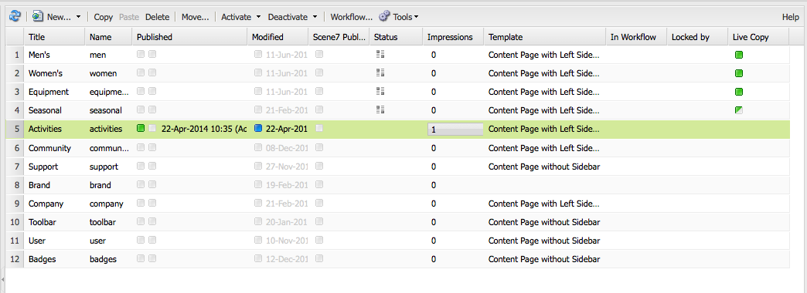

# Gestión básica{#basic-handling}

>[!NOTE]
>
>* Esta página se ha diseñado para ofrecer una descripción general de la gestión básica cuando se utiliza el entorno de creación de Adobe Experience Manager AEM (). Utiliza la consola **Sitios** como base. 
>
>* Algunas funcionalidades no están disponibles en todas las consolas y otras adicionales en algunas consolas. La información específica acerca de las consolas individuales y sus funciones relacionadas se trata con más detalle en otras páginas.
>* Los métodos abreviados del teclado están disponibles mediante AEM, sobre todo al [utilizar las consolas](/help/sites-classic-ui-authoring/author-env-keyboard-shortcuts.md) y [al editar páginas](/help/sites-classic-ui-authoring/classic-page-author-keyboard-shortcuts.md).
>

## La pantalla de bienvenida {#the-welcome-screen}

La IU clásica proporciona una selección de consolas mediante mecanismos conocidos para navegar e iniciar acciones, como hacer clic, hacer doble clic y [menús contextuales](#context-menus).

Después del inicio de sesión, se muestra la pantalla de bienvenida. Proporciona una lista de vínculos a consolas y servicios:

## Consolas {#consoles}

Las consolas principales son:

<table>
 <tbody>
  <tr>
   <td><strong>Consola</strong></td>
   <td><strong>Función</strong></td>
  </tr>
  <tr>
   <td><strong>Bienvenido</strong></td>
   <td>AEM Proporciona información general y acceso directo (mediante vínculos) a la funcionalidad principal de los recursos de la.</td>
  </tr>
  <tr>
   <td><strong>Recursos digitales</strong>  </td>
   <td>Estas consolas permiten importar y <a href="/help/sites-classic-ui-authoring/classicui-assets.md">administrar recursos digitales</a> como imágenes, vídeos, documentos y archivos de audio. AEM Estos recursos se pueden utilizar en cualquier sitio web que ejecute la misma instancia de. </td>
  </tr>
  <tr>
   <td><strong>Lanzamientos</strong></td>
   <td>Esto le ayuda a administrar sus <a href="/help/sites-classic-ui-authoring/classic-launches.md">lanzamientos</a>; esto le permite desarrollar el contenido para una versión futura de una o más páginas web activadas.  <i>Nota: En la IU táctil, gran parte de la misma funcionalidad está disponible en la consola Sitios, junto con el carril Referencias.</i> <i>Si es necesario, esta consola está disponible en la consola Herramientas; seleccione Operaciones y luego Lanzamientos.</i></td>
  </tr>
  <tr>
   <td><strong>Bandeja de entrada </strong></td>
   <td>A menudo, varias personas participan en las subtareas de un flujo de trabajo y cada persona debe completar su paso antes de entregar el trabajo a la siguiente persona. La bandeja de entrada le permite ver las notificaciones relacionadas con dichas tareas. Consulte <a href="/help/sites-administering/workflows.md">Uso de flujos de trabajo</a>.   </td>
  </tr>
  <tr>
   <td><strong>Etiquetado</strong></td>
   <td>Las consolas de etiquetado permiten administrar etiquetas. Las etiquetas son nombres cortos o frases que se pueden utilizar para clasificar y anotar fragmentos de contenido, lo que facilita su búsqueda y organización. Para obtener más información, consulte <a href="/help/sites-classic-ui-authoring/classic-feature-tags.md">Uso y administración de etiquetas</a>.</td>
  </tr>
  <tr>
   <td><strong>Herramientas</strong></td>
   <td>El <a href="/help/sites-administering/tools-consoles.md">Herramientas consolas</a> proporciona acceso a varias herramientas y consolas especializadas que le ayudan a administrar sus sitios web, recursos digitales y otros aspectos de su repositorio de contenido.</td>
  </tr>
  <tr>
   <td><strong>Usuarios</strong></td>
   <td>Estas consolas le permiten administrar los derechos de acceso de usuarios y grupos. Para obtener más información, consulte <a href="/help/sites-administering/security.md">Administración de usuarios y seguridad</a>.  </td>
  </tr>
  <tr>
   <td><strong>Sitios web</strong></td>
   <td>Las consolas Sitios web le permiten <a href="/help/sites-classic-ui-authoring/classic-page-author.md">crear, ver y administrar sitios web</a> AEM ejecución en la instancia de la. A través de estas consolas puede crear, copiar, mover y eliminar páginas del sitio web, iniciar flujos de trabajo y activar (publicar) páginas. También puede abrir una página para editarla.  </td>
  </tr>
  <tr>
   <td><strong>Flujos de trabajo</strong></td>
   <td>Un flujo de trabajo es una serie definida de pasos que describe el proceso de completar una tarea. A menudo, varias personas participan en una tarea y cada persona debe completar su paso antes de entregar el trabajo a la siguiente persona. La consola Flujo de trabajo permite crear modelos de flujo de trabajo y administrar las instancias de flujo de trabajo en ejecución. Consulte <a href="/help/sites-administering/workflows.md">Uso de flujos de trabajo</a>.  </td>
  </tr>
 </tbody>
</table>

El **Sitios web** La consola de proporciona dos paneles para que navegue y administre sus páginas:

* Panel izquierdo

  Esto muestra la estructura de árbol de los sitios web y las páginas dentro de esos sitios web.

  AEM También muestra información sobre otros aspectos o recursos, incluidos proyectos, modelos y recursos.

* Panel derecho

  Esto muestra las páginas (en la ubicación seleccionada en el panel izquierdo) y se puede utilizar para realizar acciones.

Desde aquí puede [administrar sus páginas](/help/sites-authoring/managing-pages.md) mediante la barra de herramientas, un menú contextual o abriendo una página para realizar más acciones.

>[!NOTE]
>
>El manejo básico es el mismo en todas las consolas. Esta sección se centra en **Sitios web** consola, ya que es la consola principal que se utiliza durante la creación.

## Acceso a la Ayuda   {#accessing-help}

En varias consolas (por ejemplo, sitios web), una **Ayuda** está disponible. Clic **Ayuda** abre Package Share o el sitio de documentación.

Al editar una página, la variable [la barra de tareas también tiene un botón para obtener ayuda](/help/sites-classic-ui-authoring/classic-page-author-env-tools.md#accessing-help).

## Navegación con la consola Sitios web {#navigating-with-the-websites-console}

El **Sitios web** La consola de enumera las páginas de contenido en una estructura de árbol (panel izquierdo). Para facilitar la navegación, las secciones de la estructura de árbol se pueden expandir (+) o contraer (-) según sea necesario:

* Al hacer clic en el nombre de página en el panel izquierdo, se hace lo siguiente:

   * Muestra las páginas secundarias del panel derecho
   * Expande la estructura en el panel izquierdo.

     Por motivos de rendimiento, esta acción depende del número de nodos secundarios. Con una instalación estándar, este método de expansión funciona cuando hay `30` o menos nodos secundarios.

* Al hacer doble clic en el nombre de la página (panel izquierdo), se expande el árbol, aunque este efecto no es tan obvio cuando se abre la página al mismo tiempo.

>[!NOTE]
>
>Este valor predeterminado ( `30`) se puede cambiar por consola en las configuraciones específicas de la aplicación del widget siteadmin:
>
>En el nodo siteadmin:
>
>Establezca el valor de la propiedad:
>`treeAutoExpandMax`
>el:
>`/apps/wcm/core/content/siteadmin`
>
>O globalmente en la temática:
>Establezca el valor de:
>`TREE_AUTOEXPAND_MAX`
>en:
>`/apps/cq/ui/widgets/themes/default/widgets/wcm/SiteAdmin.js`
>
>Consulte [SiteAdmin en la API del widget CQ](https://developer.adobe.com/experience-manager/reference-materials/6-5/widgets-api/index.html?class=CQ.wcm.SiteAdmin) para obtener más información.

## Información de página en la consola Sitios web {#page-information-on-the-websites-console}

El panel derecho del **Sitios web** La consola de proporciona una vista de lista con información sobre las páginas:

Están disponibles los siguientes campos; se muestra un subconjunto de ellos como predeterminado:

<table>
 <tbody>
  <tr>
   <td><strong>Columna</strong></td>
   <td><strong>Descripción</strong></td>
  </tr>
  <tr>
   <td>Miniatura   </td>
   <td>Muestra una miniatura para la página.</td>
  </tr>
  <tr>
   <td>Título</td>
   <td>El título que aparece en la página</td>
  </tr>
  <tr>
   <td>Nombre</td>
   <td>AEM El nombre hace referencia a la página.</td>
  </tr>
  <tr>
   <td>Publicado</td>
   <td>Indica si la página se ha publicado y proporciona la fecha y hora de publicación.</td>
  </tr>
  <tr>
   <td>Modificado</td>
   <td>Indica si la página se ha modificado y proporciona la fecha y hora de modificación. Para guardar cualquier modificación, debe activar la página.</td>
  </tr>
  <tr>
   <td>Publicación de Scene7</td>
   <td>Indica si la página se ha publicado en Scene7.  </td>
  </tr>
  <tr>
   <td>Estado</td>
   <td>Indica el estado de la página, como si forma parte de un flujo de trabajo o Live Copy, o si está bloqueada.</td>
  </tr>
  <tr>
   <td>Impresiones</td>
   <td>Muestra la actividad en una página en número de visitas.</td>
  </tr>
  <tr>
   <td>Plantilla</td>
   <td>Indica la plantilla en la que se basa una página.</td>
  </tr>
  <tr>
   <td>En flujo de trabajo</td>
   <td>Indica cuándo la página está en un flujo de trabajo.</td>
  </tr>
  <tr>
   <td>Bloqueado por</td>
   <td>Muestra cuándo se ha bloqueado una página y la cuenta de usuario que la ha bloqueado.</td>
  </tr>
  <tr>
   <td>Live Copy</td>
   <td>Indica cuándo la página es parte de una Live Copy.</td>
  </tr>
 </tbody>
</table>

>[!NOTE]
>
>Para seleccionar las columnas visibles, pase el ratón sobre un título de columna. Se muestra un menú desplegable y, desde aquí, puede utilizar la variable **Columnas** opción.

Los colores que aparecen junto a las páginas del **Publicado** y **Modificado** Las columnas indican el estado de publicación:

| **Columna** | **Color** | **Descripción** |
|---|---|---|
| Publicado | Verde | Publicación correcta. El contenido se ha publicado. |
| Publicado | Amarillo | La publicación está pendiente. El sistema aún no ha recibido confirmación de publicación. |
| Publicado | Rojo | Error de publicación. No hay ninguna conexión con la instancia de publicación. Esto también puede significar que el contenido se ha desactivado. |
| Publicado | *blank* | Esta página nunca se ha publicado. |
| Modificado | Azul | Se ha modificado la página desde la última publicación. |
| Modificado | *blank* | Esta página no se ha modificado nunca o no se ha modificado desde la última publicación. |

## Menús contextuales {#context-menus}

La IU clásica utiliza mecanismos bien conocidos para navegar e iniciar acciones, como hacer clic y hacer doble clic. Dependiendo de la situación actual, también están disponibles una serie de menús contextuales (abiertos con el botón derecho del ratón):

