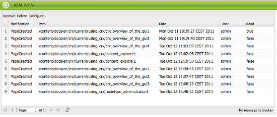

# Su bandeja de entrada{#your-inbox}

Puede recibir notificaciones desde varias áreas de AEM, como notificaciones sobre elementos de trabajo o tareas que representan acciones que debe realizar en el contenido de la página.

Estas notificaciones se reciben en dos bandejas de entrada, que están separadas por tipo de notificación:

* Una bandeja de entrada donde se ven las notificaciones recibidas en relación con las suscripciones (se describe en la sección siguiente).
* Una bandeja de entrada especializada para elementos de flujo de trabajo se describe en la sección [Participación en flujos de trabajo](/help/sites-classic-ui-authoring/classic-workflows-participating.md) documento.

## Visualizar notificaciones {#viewing-your-notifications}

Para ver las notificaciones:

1. Abra la bandeja de entrada de notificaciones: en la consola **Sitios web**, haga clic en el botón de usuario ubicado en la esquina superior derecha y seleccione **Bandeja de entrada de notificaciones**.

   

   >[!NOTE]
   >
   >También puede acceder a la consola directamente desde el navegador; por ejemplo:
   >
   >
   >` https://<host>:<port>/libs/wcm/core/content/inbox.html`

1. Se enumerarán las notificaciones. Puede realizar las acciones requeridas:

   * [Suscripción a las notificaciones](#subscribing-to-notifications)
   * [Procesamiento de notificaciones](#processing-your-notifications)

   

## Suscripción a las notificaciones {#subscribing-to-notifications}

Para suscribirse a notificaciones:

1. Abra la bandeja de entrada de notificaciones: en la consola **Sitios web**, haga clic en el botón de usuario ubicado en la esquina superior derecha y seleccione **Bandeja de entrada de notificaciones**.

   

   >[!NOTE]
   >
   >También puede acceder a la consola directamente desde el navegador; por ejemplo:
   >
   >
   >`https://<host>:<port>/libs/wcm/core/content/inbox.html`

1. Haga clic en **Configurar...** en la esquina superior izquierda para abrir el cuadro de diálogo de configuración.

   

1. Seleccione el canal de notificación:

   * **Bandeja de entrada**: las notificaciones se mostrarán en su bandeja de entrada de AEM.
   * **Correo electrónico**: las notificaciones se enviarán a la dirección de correo electrónico definida en su perfil de usuario.

   >[!NOTE]
   >
   >Es necesario configurar unas pocas opciones para recibir notificaciones por correo electrónico. También es posible personalizar la plantilla de correo electrónico o añadir una plantilla de correo electrónico para un nuevo idioma. Consulte [Configuración de notificaciones por correo electrónico](/help/sites-administering/notification.md#configuringemailnotification) para configurar las notificaciones por correo electrónico en AEM.

1. Seleccione las acciones de página para las cuales recibirá notificaciones:

   * Activado: cuando se activa una página.
   * Desactivado: cuando se desactiva una página.
   * Eliminado (distribución): cuando se elimina-replica una página. Es decir, cuando se replica una acción de eliminar realizada en una página.
Cuando se elimina o mueve una página, se replica automáticamente una acción de eliminar: la página se elimina en la instancia de origen donde la acción de eliminar se realizó y en la instancia de destino definida por los agentes de replicación.

   * Modificado: cuando se modifica una página.
   * Creado: cuando se crea una página.
   * Eliminado: cuando se elimina una página mediante la acción de eliminar página.
   * Trasladado: cuando se traslada una página.

1. Defina las rutas de las páginas para las cuales recibirá notificaciones:

   * Haga clic en **Añadir** para añadir una nueva fila a la tabla.
   * Haga clic en el **Ruta** celda de tabla e introduzca la ruta, por ejemplo `/content/docs`.

   * Para recibir notificaciones para todas las páginas pertenecientes al subárbol, establezca **¿Exacto?** en **No**.
Para recibir notificaciones únicamente para acciones en la página definida por la ruta, establezca **¿Exacto?** en **Sí**.

   * Para permitir la regla, establezca **Regla** en **Permitir**. Si la establece en **Denegar**, se deniega la regla pero no se quita y se puede permitir después.

   Para quitar una definición, seleccione la fila al hacer clic en una celda de tabla y haga clic en **Eliminar**.

1. Haga clic en **Guardar** para guardar la configuración.

## Procesamiento de notificaciones {#processing-your-notifications}

Si eligió recibir notificaciones en su bandeja de entrada AEM, la bandeja de entrada se llenará de notificaciones. Puede [ver sus notificaciones](#viewing-your-notifications) y, a continuación, seleccionar las notificaciones necesarias para:

* Aprobarla al hacer clic en **Aprobar**: el valor en la columna **Leer** se establece en **true**.

* Eliminarla al hacer clic en **Eliminar**.

