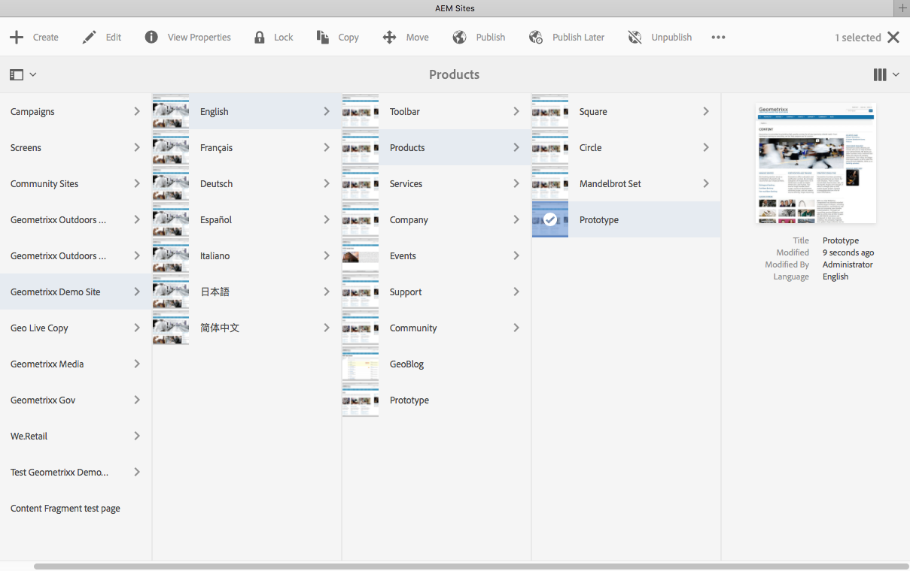

# Uso del entorno de creación{#working-with-the-author-environment}

>[!NOTE]
>
>La siguiente documentación trata sobre la IU clásica. Para obtener información sobre la creación en la IU moderna y táctil, consulte la [documentación de creación estándar](/help/assets/assets.md).

El entorno de creación permite realizar tareas relacionadas con:

* [Creación](/help/sites-authoring/author.md)  (incluida la  [creación de ](/help/sites-authoring/qg-page-authoring.md) páginas y la  [administración de recursos](/help/assets/assets.md))

* [Tareas de administración](/help/sites-administering/administer-best-practices.md) necesarias para generar y mantener el contenido de su sitio web

Para conseguirlo se ofrecen dos interfaces gráficas de usuario, accesibles desde cualquier navegador moderno:

1. IU clásica

   * Esta IU ha estado disponible en AEM durante muchos años.
   * Es, principalmente, de color verde.
   * Está diseñada para utilizarse en dispositivos de escritorio.
   * Ya no se mantiene.
   * La siguiente documentación trata sobre la IU clásica. Para obtener información sobre la creación de contenido en la nueva IU táctil, consulte la [documentación de creación estándar](/help/sites-authoring/author.md).

   

1. IU táctil

   * Esta es la nueva IU estándar de AEM.
   * Es, principalmente, de color gris, con una interfaz sencilla y clara.
   * Está diseñada para utilizarse tanto en dispositivos táctiles como de escritorio (optimizada para los dispositivos táctiles). El aspecto es el mismo en todos los dispositivos, aunque la forma de [ver y seleccionar los recursos](/help/sites-authoring/basic-handling.md) varía ligeramente (toques en lugar de clics).
   * Consulte la [documentación de creación estándar](/help/sites-authoring/author.md) para obtener más información sobre cómo crear con la IU táctil. La siguiente documentación trata sobre la IU clásica.

   * Escritorio:

   

   * Dispositivos de tableta (o de escritorio con menos de 1024 píxeles de ancho):

   

