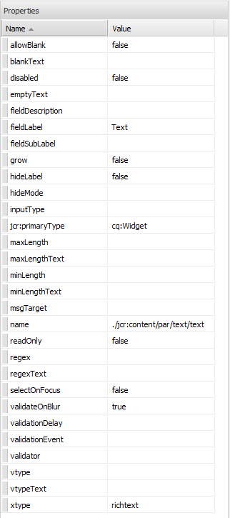

# Scaffolding{#scaffolding}

A veces, es posible que necesite crear un conjunto grande de páginas que comparten la misma estructura pero tienen contenido diferente. A través de la interfaz de AEM estándar, necesitaría crear cada página, arrastrar los componentes correspondientes a la página y rellenar cada uno individualmente.

Con scaffolding, puede crear un formulario (un scaffold) con campos que reflejen la estructura que desee para sus páginas y luego usar este formulario para crear fácilmente páginas según esta estructura.

>[!NOTE]
>
>El scaffolding (en la IU clásica) [respeta la herencia de MSM](#scaffolding-with-msm-inheritance).

## Funcionamiento del scaffolding {#how-scaffolding-works}

Los scaffolds se almacenan en la consola **Tools** del administrador del sitio.

* Abra la consola **Herramientas** y haga clic en **Scaffolding de página predeterminada**.
* Aquí, haga clic en **geometrixx**.
* Dentro de **geometrixx**, encontrará una *página de scaffold* denominada **Noticias**. Haga doble clic para abrir esta página.

El scaffold consiste en un formulario con un campo para cada parte de contenido que conformará la página que se creará y cuatro parámetros importantes a los que se accede a través de las **Propiedades de página** de la página de scaffold.

Las propiedades de página de scaffolding son:

* **Texto del título**: Es el nombre de esta página de scaffolding misma. En este ejemplo, se llama “Noticias”.
* **Descripción**: Aparece debajo del título en la página de scaffolding.
* **Plantilla de destino**: Es la plantilla que este scaffold usará cuando cree una nueva página. En este ejemplo, es una plantilla de *Página de contenido de Geometrixx*.
* **Ruta de destino**: Es la ruta de acceso de la página primaria debajo de la cual este scaffold creará nuevas páginas. En este ejemplo, la ruta es */content/geometrixx/en/news*.

El cuerpo del scaffold es el formulario. Cuando un usuario desea crear una página con el scaffold, el usuario completa el formulario y hace clic en *Crear*, en la parte inferior. En el ejemplo **Noticias** de arriba, el formulario tiene los siguientes campos:

* **Título**: Es el nombre de la página que se va a crear. Este campo siempre está presente en cada scaffold.
* **Texto**: Este campo corresponde a un componente de texto en la página resultante.
* **Imagen**: Este campo corresponde a un componente de imagen en la página resultante.
* **Imagen/Avanzado**: **Título**: El título de la imagen.
* **Imagen/Avanzado**: **Texto alternativo**: El texto alternativo de la imagen.
* **Imagen/Avanzado**:  **Descripción**: Descripción de la imagen.
* **Imagen/Avanzado**: **Tamaño**: El tamaño de la imagen.
* **Etiquetas/Palabras clave**: Los metadatos que se asignarán a esta página. Este campo siempre está presente en cada scaffold.

### Creación de un scaffold {#creating-a-scaffold}

Para crear un nuevo scaffold, vaya a la consola **Herramientas**, luego **Andamiaje de páginas predeterminado** y cree una nueva página. Estará disponible un solo tipo de plantilla de página, la *Plantilla de andamiaje.*

Vaya a **Propiedades de la página** de la nueva página y establezca la *Texto del título*, *Descripción*, *Plantilla de Destinatario* y *Ruta del Destinatario*, como se describe anteriormente.

A continuación, tiene que definir la estructura de la página que este scaffold creará. Para ello, vaya al **[modo de diseño](/help/sites-authoring/page-authoring.md#sidekick)** en la página de scaffold. Aparecerá un vínculo que le permitirá editar el scaffold en el **editor de cuadro de diálogo**.

Con el editor de cuadro de diálogo, especifica las propiedades que se crearán cada vez que se cree una nueva página con este scaffold.

La definición de cuadro de diálogo para un scaffold funciona igual que la de un componente (consulte [Componentes](/help/sites-developing/components.md)). Sin embargo, se aplican unas pocas diferencias importantes:

* Las definiciones de cuadro de diálogo de componente se procesan como cuadros de diálogo normales (como se muestra en el panel del medio del editor de cuadro de diálogo, por ejemplo), mientras que las definiciones de cuadro de diálogo de scaffold, si bien aparecen como cuadros de diálogo normales en el editor de cuadro de diálogo, se presentan en la página de scaffold como formulario de scaffold (como se muestra en el scaffold de **Noticias** más arriba).
* Los cuadros de diálogo proporcionan campos únicamente para los valores necesarios para definir el contenido de un solo componente específico. Un cuadro de diálogo de scaffold debe proporcionar campos para toda propiedad en todo párrafo de la página que se creará.
* En el caso de los cuadros de diálogo de componente, el componente utilizado para procesar el contenido especificado está implícito y, por lo tanto, la propiedad `sling:resourceType` del párrafo se completa automáticamente durante la creación del párrafo. Con un scaffold, el cuadro de diálogo mismo debe proporcionar toda la información que define tanto el contenido como el componente asignado de un párrafo dado. En los cuadros de diálogo de scaffold, esta información debe proporcionarse mediante campos *Oculto* para enviar esta información en el momento de creación de la página.

Un repaso al cuadro de diálogo de scaffold **Noticias** de ejemplo en el editor de cuadro de diálogo ayuda a explicar cómo funciona. Entre al modo de diseño en la página de scaffold y haga clic en el vínculo de editor de cuadro de diálogo.

Ahora, haga clic en el campo de diálogo **Cuadro de diálogo > Panel de fichas > Texto > Texto**, de este modo:

La lista de propiedades de este campo aparecerá en el lado derecho del editor de cuadro de diálogo, de esta manera:

Observe la propiedad name de este campo. Tiene el valor

`./jcr:content/par/text/text`

Es el nombre de la propiedad en que se escribirá el contenido de este campo cuando se use el scaffold para crear una página. La propiedad se indica como una ruta de acceso relativa desde el nodo que representa la página que se va a crear. Especifica la propiedad text, debajo del nodo text, que se encuentra debajo del nodo par, que es un nodo secundario del nodo jcr:content debajo del nodo page.

Esto define la ubicación del almacenamiento de contenido para el texto que se colocará dentro de este campo. Sin embargo, también necesitamos especificar dos características más para este contenido:

* El hecho de que la cadena que se está almacenando deba interpretarse como *texto enriquecido* y
* qué componente debería usarse para procesar este contenido en la página resultante.

Tenga en cuenta que, en un cuadro de diálogo de componente normal, no tendría que especificar esta información, porque está implícita en el hecho de que el cuadro de diálogo ya está ligado a un componente específico.

Para especificar estos dos elementos de información, se usan campos ocultos. Haga clic en el primer campo oculto **Cuadro de diálogo > Panel de fichas > Texto > Oculto**, de este modo:

Las propiedades de este campo oculto son las siguientes:

La propiedad name de este campo oculto es

`./jcr:content/par/text/textIsRich`

Se trata de una propiedad booleana utilizada para interpretar la cadena de texto almacenada en `./jcr:content/par/text/text`.

Como sabemos que el texto debería interpretarse como texto enriquecido, especificamos la propiedad `value` de este campo como `true`.

>[!CAUTION]
>
>El editor de cuadro de diálogo permite al usuario cambiar los valores de las propiedades *existentes* en la definición del cuadro de diálogo. Para añadir una propiedad nueva, el usuario debe utilizar [CRXDE Lite](/help/sites-developing/developing-with-crxde-lite.md). Por ejemplo, cuando se añade un nuevo campo oculto a una definición de cuadro de diálogo con el editor de cuadro de diálogo, no tiene una propiedad *value* (es decir, una propiedad con el nombre &quot;value&quot;). Si el campo oculto en cuestión requiere que se establezca una propiedad *value* predeterminada, entonces esta propiedad debe agregarse manualmente con una de las herramientas de CRX. El valor no puede agregarse con el editor de cuadro de diálogo mismo. Sin embargo, una vez que la propiedad está presente, su valor puede editarse con el editor de cuadro de diálogo.

El segundo campo oculto puede verse al hacer clic en él de esta manera:

Las propiedades de este campo oculto son las siguientes:

La propiedad name de este campo oculto es

`./jcr:content/par/text/sling:resourceType`

y el valor fijo especificado para esta propiedad es

`foundation/components/textimage`

Esto especifica que el componente que se usará para procesar el contenido de texto de este párrafo es el componente *Imagen de texto*. Utilizando el booleano `isRichText` especificado en el otro campo oculto, el componente puede procesar la cadena de texto real almacenada en `./jcr:content/par/text/text` de la manera deseada.

### Scaffolding con herencia de MSM {#scaffolding-with-msm-inheritance}

En la IU clásica; el scaffolding está totalmente integrado con la herencia de MSM (cuando proceda).

Cuando se abre una página en modo **Scaffolding** (mediante el icono de la parte inferior de la barra de tareas), cualquier componente que esté sujeto a la herencia se indica con:

* un símbolo de bloqueo (en la mayoría de los componentes; por ejemplo, texto y título)
* una máscara con el texto **Hacer clic para cancelar herencia** (para los componentes de la imagen)

Esto muestra que el componente no se puede editar, hasta que se cancele la herencia.

>[!NOTE]
>
>Esto se puede comparar con los [componentes heredados al editar el contenido de la página](/help/sites-authoring/editing-content.md#inheritedcomponentsclassicui).

Hacer clic en el símbolo de bloqueo o en el icono de imagen le permite anular la herencia:

* El símbolo cambiará a un candado abierto.
* Una vez desbloqueado, puede editar el contenido.

Para restaurar la herencia tras el desbloqueo, haga clic en el símbolo del candado desbloqueado: se perderán las modificaciones que haya realizado.

>[!NOTE]
>
>Si la herencia se cancela a nivel de página (desde la ficha Live Copy de Propiedades de página), todos los componentes se podrán editar en el modo **Andamiaje** (se mostrarán en estado desbloqueado).
