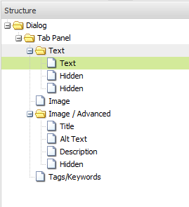

# Andamiaje{#scaffolding}

A veces, es posible que necesite crear un conjunto grande de páginas que compartan la misma estructura pero tengan contenido diferente. A través de la interfaz de AEM estándar, necesitaría crear cada página, arrastrar los componentes correspondientes a la página y rellenar cada uno individualmente.

Con scaffolding, puede crear un formulario (un scaffold) con campos que reflejen la estructura que desee para sus páginas y luego usar este formulario para crear fácilmente páginas basadas en esta estructura.

>[!NOTE]
>
>Andamiaje (en la IU clásica) [respeta la herencia de MSM](#scaffolding-with-msm-inheritance).

## Cómo funciona el scaffolding {#how-scaffolding-works}

Los scaffolds se almacenan en la variable **Herramientas** consola del administrador del sitio.

* Abra el **Herramientas** consola y haga clic en **Andamiaje de páginas predeterminado**.
* Bajo este botón, haga clic en **geometrixx**.
* En **geometrixx** encontrará una *página scaffold* llamado **Noticias**. Haga doble clic para abrir esta página.

El scaffold consiste en un formulario con un campo para cada contenido que formará la página que se creará y cuatro parámetros importantes a los que se accede mediante la variable **Propiedades de página** de la página de scaffold.

Las propiedades de página de scaffolding son:

* **Texto del título**: Este es el nombre de esta página de scaffolding misma. En este ejemplo se denomina &quot;Noticias&quot;.
* **Descripción**: Aparece debajo del título en la página de scaffolding.
* **Plantilla de Target**: Esta es la plantilla que utilizará este scaffold cuando cree una nueva página. En este ejemplo, es un *Página de contenido de Geometrixx* plantilla.
* **Ruta de destino**: Esta es la ruta de la página principal debajo de la cual este scaffold creará nuevas páginas. En este ejemplo, la ruta es */content/geometrixx/en/news*.

El cuerpo del scaffold es el formulario. Cuando un usuario desea crear una página con el scaffold, rellena el formulario y hace clic en *Crear*, en la parte inferior. En el **Noticias** el ejemplo anterior tiene los siguientes campos:

* **Título**: Es el nombre de la página que se va a crear. Este campo siempre está presente en cada scaffold.
* **Texto**: Este campo corresponde a un componente de texto en la página resultante.
* **Imagen**: Este campo corresponde a un componente de imagen en la página resultante.
* **Imagen/Avanzado**: **Título**: Título de la imagen.
* **Imagen/Avanzado**: **Texto alternativo**: Texto alternativo de la imagen.
* **Imagen/Avanzado**: **Descripción**: Descripción de la imagen.
* **Imagen/Avanzado**: **Tamaño**: El tamaño de la imagen.
* **Etiquetas/Palabras clave**: Metadatos que se asignarán a esta página. Este campo siempre está presente en cada scaffold.

### Creación de un scaffold {#creating-a-scaffold}

Para crear un nuevo scaffold, vaya a la **Herramientas** consola, **Andamiaje de páginas predeterminado** y cree una página nueva. Habrá disponible un tipo de plantilla de página única, la variable *Plantilla de Scaffolding.*

Vaya a la **Propiedades de página** de la nueva página y establezca la variable *Texto del título*, *Descripción*, *Plantilla de Target* y *Ruta de destino*, tal como se ha descrito anteriormente.

A continuación, debe definir la estructura de la página que este scaffold creará. Para ello, vaya a **[modo de diseño](/help/sites-authoring/page-authoring.md#sidekick)** en la página scaffold. Aparecerá un vínculo que le permitirá editar el scaffold en la variable **editor de cuadro de diálogo**.

Con el editor de cuadro de diálogo, especifica las propiedades que se crearán cada vez que se cree una nueva página con este scaffold.

La definición de cuadro de diálogo para un scaffold funciona de manera similar a la de un componente (consulte [Componentes](/help/sites-developing/components.md)). Sin embargo, se aplican algunas diferencias importantes:

* Las definiciones de cuadro de diálogo de componente se representan como cuadros de diálogo normales (como se muestra en el panel central del editor de cuadro de diálogo, por ejemplo) mientras que las definiciones de cuadro de diálogo de scaffold, aunque aparecen como cuadros de diálogo normales en el editor de cuadro de diálogo, se representan en la página de scaffold como un formulario de scaffold (como se muestra en el cuadro **Noticias** scaffold arriba).
* Los cuadros de diálogo proporcionan campos solo para los valores necesarios para definir el contenido de un componente específico individual. Un cuadro de diálogo de scaffold debe proporcionar campos para cada propiedad de cada párrafo de la página que se creará.
* En el caso de los cuadros de diálogo de componentes, el componente utilizado para procesar el contenido especificado está implícito y, por lo tanto, la variable `sling:resourceType` la propiedad del párrafo se rellena automáticamente cuando se crea el párrafo. Con un scaffold, el cuadro de diálogo mismo debe proporcionar toda la información que define el contenido y el componente asignado de un párrafo determinado. En los cuadros de diálogo de scaffold, esta información debe proporcionarse mediante *Oculto* para enviar esta información al crear la página.

Un vistazo al ejemplo **Noticias** cuadro de diálogo scaffold en el editor de cuadro de diálogo ayuda a explicar cómo funciona. Vaya al modo de diseño en la página de scaffold y haga clic en el vínculo del editor de cuadro de diálogo .

Ahora, haga clic en el campo de diálogo **Cuadro de diálogo > Panel de fichas > Texto > Texto**, así:

La lista de propiedades de este campo aparecerá en el lado derecho del editor de cuadro de diálogo, de esta manera:

Observe la propiedad name de este campo. Tiene el valor

`./jcr:content/par/text/text`

Es el nombre de la propiedad en la que se escribirá el contenido de este campo cuando se use el scaffold para crear una página. La propiedad se indica como una ruta relativa desde el nodo que representa la página que se va a crear. Especifica la propiedad text, debajo del nodo text, que está debajo del nodo par, que es un nodo secundario del nodo jcr:content debajo del nodo page.

Esto define la ubicación del almacenamiento de contenido para el texto que se insertará en este campo. Sin embargo, también necesitamos especificar dos características más para este contenido:

* El hecho de que la cadena que se está almacenando aquí debe interpretarse como *texto enriquecido* y
* qué componente debe utilizarse para procesar este contenido en la página resultante.

Tenga en cuenta que en un cuadro de diálogo de componente normal no tendría que especificar esta información porque está implícita en el hecho de que el cuadro de diálogo ya está enlazado a un componente específico.

Para especificar estos dos datos, utilice campos ocultos. Haga clic en el primer campo oculto **Cuadro de diálogo > Panel de fichas > Texto > Oculto**, así:

Las propiedades de este campo oculto son las siguientes:

La propiedad name de este campo oculto es

`./jcr:content/par/text/textIsRich`

Esta es una propiedad booleana que se utiliza para interpretar la cadena de texto almacenada en `./jcr:content/par/text/text`.

Como sabemos que el texto debe interpretarse como texto enriquecido, especificamos la variable `value` propiedad de este campo como `true`.

>[!CAUTION]
>
>El editor de cuadro de diálogo permite al usuario cambiar los valores de *existente* propiedades en la definición del cuadro de diálogo. Para agregar una nueva propiedad, el usuario debe utilizar [CRXDE Lite](/help/sites-developing/developing-with-crxde-lite.md). Por ejemplo, cuando se agrega un nuevo campo oculto a una definición de cuadro de diálogo con el editor de cuadro de diálogo, no tiene un *value* (es decir, una propiedad con el nombre &quot;value&quot;). Si el campo oculto en cuestión requiere un valor predeterminado *value* para que se establezca, esta propiedad debe agregarse manualmente con una de las herramientas CRX. El valor no se puede agregar con el editor de cuadro de diálogo en sí. Sin embargo, una vez que la propiedad está presente, su valor se puede editar con el editor de cuadro de diálogo.

El segundo campo oculto se puede ver haciendo clic en él de esta manera:

Las propiedades de este campo oculto son las siguientes:

La propiedad name de este campo oculto es

`./jcr:content/par/text/sling:resourceType`

y el valor fijo especificado para esta propiedad es

`foundation/components/textimage`

Esto especifica que el componente que se utilizará para procesar el contenido de texto de este párrafo es el *Imagen de texto* componente. Al usar con `isRichText` booleano especificado en el otro campo oculto, el componente puede procesar la cadena de texto real almacenada en `./jcr:content/par/text/text` de la forma deseada.

### Scaffolding con herencia de MSM {#scaffolding-with-msm-inheritance}

En la IU clásica, el scaffolding está totalmente integrado con la herencia de MSM (cuando corresponde).

Cuando abra una página en **Andamiaje** (mediante el icono de la parte inferior de la barra de tareas), cualquier componente que esté sujeto a herencia se indicará mediante:

* un símbolo de bloqueo (para la mayoría de los componentes); (por ejemplo, texto y título)
* una máscara con el texto **Haga clic en para cancelar la herencia** (para componentes de imagen)

Esto muestra que el componente no se puede editar hasta que se cancele la herencia.

>[!NOTE]
>
>Esto es comparable a [componentes heredados al editar contenido de página](/help/sites-authoring/editing-content.md#inheritedcomponentsclassicui).

Al hacer clic en el símbolo de bloqueo o en el icono de imagen, se puede romper la herencia:

* el símbolo cambiará a un candado abierto.
* una vez desbloqueado, puede editar el contenido.

Después de desbloquear puede restaurar la herencia haciendo clic en el símbolo de candado desbloqueado - esto perderá cualquier edición que haya realizado.

>[!NOTE]
>
>Si la herencia se cancela en el nivel de página (en la pestaña Copia publicada de Propiedades de página), todos los componentes se podrán editar en **Andamiaje** (se mostrarán en estado desbloqueado).
