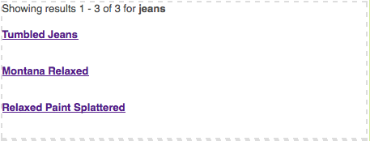

# Adición de funciones de Search&amp;Promote a la página{#adding-search-promote-features-to-your-page}

Para integrar las capacidades de Search&amp;Promote en su sitio web, utilice los componentes de Search&amp;Promote para añadir las funciones siguientes a las páginas:

* Búsqueda de palabras clave
* Página de resultados de búsqueda
* Perfeccionamiento de la búsqueda
* Banners

Tenga en cuenta que puede utilizar las capacidades de Search&amp;Promote solo si el administrador de AEM las ha activado. Consulte [Integración con Adobe Search&amp;Promote](/help/sites-administering/search-and-promote.md).

Las facetas se configuran en el servidor de Search&amp;Promote, al igual que la información que cada componente proporciona. En la siguiente tabla se incluye una descripción breve de cada componente. En las secciones posteriores se proporciona información detallada acerca de su aplicación.

<table>
 <tbody>
  <tr>
   <th>Search&amp;Promote, componente</th>
   <th>Descripción</th>
  </tr>
  <tr>
   <td>Pancartas</td>
   <td>Muestra anuncios de letreros. Los letreros se seleccionan en función de los datos recopilados mediante Search&amp;Promote.  </td>
  </tr>
  <tr>
   <td>Rutas de exploración</td>
   <td>Muestra la palabra clave de búsqueda y la secuencia de filtros que el usuario ha aplicado a los resultados de búsqueda.</td>
  </tr>
  <tr>
   <td>Lista de casilla de verificación-Faceta</td>
   <td>Lista de casillas de verificación para seleccionar facetas para filtrar los resultados de búsqueda.</td>
  </tr>
  <tr>
   <td>Faceta desplegable</td>
   <td>Una lista desplegable de facetas para filtrar los resultados de búsqueda.</td>
  </tr>
  <tr>
   <td>Faceta de lista de vínculo</td>
   <td>Lista de vínculos de facetas para filtrar los resultados de búsqueda.</td>
  </tr>
  <tr>
   <td>Paginación</td>
   <td>Controles para navegar por las páginas de resultados de búsqueda.</td>
  </tr>
  <tr>
   <td>Resultados</td>
   <td>Muestra los resultados de una búsqueda de palabras clave.</td>
  </tr>
  <tr>
   <td>Búsqueda  </td>
   <td>Añade un campo de búsqueda en la página.</td>
  </tr>
 </tbody>
</table>

## Creación de la página de resultados de búsqueda {#creating-the-search-results-page}

Utilice la consola WCM Websites para crear una página en la que se mostrarán los resultados de la búsqueda. Los resultados de una búsqueda de cualquier componente de búsqueda pueden aparecer en esta página si utiliza el mismo servicio de Search&amp;Promote. 

Los componentes que permiten a los usuarios revisar resultados de la búsqueda son Resultados y Paginación. El componente **Resultados** no tiene propiedades configurables en modo Edición o Diseño. El componente Resultados simplemente enumera los resultados de la búsqueda, en los que se ofrecen vínculos a otras páginas, y muestra la cantidad de resultados para la palabra clave de búsqueda. 

El componente **Paginación** permite a los usuarios navegar por varias páginas de resultados de la búsqueda. El usuario puede ver el número de páginas, desplazarse a la página siguiente o anterior, seleccionar una página para abrirla o consolidar los resultados en una página. 

Puede configurar las siguientes propiedades de componente en modo Edición para controlar el comportamiento en tiempo de ejecución:

* Ocultar una sola página de resultados: Seleccione esta opción para ocultar los controles de navegación de la página cuando la búsqueda devuelve una sola página de resultados.
* Ocultar primero/último: seleccione esta opción para impedir que los usuarios salten a la primera o la última página de resultados. 
* Ocultar anterior/siguiente: determina si los usuarios pueden navegar por las páginas de resultados relativas a la página actual. 
* Ocultar ver todos: determina si el usuario puede unificar todos los resultados de búsqueda en una sola página. Normalmente, el uso de datos en páginas permite un uso más eficaz de los recursos del servidor. Seleccione esta opción para impedir la transferencia de conjuntos de datos de gran tamaño en un mensaje de respuesta.

### Activación del filtro de resultados por facetas {#enabling-the-filtering-of-results-by-facets}

Puede permitir a los usuarios filtrar resultados de búsqueda por facetas. Los componentes **Faceta de Lista de casilla de verificación**, **Faceta desplegable** y **Faceta de Lista de vínculo** permiten a los usuarios seleccionar una o varias facetas para filtrar. Si se utilizan estos componentes, debe incluir el componente **Rutas de exploración**. Las rutas de exploración indican los filtros actuales que se utilizan.

Los componentes **Faceta de Lista de casilla de verificación**, **Faceta desplegable** y **Faceta de Lista de vínculo** tienen las siguientes propiedades que se configuran en el modo **Editar**:

* **Nombre de faceta**: el nombre de la faceta que se utiliza en los filtros.

El componente **Faceta de lista de casilla de verificación** muestra una lista de facetas con una casilla de verificación correspondiente. Utilice **Faceta de lista de casilla de verificación** de modo que los usuarios puedan ver un subconjunto de resultados que incluyen elementos de varias facetas. Por ejemplo, la faceta **Marca es adecuada porque varias marcas proporcionan el mismo tipo de producto.**

Aparece una casilla de verificación para cada faceta asociada a un resultado de búsqueda. Cuando un usuario selecciona una casilla de verificación, la página se vuelve a cargar con un conjunto de resultados actualizado. Todas las casillas permanecen en la página para que los clientes puedan añadir o quitar facetas al filtro en cualquier momento:

El componente **Faceta desplegable** permite a los clientes seleccionar un elemento de faceta de una lista desplegable. Este componente es de utilidad cuando quiere que los clientes se centren en un solo elemento de faceta a la vez. Por ejemplo, la faceta Departamento es adecuada para permitir a los clientes refinar las búsquedas de producto por sexo. Juan busca *tejanos* y luego filtra con el departamento Hombres. 

La lista desplegable se rellena con las facetas asociadas a todos los resultados de la búsqueda. Al seleccionar un elemento de la lista desplegable, la página se vuelve a cargar con un conjunto de resultados actualizado. Los elementos de la lista desplegable no cambian para que los clientes puedan cambiar de una faceta a otra en cualquier momento. 

El componente **Faceta de lista de vínculo** permite a los clientes restringir progresivamente la selección de elementos categorizados bajo varios miembros de faceta o facetas.

Los miembros de faceta aparecen como una lista de vínculos. El texto de cada vínculo es el nombre de un miembro de faceta asociado a los resultados de búsqueda actuales. Cuando un cliente hace clic en un vínculo de faceta, la página se vuelve a cargar y se muestra un subconjunto de resultados. La lista de vínculos se actualiza en consecuencia para permitir una selección aún más delimitada.

Los vínculos de la lista también cambian cuando se aplica un filtro de un tipo de componente de Search&amp;Promote diferente. El uso de componentes de filtro de varios tipos puede proporcionar combinaciones eficaces de filtro.

El componente **Rutas de exploración** permite al cliente ver los filtros que se aplican a los resultados de la búsqueda, en el orden en el que se aplicaron. Los clientes pueden hacer clic en los elementos de la ruta de exploración para volver a dicha combinación de filtros.

Puede configurar las siguientes propiedades para las rutas de exploración en modo Edición y personalizar el aspecto del componente:

* Delimitador: define el carácter o la cadena de caracteres que funcionará como delimitador entre cada ruta de exploración. El campo Delimitador acepta cualquier cadena de caracteres como entrada. El valor predeterminado es: &quot;>&quot; (sin las comillas)
* Delimitador final: define un carácter o una cadena de caracteres que se va a mostrar en el extremo de las rutas de exploración. El campo de delimitador final acepta cualquier cadena de caracteres como entrada. El valor predeterminado es *blanco* (es decir, no se muestra nada en el extremo de la línea de la ruta de exploración)

### Adición de cuadros de búsqueda  {#adding-search-boxes}

El componente de búsqueda permite a los clientes realizar búsquedas de palabras claves. Añada componentes de búsqueda a cada página en la que se desee proporcionar acceso a búsquedas. 

Configure las siguientes propiedades en el modo Edición para controlar el comportamiento en tiempo de ejecución:

* Ruta de página de resultados: la ruta a la página en la que se muestran los resultados de la búsqueda. 
* Habilitar completado automático: seleccione esta opción para que aparezcan palabras claves de búsqueda sugeridas cuando el cliente empieza a escribir en el cuadro de búsqueda. 

### Adición de titulares {#adding-banners}

El componente Titulares muestra los anuncios de letreros según las búsquedas de Search&amp;Promote del cliente. La lógica en el servidor de Search&amp;Replace determina qué titular se muestra. Por ejemplo, una búsqueda de tejanos puede hacer que aparezca un titular relacionado con la moda. Filtrar por el departamento Hombres podría ajustar aún más la opción de titular.

El componente de titulares proporciona una propiedad configurable llamada Área de banner. En el modo Edición, seleccione uno de los valores de propiedad para especificar cómo aparecerá el titular. El servicio de Search&amp;Promote determina la lista de valores entre los que puede seleccionar.

### Ejemplo de página de búsqueda de Search&amp;Promote {#example-search-promote-search-page}

En este diagrama se muestran los componentes que se añaden a una página para crear la página de resultados de Search&amp;Promote a continuación.

 
