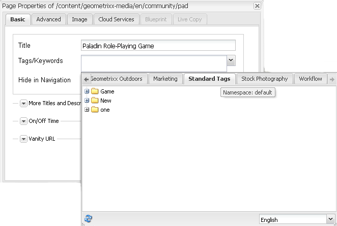

# Uso de etiquetas{#using-tags}

Las etiquetas son un método rápido y fácil de clasificar contenido dentro de un sitio web. Las etiquetas pueden considerarse como palabras clave o marcas que se pueden adjuntar a una página, un recurso o cualquier otro contenido para que con las búsquedas se encuentre ese contenido y el contenido relacionado.

* See [Administering Tags](/help/sites-administering/tags.md) for information about creating and managing tags, as well as to which content tags have been applied.
* See [Tagging for Developers](/help/sites-developing/tags.md) for information about the tagging framework as well as including and extending tags in custom applications.

## Diez motivos para utilizar etiquetas {#ten-reasons-to-use-tagging}

1. Organización del contenido: el etiquetado facilita las cosas a los autores, ya que pueden organizar rápidamente el contenido con muy poco esfuerzo.
1. Organización de etiquetas: si bien las etiquetas organizan el contenido, las taxonomías jerárquicas o los espacios de nombres organizan las etiquetas.
1. Etiquetas sumamente organizadas: con la capacidad de crear etiquetas y subetiquetas, es posible expresar sistemas taxonómicos completos y cubrir términos, subtérminos y sus relaciones. Esto permite crear una segunda (o tercera) jerarquía de contenido en paralelo a la oficial.
1. Etiquetado controlado: el etiquetado puede controlarse aplicando permisos a las etiquetas o los espacios de nombres para controlar la creación y la aplicación de etiquetas.
1. Etiquetado flexible: las etiquetas tienen muchos nombres y rostros: etiquetas, términos de taxonomía, categorías, marcas y muchos más. Son flexibles en el modelo de contenido y en la manera de usarlas. Por ejemplo, al trazar información demográfica de destino, categorizar y calificar contenido o para crear una jerarquía de contenido secundario.
1. Búsqueda mejorada: el componente de búsqueda predeterminado en AEM incluye, en términos generales, las etiquetas creadas y las etiquetas aplicadas a los filtros que pueden aplicarse para obtener únicamente los resultados relevantes.
1. Habilitación de SEO: las etiquetas aplicadas como propiedades de página se mostrarán automáticamente en las metaetiquetas de la página, por lo que serán visibles a los motores de búsqueda.
1. Sofisticación simple: las etiquetas se pueden crear simplemente a partir de una palabra y tocar un botón. Después, se pueden añadir un título, una descripción y marcas ilimitadas para proporcionar más semántica a la etiqueta.
1. Consistencia central: el sistema de etiquetado es un componente central de AEM que todas las capacidades de AEM utilizan para categorizar contenido. Además, la API de etiquetado está disponible para los desarrolladores para que creen aplicaciones compatibles con el etiquetado con acceso a las mismas taxonomías.
1. Combina estructura y flexibilidad: AEM es ideal para trabajar con información estructurada, ya que anida páginas y rutas de acceso. También es extremadamente útil a la hora de trabajar con información sin estructurar, debido a la búsqueda incorporada de texto completo. El etiquetado combina las ventajas que aportan tanto la estructura como la flexibilidad.

A la hora de diseñar la estructura de contenido para un sitio y el esquema de metadatos para los recursos, considere la ligereza y la accesibilidad que el etiquetado proporciona.

## Aplicación de etiquetas {#applying-tags}

In the author environment, authors may apply tags by accessing the page properties and entering one or more tags in the **Tags/Keywords** field.

To apply [pre-defined tags](/help/sites-administering/tags.md), in the **Page Properties** window use the `Tags/Keywords` field pull-down to select from the list of tags permitted for the page. Tthe **Standard Tags** tab is the default namespace, which means there is no `namespace-string:` prefixed to the taxonomy.

### Publicación de etiquetas {#publishing-tags}

Al igual que con las páginas, puede realizar las siguientes acciones con etiquetas y espacios de nombres:

**Activar**

* Activar etiquetas individuales.

   Al igual que con las páginas, las nuevas etiquetas que se creen deberán activarse antes de que estén disponibles en el entorno de publicación.

>[!NOTE]
>
>Cuando se activa una página, se abre automáticamente un cuadro de diálogo que le permite activar las etiquetas desactivadas que pertenecen a la página.

**Desactivar**

* Desactivar las etiquetas seleccionadas.

## Nubes de etiquetas {#tag-clouds}

Las nubes de etiquetas muestran una nube de etiquetas, ya sea para la página actual, el sitio web completo o a las que se accede con más frecuencia. Las nubes de etiquetas son un medio para resaltar los problemas que son (han sido) de interés para el usuario. El tamaño del texto que se utiliza para mostrar la etiqueta varía según su uso.

El componente [Nube de etiquetas](/help/sites-classic-ui-authoring/classic-page-author-edit-mode.md#tag-cloud) (grupo de componentes general) se utiliza para añadir una nube de etiquetas a una página.

## Búsqueda de etiquetas {#searching-on-tags}

Puede buscar etiquetas en los entornos de autor y publicación.

### Uso del componente de búsqueda {#using-search-component}

Adding a [Search component](/help/sites-classic-ui-authoring/classic-page-author-edit-mode.md#search) to a page provides a search capability which includes tags and can be used in both the author and publish environments.

