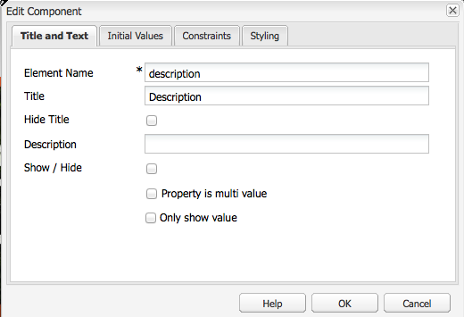
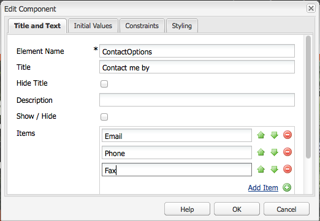
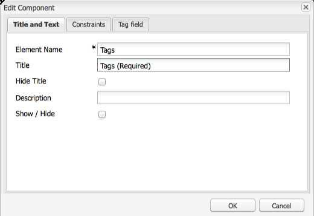

# Crear contenido accesible (Conformidad con WCAG 2.0){#creating-accessible-content-wcag-conformance}

>[!CAUTION]
>
>AEM Debido a que la IU clásica estaba en desuso en la versión 6.4 de, el contenido de esta página no se ha actualizado para WCAG 2.1.
>
>AEM Consulte las siguientes páginas para obtener más información relacionada con la y WCAG 2.1:
>
>* [AEM Directrices de accesibilidad web de y](/help/managing/web-accessibility.md)
>* [Guía rápida de WCAG 2.1](/help/managing/qg-wcag.md)
>* [Crear contenido accesible (Conformidad con WCAG 2.1)](/help/sites-authoring/creating-accessible-content.md)

WCAG 2.0 consiste en un conjunto de directrices tecnológicas independientes y criterios de éxito para ayudar a crear contenido web accesible para, y utilizable por, personas con discapacidades.

>[!NOTE]
>
>Consulte también:
>
>* [Guía rápida de WCAG 2.0](/help/managing/qg-wcag.md)
>* [Configurar el Editor de texto enriquecido para producir contenido accesible](/help/sites-administering/rte-accessible-content.md)
>

Estas directrices se clasifican según tres niveles de conformidad: Nivel A (el más bajo), Nivel AA y Nivel AAA (el más alto). Brevemente, los niveles se definen de la siguiente manera:

* **Nivel A:** El sitio alcanza un nivel básico y mínimo de accesibilidad. Para alcanzar este nivel, se cumplen todos los criterios de éxito del nivel A.
* **Nivel AA:** El nivel ideal de accesibilidad al que se debe aspirar, en el que el sitio alcanza un nivel mejorado de accesibilidad, de modo que sea accesible para la mayoría de las personas en la mayoría de las situaciones y que usen la mayoría de las tecnologías. Para alcanzar este nivel, se cumplen todos los criterios de éxito de los niveles A y AA.
* **Nivel AAA:** Su sitio alcanza un nivel muy alto de accesibilidad. Para alcanzar este nivel, se cumplen todos los criterios de éxito de los niveles A, AA y AAA.

Al crear su sitio, debe determinar el nivel general en el que desea que se ajuste.

La siguiente sección presenta las [directrices WCAG 2.0](https://www.w3.org/TR/WCAG20/#guidelines) con criterios de éxito vinculados a los [niveles de conformidad](https://www.w3.org/TR/UNDERSTANDING-WCAG20/conformance.html) de los niveles A y AA.

>[!NOTE]
>
>Como no es posible satisfacer todos los criterios de éxito de nivel AAA para determinados tipos de contenido, no se recomienda que este nivel de conformidad sea necesario como política general.

>[!NOTE]
>
>Este documento utiliza lo siguiente:
>
>* Nombres abreviados para las [directrices WCAG 2.0](https://www.w3.org/TR/WCAG20/#guidelines)
>* Numeración utilizada en las [directrices WCAG 2.0](https://www.w3.org/TR/WCAG20/#guidelines) para apoyar las referencias cruzadas en la página web de WCAG
>

## Principio 1: perceptible  {#principle-perceivable}

[Principio 1: perceptible. Los componentes de la interfaz de usuario y de la información se deben presentar a los usuarios de forma perceptible.](https://www.w3.org/TR/WCAG20/#perceivable)

### Alternativas de texto (1.1)     {#text-alternatives}

[Directrices 1.1 Alternativas de texto: Proporcione alternativas de texto para cualquier contenido no textual y así poder cambiarlo por otras formas que la gente puede necesitar, como letras grandes, braille, voz, símbolos o lenguaje más sencillo.](https://www.w3.org/TR/WCAG20/#text-equiv)

### Contenido no textual (1.1.1) {#non-text-content}

* Criterios de éxito 1.1.1
* Nivel A
* Contenido no textual: todo contenido no textual que se presenta al usuario tiene una alternativa de texto que cumple el objetivo equivalente, excepto para las situaciones que se detallan a continuación

#### Objetivo: Contenido no textual (1.1.1) {#purpose-non-text-content}

La información de una página web se puede proporcionar en muchos formatos no textuales diferentes, como imágenes, vídeos, animaciones, tablas y gráficos. Las personas ciegas o con deficiencias visuales graves no pueden ver el contenido no textual, pero pueden acceder al contenido textual si lo lee en voz alta un lector de pantalla o si se presenta en un formato táctil a través de un dispositivo de visualización braille. Por lo tanto, al proporcionar alternativas textuales para el contenido en formato gráfico, las personas que no pueden ver ese contenido gráfico pueden acceder a una versión equivalente de la información que proporciona el contenido.

Una ventaja adicional útil es que las alternativas textuales permiten indexar el contenido no textual mediante la tecnología de motor de búsqueda.

#### Cómo cumplir: Contenido no textual (1.1.1) {#how-to-meet-non-text-content}

Para gráficos estáticos, el requisito principal es proporcionar una alternativa textual equivalente para el gráfico. Este método se realiza en la variable **Texto alternativo** campo:

>[!NOTE]
>
>Algunos componentes listos para usar, como **Carrusel** y **Presentación de diapositivas,** no proporcionan los medios para añadir descripciones de texto alternativas a las imágenes. AEM Cuando se implementan versiones de estos componentes para su instancia de, su equipo de desarrollo debe configurarlos para que admitan `alt` atributo. Al hacerlo, se garantiza que los autores puedan agregarlo al contenido (consulte [Añadir ayuda para elementos y atributos de HTML adicionales](/help/sites-administering/rte-accessible-content.md#add-support-for-more-html-elements-and-attributes)).

El **Texto alternativo** está disponible en el campo **Avanzadas** pestaña de propiedades de la imagen de **Imagen** cuadro de diálogo componente:


AEM añade un **Texto alternativo** a las imágenes de forma predeterminada. Para la IU clásica, hay dos escenarios diferentes para la creación del atributo predeterminado, aunque el valor predeterminado puede no ser suficiente como alternativa y es probable que deba editarse en la **Avanzadas** pestaña propiedades de la imagen:

* Archivo:

Se carga una imagen desde el disco duro del usuario. Si agrega un componente de imagen a una página y, a continuación, elige una imagen del disco duro u otra fuente, el valor predeterminado para **Texto alternativo** es `file`. Este valor debe cambiarse en la variable **Avanzadas** pestaña propiedades de la imagen. De nuevo, este valor no se muestra en **Texto alternativo** , pero cuando se cambia el valor, el nuevo valor se muestra en el campo.

* Recurso:

Se agrega una imagen desde el repositorio de recursos digitales. Si arrastra una imagen desde el repositorio de recursos digitales a una página web, la variable **Título** y **Texto alternativo** los valores de esa imagen se toman de los metadatos de esa imagen.

>[!NOTE]
>
>En ambos casos, la opción predeterminada **Texto alternativo** El valor no es visible en **Propiedades de imagen avanzadas** pestaña. Para cambiar el valor predeterminado, simplemente introduzca un nuevo valor en **Texto alternativo** field.

>[!NOTE]
>
>Si la imagen es puramente decorativa (consulte [Crear buenas alternativas de texto](#creating-good-text-alternatives)), puede introducir un espacio en la **Texto alternativo** mediante la barra espaciadora. Al hacerlo, se crea un `alt` , que solicita al lector de pantalla que ignore la imagen.

#### Crear buenas alternativas de texto {#creating-good-text-alternatives}

Existen varias formas de contenido no textual, por lo que el valor de la alternativa textual depende de la función del gráfico en la página web. Algunas de las reglas generales incluyen las siguientes:

* Las alternativas textuales deben ser concisas, pero captar claramente la información esencial proporcionada por el contenido no textual.
* Deben evitarse las descripciones demasiado largas, que superen los 100 caracteres. Si una alternativa textual requiere más detalle, haga lo siguiente:

   * proporcione una breve descripción en el texto alternativo
   * y añada una descripción más larga en el texto en cualquier otra parte, en la misma página o en una página web aparte. Cree un vínculo a esta descripción separada poniendo un vínculo en la imagen o situando un vínculo de texto junto a la imagen.

* El texto alternativo no debe repetir el contenido proporcionado en el texto de la misma página. Recuerde que muchas imágenes son ilustraciones de puntos que ya se han tratado en el texto de una página, por lo que puede que ya exista una alternativa textual detallada.
* Si el contenido no textual es un vínculo a otra página o documento y no hay otro texto que forme parte del mismo vínculo, el texto alternativo para la imagen debe indicar el destino del vínculo. No debe describir la imagen.
* Si el contenido no textual está contenido en un elemento button y no hay texto que forme parte del mismo botón, el texto alternativo de la imagen debe indicar la funcionalidad del botón, no describir la imagen.
* Es aceptable que una imagen tenga un texto alternativo vacío (nulo), pero solo si la imagen no tiene texto alternativo. Por ejemplo, se trata de un gráfico puramente decorativo. O si el texto equivalente ya existe en la página de texto.

El [Borrador W3C: Técnicas de HTML5 para proporcionar alternativas textuales útiles](https://html.spec.whatwg.org/multipage/images.html#alt) tiene más detalles y ejemplos de disposiciones de texto alternativas adecuadas para imágenes de diferentes tipos.

Los tipos específicos de contenido no textual que requieren alternativas textuales pueden incluir:

* Fotos ilustrativas:

Son imágenes de personas, objetos o lugares. Considere el papel de la foto en la página; un texto equivalente apropiado probablemente sea *Foto de [objeto]*, pero puede depender del texto que lo rodea.

* Iconos:

Pequeños pictogramas (gráficos) que transmiten información específica. Deben utilizarse de forma coherente en toda la página y en todo el sitio. Todas las instancias del icono en una página o sitio deben tener la misma alternativa textual corta y sucinta, a menos que hacerlo resulte en una duplicación innecesaria del texto adyacente.

* Gráficos y diagramas:

Normalmente representan datos numéricos. Por lo tanto, una opción para proporcionar una alternativa textual podría ser incluir un breve resumen de las principales tendencias que se muestran en el gráfico. Si es necesario, proporcione también una descripción más detallada en el texto utilizando la variable **Descripción** en el campo **Avanzadas** pestaña propiedades de la imagen. Además, puede proporcionar los datos de origen en formato tabulado en cualquier otra parte de la página o sitio.


Para proporcionar una alternativa a este gráfico de ejemplo, añada una `alt` texto a la propia imagen y, a continuación, siga la imagen con una alternativa de texto completo.

```xml
<p></p>
<p> Figure 1. Distribution of Articles by Journal Category.
Pie chart: Language=68%, Education=14% and Science=18%.</p>
```

>[!NOTE]
>
>El fragmento anterior solo se utiliza para ilustrar el orden. Utilice el **Imagen** en lugar del componente `img src` Referencia utilizada anteriormente.

AEM En el caso de los usuarios de, puede utilizar una combinación de las siguientes opciones: **Texto alternativo** y **Descripción** campos en el cuadro de diálogo de configuración de la imagen: como en [Cómo cumplir: Contenido no textual (1.1.1)](#how-to-meet-non-text-content).

* Mapas, diagramas, diagramas de flujo:

Para gráficos que proporcionan datos espaciales (por ejemplo, para admitir la descripción de relaciones entre objetos o un proceso), compruebe que el mensaje clave se proporciona en formato de texto.  En el caso de los mapas, es probable que no sea práctico suministrar un equivalente textual completo. No obstante, si el mapa se proporciona como una forma de ayudar a las personas a encontrar su camino a una ubicación determinada, el texto alternativo de la imagen del mapa puede indicar brevemente *Mapa de X* y, a continuación, ofrecer indicaciones para llegar a esa ubicación en texto en cualquier parte de la página o a través del campo **Descripción** en la pestaña **Avanzado** del componente **Imagen**.

* CAPTCHA:

un Captcha es una *prueba de Turing pública completamente automatizada para distinguir entre equipos y humanos*. Se trata de una comprobación de seguridad que se utiliza en las páginas web para distinguir a los seres humanos de software malintencionado, pero que puede instaurar barreras de accesibilidad. Son imágenes que requieren que se describa lo que se ve para pasar una prueba de seguridad. Como no es posible proporcionar una alternativa textual para la imagen, en lugar de ello tendrá que considerar una solución alternativa que no sea gráfica.‪

El W3C proporciona varias sugerencias, como las siguientes. Cada uno de estos enfoques tiene sus propios méritos e inconvenientes.

    * Rompecabezas de lógica
    * El uso de salida de sonido en lugar de imágenes
    * Cuentas de uso limitado y filtros de spam.

* Imágenes de fondo:

Estas imágenes se consiguen utilizando hojas de estilo en cascada (CSS) en lugar de en HTML. No es posible especificar un valor de texto alternativo. Por lo tanto, las imágenes de fondo no deben proporcionar información textual importante: si lo hacen, esta información también debe proporcionarse en el texto de la página.

Sin embargo, es importante que se muestre un fondo alternativo cuando la imagen no se pueda mostrar.

>[!NOTE]
>
>Debe haber un nivel adecuado de contraste entre el fondo y el texto en primer plano. Este contraste se analiza con más detalle en [Contraste (mínimo) (1.4.3)](#contrast-minimum).

#### Más información: Contenido no textual (1.1.1) {#more-information-non-text-content}

* [Entender los criterios de éxito 1.1.1](https://www.w3.org/TR/UNDERSTANDING-WCAG20/text-equiv-all.html)
* [Cumplir los criterios de éxito 1.1.1](https://www.w3.org/WAI/WCAG21/quickref/?versions=2.0#text-alternatives)
* [W3C: Técnicas de HTML 5 para proporcionar alternativas textuales útiles](https://html.spec.whatwg.org/multipage/images.html#alt)
* [Explicación de W3C y alternativas para CAPTCHA](https://www.w3.org/TR/turingtest/)

### Medios basados en el tiempo (1.2)     {#time-based-media}

[Directriz 1.2 Medios basados en el tiempo: proporcionar alternativas para medios basados en el tiempo.](https://www.w3.org/TR/WCAG20/#text-equiv)

Esta información trata sobre el contenido web que es *basado en el tiempo*. Abarca el contenido que el usuario puede reproducir (como vídeo, audio y contenido animado) y puede ser pregrabado o reproducido en directo.

### Solo audio y solo vídeo (pregrabado) (1.2.1)  {#audio-only-and-video-only-pre-recorded}

* Criterios de éxito 1.2.1
* Nivel A
* Solo audio y Solo vídeo (pregrabado): para medios de solo audio y solo vídeo pregrabado, la siguiente información es cierta, excepto cuando el audio o el vídeo es una alternativa para texto y se etiqueta claramente como:

   * Solo audio pregrabado: se proporciona una alternativa para medios basados en el tiempo que presentan información equivalente para contenido solo audio pregrabado.
   * Solo vídeo pregrabado: se proporciona una alternativa para los medios basados en el tiempo o una pista de audio que presenta información equivalente para el contenido solo de vídeo pregrabado.

#### Objetivo: solo audio y Solo vídeo (pregrabado) (1.2.1)  {#purpose-audio-only-and-video-only-pre-recorded}

Los problemas de accesibilidad para vídeo y audio pueden experimentarse por parte de estos grupos:

* Personas con discapacidades visuales cuando no hay banda sonora o cuando la banda sonora no basta para informar de lo que está sucediendo en el vídeo o animación.
* Personas con discapacidades auditivas o sordera, que no pueden oír la banda sonora.
* Personas que pueden oír la banda sonora, pero que no entienden lo que se dice (por ejemplo, porque está en un idioma que no entienden).

También puede que el vídeo o el audio no se encuentre disponible para las personas que utilizan navegadores o dispositivos en los que no se puede reproducir contenido en formatos específicos, como Adobe Flash.

Proporcionar esta información en un formato diferente, como texto (o audio para vídeo sin audio) puede ser una manera accesible para las personas que no puedan entender el contenido original.

#### Cómo cumplir: Solo audio y solo vídeo (pregrabado) (1.2.1)  {#how-to-meet-audio-only-and-video-only-pre-recorded}

* Si el contenido es audio pregrabado sin vídeo (como podcast):

   * Proporcione un vínculo inmediatamente antes o después del contenido para obtener una transcripción textual del contenido del audio.

  La transcripción debe ser una página de HTML con un texto equivalente a todo el contenido hablado y no hablado importante. También debe indicar quién está hablando, una descripción del escenario, expresiones vocales y una descripción de cualquier otro audio significativo.

* Si el contenido es una animación o un vídeo pregrabado sin audio:

   * Proporcione un vínculo inmediatamente antes o después del contenido para una descripción textual equivalente a la información proporcionada por el vídeo.
   * O bien, una descripción de audio equivalente en un formato de audio utilizado comúnmente, como MP3.

>[!NOTE]
>
>Si el contenido de audio o vídeo se proporciona como alternativa al contenido que existe en otro formato en una página web, no es necesario seguir los requisitos anteriores. Por ejemplo, si un vídeo ilustra una lista de instrucciones de texto, este vídeo no requiere una alternativa, ya que las instrucciones de texto ya actúan como una alternativa al vídeo.

La inserción de contenido multimedia, específicamente de Flash AEM, en las páginas web de la aplicación es similar a la inserción de una imagen. Sin embargo, como el contenido multimedia es mucho más que una imagen fija, existen varios ajustes y opciones diferentes para controlar cómo se reproduce el contenido multimedia.

>[!NOTE]
>
>Al utilizar contenido multimedia con contenido informativo, también se deben crear vínculos a opciones alternativas. Por ejemplo, para incluir una transcripción textual, cree una página HTML para reproducir la transcripción y añada un vínculo debajo o junto al contenido del audio.

#### Más información: Solo audio y solo vídeo (pregrabado) (1.2.1) {#more-information-audio-only-and-video-only-pre-recorded}

* [Entender los criterios de éxito 1.2.1](https://www.w3.org/TR/UNDERSTANDING-WCAG20/media-equiv-av-only-alt.html)
* [Cumplir los criterios de éxito 1.2.1](https://www.w3.org/WAI/WCAG21/quickref/?versions=2.0#time-based-media)

### Subtítulos (pregrabados) (1.2.2)  {#captions-pre-recorded}

* Criterios de éxito 1.2.2
* Nivel A
* Subtítulos (pregrabados): se proporcionan los subtítulos para todo el contenido de audio pregrabado en medios sincronizados, excepto cuando los medios son una alternativa para el texto y se etiquetan claramente como tal.

#### Objetivo: subtítulos (pregrabados) (1.2.2)  {#purpose-captions-pre-recorded}

Las personas sordas o con dificultades auditivas no pueden acceder o tienen grandes dificultades para acceder al contenido de audio. Los subtítulos son equivalentes textuales para audio verbal y no verbal que se muestran en la pantalla en el momento adecuado durante el vídeo. Permiten entender lo que está sucediendo a las personas que no pueden oír el audio.

>[!NOTE]
>
>No se requieren subtítulos cuando hay texto adecuado o equivalentes no textuales (que proporcionan información directamente equivalente) disponibles en la misma página que el vídeo o la animación.

#### Cómo cumplir: Subtítulos (pregrabados) (1.2.2)  {#how-to-meet-captions-pre-recorded}

Los subtítulos pueden ser:

* Abiertos: siempre visibles cuando se reproduce el vídeo
* Cerrados: el usuario puede activar o desactivar los subtítulos

Utilice subtítulos cerrados siempre que sea posible. Permite a los usuarios elegir si desean ver los subtítulos.

Para los subtítulos cerrados, cree y proporcione un archivo de subtítulos sincronizados en un formato adecuado, como [SONREÍR](https://www.w3.org/AudioVideo/), junto con el archivo de vídeo.

Consulte los tutoriales de en [Más información: Subtítulos (pregrabados) (1.2.2)](#more-information-captions-pre-recorded). Asegúrese de proporcionar una nota para que los usuarios sepan que hay subtítulos disponibles para el vídeo.

Si necesita utilizar subtítulos abiertos, incorpore el texto en la pista de vídeo. Este método se logra utilizando aplicaciones de edición de vídeo que permiten la superposición de títulos en el vídeo.

#### Más información: Subtítulos (pregrabados) (1.2.2)  {#more-information-captions-pre-recorded}

* [Entender los criterios de éxito 1.2.2](https://www.w3.org/TR/UNDERSTANDING-WCAG20/media-equiv-captions.html):
* [Cumplir los criterios de éxito 1.2.2](https://www.w3.org/WAI/WCAG21/quickref/?versions=2.0#time-based-media)
* [W3C: Medios multimedia sincronizados](https://www.w3.org/AudioVideo/)
* [Subtítulos, transcripciones y descripciones de audio: por WebAIM](https://webaim.org/techniques/captions/)

### Descripción del audio o medios alternativos (pregrabados) (1.2.3)  {#audio-description-or-media-alternative-pre-recorded}

* Criterios de éxito 1.2.3
* Nivel A
* Descripción del audio o medios alternativos (pregrabados): se proporciona una alternativa para medios basados en el tiempo o descripción del audio del contenido de vídeo pregrabado para medios sincronizados, excepto cuando el medio es una alternativa para el texto y se etiqueta claramente como tal.

#### Objetivo: Descripción del audio o medios alternativos (pregrabados) (1.2.3)  {#purpose-audio-description-or-media-alternative-pre-recorded}

Las personas ciegas o con problemas de visión experimentan barreras de accesibilidad si la información de un vídeo o animación solo se proporciona de forma visual. O bien, si la banda sonora no proporciona información suficiente para permitir comprender lo que está ocurriendo visualmente.

#### Cómo cumplir: Descripción del audio o medios alternativos (pregrabados) (1.2.3)  {#how-to-meet-audio-description-or-media-alternative-pre-recorded}

Se pueden adoptar dos enfoques para cumplir este criterio con éxito. Cualquiera es aceptable.

1. Incluir una descripción de audio adicional para el contenido del vídeo. Puede llevar a cabo este enfoque de una de las tres maneras siguientes:

   * Durante las pausas en el diálogo existente, se puede proporcionar información acerca de los cambios en la escena que no se presentan como parte de la pista de audio existente.
   * Proporcionando una pista de audio nueva, adicional y optativa, que contenga la banda sonora original, pero incluyendo también información de audio adicional acerca de los cambios en la escena.

      * Los usuarios pueden cambiar entre la pista de audio existente (que *no tiene* contiene una descripción del audio) y la nueva pista de audio (que *hace* contiene una descripción del audio).
      * Este método evita interrupciones a los usuarios que no necesitan la descripción adicional.

   * Creando una segunda versión del contenido de vídeo que permita descripciones de audio extendidas. Al hacerlo, se reducen las dificultades asociadas con la descripción detallada del audio dentro de los espacios entre los diálogos existentes, pausando temporalmente el audio y el vídeo en los puntos apropiados. El resultado es una descripción del audio mucho más larga antes de que se retome la acción. Como en el ejemplo anterior, esta opción resulta mejor como una pista de audio adicional y opcional para prevenir interrupciones a los usuarios que no necesitan la descripción adicional.

1. Proporcionar una transcripción del texto que sea adecuada al equivalente textual del audio y a los elementos visuales del vídeo o animación. Debe incluir, cuando proceda, una indicación de quién habla, una descripción del entorno y expresiones vocales. Según la longitud, se puede colocar la transcripción en la misma página del vídeo o de la animación o en una página aparte; si se elige esta última opción, se debe proporcionar un vínculo a la transcripción junto al vídeo o animación.

Los detalles exactos de cómo crear vídeos descritos por audio quedan fuera del alcance de esta guía. Crear descripciones de vídeo y audio puede llevar mucho tiempo, pero otros productos de Adobe pueden ayudarle a realizar estas tareas. Al crear contenido con Adobe Flash Professional, también se debe crear un guión para recordar al usuario que puede descargar el programa adicional adecuado y proporcionar una alternativa textual a través del elemento `<noscript>`.

#### Más información: Descripción del audio o medios alternativos (pregrabados) (1.2.3) {#more-information-audio-description-or-media-alternative-pre-recorded}

* [Entender los criterios de éxito 1.2.3](https://www.w3.org/TR/UNDERSTANDING-WCAG20/media-equiv-audio-desc.html)
* [Cumplir los criterios de éxito 1.2.3](https://www.w3.org/WAI/WCAG21/quickref/?versions=2.0#qr-media-equiv-audio-desc)
* [Adobe Encore CS5](https://helpx.adobe.com/premiere-pro/using/whats-new.html)

### Subtítulos (en vivo) (1.2.4)    {#captions-live}

* Criterios de éxito 1.2.4
* Nivel AA
* Subtítulos (en vivo): se proporcionan subtítulos para todo el contenido de audio en vivo en medios sincronizados.

#### Objetivo: Subtítulos (en vivo) (1.2.4)     {#purpose-captions-live}

Este criterio de éxito es idéntico al de [Subtítulos (pregrabados)](#captions-pre-recorded) puesto que se enfrenta a las barreras de accesibilidad que experimentan las personas sordas o que sufren deficiencias auditivas, excepto por el hecho de que este criterio de éxito trata las presentaciones en vivo tales como retransmisiones vía Internet.

#### Cómo cumplir: Subtítulos (en vivo) (1.2.4) {#how-to-meet-captions-live}

Siga las directrices proporcionadas para [Subtítulos (pregrabados)](#captions-pre-recorded) arriba. Sin embargo, debido a la naturaleza de los medios, los subtítulos deben crearse lo más rápido posible y en respuesta a lo que está sucediendo. Por eso es necesario considerar la posibilidad de utilizar subtítulos a tiempo real o herramientas de función de voz a texto.

Las instrucciones detalladas van más allá del alcance de este documento, pero los siguientes recursos proporcionan información útil:

* [WebAIM: Subtítulos a tiempo real](https://webaim.org/techniques/captions/realtime)
* [AccessIT (Universidad de Washington): ¿Se pueden generar subtítulos de manera automática utilizando el reconocimiento de voz?](https://www.washington.edu/doit/programs/accessit?1209)

#### Más información: Subtítulos (en vivo) (1.2.4)     {#more-information-captions-live}

* [Entender los criterios de éxito 1.2.4](https://www.w3.org/TR/UNDERSTANDING-WCAG20/media-equiv-real-time-captions.html)
* [Cumplir los criterios de éxito 1.2.4](https://www.w3.org/WAI/WCAG21/quickref/?versions=2.0#qr-media-equiv-real-time-captions)

### Descripción del audio (pregrabado) (1.2.5)          {#audio-description-pre-recorded}

* Criterios de éxito 1.2.5
* Nivel AA
* Descripción del audio (pregrabado): se proporciona una descripción del audio para todo el contenido de vídeo pregrabado en medios sincronizados.

#### Objetivo: Descripción del audio (pregrabado) (1.2.5)     {#purpose-audio-description-pre-recorded}

Este criterio de éxito es idéntico al de [Descripción del audio o medios alternativos (pregrabados)](#audio-description-or-media-alternative-pre-recorded), excepto por el hecho de que los autores deben proporcionar una descripción del audio mucho más detallada para ajustarse al Nivel AA.

#### Cómo cumplir: Descripción del audio (pregrabado) (1.2.5)  {#how-to-meet-audio-description-pre-recorded}

Siga las directrices que se proporcionan para la [Descripción del audio o medios alternativos (pregrabados)](#audio-description-or-media-alternative-pre-recorded).

#### Más información: Descripción del audio (pregrabado) (1.2.5)     {#more-information-audio-description-pre-recorded}

* [Entender los criterios de éxito 1.2.5](https://www.w3.org/TR/UNDERSTANDING-WCAG20/media-equiv-audio-desc-only.html)
* [Cumplir los criterios de éxito 1.2.5](https://www.w3.org/WAI/WCAG21/quickref/?versions=2.0#qr-media-equiv-audio-desc-only)

### Adaptable (1.3)     {#adaptable}

[Directrices 1.3 Adaptable: Crear contenido que se pueda presentar de diferentes maneras (por ejemplo, con un diseño más sencillo) sin perder información o estructura.](https://www.w3.org/TR/WCAG20/#content-structure-separation)

Esta directriz cubre los requisitos necesarios para apoyar a las siguientes personas:

* no pueden acceder a la información tal como la presenta un autor en un *standard* diseño de página web en dos dimensiones, varias columnas y en color

* utilizan una representación de solo audio o una alternativa visual, como un texto largo o un gran contraste.

### Información y relaciones (1.3.1)    {#info-and-relationships}

* Criterios de éxito 1.3.1
* Nivel A
* Información y relaciones: la información, la estructura y las relaciones en presentaciones se pueden determinar mediante un programa o pueden estar disponibles en formato de texto.

#### Objetivo: Información y relaciones (1.3.1)     {#purpose-info-and-relationships}

Muchas tecnologías de asistencia que utilizan las personas con discapacidad dependen de la información estructural para mostrar o generar contenido de forma eficaz. Esta información estructural puede adoptar la forma de encabezados de página, encabezados de fila y columna de tabla y tipos de lista. Por ejemplo, un lector de pantalla podría permitir que un usuario navegue por una página de un encabezado a otro. Sin embargo, cuando el contenido de una página solo parece contener una estructura a través de un estilo visual, en lugar del formato HTML subyacente, quiere decir que no existe ninguna información estructural disponible para tecnologías de asistencia, lo que limita su capacidad de proporcionar una navegación más sencilla.

Este criterio de éxito existe para garantizar que dicha información estructural se proporcione a través de HTML, de modo que los navegadores y las tecnologías de asistencia puedan acceder a la información y aprovecharla.

#### Cómo cumplir: Información y relaciones (1.3.1)  {#how-to-meet-info-and-relationships}

AEM facilita construir páginas web utilizando los elementos HTML adecuados. Abra el contenido de su página en RTE (un componente Texto) y utilice el **Formato** para especificar el elemento estructural adecuado (por ejemplo, párrafo y encabezado).

La siguiente imagen muestra el texto que se ha diseñado como texto de párrafo; la vista de código fuente que se está utilizando muestra que tiene las opciones de apertura y cierre correctas &lt;p> y &lt;/p> etiquetas.


Asegúrese de que las páginas web tengan la estructura adecuada mediante lo siguiente:

* **Uso de encabezados:**  

Siempre que tenga las funciones de accesibilidad de RTE activadas (consulte [AEM Acceso y accesibilidad de la](/help/sites-administering/rte-accessible-content.md)AEM ), ofrece tres niveles de encabezado de página. Puede utilizarlas para identificar secciones y subsecciones de contenido. El encabezado 1 es el nivel más alto, mientras que el encabezado 3 es el más bajo. El administrador del sistema puede configurar el sistema para permitir el uso de más niveles de encabezado.

La siguiente imagen muestra un ejemplo de los diferentes tipos de encabezados.


* **Texto enfatizado**:

Utilice el elemento o para indicar énfasis. No utilice encabezados o texto enfatizado en los párrafos.

    * Resalte el texto que desee resaltar;
    * Haga clic en el icono **B** (para &amp;lt;strong&amp;gt;) o en el icono **I** (para &amp;lt;em&amp;gt;) que se muestra en el panel **Propiedades** (asegúrese de que el HTML está seleccionado).

>[!NOTE]
>
>RTE en una instalación AEM estándar está configurada para utilizar:
>
>* &lt;b> para &lt;strong>
* &lt;i> para &lt;em>
>
Aunque son igual de eficaces, y son preferibles porque son HTML semánticamente correctos. Su equipo de desarrollo puede configurar el RTE para utilizar y  (en lugar de y ) al desarrollar su instancia de proyecto.

* **Utilizar listas**:
Es posible utilizar HTML para especificar tres tipos de listas distintas.

   * El `<ul>` se utiliza para *desordenado* listas (listas con viñetas). Los elementos de listas individuales se identifican utilizando el elemento `<li>`. 

  en RTE, utilice el **Lista con viñetas** icono.

   * El elemento `<ol>` se utiliza para listas *numeradas*. Los elementos de listas individuales se identifican utilizando el elemento `<li>`. 

  En RTE, utilice el icono **Lista numerada**.

Si desea cambiar contenido existente por un tipo de lista específico, resalte el texto correspondiente y seleccione el tipo de lista adecuado. Como en el ejemplo anterior, que muestra cómo se introduce el texto del párrafo, los elementos de la lista correspondientes se añaden automáticamente al HTML, pero puede verlo en la vista de edición de código fuente.

>[!NOTE]
>
El `<dl>` no es compatible con RTE.

* **Uso de tablas**:

Las tablas de datos deben identificarse utilizando elementos de tablas de HTML:

    * uno `&lt;table>` element
    * a `&lt;tr>` para cada fila de la tabla
    * a `&lt;th>` para cada encabezado de fila y columna
    * a `&lt;td>` para cada celda de datos

>[!NOTE]
>
Las tablas deben realizarse con la variable **Tabla** componente. Aunque se pueden crear tablas en el componente Texto, no se recomienda.

Además, las tablas accesibles utilizan los siguientes elementos y atributos:

    * El `&lt;caption>` se utiliza para proporcionar un pie de ilustración visible para la tabla. Los subtítulos aparecen centrados sobre la tabla de forma predeterminada, pero se pueden colocar correctamente con CSS. El subtítulo está asociado programáticamente con la tabla, por lo que se trata de un método útil para proporcionar una introducción al contenido.
    * El `&lt;h3 class=&quot;summary&quot;>El elemento ayuda a los usuarios que carecen de visión para que entiendan con mayor facilidad la información que se presenta en la tabla, ya que proporciona una sinopsis de lo que el usuario puede ver. Resulta particularmente útil cuando se utilizan diseños de la tabla complejos o poco convencionales (este atributo no se muestra en el buscador, solo se lee en voz alta para tecnologías de asistencia).
    * El atributo &quot;scope&quot; de &quot;&lt;th>` se utiliza para indicar si una celda representa el encabezado de una fila en particular o de una columna en particular. Un enfoque similar es el de utilizar el encabezado y los atributos de identificación en tablas complejas, donde las celdas de datos se pueden asociar con uno o más encabezados.

>[!NOTE]
>
Por defecto, estos elementos y atributos no se encuentran disponibles directamente, aunque es posible que el administrador del sistema añada cierta ayuda para estos valores en el cuadro de diálogo **Propiedades de la tabla** (consulte [Agregar ayuda para elementos y atributos HTML adicionales](/help/sites-administering/rte-accessible-content.md#add-support-for-more-html-elements-and-attributes)).

Al añadir un **Tabla**, puede configurar **Propiedades de tabla** uso del cuadro de diálogo.

    * un **Pie de ilustración** adecuado.
    * Idealmente, elimine los valores predeterminados de **Anchura**, **Altura**, **Borde**, **Margen de celdas**, **Espaciado de celdas**. ya que estas propiedades se pueden definir en una hoja de estilo global.


A continuación, puede utilizar la variable **Propiedades de celda** para elegir si la celda es una celda de datos o de encabezado y, si es una celda de encabezado, si está relacionada con una fila o columna o con ambas:


* **Tablas de datos complejas:**

A veces, cuando hay tablas complejas con dos o más niveles de encabezados, las propiedades de tabla básicas pueden no ser suficientes para proporcionar toda la información estructural necesaria. Para este tipo de tablas complejas, se deben crear relaciones directas entre los encabezados y sus celdas relacionadas mediante **encabezado** y **id** atributos. Por ejemplo, en la tabla siguiente, los encabezados y las identificaciones se comparan para crear una asociación programática para los usuarios de tecnología de asistencia.

>[!NOTE]
>
El atributo de identificación no se encuentra disponible en las instalaciones predeterminadas. Se puede activar configurando las normas HTML y el serializador en el RTE.

>[!NOTE]
>
Las tablas deben realizarse con la variable **Tabla** componente. Aunque se pueden crear tablas en el componente Texto, no se recomienda.

```xml
<table>
   <tr>
     <th rowspan="2" id="h">Homework</th>
     <th colspan="3" id="e">Exams</th>
     <th colspan="3" id="p">Projects</th>
   </tr>
   <tr>
     <th id="e1" headers="e">1</th>
     <th id="e2" headers="e">2</th>
     <th id="ef" headers="e">Final</th>
     <th id="p1" headers="p">1</th>
     <th id="p2" headers="p">2</th>
     <th id="pf" headers="p">Final</th>
   </tr>
   <tr>
    <td headers="h">15%</td>
    <td headers="e e1">15%</td>
    <td headers="e e2">15%</td>
    <td headers="e ef">20%</td>
    <td headers="p p1">10%</td>
    <td headers="p p2">10%</td>
    <td headers="p pf">15%</td>
   </tr>
  </table>
```

AEM Para conseguirlo en la, debe añadir el marcado directamente utilizando el modo de edición de origen.

>[!NOTE]
>
Esta funcionalidad no se encuentra disponible de inmediato en las instalaciones estándar. Requiere la configuración de RTE, reglas de HTML y serializador.

#### Más información: Información y relaciones (1.3.1) {#more-information-info-and-relationships}

* [Entender los criterios de éxito 1.3.1](https://www.w3.org/TR/UNDERSTANDING-WCAG20/content-structure-separation-programmatic.html)
* [Cumplir los criterios de éxito 1.3.1](https://www.w3.org/WAI/WCAG21/quickref/?versions=2.0#qr-content-structure-separation-programmatic)

### Características sensoriales (1.3.3)          {#sensory-characteristics}

* Criterios de éxito 1.3.3
* Nivel A
* Características sensoriales: las instrucciones que se proporcionan para entender el contenido y operar con él no se basan solo en características sensoriales de componentes como la forma, el tamaño, la ubicación visual, la orientación o el sonido

#### Objetivo: Características sensoriales (1.3.3)     {#purpose-sensory-characteristics}

Los diseñadores normalmente se centran en características de diseño visuales tales como el color, la forma, el estilo del texto o una parte de la ubicación absoluta o relativa del contenido a la hora de presentar la información. Estas pueden ser técnicas de diseño poderosas para transmitir información, pero las personas ciegas o con problemas de visión pueden ser incapaces de acceder a información que requiera la identificación visual de atributos como posición, color o forma.

Del mismo modo, la información que requiere distinguir entre sonidos diferentes (por ejemplo, contenido cuya voz es masculina o femenina) presenta barreras de accesibilidad para las personas que sufren deficiencias auditivas si el contenido del audio no se refleja en un texto alternativo.

>[!NOTE]
>
Para los requisitos relativos a las alternativas de color, consulte [Uso del color](#use-of-color).

#### Cómo cumplir: Características sensoriales (1.3.3)     {#how-to-meet-sensory-characteristics}

Asegúrese de que cualquier información relativa a las características visuales del contenido de una página también se presente en un formato alternativo.

* Es importante no basarse en la posición visual para dar información. Por ejemplo, si desea remitir a los usuarios a un menú situado en la parte derecha de la página para acceder a más información, no consulte *el menú de la derecha*; en su lugar, asigne un nombre al menú (por ejemplo, mediante un encabezado) y menciónelo en el texto.
* También es importante no basarse en el estilo del texto (por ejemplo, si se trata de texto en negrita o en cursiva) como la única manera de transmitir la información.

>[!NOTE]
>
El uso de términos descriptivos es aceptable si se entiende que tienen significado en un contexto no visual. Por ejemplo, con *superior* y *abajo* sería generalmente aceptable, ya que implican respectivamente contenido antes y después de un elemento de contenido en particular. Aún tendría sentido cuando el contenido se hable en voz alta.

#### Más información: Características sensoriales (1.3.3)     {#more-information-sensory-characteristics}

* [Entender los criterios de éxito 1.3.3](https://www.w3.org/TR/UNDERSTANDING-WCAG20/content-structure-separation-understanding.html)
* [Cumplir los criterios de éxito 1.3.3](https://www.w3.org/WAI/WCAG21/quickref/?versions=2.0#qr-content-structure-separation-understanding)

### Distinguible (1.4)     {#distinguishable}

[Directrices 1.4 Distinguible: Facilitar a los usuarios ver y oír el contenido incluyendo la posibilidad de separar el primer plano del fondo.](https://www.w3.org/TR/WCAG20/#visual-audio-contrast)

### Uso del color (1.4.1)          {#use-of-color}

* Criterios de éxito 1.4.1
* Nivel A
* Uso del color: el color no es el único medio visual para transmitir información, indicar una acción, una respuesta o distinguir un elemento visual.

>[!NOTE]
>
Este criterio de éxito se dirige específicamente a la percepción del color. Otras formas de percepción se tratan en [Adaptable (1.3)](#adaptable); incluyendo el acceso programático al color y otros códigos de presentación visual.

#### Objetivo: Uso del color (1.4.1)     {#purpose-use-of-color}

El color es una manera efectiva de resaltar el atractivo estético de las páginas web y también resulta útil para transmitir información. Sin embargo, existe una variedad de deficiencias visuales, desde la ceguera hasta la deficiencia en la percepción del color, que significa que algunas personas no pueden distinguir entre ciertos colores. Este problema hace que la codificación por colores sea una forma poco fiable de proporcionar información.

Por ejemplo, alguien con deficiencia de visión de color rojo-verde es incapaz de distinguir entre tonos de verde y tonos de rojo. Puede que esta persona vea ambos colores como un tercer color (por ejemplo, marrón), en cuyo caso no distingue entre el verde, el rojo y el marrón.

Además, las personas que utilizan exploradores de solo texto, dispositivos de pantallas monocromáticas o páginas en blanco y negro no pueden percibir el color.

#### Cómo cumplir: Uso del color (1.4.1)     {#how-to-meet-use-of-color}

En todos los casos donde el color se utilice para transmitir información, es importante asegurarse de que la información se encuentra disponible sin necesidad de ver el color.

Por ejemplo, asegúrese de que la información que proporciona el color también esté explícita en el texto. La siguiente ilustración muestra cómo el color y el texto indican la disponibilidad de asientos para una actuación:

<table>
 <tbody>
  <tr>
   <td><p><strong>Rendimiento</strong></p> </td>
   <td><p><strong>Disponibilidad</strong></p> </td>
  </tr>
  <tr>
   <td><p>Martes, 16 de marzo<sup>th</sup></p> </td>
   <td><p>PUESTOS DISPONIBLES</p> </td>
  </tr>
  <tr>
   <td><p>Miércoles, 17 de marzo<sup>th</p> </td>
   <td><p>PUESTOS DISPONIBLES</p> </td>
  </tr>
  <tr>
   <td><p>Jueves, 18 de marzo<sup>th</sup></p> </td>
   <td><p>AGOTADO</p> </td>
  </tr>
 </tbody>
</table>

Si se utiliza el color como medio para transmitir información, se debería proporcionar una señal visual adicional, como cambiar el estilo (por ejemplo, usar negrita o cursiva) o la fuente. De esta manera, se ayuda a las personas con poca visión o que tienen una deficiencia de percepción de color a identificar la información. Sin embargo, no se puede confiar totalmente en esta medida, puesto que no ayuda a quienes no pueden ver la página.

#### Más información: Uso del color (1.4.1) {#more-information-use-of-color}

* [Entender los criterios de éxito 1.4.1](https://www.w3.org/TR/2008/NOTE-WCAG20-TECHS-20081211/working-examples/G183/link-contrast.html)
* [Cumplir los criterios de éxito 1.4.1](https://www.w3.org/TR/2008/NOTE-WCAG20-TECHS-20081211/working-examples/G183/link-contrast.html)
* [Directrices para cumplir la relación de contraste 3:1 que contiene una lista de colores &quot;seguros para la web&quot;](https://www.w3.org/TR/2008/NOTE-WCAG20-TECHS-20081211/working-examples/G183/link-contrast.html)

### Contraste (mínimo) (1.4.3)     {#contrast-minimum}

* Criterios de éxito 1.4.3
* Nivel AA
* Contraste (mínimo): la presentación visual del texto y las imágenes de texto tiene una relación de contraste de al menos 4.5:1, excepto en los siguientes casos:

   * Texto grande: el texto y las imágenes de texto a gran escala mantienen una relación de contraste de al menos 3:1.
   * Secundario: el texto o las imágenes de texto que forman parte de un componente de interfaz de usuario inactivo, que son puramente decorativos, que no son visibles para nadie o que forman parte de una fotografía que contiene otro contenido visual significativo, no tienen requisitos de contraste.
   * Logotipos: El texto que forma parte de un logotipo o del nombre de una marca no cuenta con un requisito mínimo de contraste.

#### Objetivo: Contraste (mínimo) (1.4.3)     {#purpose-contrast-minimum}

Las personas con ciertas deficiencias visuales quizá no puedan distinguir entre ciertos pares de colores de poco contraste. Estas personas pueden tener problemas de accesibilidad si ocurre lo siguiente:

* El texto contrasta poco con el color del fondo.
* El código de color del texto (como el texto con vínculo y el texto sin vínculo) es importante para distinguir la información.

>[!NOTE]
>
El texto que se utiliza con fines puramente decorativos se excluye de estos criterios de éxito.

#### Cómo cumplir: Cumplir los criterios de contraste (Mínimo) (1.4.3)     {#how-to-meet-contrast-minimum}

Asegúrese de que el texto contraste lo suficiente con el fondo. Las relaciones de contraste dependen del tamaño y del estilo del texto en cuestión:

* Para los textos cuyo tamaño es menor de 18 puntos (o 14 puntos en negrita), la relación de contraste entre el texto o las imágenes del texto y el fondo debería ser de al menos 4.5:1.
* Para los textos cuyo tamaño es de al menos 18 puntos (o 14 puntos en negrita), la relación de contraste debería ser de al menos 3:1.
* Ante un fondo estampado, el fondo alrededor de cualquier texto debería estar sombreado para que la relación 4.5:1 o 3:1 se mantenga.

Para comprobar los niveles de contraste, utilice una herramienta de contraste de color como el programa [Paciello Group Color Contrast Analyzer](https://www.paciellogroup.com/resources/contrast-analyser.html) o el [verificador de contraste de color WebAIM](https://webaim.org/resources/contrastchecker/). Estas herramientas permiten comprobar pares de colores e informar sobre cualquier problema de contraste.

Alternativamente, si no le preocupa especificar la apariencia de su página, puede optar por no especificar el color del fondo o del texto en primer plano. No es necesario comprobar el contraste, ya que el explorador del usuario determina los colores del texto y del fondo.

Si no es posible alcanzar los niveles de contraste recomendados, proporcione un vínculo a una versión alternativa y equivalente de la página (que no tenga problemas con el contraste de color). O bien, permita que el usuario ajuste el contraste de la combinación de colores de la página a sus propios requisitos.

#### Más información: Contraste (mínimo) (1.4.3)     {#more-information-contrast-minimum}

* [Entender los criterios de éxito 1.4.3](https://www.w3.org/TR/UNDERSTANDING-WCAG20/visual-audio-contrast-contrast.html)
* [Cumplir los criterios de éxito 1.4.3](https://www.w3.org/WAI/WCAG21/quickref/?versions=2.0#qr-visual-audio-contrast-contrast)

### Imágenes de texto (1.4.5)     {#images-of-text}

* Criterios de éxito 1.4.5
* Nivel AA
* Imágenes de texto: si las tecnologías que se utilizan consiguen la presentación visual, el texto se utiliza para proporcionar información (y no las imágenes de texto), excepto en los casos siguientes:

   * Personalizable: la imagen de texto se puede personalizar visualmente según los requisitos del usuario.
   * Esencial: una presentación de texto en concreto resulta esencial para que se transmita la información.

>[!NOTE]
>
Los logotipos (texto que forma parte de un logotipo o de un nombre de marca) se consideran esenciales.

#### Objetivo: Imágenes de texto (1.4.5)          {#purpose-images-of-text}

Las imágenes de texto normalmente se utilizan cuando se prefiere un estilo de texto en particular; por ejemplo, un logotipo, o si un texto se ha generado desde otra fuente (por ejemplo, un documento físico escaneado). Sin embargo, comparadas con el texto presentado en HTML y cuyo estilo utiliza CSS, las imágenes de texto carecen de la flexibilidad de cambiar su tamaño o apariencia, lo que podría resultar necesario para las personas con deficiencias visuales o dificultades de lectura.

#### Cómo cumplir: Imágenes de texto (1.4.5)       {#how-to-meet-images-of-text}

Si es necesario utilizar imágenes de texto, utilice CSS para reemplazar las imágenes de texto con texto equivalente en HTML y así el texto estará disponible en un modo personalizable. Para ver un ejemplo, consulte [C30: Utilizar CSS para reemplazar texto con imágenes de texto y proporcionar controles de interfaz de usuario para cambiar](https://www.w3.org/TR/2008/NOTE-WCAG20-TECHS-20081211/C30).

#### Más información: Imágenes de texto (1.4.5)          {#more-information-images-of-text}

* [Entender los criterios de éxito 1.4.5](https://www.w3.org/TR/UNDERSTANDING-WCAG20/visual-audio-contrast-text-presentation.html)
* [Cumplir los criterios de éxito 1.4.5](https://www.w3.org/WAI/WCAG21/quickref/?versions=2.0#qr-visual-audio-contrast-text-presentation)

## Principio 2: operable          {#principle-operable}

[Principio 2: operable. Los componentes y la navegación de interfaz de usuario deben ser operables.](https://www.w3.org/TR/WCAG20/#operable)

### Pausar, parar, ocultar (2.2.2)          {#pause-stop-hide}

* Criterios de éxito 2.2.2
* Nivel A
* Pausar, parar, ocultar: Para mover, cerrar, desplazar o actualizar automáticamente la información, los siguientes criterios son verdaderos:  

   * Movimiento, parpadeo desplazamiento: Para cualquier tipo de información en movimiento, que parpadea o se desplaza que (a) empiece de manera automática, (b) dure más de cinco segundos y (c) se presente en paralelo con otro contenido, existe un mecanismo que el usuario puede utilizar para pausarla, pararla u ocultarla, a menos que el movimiento, el parpadeo o el desplazamiento forme parte de una actividad en la que sea esencial;
   * Actualización automática: para cualquier información de actualización automática que (a) se inicie automáticamente y (b) se presente en paralelo con otro contenido, existe un mecanismo para que el usuario la ponga en pausa, la detenga u oculte, o para controlar la frecuencia de la actualización a menos que la actualización automática forme parte de una actividad en la que sea esencial.

Puntos que se deben tener en cuenta:

1. Para ver los requisitos relacionados con contenidos que parpadean, consulte [No diseñar contenido de manera que cause parpadeos (2.3)](#seizures).
1. Ya que cualquier contenido que no cumpla estos criterios de éxito puede interferir en la capacidad de un usuario para utilizar toda una página, todo el contenido de la página web (tanto si se utiliza para cumplir otros criterios como si no) debe obedecerlos. Consulte [Requisito de conformidad 5: no interferencia](https://www.w3.org/TR/WCAG20/#cc5).
1. El contenido que se actualiza periódicamente a través del software o que se transmite al usuario no necesita preservar o presentar la información que se genera o se recibe entre la iniciación de la pausa y la reanudación de la presentación, puesto que puede no ser técnicamente posible y en muchas situaciones podría ser engañoso.
1. Una animación en una fase de precarga o en una situación similar se consideraría esencial si la interacción no se pudiera dar durante dicha fase para todos los usuarios, y si no indicara el progreso, podría confundirlos o llevarles a pensar que el contenido se ha congelado o estropeado.

#### Objetivo: Pausar, parar, ocultar (2.2.2)     {#purpose-pause-stop-hide}

Algunos usuarios pueden considerar que el contenido que se mueve distrae y dificulta la concentración en otras partes de la página. Además, dicho contenido puede ser difícil de leer para quienes tienen problemas para seguir un texto que se mueve.

#### Cómo cumplir: Pausar, parar, ocultar (2.2.2)     {#how-to-meet-pause-stop-hide}

Según la naturaleza del contenido, se puede aplicar una o varias de las siguientes sugerencias al crear páginas web con contenido que se mueve, que es intermitente o parpadea:

* Proporcionar una forma de pausar el desplazamiento por el contenido para que los usuarios tengan tiempo suficiente para leerlo. Por ejemplo, tableros de noticias o texto que se actualiza automáticamente.
* Asegúrese de que el contenido que parpadea deja de hacerlo tras cinco segundos.
* Utilizar tecnologías adecuadas para mostrar el contenido parpadeante que se puede mostrar en el navegador. Por ejemplo, archivos de Formato de intercambio de gráficos (GIF) o Gráficos de red portátiles animados (APNG).
* Proporcione un control de formulario en la página web para permitir que el usuario deshabilite todo el contenido parpadeante de la página.
* Si lo anterior no es posible, proporcione un vínculo a una página que contenga todo el contenido pero sin parpadeos.

#### Más información: Pausar, parar, ocultar (2.2.2)  {#more-information-pause-stop-hide}

* [Entender los criterios de éxito 2.2.2](https://www.w3.org/TR/UNDERSTANDING-WCAG20/time-limits-pause.html)
* [Cumplir los criterios de éxito 2.2.2](https://www.w3.org/WAI/WCAG21/quickref/?versions=2.0#qr-time-limits-pause)

### Parpadeos (2.3)     {#seizures}

[Directrices 2.3 Parpadeos: No diseñar contenido de manera que cause parpadeos.](https://www.w3.org/TR/WCAG20/#seizure)

### Tres parpadeos o por debajo de los límites (2.3.1)     {#three-flashes-or-below-threshold}

* Criterios de éxito 2.3.1
* Nivel A
* Tres parpadeos o Por debajo del umbral: las páginas web no contienen ningún elemento que parpadee más de tres veces en el intervalo de un segundo o que el parpadeo esté por debajo del umbral general de parpadeo y parpadeo en rojo.

>[!NOTE]
>
Ya que cualquier contenido que no cumpla este criterio de éxito puede interferir en la capacidad de un usuario para utilizar toda la página, todo el contenido de la página web (tanto si se utiliza para cumplir otros criterios como si no) debe cumplir este criterio de éxito. Consulte [Requisito de conformidad 5: no interferencia](https://www.w3.org/TR/WCAG20/#cc5).

#### Objetivo: Tres parpadeos o Por debajo de los límites (2.3.1) {#purpose-three-flashes-or-below-threshold}

En ciertos casos, el contenido intermitente puede causar convulsiones fotosensibles. Este criterio de éxito permite a los usuarios acceder y experimentar todo el contenido sin tener que preocuparse acerca del contenido intermitente.

#### Cómo cumplir: Tres parpadeos o por debajo del umbral (2.3.1)     {#how-to-meet-three-flashes-or-below-threshold}

Siga estos pasos para asegurarse de que se aplican las siguientes técnicas:

* Asegúrese de que los componentes no parpadean más de tres veces durante el intervalo de un segundo;
* Si no se cumple la condición anterior, muestre el contenido parpadeante en una *zona pequeña y segura* en píxeles en la pantalla. Esta zona se calcula utilizando una fórmula compleja que se recoge en [G176: Hacer que la zona parpadeante sea lo suficientemente reducida](https://www.w3.org/TR/2008/NOTE-WCAG20-TECHS-20081211/G176), por lo que esta técnica solo se debe utilizar si el contenido que parpadea es absolutamente necesario.

#### Más información: Tres parpadeos o por debajo de los límites (2.3.1) {#more-information-three-flashes-or-below-threshold}

* [Entender los criterios de éxito 2.3.1](https://www.w3.org/TR/UNDERSTANDING-WCAG20/seizure-does-not-violate.html)
* [Cumplir los criterios de éxito 2.3.1](https://www.w3.org/WAI/WCAG21/quickref/?versions=2.0#seizure)

### Página titulada (2.4.2)          {#page-titled}

* Criterios de éxito 2.4.2
* Nivel A
* Página con títulos: las páginas web tienen títulos que describen el tema o el objetivo.

#### Objetivo: Página titulada (2.4.2)     {#purpose-page-titled}

Este criterio de éxito ayuda a todo el mundo, independientemente de cualquier discapacidad en concreto, a identificar de manera rápida el contenido de una página web sin tener que leerla entera. Este diseño resulta útil cuando se abren varias páginas web en pestañas del explorador, ya que el título de la página se muestra en la pestaña y, por lo tanto, se puede localizar rápidamente.

#### Cómo cumplir: Página con título (2.4.2)     {#how-to-meet-page-titled}

Al crear una página HTML nueva en AEM, se puede especificar el título de la página. Asegúrese de que el título describa adecuadamente el contenido de la página para que los visitantes puedan identificar rápidamente si el contenido es relevante para sus necesidades.

También puede editar el título de la página al editarla. Puede acceder a ella desde **Sidekick** - **Página** pestaña - **Propiedades de página...**

#### Más información: Página titulada (2.4.2) {#more-information-page-titled}

* [Entender los criterios de éxito 2.4.2](https://www.w3.org/TR/UNDERSTANDING-WCAG20/navigation-mechanisms-title.html)
* [Cumplir los criterios de éxito 2.4.2](https://www.w3.org/WAI/WCAG21/quickref/?versions=2.0#qr-navigation-mechanisms-title)

### Objetivo del vínculo (en contexto) (2.4.4)          {#link-purpose-in-context}

* Criterios de éxito 2.4.4
* Nivel A
* Objetivo del vínculo (en contexto): el propósito de cada vínculo se puede determinar solo a partir del texto del vínculo o del texto del vínculo junto con su contexto de vínculo determinado mediante programación. La excepción se produce cuando el objetivo del vínculo es ambiguo para los usuarios en general.

#### Objetivo: Objetivo del vínculo (en contexto) (2.4.4)          {#purpose-link-purpose-in-context}

Para todos los usuarios, independientemente de su discapacidad, es vital indicar claramente la dirección de un vínculo a través de un texto adecuado. Este diseño ayuda a los usuarios a decidir si realmente desean seguir un vínculo. Para los usuarios con visión normal, un texto para el vínculo con sentido es útil cuando hay varios vínculos en una página (particularmente si la página está muy cargada de texto), ya que el texto del vínculo con sentido proporciona una indicación más clara de la funcionalidad del destino de la página. Mientras que los usuarios de tecnologías de asistencia, que pueden generar una lista de todos los vínculos en una sola página, pueden comprender más fácilmente el texto del vínculo fuera de contexto.

#### Cómo cumplir: Objetivo del vínculo (en contexto) (2.4.4)       {#how-to-meet-link-purpose-in-context}

Sobre todo, es importante asegurarse de que el objetivo de un vínculo se describe con claridad en el texto del vínculo.

* Ejemplo incorrecto:

   * Texto: Para obtener más información sobre las clases nocturnas de otoño de 2010, haga clic aquí.
   * Motivo: no indica el destino claramente y resulta ambiguo.

* Ejemplo correcto:

   * Texto: Clases nocturnas de otoño de 2010, más información.
   * Motivo: ajustando ligeramente el texto y la posición del vínculo se puede mejorar el texto del vínculo.

Los vínculos se tienen que redactar con coherencia en todas las páginas, especialmente en las barras de navegación. Por ejemplo, si un vínculo a una página en concreto se nombra como **Publicaciones** en una página, utilice ese mismo texto en otras páginas para mantener la coherencia.

Sin embargo, en el momento de escribir este artículo, hay algunas cuestiones relacionadas con el uso de los títulos:

* El texto contenido en el atributo title solo está disponible para los usuarios que utilizan el ratón como información del objeto emergente y no se puede acceder a él mediante el teclado.
* Los lectores de pantalla pueden leer en voz alta los atributos de título, pero esta funcionalidad puede que no se permita de forma predeterminada, por lo que los usuarios quizá no están al tanto de que existe un atributo en el título.
* Es difícil cambiar la apariencia del texto del título, lo que quiere decir que puede resultar complicado o imposible de leer para algunas personas.

Por lo tanto, aunque el atributo del título se puede utilizar para proporcionar contexto adicional a un vínculo, tenga en cuenta sus limitaciones y no lo utilice como alternativa al vínculo de un texto.

Cuando el vínculo esté formado por una imagen, asegúrese de que el texto alternativo de la imagen describe el destino del vínculo. Por ejemplo, si la imagen de una estantería es el vínculo a las publicaciones de una persona, el texto alternativo debería ser algo como **Publicaciones de John Smith** y no **Estantería**.

Alternativamente, si el anclaje del vínculo contiene texto que describe el objetivo del vínculo, además de la imagen (y por ello aparece junto a la imagen), utilice un atributo alternativo vacío para la imagen:

```xml
<a href="publications.html">

John Smith's publications
</a>
```

>[!NOTE]
>
El fragmento anterior representa una ilustración; es recomendable utilizar el componente **Imagen**.

Aunque se recomienda proporcionar un texto para el vínculo que identifique su objetivo sin necesidad de contexto adicional, no siempre es posible. Los vínculos de contexto libre se pueden utilizar en los casos siguientes, cuyos ejemplos HTML se pueden encontrar en [Cumplir los criterios de éxito 2.4.4](https://www.w3.org/WAI/WCAG21/quickref/?versions=2.0#qr-navigation-mechanisms-refs).

* Cuando el texto del vínculo forme parte de una lista de vínculos relacionados y cuando el elemento de la lista que incluye el vínculo proporcione contexto suficiente.
* Cuando el objetivo del vínculo se pueda identificar claramente gracias al párrafo *anterior* (y no gracias al siguiente).
* Cuando el vínculo aparezca incluido en una tabla de datos y el objetivo se pueda identificar claramente en los encabezados asociados.
* Cuando una lista de vínculos esté incluida en un conjunto de encabezados, y el encabezado mismo proporcione un contexto adecuado.
* Cuando una lista de vínculos está contenida dentro de un vínculo anidado y el elemento de lista principal situado encima proporcione el contexto adecuado.

En algunos casos en los que hay varios vínculos en una misma página (cada uno de los cuales proporciona la dirección de un vínculo con detalles complejos pero necesarios), puede resultar adecuado proporcionar una versión alternativa de la página web que muestre exactamente el mismo contenido pero donde el texto del vínculo no sea tan detallado.

Alternativamente, los scripts se pueden utilizar para proporcionar una cantidad mínima de texto dentro del propio vínculo. Sin embargo, al activar un control adecuado orientado hacia la parte superior de la página, el texto del vínculo aparece como *expandido* más detalladamente. Un enfoque similar es utilizar CSS para lo siguiente *ocultar* el enlace completo de los usuarios con visión, pero aun así imprímalo en su totalidad a los usuarios del lector de pantalla. Esto no entra dentro del ámbito de este documento, pero puede encontrar más información sobre cómo conseguirlo en la [Más información: Objetivo del vínculo (en contexto) (2.4.4)](#more-information-link-purpose-in-context) sección.

#### Más información: Objetivo del vínculo (en contexto) (2.4.4) {#more-information-link-purpose-in-context}

* [Entender los criterios de éxito 2.4.4](https://www.w3.org/TR/UNDERSTANDING-WCAG20/navigation-mechanisms-refs.html)
* [Cumplir los criterios de éxito 2.4.4](https://www.w3.org/WAI/WCAG21/quickref/?versions=2.0#qr-navigation-mechanisms-refs)
* [C7: Utilizar CSS para ocultar una parte del texto del vínculo](https://www.w3.org/TR/2008/NOTE-WCAG20-TECHS-20081211/C7)

## Principio 3: comprensible     {#principle-understandable}

[Principio 3: Comprensible: la información y el funcionamiento de la interfaz del usuario deben ser comprensibles.](https://www.w3.org/TR/WCAG20/#understandable)

### Hacer que el contenido del texto sea legible y comprensible (3.1)          {#make-text-content-readable-and-understandable}

[Directrices 3.1 Legible: hacer que el contenido del texto sea legible y comprensible.](https://www.w3.org/TR/WCAG20/#meaning)

### Idioma de la página (3.1.1)          {#language-of-page}

* Criterios de éxito 3.1.1
* Nivel A
* Idioma de la página: el lenguaje humano por defecto de cada página web se puede determinar programáticamente.

#### Objetivo: Idioma de la página (3.1.1)          {#purpose-language-of-page}

El objetivo de este criterio de éxito es asegurarse de que el texto y cualquier otro contenido lingüístico se introduce de manera correcta. Para los usuarios de lectores de pantalla, esto garantiza que el contenido se pronuncie correctamente, mientras que los navegadores visuales tienden a mostrar ciertos conjuntos de caracteres de manera adecuada.

#### Cómo cumplir: Idioma de la página (3.1.1)       {#how-to-meet-language-of-page}

Para cumplir este criterio de éxito, el idioma por defecto de una página web se puede identificar utilizando el atributo `lang` en el elemento `<html>` en la parte superior de la página. Por ejemplo:

* Si una página está escrita en inglés británico, el elemento `<html>` debería ser:

`<html lang = "en-gb">`

* Por su parte, una página en inglés estadounidense debería adoptar el estándar siguiente:

`<html lang = "en-us">`

En AEM, el idioma predeterminado de la página se define al crear la página, pero también se puede cambiar al editarla. Puede hacerlo desde la **barra de tareas** - pestaña **Página** - **Propiedades de página…** - pestaña **Avanzadas**.

#### Más información: Idioma de la página (3.1.1) {#more-information-language-of-page}

* [Entender los criterios de éxito 3.1.1](https://www.w3.org/TR/UNDERSTANDING-WCAG20/meaning-doc-lang-id.html)
* [Cumplir los criterios de éxito 3.1.1](https://www.w3.org/WAI/WCAG21/quickref/?versions=2.0#qr-meaning-doc-lang-id)
* Los códigos se basan en el código ISO 639-1. Encontrará una lista más extensa de códigos para cada idioma en el [sitio W3 Schools](https://www.w3schools.com/tags/ref_language_codes.asp).

### Idioma de las partes (3.1.2)      {#language-of-parts}

* Criterios de éxito 3.1.2
* Nivel AA
* Idioma de las partes: se puede determinar programáticamente el idioma de cada pasaje o frase en el contenido, excepto en casos de nombres propios, términos técnicos, palabras de lenguaje indeterminado y palabras o expresiones que hayan formado parte de la lengua vernácula del texto que lo rodea.

#### Objetivo: Idioma de las partes (3.1.2)   {#purpose-language-of-parts}

El propósito de este criterio de éxito es similar al del [Idioma de la página](#language-of-page), excepto que se aplica a páginas web que contienen contenido en varios idiomas en una sola página (por ejemplo, por las citas o préstamos poco frecuentes).

Las páginas que aplican este criterio de éxito permiten lo siguiente:

* Software de transición en braille para insertar caracteres acentuados.
* Los lectores de pantalla deben pronunciar correctamente las palabras que no están en el idioma predeterminado.
* Herramientas de traducción como Google Translate para traducir el contenido de manera correcta de un idioma a otro.

#### Cómo cumplir: Idioma de las partes (3.1.2)   {#how-to-meet-language-of-parts}

El atributo `lang` se puede utilizar para identificar los cambios en el idioma del contenido. Por ejemplo, una cita en alemán (ISO 639-1 código “de”) se puede mostrar de la manera siguiente:

```xml
<blockquote cite = "John F. Kennedy" lang = "de">
     <p>Ich bin ein Berliner</p>
 </blockquote>
```

>[!NOTE]
>
Los bloques de citas no funcionan con las instancias listas para usarse. Se podría desarrollar un componente personalizado para admitir la función.

De manera similar, el navegador puede mostrar un préstamo poco común o una expresión correcta si el elemento `span` se utiliza de la manera siguiente:

```xml
<p>The only French phrase I know is <span lang = "fr">je ne sais quoi</span>.</p>
```

>[!NOTE]
>
No es necesario seguir este criterio de éxito cuando se incluyen nombres o ciudades en distintos idiomas, o cuando se utilizan préstamos o expresiones que ya son comunes en el idioma por defecto (como *schadenfreude* en inglés).

Para añadir el elemento “span” (extensión), con un idioma adecuado, puede editar manualmente sus especificaciones HTML en el modo de edición de la fuente de RTE para que se lea como puede ver arriba. Alternativamente, el atributo `lang` se puede incluir en RTE a través de un administrador del sistema (consulte [Añadir ayuda para elementos y atributos HTML adicionales](/help/sites-administering/rte-accessible-content.md#add-support-for-more-html-elements-and-attributes)).

#### Más información: Idioma de las partes (3.1.2) {#more-information-language-of-parts}

* [Entender los criterios de éxito 3.1.2](https://www.w3.org/TR/UNDERSTANDING-WCAG20/meaning-other-lang-id.html)
* [Cumplir los criterios de éxito 3.1.2](https://www.w3.org/WAI/WCAG21/quickref/?versions=2.0#qr-meaning-other-lang-id)

### Ayudar a los usuarios a evitar y corregir errores (3.3)     {#help-users-avoid-and-correct-mistakes}

[Directrices 3.3 Asistencia de la entrada: ayudar a los usuarios a evitar y corregir errores.](https://www.w3.org/TR/WCAG20/#minimize-error)

### Etiquetas o instrucciones (3.3.2)     {#labels-or-instructions}

* Criterios de éxito 3.3.2
* Nivel A
* Etiquetas o instrucciones: se proporcionan cuando el contenido requiere la introducción de datos por parte del usuario.

#### Objetivo: Etiquetas o instrucciones (3.3.2)   {#purpose-labels-or-instructions}

Proporcionar instrucciones para ayudar a las personas a completar formularios es una parte fundamental de las prácticas recomendadas en el uso de la interfaz. Resulta útil para las personas con deficiencias visuales o cognitivas que, de lo contrario, podrían tener dificultades para comprender el diseño de un formulario y el tipo de datos que se proporcionan en un campo de formulario determinado.

AEM En, se agrega una etiqueta predeterminada al agregar un componente de formulario, como, por ejemplo, **Campo de texto**, a la página. Este título predeterminado depende del tipo de componente. Puede añadir su propio título en la pestaña **Título y texto** del cuadro de diálogo de edición de ese campo. Es importante asegurarse de que las etiquetas ayudan a los usuarios a entender los datos que se asocian con cada componente del formulario.



Este campo de **Título** debe utilizarse para elementos de campo, ya que proporciona una etiqueta disponible para la tecnología de asistencia. No basta con escribir una etiqueta en el texto junto al campo.

Para algunos componentes de formulario, también es posible ocultar las etiquetas visualmente mediante el **Ocultar título** casilla de verificación Las etiquetas ocultas de esta forma siguen estando disponibles para la tecnología de asistencia, pero no se muestran en la pantalla. Aunque este enfoque puede ser bueno en algunas situaciones, es mejor incluir una etiqueta visual siempre que sea posible. Es posible que algunos usuarios estén mirando una pequeña sección de la pantalla (un campo a la vez) y necesiten las etiquetas para identificar el campo correctamente.

#### Botones de imagen {#image-buttons}

Cuando se utilizan botones de imagen (por ejemplo, el componente **Botón de imagen**) el campo **Título** en la pestaña **Título y texto** del cuadro de diálogo de edición, proporciona el texto alternativo para la imagen, en lugar de la etiqueta. Por eso, en el ejemplo siguiente, la imagen con el texto `Submit` contiene el texto alternativo `Submit`, que se ha añadido utilizando el campo **Título** en el diálogo de edición.


#### Grupos de campos de formulario {#groups-of-form-fields}

Cuando hay un grupo de controles relacionados, como **Grupo de radio**, puede ser necesario un título para el grupo y controles individuales. Al agregar un conjunto de botones de radio en AEM, el campo **Título** proporciona este título de grupo, mientras que los títulos individuales se especifican a medida que se crean los botones de radio (**Elementos**).



Sin embargo, no existe una asociación programática entre el título del grupo y los botones de opción. Los editores de plantillas deben envolver el título en la etiqueta `fieldset` y `legend` para crear esta asociación, que solo se puede hacer editando el código fuente de la página. Alternativamente, un administrador del sistema puede añadir soporte a estos elementos para que aparezcan en el diálogo **Propiedades del campo** (consulte [Añadir ayuda para elementos y atributos HTML adicionales](/help/sites-administering/rte-accessible-content.md#add-support-for-more-html-elements-and-attributes)).

#### Consideraciones adicionales para Formularios {#additional-considerations-for-forms}

Si se introducen datos en un formato concreto, especifíquelo en el texto de la etiqueta. Por ejemplo, si se tiene que introducir una fecha en formato `DD-MM-YYYY`, especifíquelo como parte de la etiqueta. Esto significa que cuando los usuarios de lectores de pantalla se encuentran con el campo, la etiqueta se anuncia automáticamente, junto con la información adicional sobre el formato.

Si es obligatorio introducir datos en un campo de formulario, especifíquelo utilizando la palabra obligatorio como parte de la etiqueta. AEM añade un asterisco cuando un campo es obligatorio, pero sería ideal incluir la palabra `required` en la etiqueta (en el campo **Título** del diálogo de edición).



La colocación de las etiquetas también es importante, ya que les ayuda a localizar los campos adecuados. Esto es de particular importancia cuando el usuario se enfrenta a un formulario complejo. Siga la convención siguiente:

* Casillas o botones de opción:

Las etiquetas se colocan inmediatamente a la derecha del campo.

* Otros componentes del formulario (por ejemplo, cuadros de texto o cuadros combinados):

Las etiquetas se colocan inmediatamente encima o bien a la izquierda del campo.

En formularios simples con funcionalidad limitada, etiquetar correctamente una `Submit` El botón puede actuar como una etiqueta para el campo adyacente (por ejemplo, `Search`). Resulta útil cuando puede ser difícil encontrar espacio para el texto de una etiqueta.

#### Más información: Etiquetas o instrucciones (3.3.2)   {#more-information-labels-or-instructions}

* [Entender los criterios de éxito 3.3.2](https://www.w3.org/TR/UNDERSTANDING-WCAG20/minimize-error-cues.html)
* [Cumplir los criterios de éxito 3.3.2](https://www.w3.org/WAI/WCAG21/quickref/?versions=2.0#qr-minimize-error-cues)
