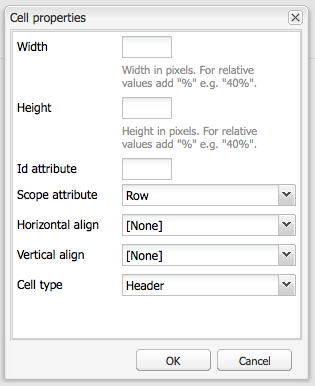

# Crear contenido accesible (Conformidad con WCAG 2.0){#creating-accessible-content-wcag-conformance}

>[!CAUTION]
>
>Como la IU clásica quedó obsoleta en AEM 6.4, el contenido de esta página no se ha actualizado para WCAG 2.1.
>
>Consulte las siguientes páginas para obtener detalles relacionados con AEM y WCAG 2.1:
>
>* [AEM y las directrices de accesibilidad web](/help/managing/web-accessibility.md)
>* [Guía rápida de WCAG 2.1](/help/managing/qg-wcag.md)
>* [Crear contenido accesible (Conformidad con WCAG 2.1)](/help/sites-authoring/creating-accessible-content.md)


WCAG 2.0 consiste en un conjunto de directrices tecnológicas independientes y criterios de éxito para ayudar a crear contenido web accesible para, y utilizable por, personas con discapacidades.

>[!NOTE]
>
>Consulte también:
>
>* [Guía rápida de WCAG 2.0](/help/managing/qg-wcag.md)
>* [Configurar el Editor de texto enriquecido para producir contenido accesible](/help/sites-administering/rte-accessible-content.md)
>


Estas directrices se clasifican según tres niveles de conformidad: Nivel A (el más bajo), Nivel AA y Nivel AAA (el más alto). Brevemente, los niveles se definen de la siguiente manera:

* **Nivel A:** El sitio alcanza un nivel básico y mínimo de accesibilidad. Para alcanzar este nivel, se cumplen todos los criterios de éxito del nivel A.
* **Nivel AA:** El nivel ideal de accesibilidad al que se debe aspirar, en el que el sitio alcanza un nivel mejorado de accesibilidad, de modo que sea accesible para la mayoría de las personas en la mayoría de las situaciones que utilizan la mayoría de las tecnologías. Para alcanzar este nivel, se cumplen todos los criterios de éxito de los niveles A y AA.
* **Nivel AAA:** Su sitio alcanza un nivel muy alto de accesibilidad. Para alcanzar este nivel, se cumplen todos los criterios de éxito de los niveles A, AA y AAA.

Al crear su sitio, debe determinar el nivel general en el que desea que se ajuste.

La siguiente sección presenta las [directrices WCAG 2.0](https://www.w3.org/TR/WCAG20/#guidelines) con criterios de éxito vinculados a los [niveles de conformidad](https://www.w3.org/TR/UNDERSTANDING-WCAG20/conformance.html) de los niveles A y AA.

>[!NOTE]
>
>Como no es posible satisfacer todos los criterios de éxito de nivel AAA para ciertos tipos de contenido, no se recomienda que este nivel de conformidad sea necesario como política general.

>[!NOTE]
>
>Este documento utiliza lo siguiente:
>
>* Nombres abreviados para las [directrices WCAG 2.0](https://www.w3.org/TR/WCAG20/#guidelines)
>* Numeración utilizada en las [directrices WCAG 2.0](https://www.w3.org/TR/WCAG20/#guidelines) para apoyar las referencias cruzadas en la página web de WCAG
>


## Principio 1: perceptible  {#principle-perceivable}

[Principio 1: perceptible. Los componentes de la interfaz de usuario y de la información se deben presentar a los usuarios de forma perceptible.](https://www.w3.org/TR/WCAG20/#perceivable)

### Alternativas de texto (1.1)     {#text-alternatives}

[Directrices 1.1 Alternativas de texto: Proporcione alternativas de texto para cualquier contenido no textual y así poder cambiarlo por otras formas que la gente puede necesitar, como letras grandes, braille, voz, símbolos o lenguaje más sencillo.](https://www.w3.org/TR/WCAG20/#text-equiv)

### Contenido no textual (1.1.1) {#non-text-content}

* Criterios de éxito 1.1.1
* Nivel A
* Contenido no textual: todo contenido no textual que se presenta al usuario tiene una alternativa de texto que cumple el objetivo equivalente, excepto para las situaciones que se detallan a continuación

#### Objetivo: Contenido no textual (1.1.1) {#purpose-non-text-content}

La información de una página web se puede proporcionar en muchos formatos no textuales diferentes, como imágenes, vídeos, animaciones, gráficos y gráficos. Las personas ciegas o con deficiencias visuales graves no pueden ver el contenido no textual, pero pueden acceder al contenido textual si lo lee en voz alta un lector de pantalla o si se presenta en forma táctil mediante un dispositivo de visualización Braille. Por lo tanto, al proporcionar alternativas textuales al contenido en formato gráfico, las personas que no puedan ver ese contenido gráfico pueden acceder a una versión equivalente de la información que proporciona el contenido.

Una ventaja adicional útil es que las alternativas textuales permiten indexar el contenido no textual mediante la tecnología de motores de búsqueda.

#### Cómo cumplir: Contenido no textual (1.1.1) {#how-to-meet-non-text-content}

Para gráficos estáticos, el requisito principal es proporcionar una alternativa textual equivalente para el gráfico. Este método se realiza en la variable **Texto alternativo** campo:

>[!NOTE]
>
>Algunos componentes listos para usar, como **Carrusel** y **Presentación de diapositivas,** no proporcionan los medios para añadir descripciones de texto alternativas a las imágenes. Al implementar versiones de estos componentes para la instancia de AEM, el equipo de desarrollo debe configurar dichos componentes para que admitan la variable `alt` atributo. De este modo, se garantiza que los autores puedan agregarlo al contenido (consulte [Agregar compatibilidad con elementos y atributos de HTML adicionales](/help/sites-administering/rte-accessible-content.md#add-support-for-more-html-elements-and-attributes)).

La variable **Texto alternativo** está disponible en la **Avanzadas** ficha propiedades de imagen de **Imagen** cuadro de diálogo de componentes:


AEM agrega un **Texto alternativo** a sus imágenes de forma predeterminada. Para la IU clásica, existen dos escenarios diferentes para crear el atributo predeterminado, aunque puede que el valor predeterminado no sea suficiente como alternativa y que se deba editar en la variable **Avanzadas** ficha propiedades de imagen:

* Archivo:

Se carga una imagen desde el disco duro del usuario. Si agrega un componente de imagen a una página y luego elige una imagen de su disco duro u otra fuente, el valor predeterminado para **Texto alternativo** es `file`. Este valor debe cambiarse en la variable **Avanzadas** ficha propiedades de imagen. De nuevo, este valor no se muestra en la variable **Texto alternativo** , pero cuando se cambia el valor, el nuevo valor se muestra en el campo .

* Recurso:

Se añade una imagen del repositorio de recursos digital. Si arrastra una imagen del repositorio de recursos digital a una página web, la variable **Título** y **Texto alternativo** los valores de esa imagen se toman de los metadatos de esa imagen.

>[!NOTE]
>
>En ambos casos, el valor predeterminado **Texto alternativo** no es visible en la variable **Propiedades de imagen avanzadas** pestaña . Para cambiar el valor predeterminado, simplemente introduzca un nuevo valor en la variable **Texto alternativo** campo .

>[!NOTE]
>
>Si la imagen es puramente decorativa (consulte [Crear buenas alternativas de texto](#creating-good-text-alternatives)), puede introducir un espacio en la **Texto alternativo** utilizando la barra espaciadora. Al hacerlo, se crea un vacío `alt` , que solicita a un lector de pantalla que ignore la imagen.

#### Crear buenas alternativas de texto {#creating-good-text-alternatives}

Existen varias formas de contenido no textual, por lo que el valor de la alternativa textual depende del papel que juegue el gráfico en la página web. Algunas reglas generales incluyen lo siguiente:

* Las alternativas textuales deben ser sucintas, pero deben recoger claramente la información esencial que proporciona el contenido no textual.
* Deben evitarse las descripciones demasiado largas (que superen los 100 caracteres). Si una alternativa textual requiere más detalle:

   * proporcione una breve descripción en el texto alternativo
   * y tengan una descripción más larga en el texto en cualquier otra parte de la misma página o en una página web independiente. Para vincular a esta descripción independiente, haga que la imagen sea un vínculo o coloque un vínculo de texto junto a la imagen.

* El texto alternativo no debe replicar el contenido proporcionado en el texto de la misma página. Recuerde que muchas imágenes son ilustraciones de puntos que ya están cubiertos en el texto de una página, por lo que puede que ya exista una alternativa textual detallada.
* Si el contenido no textual es un vínculo a otra página o documento y no hay otro texto que forme parte del mismo vínculo, entonces el texto alternativo para la imagen debe indicar el destino del vínculo. No debe describir la imagen.
* Si el contenido no textual está contenido en un elemento de botón y no hay texto que forme parte del mismo botón, entonces el texto alternativo de la imagen debe indicar la funcionalidad del botón, no describir la imagen.
* Es aceptable que una imagen reciba texto alternativo vacío (nulo), pero solo si la imagen no tiene texto alternativo. Por ejemplo, es un gráfico puramente decorativo. O bien, si el texto equivalente ya existe en el texto de la página.

La variable [Borrador W3C: Técnicas del HTML 5 para proporcionar alternativas textuales útiles](https://html.spec.whatwg.org/multipage/images.html#alt) tiene más detalles y ejemplos de disposición de texto alternativo apropiado para imágenes de diferentes tipos.

Los tipos específicos de contenido no textual que requieren alternativas textuales pueden incluir:

* Fotos ilustrativas:

Imágenes de personas, objetos o lugares. Piense en el papel de la foto en la página; es probable que un texto equivalente apropiado sea *Foto de [object]*, pero puede depender del texto que lo rodea.

* Iconos:

Pequeños pictogramas (gráficos) que transmiten información específica. Se deben utilizar de manera consistente en una página y un sitio. Todas las instancias del icono en una página o sitio deben tener el mismo texto alternativo, corto y preciso, a menos que se duplique innecesariamente el texto adyacente.

* Gráficos y gráficos:

Normalmente representan datos numéricos. Por lo tanto, una opción para proporcionar una alternativa textual podría ser incluir un breve resumen de las tendencias principales que se muestran en el gráfico o gráfico. Si es necesario, proporcione también una descripción más detallada en el texto utilizando la variable **Descripción** en el campo **Avanzadas** ficha propiedades de imagen. Además, puede proporcionar los datos de origen en forma de tabla en cualquier otra parte de la página o sitio.


Para proporcionar una alternativa para este gráfico de ejemplo, agregue una `alt` texto a la imagen misma y después seguir la imagen con una alternativa textual completa.

```xml
<p></p>
<p> Figure 1. Distribution of Articles by Journal Category.
Pie chart: Language=68%, Education=14% and Science=18%.</p>
```

>[!NOTE]
>
>El fragmento anterior solo se utiliza para ilustrar el orden. Utilice la variable **Imagen** en lugar de `img src` referencia utilizada anteriormente.

En AEM, puede utilizar una combinación de **Texto alternativo** y **Descripción** campos en el cuadro de diálogo de configuración de la imagen, como en [Contenido no textual (1.1.1)](#how-to-meet-non-text-content).

* Mapas, diagramas, diagramas de flujo:

Para gráficos que proporcionan datos espaciales (por ejemplo, para admitir la descripción de relaciones entre objetos o un proceso), compruebe que el mensaje clave se proporciona en formato de texto.  En el caso de los mapas, es probable que no sea práctico suministrar un equivalente textual completo. No obstante, si el mapa se proporciona como una forma de ayudar a las personas a encontrar su camino a una ubicación determinada, el texto alternativo de la imagen del mapa puede indicar brevemente *Mapa de X* y, a continuación, ofrecer indicaciones para llegar a esa ubicación en texto en cualquier parte de la página o a través del campo **Descripción** en la pestaña **Avanzado** del componente **Imagen**.

* CAPTCHA:

Un CAPTCHA es un *Prueba de Turing pública completamente automatizada para distinguir entre ordenadores y humanos*. Se trata de una comprobación de seguridad que se utiliza en las páginas web para distinguir a los seres humanos de software malintencionado, pero que puede causar barreras de accesibilidad. Son imágenes que requieren que los usuarios describan lo que ven para pasar una prueba de seguridad. No es posible proporcionar una alternativa textual para la imagen, por lo que en su lugar debe considerar soluciones no gráficas alternativas.

W3C proporciona varias sugerencias, como las siguientes. Cada uno de estos enfoques tiene sus propias ventajas e inconvenientes.

    * Rompecabezas lógicos
    * El uso de salida de sonido en lugar de imágenes
    * Cuentas de uso limitado y filtros de spam.

* Imágenes de fondo:

Estas imágenes se consiguen utilizando hojas de estilo en cascada (CSS) en lugar de con el HTML. No es posible especificar un valor de texto alternativo. Por lo tanto, las imágenes de fondo no deben proporcionar información textual importante: si lo hacen, esta información también debe proporcionarse en el texto de la página.

Sin embargo, es importante que se muestre un fondo alternativo cuando la imagen no se pueda mostrar.

>[!NOTE]
>
>Debería haber un nivel adecuado de contraste entre el fondo y el texto en primer plano. Este contraste se analiza más detalladamente en [Contraste (mínimo) (1.4.3)](#contrast-minimum).

#### Más información: Contenido no textual (1.1.1) {#more-information-non-text-content}

* [Entender los criterios de éxito 1.1.1](https://www.w3.org/TR/UNDERSTANDING-WCAG20/text-equiv-all.html)
* [Cumplir los criterios de éxito 1.1.1](https://www.w3.org/WAI/WCAG21/quickref/?versions=2.0#text-alternatives)
* [W3C: Técnicas del HTML 5 para proporcionar alternativas textuales útiles](https://html.spec.whatwg.org/multipage/images.html#alt)
* [Explicación de W3C y alternativas para CAPTCHA](https://www.w3.org/TR/turingtest/)

### Medios basados en el tiempo (1.2)     {#time-based-media}

[Directrices 1.2 Medios basados en el tiempo: Proporcionar alternativas para medios basados en el tiempo.](https://www.w3.org/TR/WCAG20/#text-equiv)

Esta información trata el contenido web que es *basado en el tiempo*. Abarca el contenido que puede reproducir el usuario (como vídeos, audios y contenido animado) y se puede pregrabar o reproducir en vivo.

### Solo audio y solo vídeo (pregrabado) (1.2.1)  {#audio-only-and-video-only-pre-recorded}

* Criterios de éxito 1.2.1
* Nivel A
* Solo audio y solo vídeo (pregrabado): En el caso de los medios solo de audio y solo de vídeo pregrabados, los siguientes son verdaderos, excepto cuando el audio o vídeo es una alternativa para el texto y está claramente etiquetado como tal:

   * Solo audio pregrabado: Se proporciona una alternativa para medios basados en el tiempo que presenta información equivalente para contenido de solo audio pregrabado.
   * Solo vídeo pregrabado: Se proporciona una alternativa para medios basados en el tiempo o una pista de audio que presenta información equivalente para contenido de solo vídeo pregrabado.

#### Objetivo: solo audio y Solo vídeo (pregrabado) (1.2.1)  {#purpose-audio-only-and-video-only-pre-recorded}

Los problemas de accesibilidad para vídeo y audio pueden experimentarse por:

* Personas con deficiencias visuales cuando no hay banda sonora o la banda sonora no es suficiente para informarles de lo que está sucediendo en el vídeo o la animación;
* Personas con deficiencias auditivas o sordos que no puedan oír la banda sonora;
* Personas que pueden oír la banda sonora, pero no entienden lo que se está diciendo (por ejemplo, porque está en un idioma que no entienden).

Es posible que el vídeo o el audio no estén disponibles para las personas que utilizan navegadores o dispositivos que no admiten la reproducción de contenido en formatos específicos, como el Flash de Adobe.

Proporcionar esta información en un formato diferente, como texto (o audio para vídeo sin audio) puede hacer que sea accesible para las personas que no puedan acceder al contenido original.

#### Cómo cumplir: Solo audio y solo vídeo (pregrabado) (1.2.1)  {#how-to-meet-audio-only-and-video-only-pre-recorded}

* Si el contenido es audio pregrabado sin vídeo (como podcast):

   * Proporcione un vínculo inmediatamente antes o después del contenido para una transcripción textual del contenido del audio.

   La transcripción debe ser una página HTML con un texto equivalente a todo el contenido hablado o no hablado importante. También debe indicar quién está hablando, una descripción del escenario, expresiones vocales y una descripción de cualquier otro audio significativo.

* Si el contenido es una animación o un vídeo pregrabado sin audio:

   * Proporcione un vínculo inmediatamente antes o después del contenido para una descripción textual equivalente de la información proporcionada por el vídeo
   * O una descripción de audio equivalente en un formato de audio de uso habitual, como MP3.

>[!NOTE]
>
>Si el contenido de audio o vídeo se proporciona como una alternativa al contenido que existe en otro formato en una página web, no es necesario seguir los requisitos anteriores. Por ejemplo, si un vídeo ilustra una lista de instrucciones textuales, este vídeo no requiere ninguna alternativa, ya que las instrucciones de texto ya funcionan como una alternativa al vídeo.

Insertar contenido multimedia, específicamente contenido de Flash, en las páginas web AEM es similar a insertar una imagen. Sin embargo, como el contenido multimedia es mucho más que una imagen fija, hay varios ajustes y opciones diferentes para controlar cómo se reproduce el contenido multimedia.

>[!NOTE]
>
>Al utilizar contenido multimedia con contenido informativo, también se deben crear vínculos a opciones alternativas. Por ejemplo, para incluir una transcripción textual, cree una página HTML para reproducir la transcripción y añada un vínculo debajo o junto al contenido del audio.

#### Más información: Solo audio y solo vídeo (pregrabado) (1.2.1) {#more-information-audio-only-and-video-only-pre-recorded}

* [Entender los criterios de éxito 1.2.1](https://www.w3.org/TR/UNDERSTANDING-WCAG20/media-equiv-av-only-alt.html)
* [Cumplir los criterios de éxito 1.2.1](https://www.w3.org/WAI/WCAG21/quickref/?versions=2.0#time-based-media)

### Subtítulos (pregrabados) (1.2.2)  {#captions-pre-recorded}

* Criterios de éxito 1.2.2
* Nivel A
* Subtítulos (pregrabados): se proporcionan los subtítulos para todo el contenido de audio pregrabado en medios sincronizados, excepto cuando los medios son una alternativa para el texto y se etiquetan claramente como tal.

#### Objetivo: subtítulos (pregrabados) (1.2.2)  {#purpose-captions-pre-recorded}

Las personas sordas o con dificultades auditivas no pueden acceder o tienen buenas dificultades para acceder al contenido de audio. Los subtítulos son equivalentes textuales para audio verbal y no verbal que se muestran en la pantalla en el momento adecuado durante el vídeo. Permiten entender lo que está sucediendo a las personas que no pueden oír el audio.

>[!NOTE]
>
>Los subtítulos no son necesarios cuando hay disponibles equivalentes textuales o no textuales (que proporcionan información directamente equivalente) en la misma página que el vídeo o la animación.

#### Cómo cumplir: Subtítulos (pregrabados) (1.2.2)  {#how-to-meet-captions-pre-recorded}

Los subtítulos pueden ser:

* Abiertos: siempre visibles cuando se reproduce el vídeo
* Cerrados: el usuario puede activar o desactivar los subtítulos

Utilice subtítulos cerrados siempre que sea posible. Proporciona a los usuarios la opción de ver los subtítulos.

Para los subtítulos cerrados, cree y proporcione un archivo de subtítulos sincronizados en un formato adecuado, como [SMIL](https://www.w3.org/AudioVideo/), junto con el archivo de vídeo.

Consulte los tutoriales de [Más información: Subtítulos (pregrabados) (1.2.2)](#more-information-captions-pre-recorded). Asegúrese de proporcionar una nota para informar a los usuarios de que los subtítulos están disponibles para el vídeo.

Si debe utilizar subtítulos abiertos, incruste el texto en la pista de vídeo. Este método se logra mediante aplicaciones de edición de vídeo que permiten superponer títulos en el vídeo.

#### Más información: Subtítulos (pregrabados) (1.2.2)  {#more-information-captions-pre-recorded}

* [Entender los criterios de éxito 1.2.2](https://www.w3.org/TR/UNDERSTANDING-WCAG20/media-equiv-captions.html):
* [Cumplir los criterios de éxito 1.2.2](https://www.w3.org/WAI/WCAG21/quickref/?versions=2.0#time-based-media)
* [W3C: Medios multimedia sincronizados](https://www.w3.org/AudioVideo/)
* [Subtítulos, transcripciones y descripciones de audio: por WebAIM](https://webaim.org/techniques/captions/)

### Descripción del audio o medios alternativos (pregrabados) (1.2.3)  {#audio-description-or-media-alternative-pre-recorded}

* Criterios de éxito 1.2.3
* Nivel A
* Descripción del audio o medios alternativos (pregrabados): Para los medios sincronizados se proporciona una alternativa para los medios basados en el tiempo o una descripción de audio del contenido de vídeo pregrabado, excepto cuando los medios son una alternativa para el texto y se etiquetan claramente como tal.

#### Objetivo: Descripción del audio o medios alternativos (pregrabados) (1.2.3)  {#purpose-audio-description-or-media-alternative-pre-recorded}

Las personas ciegas o con dificultades de visión experimentan barreras de accesibilidad si la información de un vídeo o animación solo se proporciona de forma visual. O, si la banda sonora no proporciona suficiente información para permitir entender lo que está pasando visualmente.

#### Cómo cumplir: Descripción del audio o medios alternativos (pregrabados) (1.2.3)  {#how-to-meet-audio-description-or-media-alternative-pre-recorded}

Se pueden adoptar dos enfoques para cumplir este criterio de éxito. Cualquiera de los dos es aceptable:

1. Incluya una descripción de audio adicional para el contenido del vídeo. Puede lograr este enfoque de una de las tres maneras siguientes:

   * Durante las pausas en el cuadro de diálogo existente, proporcione información sobre los cambios en la escena que no se presentan como parte de la pista de audio existente;
   * Proporcione una pista de audio nueva, adicional y opcional que contenga la banda sonora original, pero también incluya información de audio adicional sobre los cambios en la escena.

      * Los usuarios pueden cambiar entre la pista de audio existente (que *no* contiene una descripción del audio) y la nueva pista de audio (que *does* contiene una descripción del audio).
      * Este método evita interrupciones a los usuarios que no necesitan la descripción adicional.
   * Cree una segunda versión del contenido del vídeo para permitir descripciones de audio extendidas. De este modo, se reducen las dificultades asociadas con la presentación de descripciones de audio detalladas dentro de las brechas entre el diálogo existente, al pausar temporalmente el audio y el vídeo en los puntos apropiados. Como resultado, se puede proporcionar una descripción del audio mucho más larga antes de que la acción se inicie de nuevo. Como en el ejemplo anterior, esta opción es más adecuada como pista de audio adicional opcional para evitar interrupciones a los usuarios que no necesitan la descripción adicional.


1. Proporcione una transcripción textual adecuada al equivalente textual del audio y los elementos visuales del vídeo o animación. Cuando proceda, deberá incluir una indicación de quién habla, una descripción del entorno, expresiones vocales. En función de su longitud, puede colocar la transcripción en la misma página que el vídeo o la animación, o en una página independiente; si elige esta última opción, proporcione un enlace a la transcripción junto al vídeo o animación.

Los detalles exactos de cómo crear vídeos descritos por audio están fuera del alcance de esta guía. Crear descripciones de vídeo y audio puede llevar mucho tiempo, pero otros productos de Adobe pueden ayudarle a realizar estas tareas. Al crear contenido con Adobe Flash Professional, también se debe crear un guión para recordar al usuario que puede descargar el programa adicional adecuado y proporcionar una alternativa textual a través del elemento `<noscript>`.

#### Más información: Descripción del audio o medios alternativos (pregrabados) (1.2.3) {#more-information-audio-description-or-media-alternative-pre-recorded}

* [Entender los criterios de éxito 1.2.3](https://www.w3.org/TR/UNDERSTANDING-WCAG20/media-equiv-audio-desc.html)
* [Cumplir los criterios de éxito 1.2.3](https://www.w3.org/WAI/WCAG21/quickref/?versions=2.0#qr-media-equiv-audio-desc)
* [Adobe Encore CS5](https://helpx.adobe.com/premiere-pro/using/whats-new.html)

### Subtítulos (en vivo) (1.2.4)    {#captions-live}

* Criterios de éxito 1.2.4
* Nivel AA
* Subtítulos (en vivo): se proporcionan subtítulos para todo el contenido de audio en vivo en medios sincronizados.

#### Objetivo: Subtítulos (en vivo) (1.2.4)     {#purpose-captions-live}

Este criterio de éxito es idéntico al de [Subtítulos (pregrabados)](#captions-pre-recorded) puesto que se enfrenta a las barreras de accesibilidad que experimentan las personas sordas o que sufren deficiencias auditivas, excepto por el hecho de que este criterio de éxito trata las presentaciones en vivo tales como retransmisiones vía Internet.

#### Cómo cumplir: Subtítulos (en vivo) (1.2.4) {#how-to-meet-captions-live}

Siga las directrices proporcionadas para [Subtítulos (pregrabados)](#captions-pre-recorded) arriba. Sin embargo, debido a la naturaleza del medio, la provisión de subtítulos debe crearse lo antes posible y como respuesta a lo que está sucediendo. Por lo tanto, debe considerar la posibilidad de utilizar subtítulos en tiempo real o herramientas de función de voz a texto.

Las instrucciones detalladas van más allá del alcance de este documento, pero los siguientes recursos proporcionan información útil:

* [WebAIM: Subtítulos a tiempo real](https://webaim.org/techniques/captions/realtime)
* [AccessIT (Universidad de Washington): ¿Se pueden generar subtítulos de manera automática utilizando el reconocimiento de voz?](https://www.washington.edu/doit/programs/accessit?1209)

#### Más información: Subtítulos (en vivo) (1.2.4)     {#more-information-captions-live}

* [Entender los criterios de éxito 1.2.4](https://www.w3.org/TR/UNDERSTANDING-WCAG20/media-equiv-real-time-captions.html)
* [Cumplir los criterios de éxito 1.2.4](https://www.w3.org/WAI/WCAG21/quickref/?versions=2.0#qr-media-equiv-real-time-captions)

### Descripción del audio (pregrabado) (1.2.5)          {#audio-description-pre-recorded}

* Criterios de éxito 1.2.5
* Nivel AA
* Descripción del audio (pregrabado): Se proporciona una descripción del audio para todo el contenido de vídeo pregrabado en medios sincronizados.

#### Objetivo: Descripción del audio (pregrabado) (1.2.5)     {#purpose-audio-description-pre-recorded}

Este criterio de éxito es idéntico al de [Descripción del audio o medios alternativos (pregrabados)](#audio-description-or-media-alternative-pre-recorded), excepto por el hecho de que los autores deben proporcionar una descripción del audio mucho más detallada para ajustarse al Nivel AA.

#### Cómo cumplir: Descripción del audio (pregrabado) (1.2.5)  {#how-to-meet-audio-description-pre-recorded}

Siga las directrices que se proporcionan para la [Descripción del audio o medios alternativos (pregrabados)](#audio-description-or-media-alternative-pre-recorded).

#### Más información: Descripción del audio (pregrabado) (1.2.5)     {#more-information-audio-description-pre-recorded}

* [Entender los criterios de éxito 1.2.5](https://www.w3.org/TR/UNDERSTANDING-WCAG20/media-equiv-audio-desc-only.html)
* [Cumplir los criterios de éxito 1.2.5](https://www.w3.org/WAI/WCAG21/quickref/?versions=2.0#qr-media-equiv-audio-desc-only)

### Adaptable (1.3)     {#adaptable}

[Directrices 1.3 Adaptable: Cree contenido que se pueda presentar de diferentes maneras (por ejemplo, de forma más sencilla) sin perder información o estructura.](https://www.w3.org/TR/WCAG20/#content-structure-separation)

Esta directriz cubre los requisitos necesarios para apoyar a las personas que:

* no podrán acceder a la información tal como la presenta un autor en un *standard* diseño de página web bidimensional, de varias columnas y de color

* utilizan una representación de solo audio o una alternativa visual, como un texto largo o un gran contraste.

### Información y relaciones (1.3.1)    {#info-and-relationships}

* Criterios de éxito 1.3.1
* Nivel A
* Información y relaciones: La información, la estructura y las relaciones que se transmiten a través de la presentación se pueden determinar mediante programación o están disponibles en el texto.

#### Objetivo: Información y relaciones (1.3.1)     {#purpose-info-and-relationships}

Muchas tecnologías de asistencia que utilizan las personas con discapacidades dependen de la información estructural para mostrar o generar contenido de manera eficaz. Esta información estructural puede adoptar la forma de encabezados de página, encabezados de fila y columna de tabla y tipos de lista. Por ejemplo, un lector de pantalla podría permitir que un usuario navegue por una página de un encabezado a otro. Sin embargo, cuando el contenido de la página solo parece tener estructura a través del estilo visual, en lugar del HTML subyacente, no hay información estructural disponible para las tecnologías de asistencia, lo que limita su capacidad de admitir una exploración más sencilla.

Este criterio de éxito existe para garantizar que dicha información estructural se proporcione a través del HTML, de modo que los navegadores y las tecnologías de asistencia puedan acceder a la información y aprovecharla.

#### Cómo cumplir: Información y relaciones (1.3.1)  {#how-to-meet-info-and-relationships}

AEM facilita construir páginas web utilizando los elementos HTML adecuados. Abra el contenido de su página en RTE (un componente de texto) y utilice el **Formato** para especificar el elemento estructural adecuado (por ejemplo, párrafos y encabezados).

La imagen siguiente muestra texto que se ha diseñado como texto de párrafo; la vista de código fuente que se está utilizando muestra que tiene la apertura y el cierre correctos &lt;p> y &lt;/p> etiquetas.


Asegúrese de que las páginas web tengan la estructura adecuada mediante:

* **Uso de encabezados:**  

Siempre que tenga las características de accesibilidad de RTE activadas (consulte [AEM y accesibilidad](/help/sites-administering/rte-accessible-content.md)), AEM ofrece tres niveles de encabezado de página. Puede utilizarlas para identificar secciones y subsecciones de contenido. El encabezado 1 es el nivel más alto, mientras que el encabezado 3 es el más bajo. El administrador del sistema puede configurar el sistema para permitir el uso de más niveles de encabezado.

La siguiente imagen muestra un ejemplo de los distintos tipos de encabezados.


* **Texto enfatizado**:

Utilice el  elemento o para dar énfasis. No utilice encabezados o texto enfatizado en los párrafos.

    * Resalte el texto que desee resaltar;
    * Haga clic en el icono **B** (para &amp;lt;strong&amp;gt;) o en el icono **I** (para &amp;lt;em&amp;gt;) que se muestra en el panel **Propiedades** (asegúrese de que el HTML está seleccionado).

>[!NOTE]
>
>RTE en una instalación AEM estándar está configurada para utilizar:
>
>* &lt;b> para &lt;strong>
* &lt;i> para &lt;em>
  >
Aunque son igual de eficaces, y son preferibles porque son HTML semánticamente correctos. Su equipo de desarrollo puede configurar el RTE para que utilice y  (en lugar de  y ) al desarrollar la instancia del proyecto.

* **Utilizar listas**:
Es posible utilizar HTML para especificar tres tipos de listas distintas.

   * La variable `<ul>` element se utiliza para *unordered* listas (con viñetas). Los elementos de listas individuales se identifican utilizando el elemento `<li>`. 

   en RTE, utilice la variable **Lista con viñetas** icono.

   * El elemento `<ol>` se utiliza para listas *numeradas*. Los elementos de listas individuales se identifican utilizando el elemento `<li>`. 

   En RTE, utilice el icono **Lista numerada**.

Si desea cambiar contenido existente a un tipo de lista específico, resalte el texto adecuado y seleccione el tipo de lista adecuado. Como en el ejemplo anterior, en el que se mostraba cómo se introducía texto en párrafos, los elementos de la lista adecuada se añaden automáticamente al HTML, pero puede verlo en la vista de edición de la fuente.

>[!NOTE]
La variable `<dl>` no es compatible con RTE.

* **Usar tablas**:

Las tablas de datos deben identificarse utilizando elementos de tablas del HTML:

    * un `&lt;table>` element
    * a&lt;tr>elemento ` para cada fila de la tabla
    * a&lt;th>elemento ` para cada titular de fila y columna
    * a&lt;td>elemento ` para cada celda de datos

>[!NOTE]
Las tablas deben realizarse con la variable **Tabla** componente. Aunque las tablas se pueden crear en el componente Texto , no se recomienda.

Además, las tablas accesibles utilizan los siguientes elementos y atributos:

    * El&lt;caption>El elemento ` se utiliza para proporcionar un subtítulo visible para la tabla. Los subtítulos de forma predeterminada aparecen centrados encima de la tabla, pero se pueden posicionar de forma adecuada mediante CSS. El rótulo está asociado programáticamente con la tabla, por lo que es un método útil para proporcionar una introducción al contenido.
    * El&lt;h3 class=&quot;summary&quot;>` element ayuda a los usuarios sin visión para que entiendan con mayor facilidad la información presentada dentro de una tabla, proporcionando una sinopsis de lo que el usuario puede ver. Resulta particularmente útil cuando se utilizan diseños de la tabla complejos o poco convencionales (este atributo no se muestra en el buscador, solo se lee en voz alta para tecnologías de asistencia).
    * El atributo &quot;scope&quot; de la &quot;&lt;th>` se utiliza para indicar si una celda representa el encabezado de una fila en concreto o de una columna en concreto. Un enfoque similar es el de utilizar el encabezado y los atributos de identificación en tablas complejas, donde las celdas de datos se pueden asociar con uno o más encabezados.

>[!NOTE]
Por defecto, estos elementos y atributos no se encuentran disponibles directamente, aunque es posible que el administrador del sistema añada cierta ayuda para estos valores en el cuadro de diálogo **Propiedades de la tabla** (consulte [Agregar ayuda para elementos y atributos HTML adicionales](/help/sites-administering/rte-accessible-content.md#add-support-for-more-html-elements-and-attributes)).

Al añadir un **Tabla**, puede configurar **Propiedades de tabla** mediante el cuadro de diálogo .

    * un **Rótulo** apropiado.
    * Idealmente, elimine los valores predeterminados de **Anchura**, **Altura**, **Borde**, **Margen de celdas**, **Espaciado de celdas**. ya que estas propiedades se pueden definir en una hoja de estilo global.


A continuación, puede usar la variable **Propiedades de celda** para elegir si la celda es un dato o una celda de encabezado y, si es una celda de encabezado, si se refiere a una fila, columna o ambas:



* **Tablas de datos complejas:**

A veces, cuando hay tablas complejas con dos o más niveles de encabezados, las Propiedades de la tabla básicas pueden no ser suficientes para proporcionar toda la información estructural necesaria. Para este tipo de tablas complejas se deben crear relaciones directas entre los encabezados y sus celdas utilizando la variable **header** y **id** atributos. Por ejemplo, en la tabla siguiente, los encabezados y las identificaciones se comparan para crear una asociación programática para los usuarios de tecnología de asistencia.

>[!NOTE]
El atributo id no está disponible en una instalación predeterminada. Se puede habilitar configurando las reglas del HTML y el serializador en RTE.

>[!NOTE]
Las tablas deben realizarse con la variable **Tabla** componente. Aunque las tablas se pueden crear en el componente Texto , no se recomienda.

```xml
<table>
   <tr>
     <th rowspan="2" id="h">Homework</th>
     <th colspan="3" id="e">Exams</th>
     <th colspan="3" id="p">Projects</th>
   </tr>
   <tr>
     <th id="e1" headers="e">1</th>
     <th id="e2" headers="e">2</th>
     <th id="ef" headers="e">Final</th>
     <th id="p1" headers="p">1</th>
     <th id="p2" headers="p">2</th>
     <th id="pf" headers="p">Final</th>
   </tr>
   <tr>
    <td headers="h">15%</td>
    <td headers="e e1">15%</td>
    <td headers="e e2">15%</td>
    <td headers="e ef">20%</td>
    <td headers="p p1">10%</td>
    <td headers="p p2">10%</td>
    <td headers="p pf">15%</td>
   </tr>
  </table>
```

Para conseguirlo en AEM, debe añadir el marcado directamente mediante el modo de edición de la fuente.

>[!NOTE]
Esta funcionalidad no está disponible inmediatamente en una instalación estándar. Requiere la configuración del RTE; reglas de HTML y serializador.

#### Más información: Información y relaciones (1.3.1) {#more-information-info-and-relationships}

* [Entender los criterios de éxito 1.3.1](https://www.w3.org/TR/UNDERSTANDING-WCAG20/content-structure-separation-programmatic.html)
* [Cumplir los criterios de éxito 1.3.1](https://www.w3.org/WAI/WCAG21/quickref/?versions=2.0#qr-content-structure-separation-programmatic)

### Características sensoriales (1.3.3)          {#sensory-characteristics}

* Criterios de éxito 1.3.3
* Nivel A
* Características sensoriales: las instrucciones que se proporcionan para entender el contenido y operar con él no se basan solo en características sensoriales de componentes como la forma, el tamaño, la ubicación visual, la orientación o el sonido

#### Objetivo: Características sensoriales (1.3.3)     {#purpose-sensory-characteristics}

Los diseñadores normalmente se centran en características de diseño visuales tales como el color, la forma, el estilo del texto o una parte de la ubicación absoluta o relativa del contenido a la hora de presentar la información. Estas pueden ser poderosas técnicas de diseño para transmitir información, pero las personas ciegas o con deficiencias visuales pueden no poder acceder a la información que requiere la identificación visual de atributos como posición, color o forma.

Del mismo modo, la información que requiere distinguir entre sonidos diferentes (por ejemplo, contenido cuya voz es masculina o femenina) presenta barreras de accesibilidad para las personas con deficiencias auditivas, si no se refleja en ninguna alternativa textual para el contenido del audio.

>[!NOTE]
Para los requisitos relativos a las alternativas de color, consulte [Uso del color](#use-of-color).

#### Cómo cumplir: Características sensoriales (1.3.3)     {#how-to-meet-sensory-characteristics}

Asegúrese de que cualquier información que dependa de características visuales del contenido de la página también se presente en un formato alternativo.

* No dependa de la posición visual para dar información. Por ejemplo, si desea dirigir a los usuarios a un menú en el lado derecho de la página para que accedan a más información, no consulte *el menú de la derecha*; en su lugar, asigne un nombre al menú (por ejemplo, a través de un encabezado) y consulte ese nombre en el texto.
* También es importante no basarse en el estilo del texto (por ejemplo, si se trata de texto en negrita o en cursiva) como la única manera de transmitir la información.

>[!NOTE]
El uso de términos descriptivos es aceptable si se entiende que tienen significado en un contexto no visual. Por ejemplo, al usar *above* y *below* generalmente sería aceptable, ya que respectivamente implican contenido antes y después de un elemento particular del contenido. Seguiría teniendo sentido cuando el contenido se hable en voz alta.

#### Más información: Características sensoriales (1.3.3)     {#more-information-sensory-characteristics}

* [Entender los criterios de éxito 1.3.3](https://www.w3.org/TR/UNDERSTANDING-WCAG20/content-structure-separation-understanding.html)
* [Cumplir los criterios de éxito 1.3.3](https://www.w3.org/WAI/WCAG21/quickref/?versions=2.0#qr-content-structure-separation-understanding)

### Distinguible (1.4)     {#distinguishable}

[Directrices 1.4 Distinguible: Facilitar a los usuarios ver y oír el contenido incluyendo la posibilidad de separar el primer plano del fondo.](https://www.w3.org/TR/WCAG20/#visual-audio-contrast)

### Uso del color (1.4.1)          {#use-of-color}

* Criterios de éxito 1.4.1
* Nivel A
* Uso del color: El color no se utiliza como el único medio visual para transmitir información, indicar una acción, solicitar una respuesta o distinguir un elemento visual.

>[!NOTE]
Este criterio de éxito se dirige específicamente a la percepción del color. Otras formas de percepción se tratan en [Adaptable (1.3)](#adaptable); incluyendo acceso programático al color y otros códigos de presentación visual.

#### Objetivo: Uso del color (1.4.1)     {#purpose-use-of-color}

El color es una manera efectiva de mejorar el atractivo estético de las páginas web y también es útil para transmitir información. Sin embargo, existe una serie de impedimentos visuales, desde la ceguera hasta la deficiencia de la percepción del color, lo que significa que algunas personas no pueden distinguir entre ciertos colores. Este problema hace que la codificación de color sea una forma poco fiable de proporcionar información.

Por ejemplo, alguien con una deficiencia de la visión de color rojo-verde no puede distinguir entre los tonos de verde y los de rojo. Pueden ver ambos colores como un tercer color (por ejemplo, marrón), en cuyo caso no pueden distinguir entre rojo, verde y marrón.

Además, las personas que utilizan navegadores de solo texto, dispositivos de visualización monocromáticos o que ven una impresión en blanco y negro de la página no pueden percibir el color.

#### Cómo cumplir: Uso del color (1.4.1)     {#how-to-meet-use-of-color}

En todos los casos donde el color se utilice para transmitir información, es importante asegurarse de que la información se encuentra disponible sin necesidad de ver el color.

Por ejemplo, asegúrese de que la información que proporciona el color también esté explícita en el texto. La siguiente ilustración muestra cómo el color y el texto indican la disponibilidad de asientos para una actuación:

<table>
 <tbody>
  <tr>
   <td><p><strong>Rendimiento</strong></p> </td>
   <td><p><strong>Disponibilidad</strong></p> </td>
  </tr>
  <tr>
   <td><p>Martes, 16 de marzo<sup>th</sup></p> </td>
   <td><p>ASIENTOS DISPONIBLES</p> </td>
  </tr>
  <tr>
   <td><p>Miércoles, 17 de marzo<sup>th</p> </td>
   <td><p>ASIENTOS DISPONIBLES</p> </td>
  </tr>
  <tr>
   <td><p>Jueves, 18 de marzo<sup>th</sup></p> </td>
   <td><p>VENDIDO</p> </td>
  </tr>
 </tbody>
</table>

Si el color se utiliza como señal para proporcionar información, debe proporcionar una señal visual adicional, como cambiar el estilo (por ejemplo, negrita, cursiva) o la fuente. De esta manera, se ayuda a las personas con poca visión o que tienen una deficiencia de percepción de color a identificar la información. Sin embargo, no se puede confiar en ella por completo, ya que no ayuda a las personas que no pueden ver la página en absoluto.

#### Más información: Uso del color (1.4.1) {#more-information-use-of-color}

* [Entender los criterios de éxito 1.4.1](https://www.w3.org/TR/2008/NOTE-WCAG20-TECHS-20081211/working-examples/G183/link-contrast.html)
* [Cumplir los criterios de éxito 1.4.1](https://www.w3.org/TR/2008/NOTE-WCAG20-TECHS-20081211/working-examples/G183/link-contrast.html)
* [Directrices para cumplir la relación de contraste 3:1 que contiene una lista de colores &quot;seguros para la web&quot;](https://www.w3.org/TR/2008/NOTE-WCAG20-TECHS-20081211/working-examples/G183/link-contrast.html)

### Contraste (mínimo) (1.4.3)     {#contrast-minimum}

* Criterios de éxito 1.4.3
* Nivel AA
* Contraste (mínimo): La presentación visual del texto y de las imágenes de texto tiene una relación de contraste de al menos 4.5:1, excepto en los casos siguientes:

   * Texto grande: El texto a gran escala y las imágenes de texto a gran escala tienen una relación de contraste de al menos 3:1.
   * Secundario: el texto o las imágenes de texto que forman parte de un componente de interfaz de usuario inactivo, que son puramente decorativos, que no son visibles para nadie o que forman parte de una fotografía que contiene otro contenido visual significativo, no tienen requisitos de contraste.
   * Logotipos: El texto que forma parte de un logotipo o del nombre de una marca no cuenta con un requisito mínimo de contraste.

#### Objetivo: Contraste (mínimo) (1.4.3)  {#purpose-contrast-minimum}

Es posible que las personas con ciertas deficiencias visuales no puedan distinguir entre ciertas parejas de color de bajo contraste. Pueden producirse problemas de accesibilidad para estas personas si:

* El texto contrasta poco con el color del fondo.
* La codificación de color del texto (como el texto del vínculo y el texto que no sea del vínculo) es importante para distinguir la información.

>[!NOTE]
El texto que se utiliza exclusivamente con fines decorativos se excluye de este criterio de éxito.

#### Cómo cumplir: Cumplir los criterios de contraste (Mínimo) (1.4.3)     {#how-to-meet-contrast-minimum}

Asegúrese de que el texto contrasta lo suficiente con su fondo. Las relaciones de contraste dependen del tamaño y el estilo del texto en cuestión:

* Para los textos cuyo tamaño es menor de 18 puntos (o 14 puntos en negrita), la relación de contraste entre el texto o las imágenes del texto y el fondo debería ser de al menos 4.5:1.
* Para el texto cuyo tamaño sea de al menos 18 puntos (o 14 puntos en negrita), la relación de contraste debe ser de al menos 3:1.
* Ante un fondo estampado, el fondo alrededor de cualquier texto debería estar sombreado para que la relación 4.5:1 o 3:1 se mantenga.

Para comprobar las relaciones de contraste, utilice una herramienta de contraste de color, como la [Analizador de contraste de color del grupo Paciello](https://www.paciellogroup.com/resources/contrast-analyser.html) o [Comprobador de contraste de color de WebAIM](https://webaim.org/resources/contrastchecker/). Estas herramientas permiten comprobar pares de colores e informar sobre cualquier problema de contraste.

Alternativamente, si no le preocupa especificar el aspecto de la página, puede optar por no especificar los colores del fondo ni del texto en primer plano. No es necesario comprobar el contraste, ya que el navegador del usuario determina los colores del texto y del fondo.

Si no es posible alcanzar los niveles de contraste recomendados, proporcione un vínculo a una versión alternativa equivalente de la página (que no presenta problemas de contraste de color). O bien, permita que el usuario ajuste el contraste de la combinación de colores de la página según sus propios requisitos.

#### Más información: Contraste (mínimo) (1.4.3)     {#more-information-contrast-minimum}

* [Entender los criterios de éxito 1.4.3](https://www.w3.org/TR/UNDERSTANDING-WCAG20/visual-audio-contrast-contrast.html)
* [Cumplir los criterios de éxito 1.4.3](https://www.w3.org/WAI/WCAG21/quickref/?versions=2.0#qr-visual-audio-contrast-contrast)

### Imágenes de texto (1.4.5)     {#images-of-text}

* Criterios de éxito 1.4.5
* Nivel AA
* Imágenes de texto: si las tecnologías que se utilizan consiguen la presentación visual, el texto se utiliza para proporcionar información (y no las imágenes de texto), excepto en los casos siguientes:

   * Personalizable: La imagen de texto se puede personalizar visualmente según las necesidades del usuario;
   * Esencial: Para transmitir la información es esencial presentar un texto en particular.

>[!NOTE]
Los logotipos (texto que forma parte de un logotipo o de un nombre de marca) se consideran esenciales.

#### Objetivo: Imágenes de texto (1.4.5)          {#purpose-images-of-text}

Las imágenes de texto normalmente se utilizan cuando se prefiere un estilo de texto en particular; por ejemplo, un logotipo, o si un texto se ha generado desde otra fuente (por ejemplo, un documento físico escaneado). Sin embargo, en comparación con el texto presentado en HTML y diseñado con CSS, las imágenes de texto carecen de la flexibilidad para cambiar su tamaño o apariencia que podría ser necesaria para personas con discapacidades visuales o dificultades de lectura.

#### Cómo cumplir: Imágenes de texto (1.4.5)       {#how-to-meet-images-of-text}

Si es necesario utilizar imágenes de texto, utilice CSS para reemplazar las imágenes de texto con texto equivalente en HTML y así el texto estará disponible en un modo personalizable. Para ver un ejemplo, consulte [C30: Uso de CSS para reemplazar texto con imágenes de texto y proporcionar al usuario controles de interfaz que cambie](https://www.w3.org/TR/2008/NOTE-WCAG20-TECHS-20081211/C30).

#### Más información: Imágenes de texto (1.4.5)          {#more-information-images-of-text}

* [Entender los criterios de éxito 1.4.5](https://www.w3.org/TR/UNDERSTANDING-WCAG20/visual-audio-contrast-text-presentation.html)
* [Cumplir los criterios de éxito 1.4.5](https://www.w3.org/WAI/WCAG21/quickref/?versions=2.0#qr-visual-audio-contrast-text-presentation)

## Principio 2: operable          {#principle-operable}

[Principio 2: operable. Los componentes y la navegación de interfaz de usuario deben ser operables.](https://www.w3.org/TR/WCAG20/#operable)

### Pausar, parar, ocultar (2.2.2)          {#pause-stop-hide}

* Criterios de éxito 2.2.2
* Nivel A
* Pausar, parar, ocultar: Para mover, cerrar, desplazar o actualizar automáticamente la información, los siguientes criterios son verdaderos:  

   * Desplazamiento, parpadeo, desplazamiento: Para cualquier información en movimiento, parpadeo o desplazamiento que (a) empiece automáticamente, (b) dure más de cinco segundos y (c) se presente en paralelo con otro contenido, existe un mecanismo para que el usuario lo ponga en pausa, detenga u oculte a menos que el movimiento, parpadeo o desplazamiento forme parte de una actividad en la que sea esencial;
   * Actualización automática: Para cualquier información de actualización automática que (a) se inicie automáticamente y (b) se presente en paralelo con otro contenido, existe un mecanismo para que el usuario lo ponga en pausa, lo detenga u oculte o controle la frecuencia de la actualización a menos que la actualización automática forme parte de una actividad en la que sea esencial.

Los puntos a tener en cuenta son:

1. Para los requisitos relacionados con el contenido parpadeante o parpadeante, consulte [No diseñar contenido de una manera que cause parpadeos (2.3)](#seizures).
1. Dado que cualquier contenido que no cumpla este criterio de éxito puede interferir con la capacidad de un usuario para usar toda la página, todo el contenido de la página web (tanto si se utiliza para cumplir otros criterios de éxito como si no) debe cumplir este criterio de éxito. Consulte [Requisito de conformidad 5: No interferencia](https://www.w3.org/TR/WCAG20/#cc5).
1. El contenido que se actualiza periódicamente mediante software o que se transmite al agente de usuario no es necesario para preservar o presentar la información que se genera o recibe entre el inicio de la pausa y la reanudación de la presentación, ya que esto puede no ser técnicamente posible, y en muchas situaciones podría ser engañoso para hacerlo.
1. Una animación que se produce como parte de una fase de precarga o una situación similar puede considerarse esencial si la interacción no puede producirse durante esa fase para todos los usuarios y si no indica un progreso, puede confundir a los usuarios o hacer que piensen que el contenido se ha congelado o se ha roto.

#### Objetivo: Pausar, parar, ocultar (2.2.2)     {#purpose-pause-stop-hide}

Algunos usuarios pueden considerar que el contenido que se mueve distrae y dificulta la concentración en otras partes de la página. Además, dicho contenido puede resultar difícil de leer para las personas que tienen problemas para seguir el texto que se mueve.

#### Cómo cumplir: Pausar, parar, ocultar (2.2.2)     {#how-to-meet-pause-stop-hide}

Según la naturaleza del contenido, puede aplicar una o más de las siguientes sugerencias al crear páginas web que contengan contenido que se mueva, parpadee o parpadee:

* Proporcionar una forma de pausar el desplazamiento del contenido para que los usuarios tengan tiempo suficiente para leerlo. Por ejemplo, lectores de noticias o texto que se actualiza automáticamente.
* Asegúrese de que el contenido que parpadea deja de hacerlo tras cinco segundos.
* Utilizar tecnologías adecuadas para mostrar el contenido parpadeante que se puede mostrar en el navegador. Por ejemplo, archivos de Formato de intercambio de gráficos (GIF) o Gráficos de red portátiles animados (APNG).
* Proporcione un control de formulario en la página web para permitir al usuario desactivar todo el contenido parpadeante de la página.
* Si cualquiera de los anteriores no es posible, proporcione un vínculo a una página que contenga todo el contenido, pero sin parpadeos.

#### Más información: Pausar, parar, ocultar (2.2.2)  {#more-information-pause-stop-hide}

* [Entender los criterios de éxito 2.2.2](https://www.w3.org/TR/UNDERSTANDING-WCAG20/time-limits-pause.html)
* [Cumplir los criterios de éxito 2.2.2](https://www.w3.org/WAI/WCAG21/quickref/?versions=2.0#qr-time-limits-pause)

### Parpadeos (2.3)     {#seizures}

[Directrices 2.3 Parpadeos: No diseñar contenido de manera que cause parpadeos.](https://www.w3.org/TR/WCAG20/#seizure)

### Tres parpadeos o por debajo de los límites (2.3.1)     {#three-flashes-or-below-threshold}

* Criterios de éxito 2.3.1
* Nivel A
* Tres Flashes o por debajo de los límites: Las páginas web no contienen nada que parpadee más de tres veces en un período de un segundo, o el flash está por debajo de los umbrales generales de flash y flash rojo.

>[!NOTE]
Dado que cualquier contenido que no cumpla este criterio de éxito puede interferir con la capacidad de un usuario para usar toda la página, todo el contenido de la página web (tanto si se utiliza para cumplir otros criterios de éxito como si no) debe cumplir este criterio de éxito. Consulte [Requisito de conformidad 5: No interferencia](https://www.w3.org/TR/WCAG20/#cc5).

#### Objetivo: Tres parpadeos o Por debajo de los límites (2.3.1) {#purpose-three-flashes-or-below-threshold}

En algunos casos, el contenido que parpadea puede causar parpadeos fotosensibles. Este criterio de éxito permite a los usuarios acceder y experimentar todo el contenido sin tener que preocuparse por el contenido parpadeante.

#### Cómo cumplir: Tres parpadeos o por debajo del umbral (2.3.1)     {#how-to-meet-three-flashes-or-below-threshold}

Siga estos pasos para asegurarse de que se aplican las siguientes técnicas:

* Asegúrese de que los componentes no parpadean más de tres veces durante un período de un segundo;
* Si no se cumple la condición anterior, muestre el contenido parpadeante dentro de un *zona pequeña y segura* en píxeles en la pantalla. Esta zona se calcula mediante una fórmula compleja que se recoge en [G176: Hacer que la zona parpadeante sea lo suficientemente reducida](https://www.w3.org/TR/2008/NOTE-WCAG20-TECHS-20081211/G176), por lo que esta técnica solo debe seguirse si el contenido que parpadea es necesario.

#### Más información: Tres parpadeos o por debajo de los límites (2.3.1) {#more-information-three-flashes-or-below-threshold}

* [Entender los criterios de éxito 2.3.1](https://www.w3.org/TR/UNDERSTANDING-WCAG20/seizure-does-not-violate.html)
* [Cumplir los criterios de éxito 2.3.1](https://www.w3.org/WAI/WCAG21/quickref/?versions=2.0#seizure)

### Página titulada (2.4.2)          {#page-titled}

* Criterios de éxito 2.4.2
* Nivel A
* Página titulada: Las páginas web tienen títulos que describen el tema o el propósito.

#### Objetivo: Página titulada (2.4.2)     {#purpose-page-titled}

Este criterio de éxito ayuda a todos, independientemente de cualquier discapacidad en particular, a identificar rápidamente el contenido de una página web sin tener que leerla entera. Este diseño es útil cuando se abren varias páginas web en pestañas del explorador, ya que el título de la página se muestra en la pestaña y, por lo tanto, se puede localizar rápidamente.

#### Cómo cumplir: Página titulada (2.4.2)     {#how-to-meet-page-titled}

Al crear una página HTML nueva en AEM, se puede especificar el título de la página. Asegúrese de que el título describe adecuadamente el contenido de la página para que los visitantes puedan identificar rápidamente si el contenido es relevante para sus necesidades.

También puede editar el título de la página al editar una página, a la que se puede acceder mediante **Barra de tareas** - **Página** pestaña - **Propiedades de página...**

#### Más información: Página titulada (2.4.2) {#more-information-page-titled}

* [Entender los criterios de éxito 2.4.2](https://www.w3.org/TR/UNDERSTANDING-WCAG20/navigation-mechanisms-title.html)
* [Cumplir los criterios de éxito 2.4.2](https://www.w3.org/WAI/WCAG21/quickref/?versions=2.0#qr-navigation-mechanisms-title)

### Objetivo del vínculo (en contexto) (2.4.4)          {#link-purpose-in-context}

* Criterios de éxito 2.4.4
* Nivel A
* Objetivo del vínculo (en contexto): El propósito de cada vínculo se puede determinar a partir del texto del vínculo solo o del texto del vínculo junto con su contexto de vínculo determinado mediante programación. La excepción es cuando el propósito del vínculo es ambiguo para los usuarios en general.

#### Objetivo: Objetivo del vínculo (en contexto) (2.4.4)          {#purpose-link-purpose-in-context}

Para todos los usuarios, independientemente de su discapacidad, es vital indicar claramente la dirección de un vínculo a través del texto del vínculo adecuado. Este diseño ayuda a los usuarios a decidir si realmente desean seguir un vínculo. Para los usuarios con visión, un texto de vínculo significativo resulta útil cuando hay varios vínculos en una página (especialmente si la página tiene mucho texto), ya que un texto de vínculo significativo proporciona una indicación más clara de la funcionalidad de la página de destino. Mientras que los usuarios de tecnologías de asistencia, que pueden generar una lista de todos los vínculos en una sola página, pueden entender el texto del vínculo más fácilmente fuera de contexto.

#### Cómo cumplir: Objetivo del vínculo (en contexto) (2.4.4)    {#how-to-meet-link-purpose-in-context}

Sobre todo, es importante asegurarse de que el objetivo de un vínculo se describe con claridad en el texto del vínculo.

* Ejemplo incorrecto:

   * Texto: Para más información sobre las clases nocturnas de otoño de 2010, haga clic aquí.
   * Motivo: no indica el destino claramente y resulta ambiguo.

* Ejemplo correcto:

   * Texto: Clases nocturnas de otoño de 2010, más información.
   * Motivo: Al ajustar ligeramente el texto y la posición del elemento de vínculo, se puede mejorar el texto del vínculo:

Los vínculos se tienen que redactar con coherencia en todas las páginas, especialmente en las barras de navegación. Por ejemplo, si un vínculo a una página en concreto se nombra como **Publicaciones** en una página, utilice ese mismo texto en otras páginas para mantener la coherencia.

Sin embargo, al momento de escribir este artículo, hay algunos problemas con el uso de los títulos:

* El texto contenido en el atributo del título solo está disponible para los usuarios que utilizan el ratón como un consejo de herramienta emergente y no se puede acceder a él mediante el teclado.
* Los lectores de pantalla pueden leer los atributos de título, pero esta funcionalidad puede no estar habilitada de forma predeterminada; por lo tanto, es posible que los usuarios no sepan que existe un atributo de título.
* Es difícil cambiar la apariencia del texto del título, lo que significa que puede ser difícil o imposible de leer para algunas personas.

Por lo tanto, aunque el atributo title se puede utilizar para proporcionar contexto adicional a un vínculo, tenga en cuenta sus limitaciones y no lo utilice como alternativa al texto del vínculo adecuado.

Cuando el vínculo esté formado por una imagen, asegúrese de que el texto alternativo de la imagen describe el destino del vínculo. Por ejemplo, si la imagen de una estantería es el vínculo a las publicaciones de una persona, el texto alternativo debería ser algo como **Publicaciones de John Smith** y no **Estantería**.

Alternativamente, si el anclaje del vínculo contiene texto que describe el propósito del vínculo además del elemento de imagen (y por lo tanto el texto aparece junto a la imagen), utilice un atributo alternativo vacío para la imagen:

```xml
<a href="publications.html">

John Smith's publications
</a>
```

>[!NOTE]
El fragmento anterior es una ilustración; se recomienda usar la variable **Imagen** componente.

Aunque es aconsejable proporcionar un texto para el vínculo que identifique su objetivo sin necesidad de contexto adicional, no siempre es posible. Los vínculos de contexto libre se pueden utilizar en los casos siguientes, cuyos ejemplos HTML se pueden encontrar en [Cumplir los criterios de éxito 2.4.4](https://www.w3.org/WAI/WCAG21/quickref/?versions=2.0#qr-navigation-mechanisms-refs).

* Cuando el texto del vínculo forme parte de una lista de vínculos relacionados y cuando el elemento de la lista que incluye el vínculo proporcione contexto suficiente.
* Cuando el objetivo del vínculo se pueda identificar claramente gracias al párrafo *anterior* (y no gracias al siguiente).
* Cuando el vínculo esté contenido en una tabla de datos y, por lo tanto, el objetivo pueda identificarse claramente a partir de los encabezados asociados.
* Cuando una lista de vínculos está incluida en un conjunto de encabezados y el propio encabezado proporciona un contexto adecuado.
* Cuando una lista de vínculos está incluida en un vínculo anidado y el elemento de la lista principal encima del vínculo anidado proporciona un contexto adecuado.

A veces, cuando hay varios vínculos en una página (cada uno de los cuales proporciona la dirección de un vínculo en detalles complejos pero necesarios), puede ser apropiado proporcionar una versión alternativa de la página web que muestre exactamente el mismo contenido pero donde el texto del vínculo no sea tan detallado.

Alternativamente, las secuencias de comandos se pueden utilizar para proporcionar una cantidad mínima de texto dentro del vínculo. Pero al activar un control adecuado posicionado hacia la parte superior de la página, el texto del vínculo es *expandido* para obtener más información. Un enfoque similar es usar CSS para *ocultar* el vínculo completo de los usuarios con visión, pero se incluye en la salida completa para los usuarios de lectores de pantalla. Esto queda fuera del ámbito de este documento, pero puede encontrar más información sobre cómo conseguirlo en la [Más información: Objetivo del vínculo (en contexto) (2.4.4)](#more-information-link-purpose-in-context) para obtener más información.

#### Más información: Objetivo del vínculo (en contexto) (2.4.4) {#more-information-link-purpose-in-context}

* [Entender los criterios de éxito 2.4.4](https://www.w3.org/TR/UNDERSTANDING-WCAG20/navigation-mechanisms-refs.html)
* [Cumplir los criterios de éxito 2.4.4](https://www.w3.org/WAI/WCAG21/quickref/?versions=2.0#qr-navigation-mechanisms-refs)
* [C7: Utilizar CSS para ocultar una parte del texto del vínculo](https://www.w3.org/TR/2008/NOTE-WCAG20-TECHS-20081211/C7)

## Principio 3: comprensible     {#principle-understandable}

[Principio 3: Comprensible: la información y el funcionamiento de la interfaz del usuario deben ser comprensibles.](https://www.w3.org/TR/WCAG20/#understandable)

### Hacer que el contenido del texto sea legible y comprensible (3.1)          {#make-text-content-readable-and-understandable}

[Directrices 3.1 Legible: hacer que el contenido del texto sea legible y comprensible.](https://www.w3.org/TR/WCAG20/#meaning)

### Idioma de la página (3.1.1)          {#language-of-page}

* Criterios de éxito 3.1.1
* Nivel A
* Idioma de la página: El idioma humano predeterminado de cada página web se puede determinar mediante programación.

#### Objetivo: Idioma de la página (3.1.1)          {#purpose-language-of-page}

El objetivo de este criterio de éxito es garantizar que el texto y otro contenido lingüístico se represente correctamente. Para los usuarios de lectores de pantalla, esto garantiza que el contenido se pronuncia correctamente, mientras que es más probable que los navegadores visuales muestren ciertos conjuntos de caracteres correctamente.

#### Cómo cumplir: Idioma de la página (3.1.1)       {#how-to-meet-language-of-page}

Para cumplir este criterio de éxito, el idioma por defecto de una página web se puede identificar utilizando el atributo `lang` en el elemento `<html>` en la parte superior de la página. Por ejemplo:

* Si una página está escrita en inglés británico, el elemento `<html>` debería ser:

`<html lang = "en-gb">`

* En cambio, una página que se procese en inglés americano debería adoptar el estándar siguiente:

`<html lang = "en-us">`

En AEM, el idioma predeterminado de la página se define al crear la página, pero también se puede cambiar al editarla. Puede hacerlo desde la **barra de tareas** - pestaña **Página** - **Propiedades de página…** - pestaña **Avanzadas**.

#### Más información: Idioma de la página (3.1.1) {#more-information-language-of-page}

* [Entender los criterios de éxito 3.1.1](https://www.w3.org/TR/UNDERSTANDING-WCAG20/meaning-doc-lang-id.html)
* [Cumplir los criterios de éxito 3.1.1](https://www.w3.org/WAI/WCAG21/quickref/?versions=2.0#qr-meaning-doc-lang-id)
* Los códigos se basan en ISO 639-1. Encontrará una lista más extensa de códigos para cada idioma en la [Sitio de W3 Schools](https://www.w3schools.com/tags/ref_language_codes.asp).

### Idioma de las partes (3.1.2)      {#language-of-parts}

* Criterios de éxito 3.1.2
* Nivel AA
* Idioma de las partes: El lenguaje humano de cada pasaje o frase en el contenido puede determinarse mediante programación excepto por nombres propios, términos técnicos, palabras de lenguaje indeterminado y palabras o frases que se han convertido en parte de la lengua vernácula del texto que lo rodea inmediatamente.

#### Objetivo: Idioma de las partes (3.1.2)   {#purpose-language-of-parts}

El propósito de este criterio de éxito es similar al criterio de éxito [Idioma de la página](#language-of-page), excepto que se aplica a páginas web que contienen contenido en varios idiomas en una sola página (por ejemplo, debido a cotizaciones o préstamos poco comunes).

Las páginas que aplican este criterio de éxito permiten:

* Software de transición en braille para insertar caracteres acentuados.
* Lectores de pantalla para pronunciar correctamente las palabras que no están en el idioma predeterminado.
* Herramientas de traducción como Google Translate para traducir el contenido de manera correcta de un idioma a otro.

#### Cómo cumplir: Idioma de las partes (3.1.2)   {#how-to-meet-language-of-parts}

La variable `lang` para identificar los cambios en el idioma del contenido. Por ejemplo, una cita en alemán (ISO 639-1 código “de”) se puede mostrar de la manera siguiente:

```xml
<blockquote cite = "John F. Kennedy" lang = "de">
     <p>Ich bin ein Berliner</p>
 </blockquote>
```

>[!NOTE]
Los bloques de citas no son compatibles con una instancia predeterminada. Se podría desarrollar un componente personalizado para admitir la función.

De manera similar, el navegador puede mostrar un préstamo poco común o una expresión correcta si el elemento `span` se utiliza de la manera siguiente:

```xml
<p>The only French phrase I know is <span lang = "fr">je ne sais quoi</span>.</p>
```

>[!NOTE]
No es necesario seguir este criterio de éxito cuando se incluyen nombres o ciudades en distintos idiomas, o cuando se utilizan préstamos o expresiones que ya son comunes en el idioma por defecto (como *schadenfreude* en inglés).

Para añadir el elemento “span” (extensión), con un idioma adecuado, puede editar manualmente sus especificaciones HTML en el modo de edición de la fuente de RTE para que se lea como puede ver arriba. Alternativamente, el atributo `lang` se puede incluir en RTE a través de un administrador del sistema (consulte [Añadir ayuda para elementos y atributos HTML adicionales](/help/sites-administering/rte-accessible-content.md#add-support-for-more-html-elements-and-attributes)).

#### Más información: Idioma de las partes (3.1.2) {#more-information-language-of-parts}

* [Entender los criterios de éxito 3.1.2](https://www.w3.org/TR/UNDERSTANDING-WCAG20/meaning-other-lang-id.html)
* [Cumplir los criterios de éxito 3.1.2](https://www.w3.org/WAI/WCAG21/quickref/?versions=2.0#qr-meaning-other-lang-id)

### Ayudar a los usuarios a evitar y corregir errores (3.3)     {#help-users-avoid-and-correct-mistakes}

[Directrices 3.3 Asistencia de la entrada: ayudar a los usuarios a evitar y corregir errores.](https://www.w3.org/TR/WCAG20/#minimize-error)

### Etiquetas o instrucciones (3.3.2)     {#labels-or-instructions}

* Criterios de éxito 3.3.2
* Nivel A
* Etiquetas o instrucciones: Se proporcionan etiquetas o instrucciones cuando el contenido requiere la entrada del usuario.

#### Objetivo: Etiquetas o instrucciones (3.3.2)   {#purpose-labels-or-instructions}

Proporcionar instrucciones para ayudar a las personas a completar formularios es una parte fundamental de las buenas prácticas en el uso de la interfaz. Resulta útil para las personas con discapacidades visuales o cognitivas que, de lo contrario, podrían tener dificultades para comprender la presentación de un formulario y el tipo de datos que se proporcionan en un campo de formulario concreto.

En AEM, se agrega una etiqueta predeterminada al agregar un componente de formulario, como un **Campo de texto**, a la página . Este título predeterminado depende del tipo de componente. Puede añadir su propio título en la **Título y texto** del cuadro de diálogo de edición para ese campo. Es importante asegurarse de que las etiquetas ayudan a los usuarios a comprender los datos asociados a cada componente del formulario.


Esta **Título** El campo debe utilizarse para elementos de campo, ya que proporciona una etiqueta disponible para la tecnología de asistencia. No basta con escribir una etiqueta en el texto junto al campo.

Para algunos componentes de formulario, también es posible ocultar las etiquetas visualmente utilizando la variable **Ocultar título** casilla de verificación. Las etiquetas ocultas de esta forma siguen estando disponibles para la tecnología de asistencia, pero no se muestran en la pantalla. Aunque este enfoque puede ser bueno en algunas situaciones, es mejor incluir una etiqueta visual siempre que sea posible. Algunos usuarios pueden estar mirando una pequeña sección de la pantalla (un campo a la vez) y necesitan las etiquetas para identificar el campo correctamente.

#### Botones de imagen {#image-buttons}

Cuando se utilizan botones de imagen (por ejemplo, el componente **Botón de imagen**) el campo **Título** en la pestaña **Título y texto** del cuadro de diálogo de edición, proporciona el texto alternativo para la imagen, en lugar de la etiqueta. Por eso, en el ejemplo siguiente, la imagen con el texto `Submit` contiene el texto alternativo `Submit`, que se ha añadido utilizando el campo **Título** en el diálogo de edición.


#### Grupos de campos de formulario {#groups-of-form-fields}

Cuando hay un grupo de controles relacionados, como **Grupo de radio**, puede ser necesario un título para el grupo y controles individuales. Al agregar un conjunto de botones de radio en AEM, el campo **Título** proporciona este título de grupo, mientras que los títulos individuales se especifican a medida que se crean los botones de radio (**Elementos**).


Sin embargo, no existe una asociación programática entre el título del grupo y los botones de opción. Los editores de plantillas deben ajustar el título en el `fieldset` y `legend` para crear esta asociación, que solo se puede hacer editando el código fuente de la página. Alternativamente, un administrador del sistema puede añadir soporte a estos elementos para que aparezcan en el diálogo **Propiedades del campo** (consulte [Añadir ayuda para elementos y atributos HTML adicionales](/help/sites-administering/rte-accessible-content.md#add-support-for-more-html-elements-and-attributes)).

#### Consideraciones adicionales para Formularios {#additional-considerations-for-forms}

Si se introducen datos en un formato concreto, especifíquelo en el texto de la etiqueta. Por ejemplo, si se tiene que introducir una fecha en formato `DD-MM-YYYY`, especifíquelo como parte de la etiqueta. Esto significa que cuando los usuarios de lectores de pantalla se encuentran con el campo , la etiqueta se anuncia automáticamente, junto con la información adicional sobre el formato.

Si es obligatorio introducir datos en un campo de formulario, especifíquelo utilizando la palabra obligatorio como parte de la etiqueta. AEM añade un asterisco cuando un campo es obligatorio, pero sería ideal incluir la palabra `required` en la etiqueta (en el campo **Título** del diálogo de edición).


La colocación de las etiquetas también es importante, ya que les ayuda a localizar los campos adecuados. Esto es de particular importancia cuando el usuario se enfrenta a un formulario complejo. Siga la convención siguiente:

* Casillas o botones de opción:

Las etiquetas se colocan inmediatamente a la derecha del campo .

* Todos los demás componentes del formulario (por ejemplo, cuadros de texto o cuadros combinados):

Las etiquetas se colocan inmediatamente encima o bien a la izquierda del campo.

En formularios simples con funcionalidad limitada, etiquetar apropiadamente un `Submit` puede actuar como una etiqueta para el campo adyacente (por ejemplo `Search`). Resulta útil cuando puede ser difícil encontrar espacio para el texto de una etiqueta.

#### Más información: Etiquetas o instrucciones (3.3.2)   {#more-information-labels-or-instructions}

* [Entender los criterios de éxito 3.3.2](https://www.w3.org/TR/UNDERSTANDING-WCAG20/minimize-error-cues.html)
* [Cumplir los criterios de éxito 3.3.2](https://www.w3.org/WAI/WCAG21/quickref/?versions=2.0#qr-minimize-error-cues)
