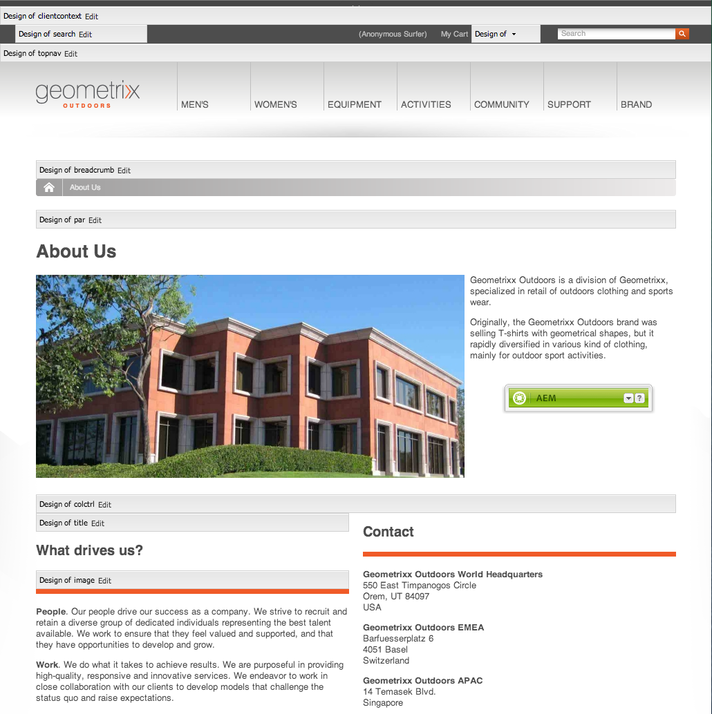

# Configurar componentes en modo Diseño{#configuring-components-in-design-mode}

Cuando la instancia de AEM se instala lista para usar, una selección de componentes aparece de inmediato en la barra de tareas.

Además de estos, también están disponibles otros componentes. Se puede utilizar el modo Diseño para [activar o desactivar dichos componentes](#enabledisablecomponentsusingdesignmode). Cuando se activan y se localizan en su página, se puede utilizar el modo Diseño para [configurar aspectos del diseño de componentes](#configuringcomponentsusingdesignmode) editando los parámetros del atributo.

>[!NOTE]
>
>Es importante tener cuidado al editar estos componentes. Las configuraciones del diseño normalmente suponen una parte integral del diseño de toda la página web, por lo que solo las puede cambiar alguien con los privilegios (y la experiencia) adecuados, normalmente un administrador o programador. Consulte [Desarrollar componentes](/help/sites-developing/components.md) para obtener más información.

Esto implica añadir o eliminar los componentes permitidos en el sistema de párrafos de la página. El sistema de párrafos (`parsys`) es un componente compuesto que contiene todos los demás componentes de párrafos. El sistema de párrafos permite a los autores añadir componentes de distintos tipos a una página, ya que contiene todos los demás componentes de párrafos. Cada tipo de párrafo se representa como un componente.

Por ejemplo, el contenido de la página de un producto puede contener un sistema de párrafos que incluya lo siguiente:

* Una imagen del producto (en forma de imagen o de párrafo de imagen de texto).
* La descripción del producto (como párrafo de texto).
* Una tabla con datos técnicos (como párrafo de tabla).
* Un formulario que rellenan los usuarios (como comienzo de formularios, elemento de formularios y párrafo de final de formulario).

>[!NOTE]
>
>Consulte [Desarrollar componentes](/help/sites-developing/components.md#paragraphsystem) y [Guías para utilizar plantillas y componentes](/help/sites-developing/dev-guidelines-bestpractices.md#guidelines-for-using-templates-and-components) para obtener más información sobre `parsys`.

## Activar/desactivar componentes {#enable-disable-components}

En el modo Diseño, se minimiza la barra de tareas y se pueden configurar los componentes accesibles para el autor:

1. Si quiere acceder al modo Diseño, abra una página para editarla y utilice el icono de la barra de tareas:

   

1. Haga clic en **Editar** en el sistema de párrafos (**Diseño de par**).

   

1. Se abrirá un cuadro de diálogo en el que se indican los grupos de componentes que se muestran en la barra de tareas junto con todos los componentes que contienen.

   Agregue los componentes que deban estar en la barra de tareas o quite los que quiera.

   

1. La barra de tareas se minimiza en el modo de diseño. Al hacer clic en la flecha, puede minimizar la barra de tareas y regresar al modo de edición:

   

## Configurar el diseño de un componente {#configuring-the-design-of-a-component}

En el modo Diseño, también se pueden configurar los atributos de los componentes individuales. Cada componente tiene sus propios parámetros. Los ejemplos siguientes muestran el componente de **Imagen:**

1. Si quiere acceder al modo Diseño, abra una página para editarla y utilice el icono de la barra de tareas:

   

1. Se puede configurar el diseño de los componentes.

   Por ejemplo, si hace clic en **Editar** en el componente Imagen (**Diseño de imagen**) puede configurar los parámetros específicos del componente:

   

1. Haga clic en **Aceptar** para guardar los cambios.

1. La barra de tareas se minimiza en el modo de diseño. Al hacer clic en la flecha, puede minimizar la barra de tareas y regresar al modo de edición:

   
