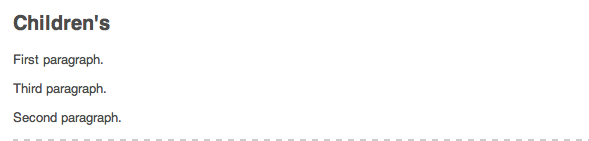
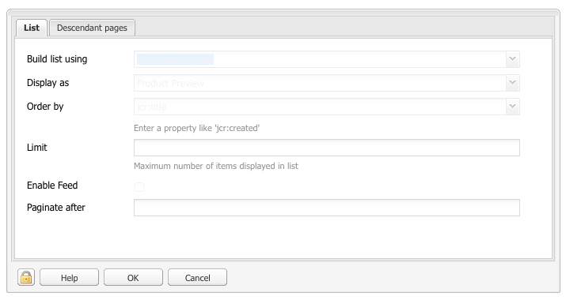

# Editar el contenido de una página{#editing-page-content}

Después de crear una página (nueva o como parte de un lanzamiento o Live Copy), puede editar el contenido para realizar las actualizaciones que requiera.

El contenido se añade mediante los [componentes](/help/sites-classic-ui-authoring/classic-page-author-default-components.md) (adecuados para el tipo de contenido), que se pueden arrastrar hacia la página. Después estos se pueden editar local, mover o eliminar.

>[!NOTE]
>
>Su cuenta necesita los [derechos de acceso](/help/sites-administering/security.md) y [permisos adecuados](/help/sites-administering/security.md#permissions) para editar páginas (por ejemplo, añadir, editar o eliminar componentes, anotar, desbloquear...).
>
>Si se producen problemas, le sugerimos que se ponga en contacto con el administrador del sistema.

## Barra de tareas {#sidekick}

La barra de tareas es una herramienta esencial a la hora de crear páginas. Flota al crear una página, por lo que siempre está visible.

Hay varios iconos y fichas disponibles, incluidos:

* Componentes
* Página
* Información
* Versiones
* Flujo de trabajo
* Modos
* Scaffolding
* ClientContext
* Sitios web

Ofrecen acceso a una amplia selección de funciones, que incluyen:

* [seleccionar componentes](/help/sites-classic-ui-authoring/classic-page-author-env-tools.md#sidekick)
* [mostrar referencias](/help/sites-classic-ui-authoring/classic-page-author-env-tools.md#showing-references)
* [acceder al registro de auditoría](/help/sites-classic-ui-authoring/classic-page-author-env-tools.md#audit-log)
* [cambiar de modo](/help/sites-classic-ui-authoring/classic-page-author-env-tools.md#page-modes)
* [crear](/help/sites-classic-ui-authoring/classic-page-author-work-with-versions.md#creating-a-new-version), [restaurar](/help/sites-classic-ui-authoring/classic-page-author-work-with-versions.md#restoring-a-page-version-from-sidekick) y [comparar](/help/sites-classic-ui-authoring/classic-page-author-work-with-versions.md#comparing-with-a-previous-version) versiones

* [publicar](/help/sites-classic-ui-authoring/classic-page-author-publish-pages.md#publishing-a-page) y [cancelar publicaciones](/help/sites-classic-ui-authoring/classic-page-author-publish-pages.md#unpublishing-a-page) de páginas

* [editar las propiedades de la página](/help/sites-classic-ui-authoring/classic-page-author-edit-page-properties.md)

* [realizar un andamiaje](/help/sites-authoring/scaffolding.md)

* [contexto de cliente](/help/sites-administering/client-context.md)

## Insertar un componente {#inserting-a-component}

### Insertar un componente {#inserting-a-component-1}

Después de abrir la página, puede comenzar a agregar contenido. Para ello, agregue componentes (también llamados párrafos).

Para insertar un nuevo componente:

1. Existen varios métodos para seleccionar el tipo de párrafo que desea insertar:

   * Hacer doble clic en el área etiquetada **Arrastrar componentes o recursos aquí...** (se abre la barra de herramientas **Insertar nuevo componente**). Seleccione un componente y haga clic en **Aceptar**.

   * Arrastrar un componente desde la barra de herramientas flotante (denominada barra de tareas) para insertar un nuevo párrafo.
   * Hacer clic con el botón derecho en un párrafo existente y seleccionar **Nuevo...** (se abre la barra de herramientas Insertar nuevo componente). Seleccione un componente y haga clic en **Aceptar**.

   

1. Tanto en la barra de tareas como en la barra de herramientas **Insertar nuevo componente**, se ve una lista de los componentes (tipos de párrafo) disponibles. Pueden estar divididos en varias secciones (por ejemplo, General, Columnas, etc.), que pueden expandirse según se requiera.

   Estas opciones pueden variar según el entorno de producción. Para obtener todos los detalles sobre los componentes, consulte [Componentes predeterminados](/help/sites-classic-ui-authoring/classic-page-author-default-components.md).

1. Inserte el componente que desee en la página. A continuación, haga doble clic en el párrafo, y se abrirá una ventana que permite configurar el párrafo y agregar contenido.

### Insertar un componente utilizando el buscador de contenido  {#inserting-a-component-using-the-content-finder}

También puede agregar un componente nuevo a la página arrastrando un activo desde el [buscador de contenido](/help/sites-classic-ui-authoring/classic-page-author-env-tools.md#the-content-finder). De este modo, se crea automáticamente un componente nuevo del tipo correspondiente que contiene el activo.

Esta opción es válida para los siguientes tipos de activo (algunos dependen del sistema de páginas o de párrafos):

| Tipo de recurso | Tipo de componente resultante |
|---|---|
| Imagen | Imagen |
| Documento | Descargar |
| Producto | Producto |
| Vídeo | Flash |

>[!NOTE]
>
>Puede configurar este comportamiento en su instalación. Para obtener más detalles, consulte [Configurar un sistema de párrafos de manera que, al arrastrar un activo, se cree una instancia de componente](/help/sites-developing/developing-components.md#configuring-a-paragraph-system-so-that-dragging-an-asset-creates-a-component-instance).

Para crear un componente arrastrando uno de los tipos de activo anteriores:

1. Asegúrese de que la página se encuentra en el modo de [**edición**.](/help/sites-classic-ui-authoring/classic-page-author-env-tools.md#page-modes)
1. Abra el [buscador de contenido](/help/sites-classic-ui-authoring/classic-page-author-env-tools.md#the-content-finder).
1. Arrastre el activo correspondiente hasta la posición final. El [marcador de posición de componente](#componentplaceholder) le muestra dónde se colocará este.

   Se creará un componente apropiado para el tipo de activo en la posición requerida: un componente que contendrá el activo seleccionado.

1. Si es necesario, [edite](#editmovecopypastedelete) el componente.

## Editar un componente (contenido y propiedades)  {#editing-a-component-content-and-properties}

Para editar un párrafo existente, haga una de las siguientes acciones:

* **Haga doble** clic en el párrafo para abrirlo. Verá la misma ventana que cuando creó el párrafo con el contenido existente. Realice los cambios y haga clic en **Aceptar**.

* **Haga clic con el botón derecho** en el párrafo y luego haga clic en **Editar**.

* **Haga clic** dos veces en el párrafo (un doble clic lento) para entrar al modo de edición in situ. Podrá editar directamente el texto en la página, en vez de en el interior de una ventana de un cuadro de diálogo. En este modo, se le proporcionará una barra de herramientas en la parte superior de la página. Simplemente realice los cambios y se guardarán automáticamente.

## Mover un componente {#moving-a-component}

Para mover un párrafo:

>[!NOTE]
>
>También puede utilizar [Cortar y pegar](#cut-copy-paste-a-component) para mover un componente.

1. Seleccione el párrafo que desee mover:

   

1. Arrastre el párrafo a la nueva ubicación (AEM indica dónde se puede mover el párrafo con una marca de verificación verde). Colóquelo en la ubicación que desee.
1. Se mueve el párrafo:

   

## Eliminar un componente {#deleting-a-component}

Para eliminar un párrafo:

1. Seleccione el párrafo y **haga clic con el botón derecho**:

   

1. Seleccione **Eliminar** desde el menú. AEM WCM solicita confirmación de que desea eliminar el párrafo, ya que esta acción no se puede deshacer.
1. Haga clic en **Aceptar**.

>[!NOTE]
>
>Si estableció las [Propiedades del usuario para mostrar la barra de herramientas de edición global](/help/sites-classic-ui-authoring/author-env-user-props.md), también puede realizar ciertas acciones en los párrafos con los botones disponibles: **Copiar**, **Cortar**, **Pegar** y **Eliminar**.
>
>También hay varios [métodos abreviados del teclado](/help/sites-classic-ui-authoring/classic-page-author-keyboard-shortcuts.md) disponibles.

## Cortar/copiar/pegar un componente {#cut-copy-paste-a-component}

Al igual que cuando [elimina un componente](#deleting-a-component), puede utilizar el menú contextual para copiar, cortar o pegar un componente.

>[!NOTE]
>
>Si estableció las [Propiedades del usuario para mostrar la barra de herramientas de edición global](/help/sites-classic-ui-authoring/author-env-user-props.md), también puede realizar ciertas acciones en los párrafos con los botones disponibles: **Copiar**, **Cortar**, **Pegar** y **Eliminar**.
>
>También hay varios [métodos abreviados del teclado](/help/sites-classic-ui-authoring/classic-page-author-keyboard-shortcuts.md) disponibles.

>[!NOTE]
>
>Solo se puede cortar, copiar y pegar el contenido en la misma página.

## Componentes heredados {#inherited-components}

Los componentes heredados pueden ser el producto de distintos escenarios, como por ejemplo:

* [Administración de varios sitios](/help/sites-administering/msm.md); también junto con el [andamiaje](/help/sites-classic-ui-authoring/classic-feature-scaffolding.md#scaffolding-with-msm-inheritance).

* [Lanzamientos](/help/sites-classic-ui-authoring/classic-launches.md) (cuando se basan en Live Copies).
* Componentes específicos; por ejemplo, el sistema de párrafos heredado en Geometrixx.

Puede cancelar (y volver a habilitar) la herencia. En función del componente, esta opción puede estar disponible en:

1. **Live Copy**

   Si un componente forma parte de una Live Copy o un lanzamiento, esta situación se indica mediante un icono de cerrojo. Puede hacer clic en el cerrojo para cancelar la herencia.

   * El icono de cerrojo se mostrará cuando el componente esté seleccionado; por ejemplo:

   

   * El cerrojo también se muestra en el cuadro de diálogo de los componentes; por ejemplo:

   

1. **Un sistema de párrafos heredado**

   El cuadro de diálogo de configuración. Por ejemplo, como en el sistema de párrafos heredado de Geometrixx:

   

## Agregar anotaciones {#adding-annotations}

[Las anotaciones](/help/sites-classic-ui-authoring/classic-page-author-annotations.md) permiten que el resto de los autores hagan comentarios sobre el contenido. Esta opción acostumbra a utilizarse para revisiones y validaciones.

## Previsualizar páginas    {#previewing-pages}

Hay dos iconos en el borde inferior de la barra de tareas que son importantes para previsualizar las páginas:

* El icono de lápiz le muestra que se encuentra en el modo de edición, desde el que puede añadir, modificar, mover o eliminar contenido.

   

* El icono de lupa le permite seleccionar el modo de previsualización, en el que la página se mostrará tal como se verá en el entorno de publicación (a veces tendrá que actualizar la página):

   

   En el modo de previsualización, la barra de tareas se reducirá; haga clic en el icono de flecha hacia abajo para volver al modo de edición:

   

## Buscar y reemplazar {#find-replace}

Para ediciones a mayor escala de la misma frase, la opción de menú **[Buscar y reemplazar](/help/sites-classic-ui-authoring/author-env-search.md#find-and-replace)** permite buscar y reemplazar varias instancias de una cadena en una sección del sitio web.

## Bloquear una página {#locking-a-page}

AEM le permite bloquear páginas para que nadie más pueda modificar su contenido. Esta función es útil cuando realice muchas ediciones en una página concreta o cuando tenga que congelar una página un rato.

>[!CAUTION]
>
>El bloqueo de páginas debería utilizarse con precaución porque la única persona que puede desbloquear una página es la que la haya bloqueado (o una cuenta con privilegios de administrador).

Para bloquear una página:

1. En la ficha **Sitios web**, seleccione la página que desee bloquear.
1. Haga doble clic en la página para abrirla y editarla.
1. En la ficha **Página** de la barra de tareas, seleccione **Bloquear página**:

   

   Un mensaje muestra que su página está bloqueada para los demás usuarios. Además, en el panel derecho de la consola **Sitios web**, AEM WCM muestra la página como bloqueada e indica qué usuario la bloqueó.

   

## Desbloquear una página {#unlocking-a-page}

Para desbloquear una página:

1. En la ficha **Sitios web**, seleccione la página que desee desbloquear.
1. Haga doble clic en la página para abrirla.
1. En la ficha **Página** de la barra de tareas, seleccione **Desbloquear página**.

## Deshacer y rehacer modificaciones de páginas {#undoing-and-redoing-page-edits}

Utilice los métodos abreviados del teclado siguientes con el cuadro de contenido de la página seleccionado:

* Deshacer: Ctrl + Z (Windows) o Cmd + Z (Mac)
* Rehacer: Ctrl + Y (Windows) o Cmd + Y (Mac)

Cuando deshace o rehace la eliminación, adición o reubicación de uno o más párrafos, se usan indicadores luminosos parpadeantes (comportamiento predeterminado) para marcar los párrafos afectados.

>[!NOTE]
>
>Consulte [Deshacer y rehacer ediciones de página: la teoría](#undoing-and-redoing-page-edits-the-theory) para ver toda la información sobre las posibilidades de deshacer y rehacer ediciones de página.

## Deshacer y rehacer ediciones de página: la teoría {#undoing-and-redoing-page-edits-the-theory}

>[!NOTE]
>
>El administrador del sistema puede [configurar varios aspectos de las funciones de Deshacer/Rehacer](/help/sites-administering/config-undo.md) según los requisitos de la instancia.

AEM almacena un historial de acciones que realiza y la secuencia en que las realizó. Por lo tanto, las acciones se deshacen en el orden en que fueron realizadas. A continuación, puede usar el comando Rehacer para aplicar nuevamente una o más de las acciones realizadas.

Si hay un elemento seleccionado en la página de contenido, el comando de deshacer y rehacer se aplicará a dicho elemento, por ejemplo un componente de texto.

El comportamiento de los comandos Deshacer y Rehacer es similar al de otros programas de software. Use los comandos para restaurar el estado reciente de la página web a medida que toma decisiones sobre el contenido. Por ejemplo, si mueve un párrafo de texto a una ubicación diferente en la página, puede usar el comando Deshacer para mover el párrafo a la posición original. Si luego decide nuevamente mover el párrafo, use el comando Rehacer.

>[!NOTE]
>
>Puede hacer lo siguiente:
>
>* Rehacer acciones siempre y cuando no haya realizado ninguna edición en la página desde que usó el comando Deshacer por última vez.
>* Deshacer un máximo de 20 acciones de edición (configuración predeterminada).
>* Utilizar [los métodos abreviados del teclado](/help/sites-classic-ui-authoring/classic-page-author-keyboard-shortcuts.md) para deshacer y rehacer.

>

Puede usar los comandos Deshacer y Rehacer para los siguientes tipos de cambios de página:

* Agregar, editar, quitar y mover párrafos
* Editar contenido de párrafos en el lugar
* Copiar, cortar y pegar elementos en una página
* Copia, corte y pegado de elementos en las páginas
* Agregar, quitar y cambiar archivos e imágenes
* Agregar, quitar, y cambiar anotaciones y bocetos
* Cambios a Scaffold
* Agregar y quitar referencias
* Cambiar los valores de propiedad de los cuadros de diálogo de componentes.

Los campos de formulario procesados por los componentes de formulario no deberían tener valores especificados mientras se crean las páginas. Así pues, los comandos deshacer y rehacer no afectarán a los cambios que realice en los valores de estos tipos de componente. Por ejemplo, no se puede deshacer la selección de un valor en una lista desplegable.

>[!NOTE]
>
>Se necesitan permisos especiales para deshacer y rehacer cambios en archivos e imágenes. Además, el historial de deshacer cambios en archivos e imágenes dura varias horas como mínimo. No obstante, pasado ese tiempo, no se garantiza que se puedan deshacer los cambios. El administrador puede proporcionar permisos y cambiar el tiempo predeterminado de diez horas.
