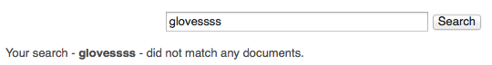
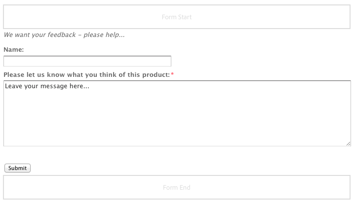

# Componentes para la creación de páginas{#components-for-page-authoring}

Los siguientes componentes están diseñados para utilizarse al crear contenido para una página web estándar. Forman un subconjunto de los componentes disponibles para su uso para efectuar una instalación estándar de AEM.

Algunos están disponibles directamente mediante la barra de tareas, mientras que otros se pueden habilitar o deshabilitar desde el [modo Diseño](/help/sites-classic-ui-authoring/classic-page-author-design-mode.md).

>[!CAUTION]
>
>En esta sección solo se describen los componentes disponibles para su uso en una instalación estándar de AEM.
>
>En función de su instancia, puede disponer de componentes personalizados desarrollados explícitamente para sus necesidades. Pueden tener incluso el mismo nombre que algunos de los componentes mencionados aquí.

Los componentes están disponibles cuando [edita una página](/help/sites-classic-ui-authoring/classic-page-author-edit-content.md) desde la ficha **Componentes** de la barra de tareas y el selector **Insertar nuevo componente** (al hacer clic con el doble en el área **Arrastrar componentes o recursos aquí**).

Puede seleccionar un componente y arrastrarlo a la ubicación requerida en la página y, a continuación, [Editar contenido y propiedades](/help/sites-classic-ui-authoring/classic-page-author-edit-content.md#editing-a-component-content-and-properties).

Los componentes se clasifican en varias categorías (grupos de componentes), incluyendo (para la creación de páginas):

* [General](#general): incluye componentes básicos, como texto, imágenes, tablas, gráficos, etc.
* [Columnas](#columns): incluye componentes necesarios para organizar el diseño del contenido.
* [Formulario](#formgroup): incluye todos los componentes necesarios para crear un formulario.

## General {#general}

Los componentes generales son los básicos que se utilizan para crear contenido.

### Elemento de cuenta {#account-item}

Es posible definir un vínculo con título y descripción.


### Imagen adaptable  {#adaptive-image}

El componente de base de la imagen adaptable genera imágenes que se ajustan al tamaño de la ventana en la que se abre la página web. Para utilizar el componente, escoja un medio de imagen del sistema de archivos o DAM. Cuando se abre la página web, el navegador web descarga una copia de la imagen que ha cambiado de tamaño para ajustarse a la ventana actual.

Las características siguientes determinarán el tamaño de la ventana:

* Pantalla del dispositivo: los dispositivos móviles acostumbran a mostrar páginas web de forma que cubran toda la pantalla.
* Tamaño de la ventana del navegador web: los usuarios de equipos portátiles o de escritorio pueden cambiar el tamaño de las ventanas del navegador web.

Por ejemplo, el componente genera una imagen pequeña al abrir la página web en un teléfono móvil y una imagen de tamaño medio al abrirla en una tableta. En un equipo portátil, el componente crea y presenta una imagen grande cuando la página se abre en un navegador web. Cuando el navegador web se cambia de tamaño para ajustarse a una parte de la pantalla, el componente se adapta presentando una imagen más pequeña y actualiza la vista.

#### Formatos de imagen compatibles  {#supported-image-formats}

Puede utilizar archivos de imagen con las extensiones de nombre de archivo siguientes con el componente imagen adaptable:

* .jpg
* .jpeg
* .png
* .gif **

>[!CAUTION]
>
>** Los archivos .gif de animación no son compatibles con AEM para representaciones adaptables.

#### Calidad y tamaño de imagen  {#images-sizes-and-quality}

En la tabla siguiente se indica la anchura de la imagen generada para la anchura de cada visor determinado. La altura de la imagen generada se calcula para mantener una proporción de aspecto constante y para que no haya espacio en blanco dentro del borde de la imagen. Se puede utilizar el recorte para evitar los espacios en blanco.

Cuando la imagen es una imagen JPEG, el tamaño del visor también puede influir en la calidad JPEG. Hay disponibles las calidades JPEG siguientes:

* Baja (0,42)
* Media (0,82)
* Alta (1,00)

| Intervalo de anchura del visor (píxeles) | Anchura de la imagen (píxeles) | Calidad JPEG | Tipo de dispositivo específico |
|---|---|---|---|
| Anchura &lt;= 319 | 320 | Baja |  |
| Anchura = 320 | 320 | Media | Teléfono móvil (vertical) |
| 320 &lt; anchura &lt; 481 | 480 | Media | Teléfono móvil (horizontal) |
| 480 &lt; anchura &lt; 769 | 476 | Alta | Tableta (vertical) |
| 768 &lt; anchura &lt; 1025 | 620 | Alta | Tableta (horizontal) |
| Anchura &lt;= 1025 | Completa (tamaño original) | Alta | Escritorio |

#### Propiedades {#properties}

Este diálogo le permite editar las propiedades de su instancia del componente de imagen adaptable, muchas de las cuales coinciden con el componente Imagen en el que este se basa. Las propiedades están disponibles en dos fichas:

* **Imagen**

   * **Imagen**
Arrastre una imagen desde el buscador de contenido o haga clic para abrir una ventana de navegación desde la que podrá cargar una imagen. Tras cargar la imagen, puede recortarla, girarla o eliminarla. Para aumentar o disminuir la imagen, utilice la barra de deslizamiento situada bajo la imagen (sobre los botones Aceptar y Cancelar)

   * **Recortar**
Recortar una imagen. Arrastre el borde para recortar la imagen.

   * **Rotar** Haga clic en Rotar varias veces hasta que la imagen haya girado como lo desee.

   * **Borrar** Eliminar la imagen actual.

* **Avanzado**

   * **Título** El componente de imagen adaptable no utiliza esta propiedad.

   * **Texto alternativo** Texto alternativo que se utilizará para la imagen.

   * **Vincular a** El componente de imagen adaptable no utiliza esta propiedad.

   * **Descripción** El componente de imagen adaptable no utiliza esta propiedad.

#### Extensión del componente de imagen adaptable {#extending-the-adaptive-image-component}

Para obtener información sobre la personalización del componente de imagen adaptable, consulte [Uso del componente de imagen adaptable](/help/sites-developing/responsive.md#using-adaptive-images).

### Carrusel {#carousel}

El componente Carrusel le permite visualizar imágenes asociadas a páginas:

* una cada vez
* por un breve período de tiempo
* en el orden que especifique
* con el retraso que se especifique

Los controles en los que se puede hacer clic también permiten al usuario recorrer las páginas mostradas en tiempo real, según sea necesario. Al hacer clic en la imagen de página visible actualmente, se le redirige a esa página. Es decir, el componente Carrusel actúa como un control de navegación.

#### Propiedades {#properties-1}

Están disponibles en dos fichas:

* **Carrusel** Aquí especifica el funcionamiento del carrusel:

   * Velocidad de reproducción El tiempo, en milisegundos, antes de que se muestre la siguiente diapositiva.
   * Tiempo de transición El tiempo, en milisegundos, de transición entre dos diapositivas.
   * Estilo de controles Hay varias opciones disponibles en un menú desplegable; por ejemplo, los botones Anterior/Siguiente y los interruptores Superior-Derecha.

* **Lista** Aquí especifica cómo se incluyen las páginas en el carrusel:

   * **Lista de creación que utiliza** Existen varias formas de crear una lista de páginas (páginas secundarias, lista fija, búsqueda o búsqueda avanzada; todas ellas se describen a continuación). Tenga en cuenta que no importa qué método elija, las páginas incluidas en la lista ya deben disponer de una imagen asociada a la página, que será la imagen que se muestre en el carrusel. Si no existe ninguna imagen para una página determinada en sus propiedades de página, es necesario asociar una imagen a la página antes de comenzar, ya que de lo contrario el carrusel mostrará una página en blanco (o casi en blanco). Consulte [Edición de las propiedades de página](/help/sites-classic-ui-authoring/classic-page-author-edit-page-properties.md). Se mostrará un panel nuevo en función del elemento que elija:

      * **Opciones de Páginas secundarias**

         * **Página principal**
Especificar una ruta manualmente o con el selector. Deje esta opción en blanco para utilizar la página actual como página principal.
      * **Opciones de Lista fija**

         * ****
PáginasSeleccione una lista de páginas. Usar 
`+` para agregar más entradas y los botones de subida y bajada para ajustar el orden.
      * **Opciones de Buscar**

         * **Iniciar en** Indique una ruta de inicio manualmente o con el selector.

         * **Consulta de búsqueda** Puede introducir una consulta de búsqueda en forma de texto sin formato.
      * **Opciones de Búsqueda avanzada**

         * **Anotación predicada Querybuilder** Es posible introducir una consulta de búsqueda utilizando una anotación predicada QueryBuilder. Por ejemplo, puede introducir &quot;fulltext=Marketing&quot; para que se muestren todas las páginas en cuyo contenido aparezca &quot;Marketing&quot; en el Carrusel. Consulte [QueryBuilder API](/help/sites-developing/querybuilder-api.md) para un tratamiento más extenso de las expresiones de consulta y más ejemplos.
   * **Ordenar**
porSeleccionar 
`jcr:title`,  `jcr:created`,  `cq:lastModified`o  `cq:template` desde el menú desplegable.

   * **Límite** Máximo de elementos que se pueden utilizar en el Carrusel; es opcional.


>[!NOTE]
Es posible crear un componente de carrusel personalizado para Adobe Experience Manager que muestre recursos digitales localizados en AEM DAM. Para obtener más información, consulte [Crear componentes de carrusel personalizado para Adobe Experience Manager](https://helpx.adobe.com/experience-manager/using/custom-carousel-components.html).

### Gráfico  {#chart}

El componente Gráfico permite añadir una barra, línea o gráfico circular. AEM crea un gráfico de los datos proporcionados. Los datos se proporcionan escribiéndolos directamente en la ficha Datos o copiando y pegando una hoja de cálculo.

* **Datos**

   * **Datos del gráfico** Introduzca los datos en su gráfico utilizando el formato CSV; el formato Valores separados por comas utiliza comas (&quot;,&quot;) como separador del campo.

* **Avanzado**

   * **Tipo de gráfico** Seleccione una de las opciones entre Gráfico circular, Gráfico de líneas y Gráfico de barras.

   * **Texto alternativo** Texto alternativo que se muestra en lugar del gráfico.

   * **Anchura** Anchura del gráfico en píxeles.

   * **Altura** Altura del gráfico en píxeles.

En el ejemplo siguiente se muestran los datos de un gráfico seguido del gráfico de barras resultante:

 

>[!NOTE]
Es posible crear un control de gráficos AEM personalizado que muestre datos ubicados en el JCR AEM. Para obtener más información, consulte [Mostrar datos de Adobe Experience Manager en un gráfico](https://helpx.adobe.com/experience-manager/using/displaying-experience-manager-data-chart.html).

### Fragmento de contenido {#content-fragment}

>[!CAUTION]
Las funciones de administración de fragmentos de contenido solo están disponibles en la IU táctil.
El componente Fragmento de contenido se puede ver en la barra de tareas de la IU clásica, pero sin otras funciones disponibles.

Los [fragmentos de contenido](/help/sites-classic-ui-authoring/classic-page-author-content-fragments.md) se crean y administran como recursos independientes de las páginas. Después se pueden usar estos fragmentos, y sus variaciones, al crear páginas de contenido.

### Importador de diseños {#design-importer}

Permite cargar un archivo comprimido manteniendo el diseño del paquete.

### Descargar {#download}

El componente Descargar crea un vínculo en la página web seleccionada para descargar un archivo específico. Puede arrastrar un recurso desde el buscador de contenido o cargar un archivo.

* **Descargar**

   * **Descripción** Breve descripción que se muestra con el vínculo de descarga.

   * **Archivo**
Archivo disponible para descargar la página web resultante. Arrastre un recurso desde el buscador de contenido o haga clic en el área para cargar el archivo que esté disponible para la descarga.

En el siguiente ejemplo se muestra el componente Descargar en Geometrixx:


### Externo {#external}

El componente de integración de aplicaciones externo (**Externo**) permite incrustar aplicaciones externas en su página AEM utilizando un iframe.

* **Externo**

   * **Aplicación de destino**

      Especifique la URL de la aplicación web que se integrará, por ejemplo:

      ```
      https://en.wikipedia.org/wiki/Main_Page
      ```

   * **Transmitir parámetros**

      Marque la casilla de los parámetros que se pasarán a la aplicación cuando sean necesarios.

   * **Anchura y altura**

      Defina el tamaño del fotograma i

La aplicación externa se integra en el sistema de párrafos de la página AEM; por ejemplo, cuando se utiliza una aplicación de destino de `https://en.wikipedia.org/wiki/Main_Page`:


>[!NOTE]
Según el ejemplo de uso, existen otras opciones para integrar aplicaciones externas, como por ejemplo la [Integración de Portlets](/help/sites-administering/aem-as-portal.md).

### Flash  {#flash}

El componente Flash permite cargar una película Flash. Puede arrastrar un recurso flash desde el buscador de contenido al componente, o bien, puede utilizar el cuadro de diálogo:

* **Flash**

   * **Película Flash**

      Archivo de película flash. Arrastre un recurso desde el buscador de contenido, o bien, haga clic para abrir una ventana de navegación.

   * **Tamaño**

      Dimensiones en píxeles del área de visualización que incluye la película.

* **Imagen alternativa**

   Imagen alternativa para mostrar.

* **Avanzado**

   * **Menú contextual**

      Indica si el menú contextual se debe mostrar u ocultar.

   * **Modo de ventana**

      El modo en que aparece la ventana; por ejemplo, opaca, transparente o como una ventana definida (sólida).

   * **Color de fondo**

      Color de fondo seleccionado del gráfico de colores proporcionado.

   * **Versión mínima**

      Versión mínima de Adobe Flash Player necesaria para ejecutar la película. El valor predeterminado es 9.0.0. 

   * **Atributos**

      Cualquier otro atributo necesario.

### Imagen  {#image}

El componente de imagen muestra una imagen y un texto de acompañamiento en función de los parámetros especificados.

Puede cargar una imagen y luego editarla y manipularla (p. ej., recortarla, girarla o añadirle un vínculo, un título o texto).

Es posible arrastrar y soltar una imagen del [Buscador de contenido](/help/sites-classic-ui-authoring/classic-page-author-env-tools.md#the-content-finder) directamente en el componente o en su cuadro de diálogo de edición. También es posible hacer doble clic en la zona central del cuadro de diálogo de edición para explorar el sistema de archivos local y cargar una imagen. Las dos pestañas del cuadro de diálogo de edición también controlan las definiciones y la manipulación de la imagen:


>[!NOTE]
El progreso de la carga no puede supervisarse con Internet Explorer.
Los usuarios de Internet Explorer deben cargar la imagen, hacer clic en **Aceptar** y volver a abrir la imagen para ver el archivo cargado en la previsualización y para poder realizar modificaciones (p. ej. recortar).
Consulte la sección [Plataformas certificadas](/help/release-notes/release-notes.md#certifiedplatforms) para obtener más información sobre las funciones HTML5 utilizadas por AEM.

Al cargar una imagen, se pueden configurar los aspectos siguientes:

* **Asignar**

   Para asignar una imagen, seleccione Asignar. Es posible especificar cómo será el mapa de imagen (un rectángulo, un polígono, etc.) y hacia dónde debe apuntar la zona.

* **Recortar**

   Seleccione Recortar para recortar una imagen. Utilice el ratón para recortar la imagen.

* **Rotar**

   Para rotar una imagen, seleccione Rotar. Utilícelo repetidamente hasta que la imagen rote hacia el lado que prefiera.

* **Borrar**

   Eliminar la imagen actual.

* **Barra de zoom**

   Para aumentar o disminuir la imagen, utilice la barra de deslizamiento situada bajo la imagen (sobre los botones Aceptar y Cancelar).

* **Título**

   Título de la imagen.

* **Texto alternativo**

   Texto alternativo que se utiliza al crear contenido accesible.

* **Vínculos**

   Cree un vínculo a recursos u otras páginas dentro del sitio web.

* **Descripción**

   Descripción de la imagen.

* **Tamaño**

   Establece la altura y la anchura de la imagen.

La imagen final (con **Título** y **Descripción**) pueden aparecer así:


### Contenedor de diseño {#layout-container}

>[!CAUTION]
Aunque el componente Contenedor de diseño está disponible en la IU clásica, la gama completa de funciones solo se puede usar en la IU táctil. Para obtener más información, consulte [Diseño interactivo](/help/sites-classic-ui-authoring/classic-page-author-responsive-layout.md).

### Lista {#list}

El componente Lista permite configurar criterios de búsqueda para mostrar una lista:

* **Lista**

   * **Lista de creación que utiliza**

      Aquí se especifica el lugar donde la lista recuperará su contenido. Existen varios métodos:

   * Se mostrará un panel nuevo, en función del elemento que elija:

      * **Opciones de Páginas secundarias**

         * **Elementos secundarios de**(página principal)
Especifique una ruta manualmente o con el selector. Deje esta opción en blanco para utilizar la página actual como página principal.
      * **Opciones de Lista fija**

         * **Páginas**

            Seleccione una lista de páginas. Utilice + para añadir más entradas y las teclas de flecha hacia arriba y hacia abajo para ajustar el orden. 
      * **Opciones de Buscar**

         * **Iniciar en**

            Introduzca una ruta de inicio manualmente o con el selector.

         * **Consulta de búsqueda**

            Puede introducir una consulta de búsqueda de texto sin formato.
      * **Opciones de Búsqueda avanzada**

         * **Notación de predicado de Querybuilder**

            Puede introducir una consulta de búsqueda utilizando la notación de predicado Querybuilder. Por ejemplo, puede indicar &quot;fulltext=Marketing&quot; para que se muestren en el carrusel todas las páginas que contengan &quot;Marketing&quot;.


            Consulte [QueryBuilder API](/help/sites-developing/querybuilder-api.md) para un tratamiento más extenso de las expresiones de consulta y más ejemplos.
      * **Etiquetas**

         Especifique la **página principal**, **Etiquetas/Palabras clave** y los criterios de coincidencia necesarios.
   * **Mostrar como**

      Cómo desea que se incluyan los elementos; incluye vínculos, teasers y noticias.

   * **Ordenar por**

      Si la lista se va a ordenar y, si es así, los criterios que se utilizarán para la ordenación. Puede introducir los criterios o seleccionar uno de la lista desplegable proporcionada.

   * **Límite**

      Especifique el número máximo de elementos que desea que se muestren en la lista.

   * **Habilitar fuente**

      Indica si una fuente RSS se debe activar para la lista.

   * **Paginar tras**

      Aquí puede especificar el número de elementos de lista que se muestran al mismo tiempo. Una lista con más elementos que los especificados utilizarán la paginación para mostrar la lista en varias partes.


En el siguiente ejemplo se muestra un componente **Lista** del modo en que puede mostrar una lista de páginas secundarias, con el diseño controlado mediante las definiciones CSS personalizadas del diseño del sitio.


### Inicio de sesión {#login}

Este componente proporciona los campos Nombre de usuario y Contraseña.


Puede configurar:

* Inicio de sesión

   * Etiqueta de sección

      Texto introductorio para los campos de entrada.

   * Etiqueta de nombre de usuario

      Texto para etiquetar el campo de nombre de usuario.

   * Etiqueta de contraseña

      Texto para etiquetar el campo de contraseña.

   * Etiqueta del botón de inicio de sesión

      Texto para el botón de inicio de sesión.

   * Redirigir a

      Puede especificar la página del sitio web que se debe abrir una vez que el usuario haya iniciado sesión.

* Ya hay una sesión iniciada

   * Etiqueta del botón Continuar

      Texto que indica que el usuario ya ha iniciado sesión.

### Estado de orden {#order-status}

* **Título**

   * **Título**

      Especifique el texto del título que desea que se muestre.

   * **Vínculo**

      Especifique la página (producto) para la que se debe mostrar el estado del pedido.

   * **Tipo / Tamaño**

      Seleccione una opción de la selección proporcionada.


### Referencia {#reference}

El componente **Referencia** permite hacer referencia a un texto de otra página de su web AEM (dentro del caso presente). El contenido del párrafo indicado aparece luego como si estuviera en la página presente. El contenido se cargará cuando el párrafo original cambie (puede que sea necesario actualizar la página).

* **Referencia del párrafo**

   * **Referencia**

      Especifique la ruta a la página y al párrafo al que desea hacer referencia (incluya contenido).

Para especificar la ruta a un párrafo determine un sufijo para la ruta (hasta la página) con:

`.../jcr:content/par/<paragraph-ID>`

Por ejemplo:

`/content/geometrixx-outdoors/en/equipment/biking/cajamara/jcr:content/par/similar-products`

Además de hacer referencia a un párrafo en concreto, la ruta de acceso se puede modificar para especificar todo un sistema de párrafos. Puede hacerlo añadiendo un sufijo a la ruta con:

`/jcr:content/par`

Por ejemplo:

`/content/geometrixx-outdoors/en/equipment/biking/cajamara/jcr:content/par`

Una vez que se haya configurado, el contenido aparecerá exactamente como en la página de origen. Solo se puede comprobar que se trata de una referencia cuando se abre el componente de edición:


### Búsqueda {#searching}

El componente Búsqueda añade la capacidad de búsqueda a la página.

Puede configurar:

* Búsqueda  

   * **Tipos de nodo**

      Si la búsqueda se va a restringir a un tipo de nodo específico, lista aquí; por ejemplo, `cq:Page`.

   * **Ruta de búsqueda**

      Especifique la página raíz de la rama que desee buscar.

   * **Texto del botón Buscar**

      Nombre mostrado en el botón de búsqueda real.

   * **Texto de estadísticas**

      Texto que aparece sobre los resultados de búsqueda.

   * **Sin texto de resultados**

      Si no hay resultados, se mostrará el texto introducido.

   * **Revisar ortografía de texto**

      Si alguien introduce un término similar, este texto se muestra antes del término.
Por ejemplo, si se escribe geometrixxe, el sistema muestra &quot;¿Quiso decir geometrixx?&quot;.

   * **Texto de páginas similares**

      Texto que muestra junto a un resultado para páginas similares. Haga clic en este vínculo para ver páginas de contenido similar.

   * **Texto de búsquedas relacionadas**

      Texto que aparece junto a las búsquedas de términos y temas relacionados.

   * **Texto de tendencias de búsqueda**

      Título sobre los términos de búsqueda que introducen los usuarios.

   * **Etiqueta de páginas de resultado**

      Texto que aparece en la parte interior de esta lista con vínculos a otras páginas de resultados.

   * **Etiqueta anterior**

      Nombre que aparece en el vínculo a anteriores páginas de búsqueda.

   * **Etiqueta siguiente**

      Nombre que aparece en el vínculo a siguientes páginas de búsqueda.

En el siguiente ejemplo se muestra el componente Búsqueda después de buscar la palabra *geometrixx* desde el directorio raíz de una instalación estándar. También ilustra la paginación de los resultados:


En el siguiente ejemplo se muestra un término de búsqueda con errores ortográficos y que no está disponible:



### Sitemap {#sitemap}

Lista del mapa del sitio automática, que (con las configuraciones por defecto) enumera todas las páginas (como vínculos activos) en la página web actual. Por ejemplo, un extracto muestra:


Si es obligatorio, se puede configurar:

* **Sitemap**

   * **Ruta de acceso raíz**

      Ruta desde donde va a comenzar la lista.

### Presentación  {#slideshow}

Este componente permite cargar una serie de imágenes para mostrar como presentación en la página. Puede añadir o eliminar las imágenes y asignar un título a cada una. En Avanzado puede especificar el tamaño del área de visualización.

Puede configurar:

* **Diapositivas**

   * **Nueva diapositiva**

      Puede especificar una selección de diapositivas mediante los botones **Añadir** (y **Eliminar**).

   * **Título**

      Especifique un título si es necesario. Se superpone en la diapositiva adecuada.

* **Avanzado**

   * **Tamaño**

      Especifique la anchura y la altura en píxeles.

El componente de presentación de diapositivas se muestra repetidamente en cada secuencia, durante un período corto de tiempo, antes de fundirse en la diapositiva siguiente:


### Tabla {#table}

>[!NOTE]
El componente **Tabla** se basa en el editor de [Texto enriquecido](/help/sites-classic-ui-authoring/classic-page-author-rich-text-editor.md), como el componente **[Texto.](#text)**
Se recomienda utilizar el componente **Tabla** para las tablas, aunque también se pueden crear con el componente **Texto.**

El componente **Tabla** se configura previamente para que pueda crear, rellenar y dar formato a una tabla. Puede configurar su tabla y crear los contenidos utilizando el cuadro de diálogo de las maneras siguientes:

* desde cero
* copiar y pegar una hoja de cálculo o una tabla desde un editor externo (como Excel, OpenOffice, Notepad, etc.).


Las capturas de pantalla siguientes muestran un ejemplo del componente de la tabla; el CSS específico de la página determina el diseño:


### Nube de etiquetas {#tag-cloud}

Una nube de etiquetas muestra de manera gráfica una selección de las etiquetas que se aplican al contenido en su página web:


Al configurar el componente de la nube de etiquetas, es posible especificar:

* **Etiquetas para mostrar**
De donde se recogen las etiquetas que se van a mostrar. Seleccione una página, una página infantil o con etiquetas.

* **Página** Seleccione la página a la que se hará referencia.

* **Etiquetas sin vínculos** Si las etiquetas que se muestran deben actuar como vínculos.

Para obtener más información sobre mostrar etiquetas, consulte [Utilizar etiquetas](/help/sites-classic-ui-authoring/classic-feature-tags.md).

### Texto {#text}

>[!NOTE]
El componente **Texto** está basado en el [editor de texto enriquecido](/help/sites-classic-ui-authoring/classic-page-author-rich-text-editor.md), como el componente **[Tabla.](#table)**
Se recomienda utilizar el componente **Tabla** para las tablas, aunque también se pueden crear con el componente **Texto.**

El componente de Texto permite introducir un bloque de texto mediante un editor WYSIWYG, con funcionalidad proporcionada por el [editor de texto enriquecido](/help/sites-classic-ui-authoring/classic-page-author-rich-text-editor.md). Una selección de iconos permite dar formato al texto, incluyendo características de fuente, alineación, vínculos, listas y sangría.


Cuando abra la ficha **Estilos** del cuadro de diálogo de **edición**, también podrá establecer:

* **Separador**
* **Estilo del texto**

El texto formateado se mostrará en la página; el diseño real dependerá del sitio CSS:


Para obtener más información detallada sobre el componente de Texto y la funcionalidad proporcionada por el editor de texto enriquecido, consulte la página [Editor de texto enriquecido.](/help/sites-classic-ui-authoring/classic-page-author-rich-text-editor.md) 

#### Edición in situ {#inplace-editing}

Además del modo de edición de texto enriquecido basado en el cuadro de diálogo, AEM también proporciona [Edición in situ](/help/sites-authoring/editing-content.md), que permite editar de manera directa el texto ya que se muestra en el formato de la página.

### Texto e imagen {#text-image}

El componente Texto e imagen añade un bloque de texto y una imagen. También se puede añadir y editar texto e imágenes por separado. Consulte los componentes de [Texto](#text) e [imagen](#image) para obtener más información.

 

Puede configurar:

* **Estilos**  de componente (**estilos**)

   Aquí puede alinear la imagen a la izquierda o la derecha. El modo predeterminado es el alineado a la **Izquierda,** con la imagen a la izquierda.

* **Propiedades**  de imagen (propiedades **de imagen** avanzadas)

   Permite especificar lo siguiente:

   * **Recurso de imagen**

      Cargue la imagen requerida.

   * **Título**

      Título para el bloque; se mostrará situando el botón sobre el mismo.

   * **Texto alternativo**

      Texto alternativo que se mostrará si no puede aparecer la imagen. Si la opción se deja vacía, el título se utilizará.

   * **Vincular a**

      Especifique una ruta de destinatario.

   * **Descripción**

      Descripción de la imagen.

   * **Tamaño**

      Establece la altura y la anchura de la imagen.

En el siguiente ejemplo se muestra un componente de Imagen de texto que muestra la imagen alineada a la izquierda:


### Título {#title}

El componente Título puede:

* Mostrar el nombre de la página actual; esto se lleva a cabo dejando en blanco el campo Título.
* Mostrar un texto especificado en el campo Título.

Puede configurar:

* **Título**

   Si desea utilizar un nombre en lugar del título de página, indíquelo aquí.

* **Vínculo**

   Identificador URI si el título va a funcionar como vínculo.

* **Tipo / Tamaño**

   Seleccione Pequeño o Grande en la lista desplegable. El valor Pequeño se genera como imagen. El valor Grande se genera como texto.

En el siguiente ejemplo se muestra un componente **Título**; el diseño se determina mediante el CSS específico del sitio.


### Vídeo {#video}

El componente **Vídeo** permite colocar un elemento de vídeo predefinido, listo para utilizar en una página.

Consulte también [Configurar los perfiles de su vídeo](/help/sites-administering/config-video.md#configuringvideoprofiles) para utilizarlos con elementos HTML5.

Después de colocar un ejemplo de componente en su página, puede configurar:

* Vídeo

   * **Recurso de vídeo**

      Cargue o suelte el recurso de vídeo.

   * **Tamaño**

      El tamaño nativo del vídeo (anchura x altura en píxeles) aparecerá en los cuadros situados junto a Tamaño (ver arriba). Indique aquí manualmente las dimensiones de anchura y altura si desea omitir las dimensiones nativas del vídeo. Haga clic en **Aceptar** para descartar el cuadro de diálogo.

>[!NOTE]
Los formatos aceptados son:
* `.mp4`
* `Ogg`
* `FLV` (vídeo de Flash)


## Columnas {#columns}

En AEM, las columnas funcionan como un mecanismo para controlar el formato del contenido. En una instalación estándar se proporcionan los componentes para crear dos y/o tres columnas.

En el siguiente ejemplo se muestran los componentes 2 columnas y 3 columnas que están en uso. Puede utilizar los marcadores de posición para componentes nuevos:


### 2 columnas {#columns-1}

Un componente Control de columna cuyo valor predeterminado es de 2 columnas iguales.

### 3 columnas  {#columns-2}

Componente Control de columna cuyo valor predeterminado es 3 columnas iguales.

### Control de columna {#column-control}

El componente de Control de columna permite a los usuarios seleccionar cómo quieren dividir el contenido del panel principal de la página web en múltiples columnas. Los usuarios pueden seleccionar el número de columnas que se requieren (de una lista predefinida) y crear, borrar o mover el contenido dentro de cada columna.

* **Control de columna**

   * **Diseño de columna**

      Seleccione el número de columnas que desee procesar. Una vez creada, cada columna tiene su propio vínculo para arrastrar componentes o recursos cuando se añada contenido.

## Formulario  {#form}

Los componentes de formulario se usan para crear formularios para que los visitantes introduzcan información. Los formularios y los componentes de formulario pueden utilizarse para recopilar información, incluidos los comentarios de usuario (por ejemplo, un cuestionario de satisfacción de los clientes) e información sobre los usuarios (por ejemplo, registro de usuarios).

>[!NOTE]
Consulte la [Ayuda de AEM Forms](/help/forms/home.md) para obtener más información sobre los AEM Forms.

Los formularios incluyen diferentes componentes:

* **Formulario**

   El componente Formulario define el principio y el fin de un nuevo formulario en una página. Otros componentes se pueden situar entre estos elementos, como tablas, descargas, etc.

* **Elementos y campos de formulario**

   Los elementos y campos de formulario pueden incluir cuadros de texto, botones de opción, imágenes, etc. El usuario suele finalizar una operación en un campo de formulario, como la introducción de texto. Consulte los elementos independientes de formulario para obtener más información.

* **Componentes de perfil**

   Los componentes Perfil se relacionan con perfiles utilizados para colaboración social y otras áreas donde es necesaria la personalización del visitante.

En el ejemplo siguiente se muestra un formulario que se compone del componente **Formulario** (inicio y final), con dos campos de **Texto** de **formulario** utilizados para el contenido, un campo de **Texto** **general** que se utiliza para el texto y el botón **Enviar.**



>[!NOTE]
La información sobre cómo desarrollar y personalizar sus formularios se encuentra disponible en la página [Desarrollar formularios](/help/sites-developing/developing-forms.md). Esto incluye añadir acciones, restricciones, precargar campos y utilizar guiones para una llamada de servicio para intervenir, entre otras.

### Configuración común de (muchos) componentes de formulario {#settings-common-to-many-form-components}

Aunque cada uno de los componentes de formulario tiene un propósito diferente, muchos están compuestos de opciones y parámetros diferentes.

Al configurar cualquiera de los componentes de formulario, estarán disponibles las fichas siguientes en el cuadro de diálogo:

* **Título y texto**

   Aquí deberá especificar la información básica, como el título del formulario y el texto que lo acompañe, si lo hay. Si es apropiado, también le permite definir otros tipos de información clave como si se pueden realizar varias selecciones en el campo y si se pueden seleccionar elementos.

* **Valores iniciales**

   Le permite especificar un valor predeterminado.

* **Restricciones**

   Aquí podrá especificar si se requiere un campo y definir qué restricciones existen en dicho campo (por ejemplo, debe ser numérico, etc.).

* **Estilo**

   Indica el tamaño y el estilo de los campos.

>[!NOTE]
Los campos varían significativamente dependiendo del componente individual.

Esas pestañas proporcionan los parámetros necesarios, que pueden depender del tipo de componente individual, pero pueden incluir:

* **Título y texto**

   * **Nombre de elemento**

      Nombre del elemento del formulario. Indica en qué lugar del repositorio se almacenan los datos.
Se trata de un campo obligatorio y sólo debe incluir los siguientes caracteres:

      * Caracteres alfanuméricos
      * `_ . / : -`
   * **Título**

      El título que se mostrará con el campo. Si se deja en blanco, se mostrará el título predeterminado.

   * **Descripción**

      Le permite especificar información adicional para el usuario, si es necesario. En el formulario, se muestra por debajo del campo, en una fuente más pequeña que el título.

   * **Mostrar / Ocultar**

      Determina si el campo es visible.


* **Valores iniciales**

   * **Valor predeterminado**

      Valor que se mostrará en el campo al abrir el formulario; es decir, antes de que el usuario introduzca información.

* **Restricciones**

   * **Requerido**

      Depende del tipo de componente del formulario, pero proporciona una o varias casillas de verificación para indicar que este campo, o ciertas partes de este campo, es obligatorio.

   * **Mensaje obligatorio**

      Un mensaje para informar a los usuarios de que este campo es obligatorio; un campo requerido también se marcará con un asterisco.

   * **Restricción**

      Las restricciones disponibles para la selección dependen del tipo de componente del formulario.

   * **Mensaje de restricción**

      Un mensaje para informar a los usuarios de lo que se necesita.

* **Estilo**

   * **Tamaño**

      En filas y columnas.

   * **Anchura**

      En píxeles.

   * **CSS**

### Formulario (componente)  {#form-component}

El componente Formulario define el inicio y el final de un formulario utilizando los elementos **Inicio de formulario** y **Fin de formulario**. Estos siempre están emparejados para garantizar que el formulario se define correctamente.


Entre el inicio y el fin de un formulario, puede añadir componentes que definirán los campos de entrada reales de los usuarios.

#### Inicio de formulario  {#start-of-form}

Este componente es necesario para definir el inicio de un nuevo formulario en una página. Puede configurar:

* **Formulario**

   * **Página de agradecimientos**

      La página a la que se hace referencia para agradecer a los visitantes que hayan proporcionado información. Si se deja en blanco, el formulario se vuelve a mostrar tras el envío.

   * **Iniciar flujo de trabajo**

      Determina qué flujo de trabajo se desencadena una vez que se envía un formulario.

* **Avanzado**

   * **Tipo de acción**

      Un formulario necesita una acción. La acción define la operación que se activa para ser ejecutada con los datos enviados por los usuarios (parecido a action= en HTML). Algunos requieren la **Configuración de acción** correspondiente.

      Se incluye una selección de tipos de acciones en la instalación AEM estándar:

      * **Solicitud de cuenta**
      * **Crear contenido**
      * **Crear posible cliente**
      * **Crear y actualizar cuenta**
      * **Servicio de correo electrónico: crear suscriptor y añadirlo a la lista**
      * **Servicio de correo electrónico: enviar correos electrónicos de respuesta automática**
      * **Servicio de correo electrónico: dar de baja a un usuario de la lista**
      * **Editar comunidad**
      * **Editar medio(s)**
      * **Editar medio(s) controlado(s) por el flujo de trabajo**
      * **Correo**
      * **Detalles de orden**
      * **Actualización de perfil**
      * **Restablecer contraseña**
      * **Establecer contraseña**
      * **Almacenar contenido**

         Es el tipo de acción predeterminado.

      * **Almacenar contenido con cargas**
      * **Enviar pedido**
      * **Dar de baja a un suscriptor**
      * **Actualizar orden**
   * **Identificador de formulario**

      El identificador del formulario identifica de forma exclusiva el formulario. Utilice el identificador del formulario si tiene varios formularios en una misma página; asegúrese de que tienen identificadores distintos.

   * **Ruta de acceso de carga**

      Ruta de acceso a las propiedades de nodo que se utiliza para cargar valores predefinidos en los campos del formulario.
Se trata de un campo opcional que especifica la ruta a un nodo en el repositorio. Cuando este nodo cuenta con propiedades que coinciden con los nombres de campo, los campos apropiados del formulario se cargan previamente con el valor de estas propiedades. Si no existe coincidencia, el campo contiene el valor predeterminado.
Si utiliza una **ruta de carga** puede cargar previamente el formulario con valores en los campos obligatorios. Consulte [Cargar previamente valores de formulario](/help/sites-developing/developing-forms.md#preloading-form-values).

   * **Validación del cliente**

      Indica si el formulario requiere validación de cliente (*siempre* se produce la validación de servidor). Esto se puede lograr junto con el componente **Captcha de formulario**.

   * **Tipo de recurso de validación**

      Define el tipo de medio de validación del formulario si desea validar el formulario completo (en lugar de campos independientes). Si va a validar el formulario completo, incluya también una de las siguientes operaciones:

      * Un script para validación de cliente:

         `/apps/<myApp>/form/<myValidation>/formclientvalidation.jsp`

      * Un script para validación de servidor:

         `/apps/<myApp>/form/<myValidation>/formservervalidation.jsp`
   * **Configuración de la acción**

      Las opciones disponibles en **Configuración de la acción** dependen del **Tipo de acción** seleccionado:

      * **Solicitud de cuenta**

         * **Crear una página de cuenta** Página que se utiliza cuando se crea una nueva cuenta.
      * **Crear contenido**

         * Ruta de contenido
Ruta de contenido para cualquier contenido que el formulario genera. Introduzca una ruta que termine con una barra diagonal `/`. La barra diagonal significa que para cada puerto del formulario, se crea un nuevo nodo en una ubicación determinada; por ejemplo:
            `/forms/feedback/`

         * **Tipo**

            Seleccione el tipo requerido.

         * **Formulario**

            Especifique el formulario.

         * **Procesar con**

            Seleccione la opción requerida en la lista.

         * **Tipo de medio**

            Si se establece, se agrega a cada comentario como `sling:resourceType`

         * **Selector de vista**
      * **Crear posible cliente**

         * **El posible cliente se añadirá a esta lista** Especifique la lista de posibles clientes requerida.
      * **Crear y actualizar cuenta**

         * **Grupo inicial**

            Grupo al que asignar un nuevo usuario.

         * **Página principal**

            Página para mostrar tras iniciar la sesión correctamente.

         * **Ruta**

            La ruta (relativa) en la que se crea y almacena la nueva cuenta.

         * **Ver datos...**

            Haga clic en este botón para acceder a la información sobre los resultados en el editor de información masiva. Desde aquí, puede exportar la información a un archivo `.tsv` (separado por tabuladores) (para utilizarlo, por ejemplo, en una hoja de cálculo de Excel).
      * **Correo**

         * **De**

            Indique la dirección de correo electrónico desde el que debe proceder ese correo.

         * **Mailto**

            Indique las direcciones de correo electrónico a las que se enviará el formulario.

         * **CC**

            Indique las direcciones de correo electrónico CC.

         * **CCO**

            Indique las direcciones de correo electrónico CCO.

         * **Asunto**

            Indique el asunto del correo electrónico.
      * **Restablecer contraseña**

         * **Página Cambiar contraseña**

            La página que se utilizará para cambiar la contraseña.
      * **Almacenar contenido**

         * **Ruta de contenido**

            Ruta de contenido para cualquier contenido que descargue el formulario. Indique una ruta que termine en una barra diagonal `/`. La barra diagonal indica que por cada puerto de formulario, se crea un nuevo nodo en la ubicación determinada; por ejemplo:
            `/forms/feedback/`

         * **Ver datos...**

            Haga clic en este botón para acceder a la información sobre los resultados en el editor de información masiva. Desde aquí podrá exportar la información en un archivo .tsv (separado por tabulaciones) para utilizarlo, (por ejemplo, en una hoja de cálculo de Excel).
      * **Almacenar contenido con cargas**

         Tiene las mismas opciones que **Almacenar contenido**.

      * **Dar de baja a un suscriptor**

         * **El posible cliente se eliminará de esta lista**

            Especifique la lista de posible cliente requerida.


#### Fin de formulario {#end-of-form}

Marca el final del formulario. Puede configurar:

* **Final del formulario**

   * **Mostrar botón Enviar**

      Indica si un botón Enviar se debe o no mostrar.

   * **Nombre de envío**

      Un identificador si está utilizando varios botones de envío en un formulario.

   * **Título de envío**

      El nombre que aparece en el botón, como Envío o Enviar.

   * **Mostrar botón Restablecer**

      Active la casilla de verificación para que se pueda ver el botón Restablecer.

   * **Restablecer título**

      El nombre que aparece en el botón Restablecer.

   * **Descripción**

      Información que aparece bajo el botón.

### Nombre de la cuenta {#account-name}

Permite al usuario introducir el nombre de la cuenta:


### Dirección {#address}

Permite añadir un campo de direcciones internacionales con el formato siguiente:


El componente está configurado para su uso inmediato, pero es posible cambiar la configuración, si es necesario. Por ejemplo, se pueden añadir restricciones para elementos o direcciones individuales. Al dejar estos campos vacíos, se usará la configuración predeterminada.

### Captcha  {#captcha}

El componente Captcha requiere que el usuario escriba una cadena alfanumérica tal y como se muestra en pantalla. La cadena cambia con cada actualización.


Se pueden configurar distintos parámetros para este componente, incluyendo un mensaje que se mostrará cuando la cadena captcha no sea válida.

### Grupo de casillas  {#checkbox-group}

Una casilla de verificación permite crear una lista de una o varias casillas, algunas de las cuales se pueden activar al mismo tiempo.


Es posible especificar varios parámetros, incluidos el título, una descripción y el nombre del elemento. Al utilizar los botones + y -, es posible añadir o eliminar elementos y posteriormente situarlos con las flechas arriba y abajo.

>[!NOTE]
Al utilizar la **Ruta de carga de elementos** puede precargar valores en la lista del grupo de casillas de verificación.
Consulte [Cargar previamente los campos del formulario con valores múltiples](/help/sites-developing/developing-forms.md#preloading-form-fields-with-multiple-values).

### Detalles de la tarjeta de crédito {#credit-card-details}

Permite proporcionar los campos necesarios para introducir los datos de las tarjetas de crédito. Se puede configurar para especificar los tipos de tarjeta aceptadas y la información obligatoria (por ejemplo, el código de seguridad).


### Lista desplegable {#dropdown-list}

Se puede configurar una lista desplegable para proporcionar una selección de valores a elegir:


Se puede especificar un título y los elementos que deben aparecer en la lista. Al utilizar los botones + y -, es posible añadir o eliminar elementos de la lista y posteriormente situarlos con las flechas arriba y abajo. Es posible especificar si los usuarios pueden seleccionar varios elementos de la lista y cualquier elemento que se deba seleccionar automáticamente la primera vez que se abra la lista (valores iniciales).

>[!NOTE]
Al utilizar la **Ruta de carga de elementos** se puede cargar previamente la lista desplegable con valores.
Consulte [Cargar previamente los campos del formulario con valores múltiples](/help/sites-developing/developing-forms.md#preloading-form-fields-with-multiple-values).

### Carga de archivo {#file-upload}

El componente de carga de archivo ofrece al usuario un mecanismo para seleccionar y cargar un archivo.


>[!NOTE]
Puede crear un componente de carga personalizado para cargar archivos en un Sling Servlet. Para obtener más información, consulte [Cargar archivos en Adobe Experience Manager](https://helpx.adobe.com/experience-manager/using/uploading-files-aem1.html).

### Campo oculto  {#hidden-field}

Este componente permite crear un campo oculto. Se pueden utilizar con finalidades distintas; por ejemplo, cuando necesite llevar a cabo una acción después de enviar el formulario, o cuando se requieran datos ocultos en la post producción.


>[!NOTE]
También puede personalizar el formulario para que se muestren u oculten componentes de formulario específicos según el valor de otros campos del formulario. Cambiar la visibilidad de un campo de formulario resulta útil cuando el campo es necesario sólo en condiciones concretas.
Consulte [Mostrar y ocultar componentes del formulario](/help/sites-developing/developing-forms.md#showing-and-hiding-form-components).

### Botón de imagen  {#image-button}

Un botón de imagen permite crear un botón con su propia imagen y texto:


### Carga de imagen {#image-upload}

El componente de carga de imagen ofrece al usuario un mecanismo para seleccionar y cargar un archivo de imagen.


### Campo de vínculo {#link-field}

El campo de vínculo permite que el usuario especifique una dirección URL:


Se suele utilizar sobre todo para el formulario de eventos del calendario, que se emplea para el campo URL/vínculo de un evento.

### Campo de contraseña  {#password-field}

Se utiliza para permitir al usuario introducir su contraseña:


### Restablecimiento de contraseña {#password-reset}

Este componente proporciona al usuario dos campos para:

* La introducción de una contraseña.
* introducción repetida de la contraseña para confirmar que los datos son correctos.

Con la configuración predeterminada, el componente aparecerá del modo siguiente:


### Grupo de radio {#radio-group}

Un grupo de opciones proporciona una lista de una o varias casillas de verificación de opciones donde sólo una de ellas se puede seleccionar en un momento concreto.

Es posible especificar el nombre del elemento junto con un título y una descripción. Al utilizar los botones + y -, es posible añadir o eliminar elementos y posteriormente situarlos con las flechas arriba y abajo y especificar un valor por defecto si es necesario:


>[!NOTE]
Al utilizar la **Ruta de carga de elementos** se puede cargar previamente el grupo con valores.
Consulte [Cargar previamente los campos del formulario con valores múltiples](/help/sites-developing/developing-forms.md#preloading-form-fields-with-multiple-values).

### Botón de envío {#submit-button}

Este componente permite crear un botón de envío, con el texto predeterminado:


O con su propio texto:


### Campo de etiquetas {#tags-field}

Este campo permite la selección de etiquetas:


Se pueden especificar distintos parámetros, incluyendo los espacios de nombres que se pueden usar utilizando la pestaña especializada:

* **Campo de etiqueta**

   * **Espacios de nombres permitidos**

      * **Geometrixx Outdoors**
      * **Flujo de trabajo**
      * **Foro**
      * **Fotografía de archivo**
      * **Geometrixx Media**
      * **Etiquetas estándar**
      * **Marketing**
      * **Propiedades de los recursos**
   * **Anchura en píxeles**
   * **Tamaño de los elementos emergentes**


### Campo de texto {#text-field}

El campo de texto estándar se puede configurar con el tamaño necesario y con su propio posible cliente en el mensaje:


### Botón(s) de envío de flujo de trabajo {#workflow-submit-button-s}

Permite crear un botón Enviar para utilizarlo en un flujo de trabajo.


