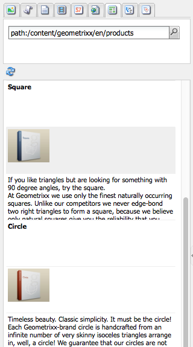

# Creación: el entorno y las herramientas {#authoring-the-environment-and-tools}

El entorno de creación AEM ofrece varios mecanismos para organizar y editar el contenido. Se puede acceder a las herramientas desde varios editores de páginas y distintas consolas.

## Administración del sitio {#site-administration}

El **Sitios web** La consola de le permite administrar y navegar por el sitio web. Mediante los dos paneles, se puede expandir la estructura del sitio web y realizar acciones en el elemento requerido:

## Edición del contenido de la página {#editing-your-page-content}

Hay un editor de páginas independiente con la IU clásica, que utiliza el buscador de contenido y la barra de tareas:

`https://localhost:4502/cf#/content/geometrixx/en/products/triangle.html`

## Acceso a la Ayuda   {#accessing-help}

Varios **Ayuda** AEM se puede acceder directamente a los recursos desde dentro de las siguientes ubicaciones:

Además de acceder a [ayuda de las barras de herramientas de la consola](/help/sites-classic-ui-authoring/author-env-basic-handling.md#accessing-help), también puede acceder a la ayuda de la barra de tareas (mediante el icono ? icono) al editar una página:

O utilizando el **Ayuda** en el cuadro de diálogo de edición de componentes específicos; esto mostrará la ayuda contextual.

## Sidekick {#sidekick}

El **Componentes** de la barra de tareas le permite examinar los componentes disponibles para añadirlos a la página actual. El grupo requerido se puede expandir y, a continuación, un componente se arrastra a la ubicación requerida en la página.

## El buscador de contenido {#the-content-finder}

El buscador de contenido es una forma rápida y sencilla de encontrar recursos o contenido dentro del repositorio al editar una página.

Puede utilizar el buscador de contenido para localizar una amplia gama de recursos. Si procede, puede arrastrar un elemento y colocarlo en un párrafo de la página:

* [Imágenes](#finding-images)
* [Documentos](#finding-documents)
* [Películas](#finding-movies)
* [Explorador de Dynamic Media](/help/sites-administering/scene7.md#scene7contentbrowser)
* [Páginas](#finding-pages)

* [Párrafos](#referencing-paragraphs-from-other-pages)
* [Productos](#products)
* O a [examinar el sitio web por estructura de repositorio](#the-content-finder)

Con todas las opciones puede [buscar elementos específicos](#the-content-finder).

### Búsqueda de imágenes {#finding-images}

Esta pestaña enumera todas las imágenes del repositorio.

Después de crear un párrafo de imagen en la página, puede arrastrar un elemento y colocarlo en el párrafo.

### Búsqueda de documentos {#finding-documents}

Esta pestaña enumera todos los documentos del repositorio.

Después de crear un párrafo de descarga en la página, puede arrastrar un elemento y colocarlo en el párrafo.

### Búsqueda de películas {#finding-movies}

Esta pestaña enumera todas las películas (por ejemplo, elementos de Flash) del repositorio.

Después de crear un párrafo adecuado (por ejemplo, un Flash) en la página, puede arrastrar un elemento y soltarlo en el párrafo.

### Productos {#products}

Esta pestaña enumera cualquier producto. Después de crear un párrafo adecuado (por ejemplo, Producto) en la página, puede arrastrar un elemento y soltarlo en el párrafo.

### Búsqueda de páginas {#finding-pages}

Esta pestaña muestra todas las páginas. Haga doble clic en cualquier página para abrirla y editarla.

### Hacer referencia a párrafos de otras páginas {#referencing-paragraphs-from-other-pages}

Esta pestaña le permite buscar otra página. Se enumerarán todos los párrafos de esa página. A continuación, puede arrastrar un párrafo a la página actual, lo que creará una referencia al párrafo original.

### Uso de la vista de repositorio completa {#using-the-full-repository-view}

Esta pestaña muestra todos los recursos del repositorio.

### Uso de la búsqueda con el navegador de contenido {#using-search-with-the-content-browser}

En todas las opciones, puede buscar elementos específicos. Se enumerarán todas las etiquetas y todos los recursos que coincidan con el patrón de búsqueda:

También pueden utilizarse caracteres comodín para la búsqueda. Los caracteres comodín admitidos son:

* `*`
coincide con una secuencia de cero o más caracteres.

* `?`
coincide con un solo carácter.

>[!NOTE]
>
>Hay una pseudopropiedad &quot;name&quot; que debe usarse para realizar una búsqueda con comodines.

Por ejemplo, si hay una imagen disponible con el nombre:

`ad-nmvtis.jpg`

lo encontrarán los siguientes patrones de búsqueda (y cualquier otra imagen que coincida con el patrón):

* `name:*nmv*`
* `name:AD*`
la coincidencia de caracteres es *no* distingue mayúsculas de minúsculas.

* `name:ad?nm??is.*`
puede utilizar cualquier número de caracteres comodín en una consulta.

>[!NOTE]
>
>También puede utilizar [SQL2](https://helpx.adobe.com/experience-manager/6-5/sites/developing/using/reference-materials/javadoc/org/apache/jackrabbit/commons/query/sql2/package-summary.html) buscar.

## Mostrando referencias {#showing-references}

AEM le permite ver qué páginas están vinculadas a la página en la que está trabajando actualmente.

Para mostrar referencias de página directas:

1. En la barra de tareas, seleccione **Página** Icono de pestaña.

   

1. Seleccionar **Mostrar referencias...** AEM Se abrirá la ventana Referencias (References) y se mostrarán las páginas que hacen referencia a la página seleccionada, incluidas sus rutas.

   

En determinadas situaciones, el Sidekick puede realizar otras acciones, como las siguientes:

* [Lanzamientos](/help/sites-classic-ui-authoring/classic-launches.md)
* [Live Copies](/help/sites-administering/msm.md)

* [Modelo](/help/sites-administering/msm-best-practices.md)

Otros [las relaciones entre páginas se pueden ver en la consola Sitios web](/help/sites-classic-ui-authoring/author-env-basic-handling.md#page-information-on-the-websites-console).

## Registro de auditoría {#audit-log}

El **Registro de auditoría** se puede acceder a desde el **Información** pestaña de la barra de tareas. Enumera las acciones recientes realizadas en la página actual; por ejemplo:

## Información de la página {#page-information}

La consola Sitio web también [proporciona información sobre el estado actual de la página](/help/sites-classic-ui-authoring/author-env-basic-handling.md#page-information-on-the-websites-console) como publicación, modificación, bloqueado, livecopy, etc.

## Modos de página   {#page-modes}

Al editar una página con la IU clásica, hay varios modos a los que se puede acceder mediante los iconos de la parte inferior de la barra de tareas:

La fila de iconos de la parte inferior del Sidekick se utiliza para cambiar los modos de trabajo de las páginas:

* [Editar](/help/sites-classic-ui-authoring/classic-page-author-edit-mode.md)
Este es el modo predeterminado y permite editar la página, añadir o eliminar componentes y realizar otros cambios.

* [Previsualizar](/help/sites-classic-ui-authoring/classic-page-author-edit-content.md#previewing-pages)
Este modo permite obtener una vista previa de la página como si apareciera en el sitio web en su forma final.

* [Diseño](/help/sites-classic-ui-authoring/classic-page-author-design-mode.md#main-pars-procedure-0)
En este modo, puede editar el diseño de la página configurando los componentes accesibles.

>[!NOTE]
>
>También hay otras opciones disponibles:
>
>* [Andamiaje](/help/sites-classic-ui-authoring/classic-feature-scaffolding.md)
>* [Client Context](/help/sites-administering/client-context.md)
>* Sitios web: abre la consola Sitios web.
>* Volver a cargar: actualizará la página.

## Métodos abreviados de teclado {#keyboard-shortcuts}

Hay varios [métodos abreviados del teclado](/help/sites-classic-ui-authoring/classic-page-author-keyboard-shortcuts.md) disponibles.
