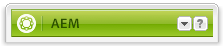

# Creación: Entorno y herramientas {#authoring-the-environment-and-tools}

El entorno de creación AEM ofrece varios mecanismos para organizar y editar el contenido. Se puede acceder a las herramientas desde varios editores de páginas y distintas consolas.

## Administración de sitios {#site-administration}

La consola **Sitios web** permite desplazarse por el sitio web y administrarlo. La estructura del sitio web, dividida en dos paneles, se puede ampliar para realizar acciones en los elementos necesarios:

## Edición del contenido de la página {#editing-your-page-content}

Hay un editor de páginas independiente en la IU clásica; utiliza el buscador de contenido y la barra de tareas:

`https://localhost:4502/cf#/content/geometrixx/en/products/triangle.html`

## Acceso a la Ayuda {#accessing-help}

Se puede acceder a varios medios de **Ayuda** directamente desde AEM:

Además de poder acceder a la [ayuda desde las barras de herramientas de la consola](/help/sites-classic-ui-authoring/author-env-basic-handling.md#accessing-help), también se puede acceder a ella desde la barra de tareas (utilizando el icono ?) al editar una página:

O con el botón **Ayuda** del cuadro de diálogo de edición de componentes específicos; esto mostrará la ayuda contextual.

## Barra de tareas {#sidekick}

La ficha **Componentes** de la barra de tareas le permite explorar los componentes que se pueden añadir a la página actual. El grupo requerido puede ampliarse y, a continuación, un componente puede arrastrarse a la ubicación deseada de la página.

## Buscador de contenido {#the-content-finder}

El buscador de contenido es una forma rápida y fácil de encontrar activos y contenido dentro del repositorio mientras se edita una página.

Puede utilizar el buscador de contenido para ubicar toda una serie de medios. Cuando convenga, puede arrastrar un elemento y colocarlo en un párrafo de la página:

* [Imágenes](#finding-images)
* [Documentos](#finding-documents)
* [Películas](#finding-movies)
* [Navegador Dynamic Media](/help/sites-administering/scene7.md#scene7contentbrowser)
*  [Páginas](/help/sites-classic-ui-authoring/classic-page-author-env-tools.md#finding-pages)

* [Párrafos](#referencing-paragraphs-from-other-pages)
* [Productos](/help/sites-classic-ui-authoring/classic-page-author-env-tools.md#products)
* O bien para [examinar el sitio web según la estructura del repositorio](#the-content-finder)

Puede [buscar elementos específicos](#the-content-finder) con todas las opciones.

### Búsqueda de imágenes {#finding-images}

En esta ficha aparece una lista con las imágenes del repositorio.

Después de crear un párrafo de imagen en la página, puede arrastrar un elemento y colocarlo adentro del párrafo.

### Búsqueda de documentos {#finding-documents}

En esta ficha, se muestra una lista con los documentos del repositorio.

Después de crear un párrafo Download en la página, puede arrastrar un elemento y colocarlo adentro del párrafo.

### Búsqueda de películas {#finding-movies}

Esta ficha enumera las películas (por ejemplo, elementos de Flash) del repositorio.

Después de crear un párrafo apropiado (por ejemplo, Flash) en la página, puede arrastrar un elemento y colocarlo dentro del párrafo.

### Productos {#products}

Esta ficha enumera los productos. Después de crear un párrafo apropiado (por ejemplo, Producto) en la página, puede arrastrar un elemento y colocarlo dentro del párrafo.

### Búsqueda de páginas {#finding-pages}

Esta ficha muestra todas las páginas. Haga clic con el doble en cualquier página para abrirla y editarla.

### Referencia a párrafos de otras páginas {#referencing-paragraphs-from-other-pages}

Esta ficha permite buscar otra página. Se mostrará una lista con todos los párrafos de esa página. Luego puede arrastrar un párrafo a su página actual para crear una referencia al párrafo original.

### Uso de la vista de repositorio completo {#using-the-full-repository-view}

En esta ficha, se muestran todos los medios del repositorio.

### Utilización de la búsqueda con el navegador de contenido {#using-search-with-the-content-browser}

Puede buscar elementos específicos en todas las opciones. Cualquier etiqueta y medio que coincida con el patrón de búsqueda aparece en una lista:

También puede utilizar caracteres comodín en las búsquedas. Se admiten los caracteres comodín siguientes:

* `*`
Hace coincidir una secuencia de cero o más caracteres.

* `?`
Hace coincidir un solo carácter.

>[!NOTE]
>
>Hay una seudopropiedad &quot;name&quot; que debe utilizarse para realizar búsquedas de comodín.

Por ejemplo, si hay una imagen disponible con el nombre:

`ad-nmvtis.jpg`

Los siguientes patrones de búsqueda la encontrarán (así como cualquier otra imagen que coincida con el patrón):

* `name:*nmv*`
* `name:AD*`
la coincidencia de caracteres *no* distingue entre mayúsculas y minúsculas.

* `name:ad?nm??is.*`
en una consulta, puede utilizar tantos caracteres comodín como desee.

>[!NOTE]
>
>También puede utilizar la búsqueda [SQL2](https://helpx.adobe.com/experience-manager/6-5/sites/developing/using/reference-materials/javadoc/org/apache/jackrabbit/commons/query/sql2/package-summary.html).

## Mostrar referencias {#showing-references}

AEM permite ver qué páginas están vinculadas a la página con la que está trabajando.

Para mostrar referencias de páginas directas:

1. En la barra de tareas, seleccione el icono de ficha **Página**.

   

1. Seleccione **Mostrar referencias...** AEM abre la ventana Referencias y muestra qué páginas hacen referencia a la página seleccionada, incluidas sus rutas.

   

En determinadas situaciones, hay disponibles acciones adicionales en la barra de tareas, como:

* [Lanzamientos](/help/sites-classic-ui-authoring/classic-launches.md)
* [Live Copies](/help/sites-administering/msm.md)

* [Modelo](/help/sites-administering/msm-best-practices.md)

Se pueden ver otras [relaciones entre páginas en la consola Sitios web](/help/sites-classic-ui-authoring/author-env-basic-handling.md#page-information-on-the-websites-console).

## Registro de auditorías {#audit-log}

Se puede acceder al **registro de auditoría** desde la ficha **Información** de la barra de tareas. Enumera las acciones recientes realizadas en la página actual; por ejemplo:

## Información de la página {#page-information}

La consola Sitio web también [proporciona información sobre el estado actual de la página](/help/sites-classic-ui-authoring/author-env-basic-handling.md#page-information-on-the-websites-console) como publicación, modificación, bloqueo, Live Copy, etc.

## Modos de página    {#page-modes}

Al editar una página con la IU clásica hay varios modos a los que se puede acceder mediante los iconos en la parte inferior de la barra de tareas:

La fila de iconos en la parte inferior de la barra de tareas se usa para cambiar de modo al trabajar con las páginas:

* [Editar](/help/sites-classic-ui-authoring/classic-page-author-edit-mode.md) Este es el modo predeterminado y permite editar la página, agregar o eliminar componentes y hacer otros cambios.

* [Previsualización](/help/sites-classic-ui-authoring/classic-page-author-edit-content.md#previewing-pages) Este modo permite obtener una vista previa de la página tal y como aparecería en el sitio web con el formato final.

* [Diseño](/help/sites-classic-ui-authoring/classic-page-author-design-mode.md#main-pars-procedure-0)
En este modo, puede configurar los componentes accesibles para editar el diseño de la página.

>[!NOTE]
>
>Hay otras opciones disponibles:
>
>* [Andamiaje](/help/sites-classic-ui-authoring/classic-feature-scaffolding.md)
>* [ClientContext](/help/sites-administering/client-context.md)
>* Sitios web: abrirá la consola Sitios web
>* Volver a cargar: actualizará la página.

## Métodos abreviados del teclado {#keyboard-shortcuts}

Hay varios [métodos abreviados del teclado](/help/sites-classic-ui-authoring/classic-page-author-keyboard-shortcuts.md) disponibles.
