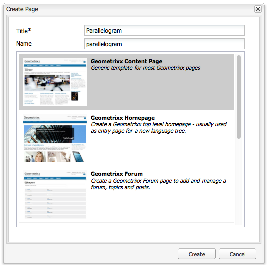

# Crear y organizar páginas{#creating-and-organizing-pages}

En esta sección se describe cómo crear y administrar páginas con Adobe Experience Manager (AEM) para que luego pueda [crear contenido](/help/sites-classic-ui-authoring/classic-page-author-edit-content.md) en esas páginas.

>[!NOTE]
>
>Su cuenta necesita el [derechos de acceso adecuados](/help/sites-administering/security.md) y [permissions](/help/sites-administering/security.md#permissions) para realizar acciones en las páginas, por ejemplo, crear, copiar, mover, editar o eliminar.
>
>Si se producen problemas, le sugerimos que se ponga en contacto con el administrador del sistema.

## Organizar el sitio web {#organizing-your-website}

Como creador, deberá organizar el sitio web dentro de AEM. Esto implica crear y dar nombre a las páginas de contenido para que:

* puede encontrarlas fácilmente en el entorno de creación
* los visitantes del sitio pueden explorarlas fácilmente en el entorno de publicación

También puede usar [carpetas](#creating-a-new-folder) para organizar el contenido.

La estructura de un sitio web puede considerarse como un *estructura de árbol* que contiene las páginas de contenido. Los nombres de estas páginas de contenido se usan para formar las direcciones URL, mientras que el título se muestra cuando se visualiza el contenido de la página.

A continuación se muestra un extracto del sitio de la Geometrixx; donde, por ejemplo, la variable `Triangle` se accederá a la página:

* Entorno de creación

   `http://localhost:4502/cf#/content/geometrixx/en/products/triangle.html`

* Entorno de publicación

   `http://localhost:4503/content/geometrixx/en/products/triangle.html`

   Según la configuración de su instancia, use `/content` puede ser opcional en el entorno de publicación.

```xml
  /content
    /geometrixx
      /en
        /toolbar...
        /products
          /triangle
            /overview
            /features
          /square...
          /circle...
          /...
        /...
      /fr...
      /de...
      /es...
      /...
    /...
```

Esta estructura se puede ver desde la consola Sitios web , que puede usar para [navegar por la estructura de árbol](/help/sites-classic-ui-authoring/author-env-basic-handling.md#main-pars-text-15).


### Convenciones de nomenclatura de páginas {#page-naming-conventions}

Al crear una página nueva, hay dos campos clave:

* **[Título](#title)**:

   * Se muestra al usuario en la consola, en la parte superior del contenido de la página al editar. 
   * Este campo es obligatorio.

* **[Nombre](#name)**:

   * Se usa para generar la URI.
   * La entrada del usuario en este campo es opcional. Si no se especifica, el nombre se deriva del título.

Al crear una página nueva, AEM [valide el nombre de página según las convenciones](/help/sites-developing/naming-conventions.md) impuesto por AEM y JCR.

La implementación y la lista de caracteres permitidos difieren ligeramente según la IU (es más extensa para la IU táctil), pero el mínimo permitido es:

* De &quot;a&quot; a &quot;z&quot;
* De la &quot;A&quot; a la &quot;Z&quot;
* De &quot;0&quot; a &quot;9&quot;
* _ (guion bajo)
* `-` (guion/signo menos)

Utilice solo estos caracteres si desea asegurarse de que se aceptan o utilizan (si necesita información detallada de todos los caracteres permitidos, consulte [las convenciones de nomenclatura](/help/sites-developing/naming-conventions.md)).

#### Título {#title}

Si proporciona solo un **título** de página al crear una nueva página, AEM derivará el **nombre** de página de esta cadena y lo [validará según las convenciones](/help/sites-developing/naming-conventions.md) impuestas por AEM y JCR. En ambas IU a **Título** se aceptará el campo que contiene caracteres no válidos, pero los caracteres no válidos se sustituirán en el nombre derivado. Por ejemplo:

| Título | Nombre derivado |
|---|---|
| Schön | schoen.html |
| SC%&amp;&amp;ast;ç+ | sc---c-.html |

#### Nombre {#name}

Al indicar un valor **Nombre** cuando se cree una página, AEM [validará el nombre según las convenciones](/help/sites-developing/naming-conventions.md) impuestas por AEM y JCR.

En la IU clásica, **no se pueden introducir caracteres no válidos** en el **Nombre** campo .

>[!NOTE]
>En la IU táctil puede **no se pueden enviar caracteres no válidos** en el **Nombre** campo . Cuando AEM detecte caracteres no válidos, se resaltará el campo y se mostrará un mensaje explicativo para indicar los caracteres que deben eliminarse o reemplazarse.

>[!NOTE]
>
>Evite utilizar un código de dos letras como se define en ISO-639-1, a menos que sea una raíz de idioma.
>
>Consulte [Preparación del contenido para su traducción](/help/sites-administering/tc-prep.md) para obtener más información.

### Plantillas {#templates}

En AEM, una plantilla especifica un tipo especializado de página. Se utilizará una plantilla como base para cualquier página nueva que se esté creando.

La plantilla define la estructura de una página; se incluyen una imagen en miniatura y otras propiedades. Por ejemplo, puede tener plantillas separadas para páginas de productos, mapas del sitio e información de contacto. Las plantillas están compuestas de [componentes](#components).

AEM incluye varias plantillas listas para usar. Las plantillas que se presentarán dependerán del sitio web individual y la información que debe suministrarse (al crear la nueva página) dependerá de la IU que se utilice. Los campos principales son:

* **Título** El título se muestra en la página web resultante.

* **Nombre** Se utiliza al dar nombre a la página.

* **Plantilla** Una lista de plantillas disponibles para usar durante la generación de la nueva página.

### Componentes {#components}

Componentes son los elementos ofrecidos por AEM para que pueda añadir tipos de contenido específicos. AEM incluye una serie de componentes integrados que proporcionan una amplia funcionalidad; entre ellos se incluyen:

* Texto
* Imagen
* Presentación de diapositivas
* Vídeo
* muchos más

Una vez que haya creado y abierto una página, puede [añadir contenido mediante los componentes](/help/sites-classic-ui-authoring/classic-page-author-edit-content.md#insertinganewparagraph), disponible en el [barra de tareas](/help/sites-classic-ui-authoring/classic-page-author-env-tools.md#sidekick).

## Administrar páginas {#managing-pages}

### Creación de una nueva página {#creating-a-new-page}

A menos que se hayan creado todas las páginas por adelantado, antes de poder empezar a crear contenido, debe crear una página:

1. En el **Sitios web** , seleccione el nivel en el que desea crear una página nueva.

   En el ejemplo siguiente, está creando una página debajo del nivel **Productos** - se muestra en el panel izquierdo; el panel derecho muestra las páginas que ya existen en el nivel inferior **Productos**.

   

1. En el **Nuevo...** (haga clic en la flecha situada junto a **Nuevo...**), seleccione **Nueva página...**. La variable **Crear página** se abre.

   Hacer clic **Nuevo...** también actúa como método abreviado para **Nueva página...** .

1. La variable **Crear página** permite:

   * Proporcione un **Título**; se muestra al usuario.
   * Proporcione un **Nombre**; se utiliza para generar el URI. Si no se especifica, el nombre se derivará del título.

      * Si proporciona una página **Nombre** al crear una página nueva, AEM [valide el nombre según las convenciones](/help/sites-developing/naming-conventions.md) impuesta por AEM y JCR.
      * En la IU clásica, **no se pueden introducir caracteres no válidos** en el **Nombre** campo .
   * Haga clic en la plantilla que desee utilizar para crear la nueva página.

      La plantilla se utiliza como base para la nueva página; por ejemplo, para determinar el diseño básico de una página de contenido.
   >[!NOTE]
   >
   >Consulte [Convenciones de nomenclatura de páginas](#page-naming-conventions).

   La información mínima necesaria para crear una página nueva es la **Título** y la plantilla requerida.

   

   >[!NOTE]
   >
   >Si desea utilizar caracteres Unicode en las direcciones URL, establezca el Alias ( `sling:alias`), propiedad ([propiedades de página](/help/sites-classic-ui-authoring/classic-page-author-edit-page-properties.md)).

1. Haga clic en **Crear** para crear la página. Regresa a la variable **Sitios web** consola donde puede ver una entrada para la nueva página.

   La consola proporciona información sobre la página (por ejemplo, cuándo se editó por última vez y quién lo hizo) que se actualiza según sea necesario.

   >[!NOTE]
   >
   >También puede crear una página al editar una página existente. Uso de **Crear página secundaria **desde la **Página** de la barra de tareas, creará una nueva página directamente debajo de la página que se esté editando.

### Abrir una página para su edición {#opening-a-page-for-editing}

Puede abrir la página para [editado](/help/sites-classic-ui-authoring/classic-page-author-edit-content.md#editing-a-component-content-and-properties) mediante varios métodos:

* De **Sitios web** consola, puede **doble clic** la entrada de página para abrirla y editarla.

* De **Sitios web** consola, puede **clic con el botón derecho** (menú contextual) el elemento de página y, a continuación, seleccione **Apertura** del menú .

* Después de abrir una página, puede navegar a otras páginas dentro del sitio (para editarlas) haciendo clic en hipervínculos.

### Copiar y pegar una página    {#copying-and-pasting-a-page}

Al copiar, puede copiar:

* una sola página
* una página junto con todas las subpáginas

1. En el **Sitios web** , seleccione la página que desee copiar.

   >[!NOTE]
   >
   >En esta fase, es irrelevante si desea copiar una sola página o las subpáginas subyacentes.

1. Haga clic en **Copiar**.

1. Vaya a la nueva ubicación y haga clic en:

   * **Pegar** : para pegar la página junto con todas las subpáginas
   * **Mayús + Pegar** - para pegar solo la página seleccionada

   Las páginas se pegan en la nueva ubicación.

   >[!NOTE]
   >
   >El nombre de página se puede ajustar automáticamente si una página existente ya tiene el mismo nombre.

   >[!NOTE]
   >
   >También puede utilizar **Copiar página** de la variable **Página** de la barra de tareas. Se abrirá un cuadro de diálogo en el que puede especificar el destino, etc.

### Mover una página o cambiarle el nombre {#moving-or-renaming-page}

>[!NOTE]
>
>El cambio de nombre de una página también está sujeto a las [Convenciones de nomenclatura de páginas](#page-naming-conventions) al especificar el nuevo nombre de página.

El procedimiento para mover o cambiar el nombre de una página es el mismo. Con la misma acción puede:

* mover una página a una nueva ubicación
* cambiar el nombre de una página en la misma ubicación
* mover una página a una nueva ubicación y cambiarle el nombre al mismo tiempo

AEM le ofrece la funcionalidad de actualizar vínculos internos a la página que está moviendo o cuyo nombre está cambiando. Esto se puede hacer página por página para proporcionar flexibilidad total.

Para mover o cambiar el nombre de una página:

1. Existen varios métodos para activar un movimiento:

   * En el **Sitios web** consola, haga clic en para seleccionar la página y, a continuación, seleccione **Mover...**
   * En el **Sitios web** consola, también puede seleccionar el elemento de página y, a continuación, **clic con el botón derecho** y seleccione **Mover...**
   * Al editar una página, puede seleccionar **Mover página** de la variable **Página** de la barra de tareas.

1. La variable **Mover** aperturas de ventana; aquí puede especificar una nueva ubicación, un nuevo nombre para la página o ambos.

   

   La página también enumera las páginas que hacen referencia a la página que se está moviendo. Según el estado de la página de referencia, es posible que pueda ajustar esos vínculos en las páginas o volver a publicarlas.

1. Rellene los campos siguientes, según corresponda:

   * **Destino**

      Utilice el mapa del sitio (disponible mediante el selector desplegable) para seleccionar la ubicación a la que debería moverse la página.

      Si solo está cambiando el nombre de la página, ignore este campo.

   * **Mover**

      Especifique la página que se moverá (esto generalmente se completa de forma predeterminada, según cómo y dónde inició la acción de mover).

   * **Cambiar nombre a**

      La etiqueta de la página actual se muestra de forma predeterminada. Especifique la nueva etiqueta de página, si es necesario.

   * **Ajustar**

      Actualice los vínculos en la página mostrada que apuntan a la página movida: por ejemplo, si la página A tiene vínculos a la página B, AEM ajusta los vínculos en la página A en caso de que mueva la página B.

      Se puede seleccionar o anular la selección para cada página de referencia individual.

   * **Volver a publicar el formulario**

      Volver a publicar la página de referencia; de nuevo, esto se puede seleccionar para cada página individual.
   >[!NOTE]
   >
   >Si la página ya estaba activada, al moverla se desactivará automáticamente. De forma predeterminada, se reactivará cuando se complete el movimiento, pero esto puede cambiar desmarcando la variable **Volver a publicar** para la página de la **Mover** ventana.

1. Haga clic en **Mover**. Se requiere confirmación. Haga clic en **OK** para confirmar.

   >[!NOTE]
   >
   >El título de la página no se actualizará.

### Eliminar una página {#deleting-a-page}

1. Puede eliminar una página de varias ubicaciones:

   * Dentro de **Sitios web** consola, haga clic en para seleccionar la página, luego haga clic con el botón derecho y seleccione **Eliminar** del menú resultante.
   * Dentro de **Sitios web** consola, haga clic en para seleccionar la página y, a continuación, seleccione **Eliminar** en el menú de la barra de herramientas.
   * Dentro de la barra de tareas, use la variable **Página** pestaña para seleccionar **Eliminar página** : esto elimina la página que está abierta actualmente.

1. Después de haber seleccionado para eliminar una página, debe confirmar la solicitud, ya que la acción no se puede deshacer.

   >[!NOTE]
   >
   >Después de eliminarla, si la página se ha publicado, puede restaurar la última versión (o una versión específica), pero es posible que no tenga exactamente el mismo contenido que la última versión si se han realizado más modificaciones. Consulte [Cómo restaurar páginas](/help/sites-classic-ui-authoring/classic-page-author-work-with-versions.md#restoringpages) para obtener más información.

>[!NOTE]
>
>Si una página ya está activada, se desactivará automáticamente antes de eliminarse.

### Bloquear una página   {#locking-a-page}

Puede [bloquear/desbloquear una página](/help/sites-classic-ui-authoring/classic-page-author-edit-content.md#locking-a-page) desde una consola o al editar una página individual. La información sobre si una página está bloqueada también se muestra en ambas ubicaciones.

### Crear una nueva carpeta {#creating-a-new-folder}

>[!NOTE]
>
>Las carpetas también están sujetas al [Convenciones de nomenclatura de páginas](#page-naming-conventions) al especificar el nuevo nombre de carpeta.

1. Abra el **Sitios web** y vaya a la ubicación requerida.
1. En el **Nuevo...** (haga clic en la flecha situada junto a **Nuevo...**), seleccione **Nueva carpeta...**.
1. La variable **Crear carpeta** se abrirá. Aquí puede indicar el **Nombre** y el **Título**:

   

1. Seleccione **Crear** para crear la carpeta.
