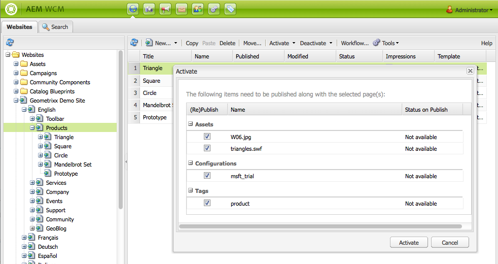

# Publicar páginas{#publishing-pages}

Cuando haya creado y revisado el contenido en el entorno de creación, el objetivo consiste en que esté disponible en su sitio web público (su entorno de publicación).

Esta acción se conoce como publicar una página. Si desea quitar una página del entorno de publicación, la acción es la de cancelar la publicación. Tanto al publicar como al cancelar la publicación, la página permanece disponible en el entorno de creación para realizar cualquier cambio, hasta que decida eliminarla.

También puede publicar una página (o cancelar su publicación) inmediatamente o en un momento posterior predefinido.

>[!NOTE]
>
>Algunos términos relacionados con la publicación pueden llevar a confusión:
>
>* **Publicar o cancelar la publicación**
   >  Estos son los términos principales de las acciones que harán que el contenido esté disponible o no para los visitantes en su entorno de publicación.
   >
   >
* **Activar o desactivar**
   >  Estos términos son sinónimos de publicar y cancelar la publicación.
   >
   >
* **Replicar o replicación**
   >  Son los términos técnicos que describen el movimiento de datos (p. ej. contenido de página, archivos, código, comentarios del usuario) de un entorno a otro, como al publicar o replicar a la inversa los comentarios del usuario.
>

>[!NOTE]
>
>Si no dispone de los privilegios necesarios para publicar en una página concreta:
>
>* Se activará un flujo de trabajo para notificar a la persona adecuada la solicitud de publicación.
>* Se mostrará un mensaje para notificárselo (durante un breve periodo de tiempo).

>

## Publicar una página {#publishing-a-page}

Existen dos métodos para activar una página:

* [desde la consola Sitios web](#activating-a-page-from-the-websites-console)
* [desde la barra de tareas de la propia página](#activating-a-page-from-sidekick)

>[!NOTE]
>
>También puede activar un subárbol de varias páginas mediante la opción [Activar árbol](#howtoactivateacompletesectiontreeofyourwebsite) de la consola Herramientas.

### Activar una página desde la consola Sitios web {#activating-a-page-from-the-websites-console}

Puede activar páginas en la consola Sitios web. Una vez que haya abierto una página y modificado el contenido, debe regresar a la consola Sitios web:

1. En la consola Sitios web, seleccione la página que desee activar.
1. Seleccione **Activar** desde el menú superior o desde el menú desplegable en el elemento de página seleccionado.

   Para activar el contenido de la página y todas sus subpáginas, use la consola [**Herramientas**.](/help/sites-classic-ui-authoring/classic-page-author-publish-pages.md#howtoactivateacompletesectiontreeofyourwebsite)

   

   >[!NOTE]
   >
   >Si es necesario, AEM solicita que active o vuelva a activar todo recurso vinculado a la página. Puede seleccionar o anular la selección de las casillas de verificación para activar esos recursos.

1. Si es necesario, AEM solicita que active o vuelva a activar todo recurso vinculado a la página. Puede seleccionar o anular la selección de las casillas de verificación para activar esos recursos.

   

1. WCM AEM activa el contenido seleccionado. Las páginas publicadas aparecen en la consola Sitios web (marcadas en verde) con información sobre quién activó el contenido y la fecha y hora de la activación.

   

### Activación de una página de la barra de tareas {#activating-a-page-from-sidekick}

También puede activar una página cuando la tiene abierta para edición.

Una vez que haya abierto la página y modificado el contenido, haga lo siguiente:

1. Seleccione la ficha **Página** en la barra de tareas.
1. Haga clic en **Activar página**. Aparece un mensaje en la parte superior derecha de la ventana, que confirma la activación de la página.

## Cancelar la publicación de una página {#unpublishing-a-page}

Para quitar una página del entorno de publicación, debe desactivar el contenido.

Para desactivar una página:

1. En la consola Sitios web, seleccione la página que desee desactivar.
1. Seleccione **Desactivar** desde el menú superior o desde el menú desplegable en el elemento de página seleccionado. Se solicita que confirme la eliminación.

   

1. Actualice la [consola Sitios web](/help/sites-classic-ui-authoring/author-env-basic-handling.md#page-information-on-the-websites-console) y el contenido se marcará en rojo, lo que significa que ya no está publicado.

   

## Activar/Desactivar más tarde {#activate-deactivate-later}

### Activar más tarde {#activate-later}

Si desea programar la activación para un momento posterior:

1. En la consola Sitios web, vaya al menú **Activar** y seleccione **Activar más tarde**.
1. En el cuadro de diálogo que se abre, especifique la fecha y la hora de la activación y haga clic en **Aceptar**. Esto crea una versión de la página que se activa a la hora especificada.

   

Si se activa más tarde, se inicia un flujo de trabajo para activar esta versión de la página a la hora especificada. Por el contrario, si se desactiva más tarde, se inicia un flujo de trabajo para desactivar esta versión de la página a una hora específica.

Si desea cancelar esta activación/desactivación, vaya a la [consola Flujo de trabajo](/help/sites-administering/workflows-administering.md#main-pars_title_3-yjqslz-refd) para finalizar el flujo de trabajo correspondiente.

### Desactivar más tarde  {#deactivate-later}

Si desea programar la desactivación para un momento posterior:

1. En la consola Sitio web, vaya al menú **Desactivar** y seleccione **Desactivar más tarde**.

1. En el cuadro de diálogo que se abre, especifique la fecha y hora de la desactivación y haga clic en **Aceptar**.

   

**Desactivar más tarde** inicia un flujo de trabajo para desactivar esta versión de la página a una hora específica.

Si desea cancelar esta desactivación, vaya a la [consola Flujo de trabajo](/help/sites-administering/workflows-administering.md#main-pars_title_3-yjqslz-refd) para finalizar el flujo de trabajo correspondiente.

## Activación/Desactivación programada (periodo de activación/desactivación)  {#scheduled-activation-deactivation-on-off-time}

Puede programar las horas en las que la página se publicará o dejará de publicar mediante las opciones **Tiempo de activación** y **Tiempo de desactivación**, que se pueden definir en las [Propiedades de página](/help/sites-classic-ui-authoring/classic-page-author-edit-page-properties.md).

### Determinación del estado de publicación de la página {#determining-page-publication-status-classic-ui}

El estado se puede ver desde la [consola Sitios web](/help/sites-classic-ui-authoring/author-env-basic-handling.md#page-information-on-the-websites-console). Los colores indican el estado de publicación.

## Activación de una sección completa (árbol) del sitio web  {#activating-a-complete-section-tree-of-your-website}

Desde la ficha **Sitios web**, puede activar cada página por separado. Cuando haya especificado o actualizado una cantidad considerable de páginas de contenido (todas residentes en la misma página raíz), será más fácil activar el árbol entero con una sola acción. También puede hacer un ensayo para emular una activación y resaltar qué páginas se activarían.

1. Abra la consola **Herramientas** seleccionándola en la página **Bienvenida** y luego haga clic con el doble **Replicación** para abrir la consola ( `https://localhost:4502/etc/replication.html`).

   

1. En la consola **Replicación**, haga clic en **Activar árbol**.

   Se mostrará la siguiente ventana ( `https://localhost:4502/etc/replication/treeactivation.html`).

   

1. Introduzca la **ruta de Inicio**. Esto especifica la ruta a la raíz de la sección que desea activar (publicar). Esta página y todas las páginas debajo se consideran para la activación (o se utilizan en la emulación si se selecciona un ensayo).
1. Active los criterios de selección según necesite:

   * **Solo modificado**: active únicamente las páginas modificadas.
   * **Solo activado**: active únicamente las páginas (ya) activadas. Actúa como una forma de reactivación.
   * **Ignorar desactivado**: ignore toda página desactivada.

1. Seleccione la acción que desee realizar:

   1. Seleccione **Ejecución seca** si desea comprobar qué páginas *se activarían*. Esto es solo una emulación, no se activará ninguna página.

   1. Seleccione **Activar** si desea activar las páginas.
