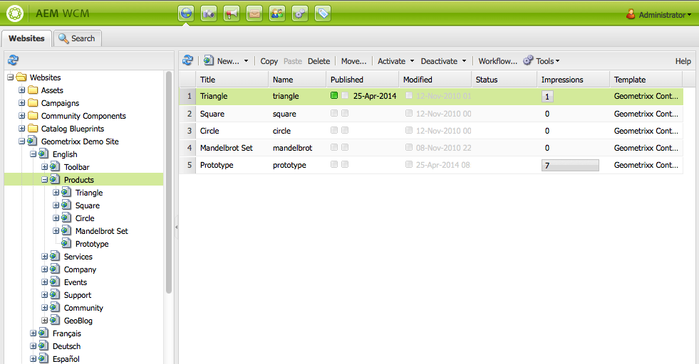

# Publicar páginas{#publishing-pages}

Después de crear y revisar el contenido en el entorno de creación, haga que esté disponible en el sitio web público (su entorno de publicación).

Esto se conoce como publicación de una página. Cuando desea eliminar una página del entorno de publicación, se denomina cancelación de publicación. Al publicar y cancelar la publicación, la página permanece disponible en el entorno de creación para realizar más cambios hasta que la elimine.

También puede publicar una página o cancelar su publicación inmediatamente o en un momento posterior predefinido.

>[!NOTE]
>
>Algunos términos relacionados con la publicación pueden confundirse:
>
>* **Publicar o cancelar la publicación**
   >  Estos son los términos principales de las acciones que harán que el contenido esté disponible o no para los visitantes en su entorno de publicación.
>
>* **Activar o desactivar**
   >  Estos términos son sinónimos de publicar y cancelar la publicación.
>
>* **Replicar o replicación**
   >  Son los términos técnicos que describen el movimiento de datos (p. ej., contenido de página, archivos, código, comentarios del usuario) de un entorno a otro, como al publicar o replicar a la inversa los comentarios del usuario.
>

>[!NOTE]
>
>Si no tiene los privilegios necesarios para publicar una página específica:
>
>* Se activará un flujo de trabajo para notificar a la persona adecuada la solicitud de publicación.
>* Se mostrará un mensaje (durante un breve periodo de tiempo) para notificárselo.
>

## Publicación de una página {#publishing-a-page}

Existen dos métodos para activar una página:

* [desde la consola Sitios web](#activating-a-page-from-the-websites-console)
* [desde la barra de tareas de la propia página](#activating-a-page-from-sidekick)

>[!NOTE]
>
>También puede activar un subárbol de varias páginas mediante [Activar árbol](#howtoactivateacompletesectiontreeofyourwebsite) en la consola Herramientas.

### Activación de una página desde la consola Sitios web {#activating-a-page-from-the-websites-console}

Puede activar páginas en la consola Sitios web . Después de abrir una página y modificar su contenido, vuelva a la consola Sitios web :

1. En la consola Sitios web , seleccione la página que desee activar.
1. Select **Activar**, ya sea desde el menú superior o desde el menú desplegable del elemento de página seleccionado.

   Para activar el contenido de la página y todas sus páginas secundarias, utilice la variable [**Herramientas** consola](/help/sites-classic-ui-authoring/classic-page-author-publish-pages.md#howtoactivateacompletesectiontreeofyourwebsite).

   

   >[!NOTE]
   >
   >Si es necesario, AEM solicita que active o vuelva a activar cualquier recurso vinculado a la página. Puede activar o desactivar las casillas de verificación para activar esos recursos.

1. Si es necesario, AEM solicita que active o vuelva a activar cualquier recurso vinculado a la página. Puede activar o desactivar las casillas de verificación para activar esos recursos.

   

1. AEM WCM activa el contenido seleccionado. La página o páginas publicadas aparecen en el [Consola Sitios web](/help/sites-classic-ui-authoring/author-env-basic-handling.md#page-information-on-the-websites-console) (marcado en verde) con información sobre quién activó el contenido, así como la fecha y hora de la activación.

   

### Activación de una página desde la barra de tareas {#activating-a-page-from-sidekick}

También puede activar una página cuando la tenga abierta para edición.

Una vez que haya abierto la página y modificado su contenido, deberá:

1. Seleccione el **Página** en la barra de tareas.
1. Haga clic en **Activar página**.
Aparece un mensaje en la parte superior derecha de la ventana que confirma la activación de la página.

## Cancelar la publicación de una página {#unpublishing-a-page}

Para quitar una página del entorno de publicación, desactive el contenido.

Para desactivar una página:

1. En la consola Sitios web , seleccione la página que desee desactivar.
1. Select **Desactivar**, ya sea desde el menú superior o desde el menú desplegable del elemento de página seleccionado. Se le pedirá que confirme la eliminación.

   

1. Actualice el [Consola Sitios web](/help/sites-classic-ui-authoring/author-env-basic-handling.md#page-information-on-the-websites-console) y el contenido está marcado en rojo, lo que indica que ya no se publica.

   

## Activar/Desactivar más tarde {#activate-deactivate-later}

### Activar más tarde {#activate-later}

Para programar la activación para un momento posterior:

1. En la consola Sitios web , vaya a la **Activar** y seleccione **Activar más tarde**.
1. En el cuadro de diálogo que se abre, proporcione la fecha y la hora de activación y haga clic en **OK**. Esto crea una versión de la página que se activa a la hora especificada.

   

La activación posterior inicia un flujo de trabajo para activar esta versión de la página a la hora especificada. Por el contrario, si se desactiva más tarde, se inicia un flujo de trabajo para desactivar esta versión de la página a una hora específica.

Si desea cancelar esta activación/desactivación, vaya a la [Consola de flujo de trabajo](/help/sites-administering/workflows-administering.md#main-pars_title_3-yjqslz-refd) para finalizar el flujo de trabajo correspondiente.

### Desactivar más tarde {#deactivate-later}

Para programar la desactivación para un momento posterior:

1. En la consola Sitio web, vaya a la **Desactivar** y seleccione **Desactivar más tarde**.

1. En el cuadro de diálogo que se abre, proporcione la fecha y hora de la desactivación y haga clic en **OK**.

   

**Desactivación tarde** r inicia un flujo de trabajo para desactivar esta versión de la página a una hora específica.

Si desea cancelar esta desactivación, vaya a la [Consola de flujo de trabajo](/help/sites-administering/workflows-administering.md#main-pars_title_3-yjqslz-refd) para finalizar el flujo de trabajo correspondiente.

## Activación/desactivación programada (tiempo de activación/desactivación) {#scheduled-activation-deactivation-on-off-time}

Puede programar las horas en las que se publicará o dejará de publicar una página mediante la **Tiempo de activación** y **Tiempo de inactividad** que se pueden definir en la variable [Propiedades de página](/help/sites-classic-ui-authoring/classic-page-author-edit-page-properties.md).

### Determinación del estado de publicación de la página {#determining-page-publication-status-classic-ui}

El estado se puede ver desde la [Consola Sitios web](/help/sites-classic-ui-authoring/author-env-basic-handling.md#page-information-on-the-websites-console). Los colores indican el estado de publicación.

## Activación de una sección completa (árbol) del sitio web {#activating-a-complete-section-tree-of-your-website}

En el **Sitios web** puede activar las páginas individuales. Cuando haya introducido o actualizado una cantidad considerable de páginas de contenido (todas ellas residentes dentro de la misma página raíz), puede ser más fácil activar todo el árbol en una sola acción. También puede realizar un ensayo para emular una activación y resaltar qué páginas se activarían.

1. Abra el **Herramientas** seleccionando esta opción en la **Bienvenido** y, a continuación, haga doble clic en **Replicación** para abrir la consola ( `https://localhost:4502/etc/replication.html`).

   

1. En el **Replicación** consola, haga clic en **Activar árbol**.

   La siguiente ventana ( `https://localhost:4502/etc/replication/treeactivation.html`).

   

1. Introduzca la variable **Ruta de inicio**. Esto especifica la ruta a la raíz de la sección que desea activar (publicar). Esta página y todas las páginas debajo se consideran para la activación (o se usan en la emulación si se selecciona un ensayo).
1. Active los criterios de selección según sea necesario:

   * **Solo modificado**: activar solo las páginas modificadas.
   * **Solo activado**: activar solo las páginas que (ya) están activadas. Actúa como una forma de reactivación.
   * **Ignorar desactivado**: ignore las páginas desactivadas.

1. Seleccione la acción que desee realizar:

   1. Select **Ensayo** si desea comprobar qué páginas *will* se activará. Esto es solo una emulación, no se activará ninguna página.

   1. Select **Activar** si desea activar las páginas.
