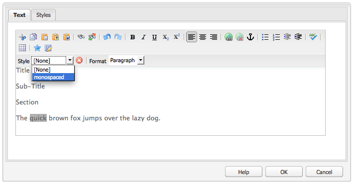
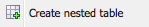

# Editor de texto enriquecido {#rich-text-editor}

El editor de texto enriquecido es un componente básico para introducir contenido textual en AEM. Constituye la base de diversos componentes, entre ellos, los siguientes:

* Texto
* Imagen de texto
* Tabla

## Editor de texto enriquecido {#rich-text-editor-1}

El cuadro de diálogo de edición WYSIWYG proporciona una amplia gama de funcionalidades:

>[!NOTE]
>
>Las funciones disponibles se pueden configurar para proyectos individuales, por lo que podrían variar en su instalación.

## Edición in situ {#in-place-editing}

Además del modo de edición de texto enriquecido basado en cuadros de diálogo, AEM también proporciona el modo de edición in situ, que permite la edición directa del texto tal y como se muestra en el diseño de la página.

Haga clic dos veces en un párrafo (un doble clic lento) para entrar en el modo de edición in situ (el borde del componente estará ahora de color naranja).

Podrá editar directamente el texto de la página, en lugar de hacerlo dentro de la ventana de un cuadro de diálogo. Simplemente realice los cambios y estos se guardarán automáticamente.

>[!NOTE]
>
>Si tiene el buscador de contenido abierto, se muestra una barra de herramientas con las opciones de formato RTE en la parte superior de la pestaña (como se muestra arriba).
>
>Si el buscador de contenido no está abierto, la barra de herramientas no se mostrará.

Actualmente, el modo de edición in situ está habilitado para los elementos de página generados por los componentes **Texto** y **Título**.

>[!NOTE]
>
>El componente [!UICONTROL Título] está diseñado para contener un texto corto sin saltos de línea. Cuando se edita un título en el modo de edición in situ, al introducir un salto de línea se abre un nuevo componente **Texto** debajo del título.

## Funciones del editor de texto enriquecido {#features-of-the-rich-text-editor}

El editor de texto enriquecido proporciona una serie de funciones que [dependen de la configuración](/help/sites-administering/rich-text-editor.md) del componente individual. Las funciones están disponibles tanto para la interfaz de usuario táctil optimizada como para la clásica.

### Formatos de caracteres básicos {#basic-character-formats}

Aquí puede aplicar formato a los caracteres seleccionados (resaltados); algunas opciones también tienen teclas de método abreviado:

* Negrita (Ctrl-B)
* Cursiva (Ctrl-I)
* Subrayado (Ctrl-U)
* Subíndice
* Superíndice

Todas funcionan como conmutadores, por lo que si se vuelven a seleccionar se anula el formato aplicado previamente.

### Estilos y formatos predefinidos {#predefined-styles-and-formats}

La instalación puede incluir estilos y formatos predefinidos. Están disponibles con las listas desplegables **[!UICONTROL Estilo]** y **[!UICONTROL Formato]**, y se pueden aplicar al texto que haya seleccionado.

Se puede aplicar un estilo a una cadena específica (un estilo se correlaciona con CSS):

Mientras que un formato se aplica a todo el párrafo de texto (un formato se basa en HTML):

Solamente se puede cambiar un formato específico (el formato predeterminado es **[!UICONTROL Párrafo]**).

Se puede quitar un estilo; para ello, coloque el cursor dentro del texto al que se le ha aplicado ese estilo y haga clic en el icono Quitar:

>[!CAUTION]
>
>No vuelva a seleccionar ninguno de los textos a los que se les ha aplicado el estilo; si lo hace, se desactivará el icono.

### Cortar, Copiar, Pegar {#cut-copy-paste}

Las funciones estándar de **[!UICONTROL Cortar]** y **[!UICONTROL Copiar]** están disponibles. Se proporcionan varios tipos de **[!UICONTROL Pegar]** para adaptarse a diferentes formatos.

* Cortar (Ctrl-X)
* Copiar (Ctrl-C)
* Pegar
Este es el mecanismo de pegado predeterminado (Ctrl-V) para el componente; cuando se instala de forma predeterminada, está configurado para ser [!UICONTROL Pegar desde Word].

* Pegar como texto: elimina todos los estilos y formatos para pegar únicamente el texto sin formato.

* Pegar desde Word: pega el contenido como HTML (con el formato adicional necesario).

### Deshacer, Rehacer {#undo-redo}

AEM guarda un registro de las últimas 50 acciones del componente actual, en orden cronológico. Estas acciones se pueden deshacer (y luego rehacer) en orden estricto, si es necesario.

>[!CAUTION]
>
>El historial solo se conserva durante la sesión de edición actual. Se reinicia cada vez que abre el componente para editarlo.

>[!NOTE]
>
>Cincuenta es el número predeterminado de tareas. Esto puede ser diferente para su instalación.

### Alineación {#alignment}

El texto puede estar alineado a la izquierda, al centro o a la derecha.

### Sangría {#indentation}

La sangría de un párrafo se puede aumentar o reducir. Se aplicará sangría al párrafo seleccionado y el texto nuevo introducido conservará el nivel actual de sangría.

### Listas {#lists}

Se pueden crear listas con viñetas y numeradas dentro del texto. Seleccione el tipo de lista y empiece a escribir o resalte el texto que desea convertir. En ambos casos, una línea de alimentación inicia un nuevo elemento de lista.

Pueden crearse listas anidadas aplicando sangría a uno o varios elementos de lista.

El estilo de una lista puede cambiar con solo posicionar el cursor dentro de la lista y luego seleccionar el otro estilo. Una sublista también puede tener un estilo diferente al de la lista contenedora. Esto se puede aplicar una vez creada la sublista (mediante sangría).

### Vínculos {#links}

Un vínculo a una dirección URL (ya sea dentro del sitio web o una ubicación externa) se genera resaltando el texto requerido y haciendo clic en el icono de hipervínculo:

Un cuadro de diálogo le permitirá especificar la dirección URL de destino, así como si debe abrirse en una nueva ventana.

Puede hacer lo siguiente:

* Escriba un URI directamente
* Utilice el mapa del sitio para seleccionar una página del sitio web
* Introduzca el URI y, a continuación, anexe el anclaje de destino; por ejemplo, `www.TargetUri.org#AnchorName`
* Escriba solo un anclaje (para hacer referencia a “la página actual”); por ejemplo, `#anchor`
* Busque una página en el buscador de contenido y arrastre y suelte el icono de página en el cuadro de diálogo Hipervínculo

>[!NOTE]
>
>El URI se puede anteponer a cualquiera de los protocolos configurados para la instalación. En una instalación estándar, estos son `https://`, `ftp://` y `mailto:`. Los protocolos no configurados para la instalación se rechazarán y se marcarán como no válidos.

Para romper el vínculo, coloque el cursor en cualquier lugar dentro del texto del vínculo y haga clic en el icono [!UICONTROL Desvincular]:

### Anclajes {#anchors}

Se puede crear un anclaje en cualquier parte dentro del texto al posicionar el cursor o al seleccionar texto. A continuación, haga clic en el icono **Anclaje** para abrir el cuadro de diálogo.

Escriba el nombre del anclaje y haga clic en **Aceptar** para guardar.

El anclaje se muestra cuando se edita el componente y ahora se puede usar dentro de un destino para vínculos.

### Buscar y reemplazar {#find-and-replace}

AEM proporciona una función **Buscar** y **Reemplazar** (buscar y reemplazar).

Ambas tienen un botón **Buscar siguiente** para buscar el texto especificado en el componente abierto. También puede especificar si necesita que haya coincidencia con mayúsculas y minúsculas.

La búsqueda siempre comenzará desde la posición actual del cursor dentro del texto. Cuando se llega al final del componente, un mensaje le informa de que la siguiente operación de búsqueda comenzará desde arriba.

La opción **Reemplazar** le permite **Buscar** y **Reemplazar** una instancia individual con el texto especificado o **Reemplazar todas** las instancias del componente actual.

### Imágenes {#images}

Las imágenes se pueden arrastrar desde el buscador de contenido para añadirlas al texto.

>[!NOTE]
>
>AEM también ofrece componentes especializados para una configuración de imagen más detallada. Por ejemplo, tiene a su disposición los componentes **Imagen** e **Imagen de texto**.

### Corrector ortográfico {#spelling-checker}

La revisión ortográfica revisará todo el texto en el componente actual.

Los errores ortográficos quedarán resaltados:

>[!NOTE]
>
>La revisión ortográfica se realiza en el idioma del sitio web empleando la propiedad de idioma del subárbol o extrayendo el idioma de la URL. Por ejemplo, se comprobará que la rama `en` esté en inglés y la rama `de` en alemán.

### Tablas {#tables}

Las tablas están disponibles tanto:

* Como componente **Tabla**

  

* Desde dentro del componente **Texto**

  

  >[!NOTE]
  >
  >Aunque las tablas están disponibles en RTE, se recomienda usar el componente **Tabla** al crearlas.

En los componentes **Texto** y **Tabla**, la funcionalidad de la tabla está disponible a través del menú contextual (normalmente el botón secundario del ratón) donde se hizo clic dentro de la tabla; por ejemplo:

>[!NOTE]
>
>En el componente **Tabla**, también hay disponible una barra de herramientas especializada, que incluye varias funciones estándar del editor de texto enriquecido, junto con un subconjunto de las funciones específicas de la tabla.

Las funciones específicas de la tabla son:

* [Propiedades de tabla](#table-properties)
* [Propiedades de celda](#cell-properties)
* [Añadir o eliminar filas](#add-or-delete-rows)
* [Añadir o eliminar columnas](#add-or-delete-columns)
* [Selección de filas o columnas completas](#selecting-entire-rows-or-columns)
* [Combinar celdas](#merge-cells)
* [Dividir celdas](#split-cells)
* [Tablas anidadas](#creating-nested-tables)
* [Quitar tabla](#remove-table)

#### Propiedades de tabla {#table-properties}

Las propiedades básicas de la tabla se pueden configurar antes de hacer clic en **Aceptar** para guardar:

* **Anchura**: anchura total de la tabla.

* **Altura**: altura total de la tabla.

* **Borde**: tamaño del borde de la tabla.

* **Margen de celdas**: define el espacio en blanco entre el contenido de la celda y sus bordes.

* **Espaciado de celdas**: define la distancia entre las celdas.

>[!NOTE]
>
>Algunas propiedades de celda, como Anchura y Altura, pueden definirse como píxeles o como porcentajes.

>[!CAUTION]
>
>Adobe recomienda definir una anchura para la tabla.

#### Propiedades de celda {#cell-properties}

Se pueden configurar las propiedades de una celda específica o de una serie de celdas:

* **Anchura**
* **Altura**
* **Alineación horizontal**: Izquierda, Centro o Derecha
* **Alineación vertical**: Arriba, Centro, Abajo o Línea de base
* **Tipo de celda**: Datos o Encabezado
* **Aplicar a:** Una sola celda, Toda la fila, Toda la columna

#### Añadir o eliminar filas {#add-or-delete-rows}

Las filas se pueden añadir encima o debajo de la fila actual.

La fila actual también se puede eliminar.

#### Añadir o eliminar columnas {#add-or-delete-columns}

Las columnas se pueden añadir a la izquierda o a la derecha de la columna actual.

La columna actual también se puede eliminar.

#### Selección de filas o columnas completas {#selecting-entire-rows-or-columns}

Selecciona toda la fila o columna actual. A continuación, hay disponibles acciones específicas (por ejemplo, Combinar).

#### Combinar celdas {#merge-cells}

 

* Si ha seleccionado un grupo de celdas, puede combinarlas en una.
* Si solamente tiene una celda seleccionada, puede combinarla con la celda situada a la derecha o debajo de ella.

#### Dividir celdas {#split-cells}

Seleccione una sola celda para dividirla:

* Al dividir una celda horizontalmente se generará una nueva celda a la derecha de la celda actual, dentro de la columna actual.
* Dividir una celda verticalmente generará una nueva celda debajo de la celda actual, pero dentro de la fila actual.

#### Creación de tablas anidadas {#creating-nested-tables}

Al crear una tabla anidada, se crea una tabla independiente dentro de la celda actual.

>[!NOTE]
>
>Cierto comportamiento adicional depende del explorador:
>
>* Windows IE: utilice Ctrl+clic-con-el-botón-principal-del-ratón (normalmente el izquierdo) para seleccionar varias celdas.
>* Firefox: arrastre el puntero para seleccionar un rango de celdas.

#### Quitar tabla {#remove-table}

Utilice la opción para quitar la tabla del componente **[!UICONTROL Texto]**.

### Caracteres especiales {#special-characters}

Se pueden poner caracteres especiales a disposición del editor de texto enriquecido; pero pueden variar en función de la instalación.

Pase el ratón para ver una versión ampliada del carácter y, a continuación, haga clic en él para que se incluya en la ubicación actual del cursor en el texto.

### Modo de edición de origen {#source-editing-mode}

El modo de edición de origen permite ver y editar el HTML subyacente del componente.

De esta forma, el texto:

tendrá el siguiente aspecto en modo de origen (con frecuencia, el origen es mucho más largo, por lo que tendrá que desplazarse):

>[!CAUTION]
>
>Al salir del modo de origen, AEM realiza determinadas comprobaciones de validación (por ejemplo, para asegurarse de que el texto esté correctamente contenido/anidado en bloques). Esto puede provocar cambios en las ediciones.
