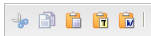
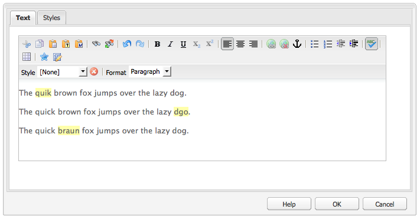
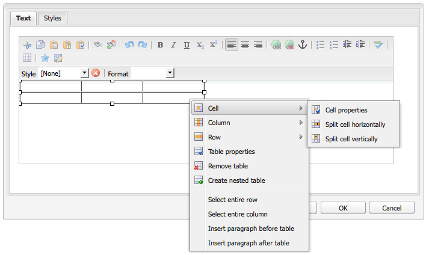

# Editor de texto enriquecido {#rich-text-editor}

El editor de texto enriquecido es un bloque de creación básico para introducir contenido textual en AEM. Constituye la base de diversos componentes, que incluyen:

* Texto
* Imagen de texto
* Tabla

## Editor de texto enriquecido {#rich-text-editor-1}

El cuadro de diálogo de edición WYSIWYG proporciona una amplia variedad de funcionalidades:

>[!NOTE]
>
>Las características disponibles pueden configurarse para proyectos individuales; por lo tanto, podrían variar para su instalación.

## Edición local {#in-place-editing}

Además del modo de edición de texto enriquecido basado en cuadros de diálogo, AEM también proporciona un modo de edición in situ, que permite la edición directa de texto tal y como aparece en el diseño de la página.

Haga clic dos veces en un párrafo (un doble clic lento) para entrar al modo de edición in situ (el borde del componente ahora estará de color naranja).

Podrá editar directamente el texto en la página, en vez de en el interior de una ventana de un cuadro de diálogo. Simplemente realice los cambios y se guardarán automáticamente.

>[!NOTE]
>
>Si tiene abierto el buscador de contenido, se mostrará una barra de herramientas con las opciones de formato RTE en la parte superior de la ficha (como se muestra arriba).
>
>Si el buscador de contenido no está abierto, no se mostrará la barra de herramientas.

Actualmente, el modo de edición directamente está habilitado para elementos de página generados por los componentes **Texto** y **Título**.

>[!NOTE]
>
>El componente [!UICONTROL Título] está diseñado para contener texto corto sin saltos de línea. Cuando edite un título en modo de edición in situ, al especificar un salto de línea se abrirá un nuevo componente **Texto** debajo del título.

## Funciones del Editor de texto enriquecido {#features-of-the-rich-text-editor}

El Editor de texto enriquecido proporciona una serie de funciones, que [dependen de la configuración](/help/sites-administering/rich-text-editor.md) del componente individual. Las funciones están disponibles tanto para la IU táctil como para la clásica.

### Formatos de carácter básicos {#basic-character-formats}

Aquí puede aplicar formato a caracteres que ha seleccionado (resaltado); algunas opciones también tienen teclas de métodos abreviados.

* Negrita (Ctrl-B)
* Cursiva (Ctrl-I)
* Subrayado (Ctrl-U)
* Subíndice
* Superíndice

Todos funcionan como conmutadores; por lo tanto, si vuelve a seleccionar, se quita el formato.

### Formatos y estilos predefinidos  {#predefined-styles-and-formats}

Su instalación puede incluir estilos y formatos predefinidos. Están disponibles con las listas desplegables **[!UICONTROL Estilo]** y **[!UICONTROL Formato]**, y pueden aplicarse a texto seleccionado.

Se puede aplicar un estilo a una cadena específica (un estilo se correlaciona con CSS):

Mientras que se aplica un formato a todo el texto del párrafo (un formato está basado en HTML):

Un formato específico puede cambiarse solamente (el valor predeterminado es **[!UICONTROL Párrafo]**).

Se puede quitar un estilo; coloque el cursor dentro del texto al que se aplicó el estilo y haga clic en el icono Quitar:

>[!CAUTION]
>
>No vuelva a seleccionar realmente ninguna parte del texto al que se aplicó el estilo o el icono se desactivará.

### Cortar, copiar, pegar  {#cut-copy-paste}

Están disponibles las funciones estándar de **[!UICONTROL Cortar]** y **[!UICONTROL Copiar]**. Se proporcionan varias opciones de **[!UICONTROL Pegar]** para adaptarse a los diferentes formatos.

* Cortar (Ctrl-X)
* Copiar (Ctrl-C)
* Pegar
Este es el mecanismo de pegado predeterminado (Ctrl-V) para el componente; cuando se instala de forma predeterminada, se configura como [!UICONTROL Pegar desde Word].

* Pegar como texto: Elimina todos los estilos y el formato para pegar solo el texto sin formato.

* Pegar desde Word: Esto pega el contenido como HTML (con algunas modificaciones de formato necesarias).

### Deshacer y rehacer {#undo-redo}

AEM lleva un registro de las últimas 50 acciones realizadas en el componente actual en orden cronológico. Es posible deshacer estas acciones (y luego rehacerlas) en orden estricto si es necesario.

>[!CAUTION]
>
>El historial se conserva únicamente durante la sesión de edición actual. Se reinicia cada vez que se abre el componente para editar.

>[!NOTE]
>
>Cincuenta es el número predeterminado de tareas. Este valor puede variar en su instalación.

### Alineación {#alignment}

El texto puede alinearse a la izquierda, al medio o a la derecha.

### Sangría {#indentation}

Es posible aumentar o reducir la sangría de un párrafo. Se aplicará sangría al párrafo seleccionado, todo nuevo texto especificado retendrá el nivel de sangría actual.

### Listas {#lists}

Dentro del texto pueden crearse tanto listas numeradas como listas con viñetas. Seleccione el tipo de lista y comience a escribir o resalte el texto que desee convertir. En ambos casos, un salto de línea generará un nuevo elemento de lista.

Pueden crearse listas anidadas aplicando sangría a uno o varios elementos de lista.

El estilo de una lista puede cambiar con solo colocar el cursor dentro de ella y luego seleccionar el otro estilo. Una sublista también puede tener un estilo diferente a la lista que la contiene. Este puede aplicarse una vez que se ha creado la sublista (mediante sangría).

### Vínculos {#links}

Se genera un vínculo a una URL (ya sea dentro del sitio web o una ubicación externa) resaltando el texto requerido y haciendo clic en el icono del hipervínculo:

Un cuadro de diálogo permitirá especificar la URL de destino; también si debería abrirse en una nueva ventana.

Puede hacer lo siguiente:

* Escriba un URI directamente
* Utilice el mapa del sitio para seleccionar una página dentro del sitio web
* Introduzca el URI y, a continuación, añada el anclaje de destinatario; p. ej. `www.TargetUri.org#AnchorName`
* Introduzca un anclaje solamente (para hacer referencia a &quot;la página actual&quot;); Por ejemplo, `#anchor`
* Busque una página en el buscador de contenido y, a continuación, arrastre y suelte el icono de página en el cuadro de diálogo Hipervínculo

>[!NOTE]
>
>El URI puede añadirse delante con cualquiera de los protocolos configurados para la instalación. En una instalación estándar, estos son `https://`, `ftp://` y `mailto:`. Los protocolos que no estén configurados para la instalación serán rechazados y marcados como no válidos.

Para anular el vínculo, posicione el cursor en cualquier parte dentro del texto del vínculo y haga clic en el icono [!UICONTROL Desvincular:]

### Anclajes  {#anchors}

Se puede crear un anclaje en cualquier parte dentro del texto al posicionar el cursor o al seleccionar texto. A continuación, haga clic en el icono **Anclaje** para abrir el cuadro de diálogo.

Especifique el nombre del anclaje y haga clic en **Aceptar** para guardar.

El anclaje se muestra cuando se edita el componente y ahora se puede usar dentro de un destino para vínculos.

### Buscar y reemplazar {#find-and-replace}

AEM contiene las funciones **Buscar** y **Reemplazar**.

Ambas tienen un botón **Buscar siguiente** para buscar el texto especificado en el componente abierto. También puede especificar si necesita que haya coincidencia con mayúsculas y minúsculas.

La búsqueda siempre comenzará desde la posición del cursor actual dentro del texto. Cuando se llegue al final del componente, un mensaje le informará de que la siguiente operación de búsqueda comenzará desde arriba.

La opción **Reemplazar** permite **Buscar** y luego **Reemplazar** una instancia individual con el texto especificado, o **Reemplazar todas** las instancias en el componente actual.

### Imágenes {#images}

Es posible arrastrar imágenes desde el buscador de contenido para agregarlas al texto.

>[!NOTE]
>
>AEM también ofrece componentes especializados para una configuración de imagen más detallada. Por ejemplo, tiene a su disposición los componentes **Imagen** e **Imagen de texto.**

### Corrector ortográfico {#spelling-checker}

La revisión ortográfica revisará todo el texto en el componente actual.

Los errores ortográficos quedarán resaltados:

>[!NOTE]
>
>La revisión ortográfica se realiza en el idioma del sitio web empleando la propiedad de idioma del subárbol o extrayendo el idioma de la URL. Por ejemplo, la rama `en` se revisa en inglés y la rama `de`, en alemán.

### Tablas {#tables}

Las tablas están disponibles tanto:

* Como el componente **Tabla**

   

* Desde el componente **Texto**

   

   >[!NOTE]
   >
   >Aunque las tablas están disponibles en RTE, se recomienda utilizar el componente **Tabla** al crear tablas.

En los componentes **Texto** y **Tabla**, la funcionalidad de tabla está disponible mediante el menú contextual (generalmente el botón derecho del ratón) donde se hace clic dentro de la tabla. Por ejemplo:

>[!NOTE]
>
>En el componente **Tabla**, también hay disponible una barra de herramientas especializada, que incluye diversas funciones de editor de texto enriquecido estándar, junto con un subconjunto de las funciones específicas de las tablas.

Las funciones específicas de las tablas son:

* [Propiedades de tabla](#table-properties)
* [Propiedades de celda](#cell-properties)
* [Agregar o eliminar filas](#add-or-delete-rows)
* [Agregar o eliminar columnas](#add-or-delete-columns)
* [Selección de filas o columnas enteras](#selecting-entire-rows-or-columns)
* [Combinar celdas](#merge-cells)
* [Dividir celdas](#split-cells)
* [Tablas anidadas](#creating-nested-tables)
* [Quitar tabla](#remove-table)

#### Propiedades de tabla {#table-properties}

Las propiedades básicas de la tabla pueden configurarse antes de hacer clic en **Aceptar** para guardar:

* **Ancho**: Ancho total de la tabla.

* **Altura**: Altura total de la tabla.

* **Borde**: Tamaño del borde de la tabla.

* **Relleno** de celdas: Define el espacio en blanco entre el contenido de la celda y sus bordes.

* **Espaciado** de celdas: Define la distancia entre las celdas.

>[!NOTE]
>
>Algunas propiedades de celda, como la anchura y la altura, se pueden definir como píxeles o como porcentajes.

>[!CAUTION]
>
>Adobe recomienda definir una anchura para la tabla.

#### Propiedades de celda {#cell-properties}

Es posible configurar las propiedades de una celda específica o serie de celdas:

* **Ancho**
* **Altura**
* **Alineación horizontal** - Izquierda, Centro o Derecha
* **Alineación**  vertical: arriba, medio, abajo o línea de base
* **Tipo** de celda: datos o encabezado
* **Aplicar a:** celda única, fila completa, columna completa

#### Agregar o eliminar filas {#add-or-delete-rows}

Las filas pueden agregarse encima o debajo de la fila actual.

También puede eliminarse la fila actual.

#### Agregar o eliminar columnas  {#add-or-delete-columns}

Las columnas pueden agregarse a la izquierda o a la derecha de la columna actual.

También puede eliminarse la columna actual.

#### Selección de filas o columnas enteras  {#selecting-entire-rows-or-columns}

Selecciona toda la fila o columna actual. Hay acciones específicas (por ejemplo, combinar) disponibles.

#### Combinar celdas {#merge-cells}

 

* Si seleccionó un grupo de celdas, puede combinarlas en una sola.
* Si tiene una sola celda seleccionada, puede combinarla con la celda ubicada a la derecha o debajo.

#### Dividir celdas  {#split-cells}

Seleccione una celda única para dividirla:

* Dividir una celda horizontalmente generará una nueva celda a la derecha de la celda actual, dentro de la columna actual.
* Dividir una celda verticalmente generará una nueva celda debajo de la celda actual, pero dentro de la fila actual.

#### Crear tablas anidadas  {#creating-nested-tables}

Crear una tabla anidada creará una nueva tabla autocontenida dentro de la celda actual.

>[!NOTE]
>
>El navegador determina cierto comportamiento adicional:
>
>* Windows IE: use Ctrl + clic con el botón principal del ratón (generalmente el izquierdo) para seleccionar varias celdas.
>* Firefox: Arrastre el puntero para seleccionar un rango de celdas.

#### Quitar tabla {#remove-table}

Utilice la opción para quitar la tabla del componente **[!UICONTROL Texto]**.

### Caracteres especiales {#special-characters}

Se pueden hacer disponibles caracteres especiales para su editor de texto enriquecido, los cuales podrían variar con la instalación.

Coloque el puntero encima para ver una versión ampliada del carácter, y luego haga clic para incluirlo en la ubicación actual en el texto.

### Modo de edición de origen  {#source-editing-mode}

El modo de edición de fuente permite ver y editar el HTML subyacente del componente.

Por lo tanto, el texto:

Tendrá el siguiente aspecto en el modo de origen (a menudo el origen es mucho más largo, por lo que tendrá que desplazarse):

>[!CAUTION]
>
>Cuando se sale del modo de origen, AEM hace ciertas comprobaciones de validación (por ejemplo, garantizar que el texto esté contenido o anidado correctamente en bloques). Esto puede generar cambios en sus modificaciones.
