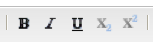
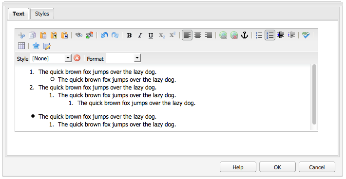
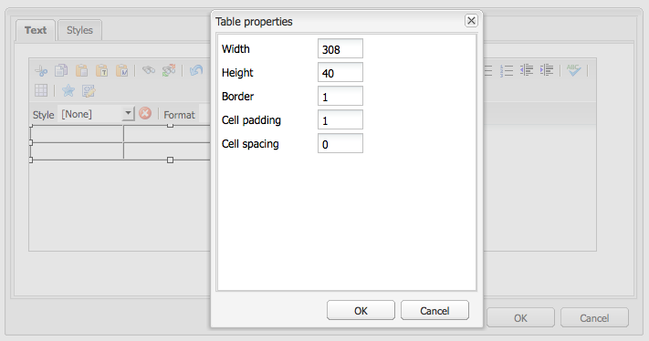
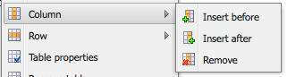

# Editor de texto enriquecido {#rich-text-editor}

AEM El Editor de texto enriquecido es un bloque de creación básico para introducir contenido textual en los elementos de texto de los elementos de texto de los elementos de texto de los elementos de texto de la interfaz de usuario. Constituye la base de varios componentes, entre los que se incluyen:

* Texto
* Imagen de texto
* Tabla

## Editor de texto enriquecido {#rich-text-editor-1}

El cuadro de diálogo de edición WYSIWYG proporciona una amplia gama de funcionalidades:

>[!NOTE]
>
>Las funciones disponibles se pueden configurar para proyectos individuales, por lo que pueden variar en función de la instalación.

## Edición local {#in-place-editing}

AEM Además del modo de edición de texto enriquecido basado en el cuadro de diálogo, también proporciona el modo de edición in situ, que permite editar directamente el texto tal y como se muestra en el diseño de la página.

Haga clic dos veces en un párrafo (un doble clic lento) para entrar en el modo de edición local (el borde del componente ahora será naranja).

Podrá editar directamente el texto de la página, en lugar de hacerlo desde una ventana de diálogo. Simplemente realice los cambios y se guardarán automáticamente.

>[!NOTE]
>
>Si tiene el buscador de contenido abierto, se muestra una barra de herramientas con las opciones de formato RTE en la parte superior de la pestaña (como se muestra arriba).
>
>Si el buscador de contenido no está abierto, la barra de herramientas no se mostrará.

Actualmente, el modo de edición local está habilitado para los elementos de página generados por **Texto** y **Título** componentes.

>[!NOTE]
>
>El [!UICONTROL Título] está diseñado para contener un texto corto sin saltos de línea. Al editar un título en el modo de edición local, al introducir un salto de línea se abre un nuevo **Texto** Componente debajo del título.

## Funciones del editor de texto enriquecido {#features-of-the-rich-text-editor}

El Editor de texto enriquecido proporciona una serie de funciones, que [dependen de la configuración](/help/sites-administering/rich-text-editor.md) del componente individual. Las funciones están disponibles tanto para la interfaz de usuario táctil optimizada como para la clásica.

### Formatos de caracteres básicos {#basic-character-formats}

Aquí puede aplicar formato a los caracteres seleccionados (resaltados); algunas opciones también tienen teclas de método abreviado:

* Negrita (Ctrl-B)
* Cursiva (Ctrl-I)
* Subrayado (Ctrl-U)
* Subíndice
* Superíndice

Todos funcionan como una alternativa, por lo que la reselección elimina el formato.

### Estilos y formatos predefinidos {#predefined-styles-and-formats}

La instalación puede incluir estilos y formatos predefinidos. Están disponibles con el **[!UICONTROL Estilo]** y **[!UICONTROL Formato]** listas desplegables y se pueden aplicar al texto seleccionado.

Se puede aplicar un estilo a una cadena específica (un estilo se correlaciona con CSS):

Mientras que un formato se aplica a todo el párrafo de texto (un formato se basa en el HTML):

Un formato específico solo se puede cambiar (el formato predeterminado es **[!UICONTROL Párrafo]**).

Se puede quitar un estilo; coloque el cursor dentro del texto al que se ha aplicado el estilo y haga clic en el icono Eliminar:

>[!CAUTION]
>
>No vuelva a seleccionar ninguno de los textos a los que se ha aplicado el estilo o se desactivará el icono.

### Cortar, Copiar, Pegar {#cut-copy-paste}

Las funciones estándar de **[!UICONTROL Cortar]** y **[!UICONTROL Copiar]** están disponibles. Varios sabores de **[!UICONTROL Pegar]** se proporcionan para adaptarse a diferentes formatos.

* Cortar (Ctrl-X)
* Copiar (Ctrl-C)
* Pegar Este es el mecanismo de pegado predeterminado (Ctrl-V) para el componente; cuando se instala de forma predeterminada, se configura para que sea [!UICONTROL Pegar desde Word].

* Pegar como texto: elimina todos los estilos y formatos para pegar únicamente el texto sin formato.

* Pegar desde Word: pega el contenido como HTML (con el formato adicional necesario).

### Deshacer, Rehacer {#undo-redo}

AEM mantiene un registro de las últimas 50 acciones del componente actual, retenidas en orden cronológico. Estas acciones se pueden deshacer (y luego rehacer) en orden estricto, si es necesario.

>[!CAUTION]
>
>El historial solo se conserva durante la sesión de edición actual. Se reinicia cada vez que abre el componente para editarlo.

>[!NOTE]
>
>Cincuenta es el número predeterminado de tareas. Esto puede ser diferente para su instalación.

### Alineación {#alignment}

El texto puede estar alineado a la izquierda, al centro o a la derecha.

### Sangría {#indentation}

La sangría de un párrafo se puede aumentar o reducir. Se aplicará sangría al párrafo seleccionado y el texto nuevo introducido conservará el nivel actual de sangría.

### Listas {#lists}

Se pueden crear listas con viñetas y numeradas dentro del texto. Seleccione el tipo de lista y empiece a escribir o resalte el texto que desea convertir. En ambos casos, una línea de alimentación inicia un nuevo elemento de lista.

Las listas anidadas se pueden lograr sangrando uno o más elementos de la lista.

El estilo de una lista se puede cambiar simplemente colocando el cursor dentro de la lista y seleccionando el otro estilo. Una sublista también puede tener un estilo diferente al de la lista contenedora. Esto se puede aplicar una vez creada la sublista (por sangría).

### Vínculos {#links}

Un vínculo a una dirección URL (ya sea dentro del sitio web o una ubicación externa) se genera resaltando el texto requerido y haciendo clic en el icono de hipervínculo:

Un cuadro de diálogo le permitirá especificar la dirección URL de destino, así como si debe abrirse en una nueva ventana.

Puede hacer lo siguiente:

* Escriba un URI directamente
* Utilice el mapa del sitio para seleccionar una página del sitio web
* Introduzca el URI y, a continuación, añada el anclaje de destino; por ejemplo, `www.TargetUri.org#AnchorName`
* Introducir solo un anclaje (para hacer referencia a &quot;la página actual&quot;); por ejemplo, `#anchor`
* Busque una página en el buscador de contenido y arrastre y suelte el icono de página en el cuadro de diálogo Hipervínculo

>[!NOTE]
>
>El URI se puede anteponer a cualquiera de los protocolos configurados para la instalación. En una instalación estándar, estos son `https://`, `ftp://`, y `mailto:`. Los protocolos no configurados para la instalación se rechazarán y se marcarán como no válidos.

Para romper el vínculo, coloque el cursor en cualquier lugar dentro del texto del vínculo y haga clic en [!UICONTROL Desvincular] icono:

### Anclajes {#anchors}

Se puede crear un anclaje en cualquier lugar dentro del texto colocando el cursor o seleccionando texto. Luego haga clic en **Anclaje** para abrir el cuadro de diálogo.

Introduzca el nombre del anclaje y haga clic en **OK** para guardar.

El anclaje se muestra cuando se edita el componente y ahora se puede utilizar en un destino para vínculos.

### Buscar y reemplazar {#find-and-replace}

AEM proporciona tanto una como una **Buscar** y una **Reemplazar** función (buscar y reemplazar).

Ambos tienen un **Buscar siguiente** para buscar el texto especificado en el componente abierto. También puede especificar si necesita que coincidan las mayúsculas y minúsculas (upper/lower).

La búsqueda siempre comenzará desde la posición actual del cursor dentro del texto. Cuando se llega al final del componente, un mensaje le informa de que la siguiente operación de búsqueda comenzará desde arriba.

El **Reemplazar** La opción le permite **Buscar**, entonces **Reemplazar** una instancia individual con el texto especificado o hasta **Reemplazar todo** instancias en el componente actual.

### Imágenes {#images}

Las imágenes se pueden arrastrar desde el buscador de contenido para añadirlas al texto.

>[!NOTE]
>
>AEM También ofrece componentes especializados para una configuración de imagen más detallada. Por ejemplo, la variable **Imagen** y **Imagen de texto** componentes están disponibles.

### Corrector ortográfico {#spelling-checker}

El corrector ortográfico revisará todo el texto del componente actual.

Se resaltarán las palabras incorrectas:

>[!NOTE]
>
>El corrector ortográfico funcionará en el idioma del sitio web tomando la propiedad idioma del subárbol o extrayendo el idioma de la dirección URL. Por ejemplo, la variable `en` La sucursal se revisará para ver si está en inglés y `de` sucursal para alemán.

### Tablas {#tables}

Las tablas están disponibles tanto:

* Como el **Tabla** componente

  

* Desde dentro de **Texto** componente

  

  >[!NOTE]
  >
  >Aunque las tablas están disponibles en el RTE, se recomienda utilizar el **Tabla** al crear tablas.

En ambos **Texto** y **Tabla** la funcionalidad de la tabla componentes está disponible a través del menú contextual (normalmente el botón derecho del ratón) en el que se hace clic dentro de la tabla; por ejemplo:

>[!NOTE]
>
>En el **Tabla** también está disponible una barra de herramientas especializada, que incluye varias funciones estándar del editor de texto enriquecido, junto con un subconjunto de las funciones específicas de la tabla.

Las funciones específicas de la tabla son:

* [Propiedades de tabla](#table-properties)
* [Propiedades de celda](#cell-properties)
* [Agregar o eliminar filas](#add-or-delete-rows)
* [Agregar o eliminar columnas](#add-or-delete-columns)
* [Selección de filas o columnas completas](#selecting-entire-rows-or-columns)
* [Combinar celdas](#merge-cells)
* [Dividir celdas](#split-cells)
* [Tablas anidadas](#creating-nested-tables)
* [Quitar tabla](#remove-table)

#### Propiedades de tabla {#table-properties}

Las propiedades básicas de la tabla se pueden configurar antes de hacer clic en **OK** para guardar:

* **Ancho**: Ancho total de la tabla.

* **Altura**: altura total de la tabla.

* **Borde**: tamaño del borde de la tabla.

* **Margen de celdas**: define el espacio en blanco entre el contenido de la celda y sus bordes.

* **Espaciado de celdas**: define la distancia entre las celdas.

>[!NOTE]
>
>Algunas propiedades de celda, como Width y Height, pueden definirse como píxeles o como porcentajes.

>[!CAUTION]
>
>El Adobe recomienda definir una anchura para la tabla.

#### Propiedades de celda {#cell-properties}

Se pueden configurar las propiedades de una celda específica o de una serie de celdas:

* **Anchura**
* **Altura**
* **Alineación horizontal** - Izquierda, centro o derecha
* **Alineación vertical** - Superior, Medio, Inferior o Línea de base
* **Tipo de celda**- Datos o encabezado
* **Aplicar a:** Una celda, toda la fila, toda la columna

#### Agregar o eliminar filas {#add-or-delete-rows}

Las filas se pueden agregar encima o debajo de la fila actual.

La fila actual también se puede eliminar.

#### Agregar o eliminar columnas {#add-or-delete-columns}

Las columnas se pueden agregar a la izquierda o a la derecha de la columna actual.

La columna actual también se puede eliminar.

#### Selección de filas o columnas completas {#selecting-entire-rows-or-columns}

Selecciona toda la fila o columna actual. A continuación, hay disponibles acciones específicas (por ejemplo, combinar).

#### Combinar celdas {#merge-cells}

 

* Si ha seleccionado un grupo de celdas, puede combinarlas en una.
* Si sólo tiene una celda seleccionada, puede combinarla con la celda situada a la derecha o debajo de ella.

#### Dividir celdas {#split-cells}

Seleccione una sola celda para dividirla:

* Dividir una celda horizontalmente generará una nueva celda a la derecha de la celda actual, dentro de la columna actual.
* Dividir una celda verticalmente generará una nueva celda debajo de la celda actual, pero dentro de la fila actual.

#### Creación de tablas anidadas {#creating-nested-tables}

Al crear una tabla anidada, se crea una tabla independiente dentro de la celda actual.

>[!NOTE]
>
>Cierto comportamiento adicional depende del explorador:
>
>* Windows IE: Utilice Ctrl+primary-mouse-button-click (normalmente izquierdo) para seleccionar varias celdas.
>* Firefox: arrastre el puntero para seleccionar un rango de celdas.

#### Quitar tabla {#remove-table}

Utilice la opción para quitar la tabla de la tabla de **[!UICONTROL Texto]** componente.

### Caracteres especiales {#special-characters}

Se pueden poner caracteres especiales a disposición del editor de texto enriquecido; estos pueden variar según la instalación.

Pase el ratón para ver una versión ampliada del carácter y, a continuación, haga clic en para que se incluya en la ubicación actual del texto.

### Modo de edición de origen {#source-editing-mode}

El modo de edición de origen permite ver y editar el HTML subyacente del componente.

Así que el texto:

Will tiene el siguiente aspecto en el modo de origen (a menudo el origen es mucho más largo, por lo que tendrá que desplazarse):

>[!CAUTION]
>
>AEM Al salir del modo de origen, realiza determinadas comprobaciones de validación (por ejemplo, asegurarse de que el texto esté correctamente contenido/anidado en bloques). Esto puede provocar cambios en las ediciones.
