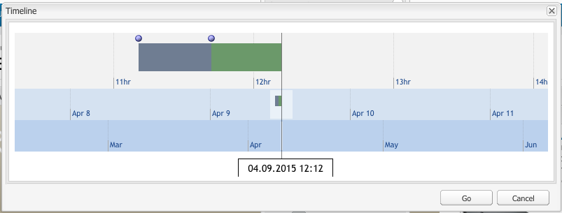

# Uso de versiones de página  {#working-with-page-versions}

Al generar una versión, se crea una “instantánea” de una página en un punto específico del tiempo. Con la función de versiones, se pueden realizar las siguientes operaciones:

* Crear una versión de la página.
* Restaurar una página a una versión anterior, por ejemplo, para deshacer un cambio realizado en ella.
* Comparar la versión actual de una página con una versión anterior resaltando las diferencias en el texto y las imágenes. 

## Creación de una nueva versión   {#creating-a-new-version}

Para crear una nueva versión de una página:

1. En el navegador, abra la página para la que desee crear una nueva versión.
1. En la barra de tareas, seleccione la ficha **Versiones** y después la subficha **Crear versión**.

   

1. Introduzca un **comentario** (opcional).
1. Para establecer una etiqueta en la versión (opcional), haga clic en el botón **Más >>** y defina la **Etiqueta** para asignar un nombre a la versión. Si la etiqueta no está configurada, la versión se incrementa automáticamente.
1. Haga clic en **Crear versión**. Se mostrará un mensaje atenuado en la página; por ejemplo:
Versión 1.2 creada para: Shirts.

>[!NOTE]
>
>Se creará una versión automáticamente cuando se active la página.

## Restaurar una versión de página desde la barra de tareas  {#restoring-a-page-version-from-sidekick}

Para restaurar la página a una versión anterior:

1. Abra la página que desee restaurar a una versión anterior.
1. En la barra de tareas, seleccione la ficha **Versiones** y después la subficha **Restaurar versión**.

   

1. Seleccione la versión que desee restaurar y, a continuación, **Restaurar**.

## Restaurar una versión de página desde la consola {#restoring-a-page-version-from-the-console}

Este método puede utilizarse para restaurar una versión de página. También puede utilizarse para restaurar páginas que se hayan eliminado anteriormente:

1. En la consola **Sitios web**, desplácese a la página que desee restaurar y selecciónela.
1. Desde el menú superior, seleccione **Herramientas** y luego **Restaurar**:

   

1. Si se selecciona **Restaurar versión...** se enumeran las versiones de los documentos en la carpeta actual. Incluso si se ha eliminado una página, se enumerará la última versión:

   

1. Seleccione la versión que desee restaurar y haga clic en **Restaurar**. AEM restaura la versión o las versiones (o árboles) que seleccione.

### Restaurar un árbol desde la consola  {#restoring-a-tree-from-the-console}

Este método puede utilizarse para restaurar una versión de página. También puede utilizarse para restaurar páginas que se hayan eliminado anteriormente:

1. En la consola **Sitios web**, desplácese a la carpeta que desee restaurar y selecciónela.
1. Desde el menú superior, seleccione **Herramientas** y luego **Restaurar**.
1. Si se selecciona **Restaurar árbol...** se abre el cuadro de diálogo para que pueda seleccionar el árbol que desee restaurar:

   

1. Haga clic en **Restaurar**. AEM restaura el árbol que haya seleccionado.

## Comparación con una versión anterior {#comparing-with-a-previous-version}

Para compara la versión actual de la página con una versión anterior:

1. En el navegador, abra la página que desee comparar con una versión anterior.
1. En la barra de tareas, seleccione la ficha **Versiones** y, a continuación, la subficha **Restaurar versión** n.

   

1. Seleccione la versión que desee comparar y haga clic en el botón **Dif**.
1. Las diferencias entre la versión actual y la versión seleccionada se muestran de la siguiente manera:

   * El texto que se ha eliminado aparece en rojo y tachado.
   * El texto que se ha agregado aparece en verde y resaltado.
   * Las imágenes que se han agregado o eliminado tienen un recuadro verde.

   

1. En la barra de tareas, seleccione la subficha **Restaurar versión** y haga clic en el botón **&lt;&lt;Atrás** para ver la versión actual.

## Deformación de tiempo    {#timewarp}

Deformación de tiempo es una función diseñada para simular el estado ***publicado*** de una página en periodos específicos en el pasado.

Su propósito es permitirle seguir el sitio web publicado en el punto temporal seleccionado. Se utilizan las activaciones de página para determinar el estado del entorno de publicación.

Para ello:

* El sistema busca la versión de la página activa en el tiempo seleccionado.
* Esto significa que la versión mostrada se creó o activó *antes del* punto temporal seleccionado en Deformación de tiempo.
* Al navegar a una página que se haya eliminado, también se procesará, siempre que las versiones anteriores de la página estén disponibles en el repositorio.
* Si no se encuentran versiones publicadas, Timewarp volverá al estado actual de la página en el entorno de creación (para evitar un error/página 404, lo que significaría que ya no puede examinarla).

>[!NOTE]
>
>Si las versiones se eliminan del repositorio, Timewarp no podrá mostrar la vista correcta. Asimismo, si se han cambiado elementos (como código, css, imágenes, etc.) para procesar el sitio web, la vista será diferente de la original, ya que no habrá versiones de dichos elementos en el repositorio.

### Uso del calendario de Timewarp  {#using-the-timewarp-calendar}

Timewarp está disponible en la barra de tareas.

La versión de calendario se utiliza si quiere visualizar un día específico:

1. Abra la ficha **Versiones** y, a continuación, haga clic en **Timewarp** (cerca de la parte inferior de la barra de tareas). Se mostrará el cuadro de diálogo siguiente:

   

1. Especifique la fecha y la hora deseadas con los selectores de fecha y hora y haga clic en **Ir**.

   Timewarp mostrará la página en su estado de publicación antes de la fecha o en la fecha seleccionada.

   >[!NOTE]
   >
   >Timewarp solo funcionará completamente si ha publicado la página anteriormente. En caso contrario, Deformación de tiempo mostrará la página actual en el entorno de creación.

   >[!NOTE]
   >
   >Si se desplaza a una página que se ha eliminado del repositorio, se procesará correctamente si aún hay versiones antiguas de la página en el repositorio.

   >[!NOTE]
   >
   >Las versiones antiguas de la página no pueden editarse, Tan solo pueden visualizarse. Si desea restaurar la versión anterior, deberá hacerlo manualmente mediante la [restauración](/help/sites-classic-ui-authoring/classic-page-author-work-with-versions.md#restoring-a-page-version-from-sidekick).

1. Cuando haya terminado de visualizar la página, haga clic en:

   * **Salir de Deformación de tiempo** para salir y volver a la página de creación actual.
   * [Mostrar línea de tiempo](#using-the-timewarp-timeline) para ver la línea de tiempo. 

   

### Usar la línea de tiempo de Deformación de tiempo {#using-the-timewarp-timeline}

La versión de la línea de tiempo se utiliza para ver información general sobre las actividades de publicación de la página.

Si desea ver la línea de tiempo del documento:

1. Para mostrar la línea de tiempo puede:

   1. Abrir la ficha **Versiones** y hacer clic en **Timewarp** (cerca de la parte inferior de la barra de tareas).

   1. Utilizar el cuadro de diálogo de la barra de tareas que se muestra tras [utilizar el calendario de Deformación de tiempo](#using-the-timewarp-calendar).

1. Haga clic en **Mostrar escala de tiempo**: aparecerá la línea de tiempo del documento, por ejemplo:

   

1. Seleccione y mueva (mantenga presionada y arrastre) la línea de tiempo para moverse por la línea de tiempo del documento.

   * Todas las líneas indican versiones publicadas.
Cuando se activa una página, se iniciará una línea nueva. Cada vez que se edita el documento, aparece un color nuevo.
En el ejemplo que se muestra a continuación, la línea roja indica que la página se editó durante el periodo de tiempo de la versión verde inicial y la línea amarilla indica que la página se editó en algún momento de la versión roja, etc.

   

1. Haga clic:

   1. **Ir** para mostrar el contenido de la página publicada en el punto temporal seleccionado.
   1. Cuando se muestre el contenido, use **Salir de Deformación de tiempo** para salir y volver a la página de creación actual.

### Limitaciones de Deformación de tiempo {#timewarp-limitations}

Deformación de tiempo realiza el mejor esfuerzo para reproducir una página en un punto temporal seleccionado. Sin embargo, debido a las complejidades de la creación continua de contenido en AEM, esto no siempre es posible. Estas limitaciones deben tenerse en cuenta al utilizar Deformación de tiempo.

* **Deformación de tiempo funciona dependiendo de las páginas publicadas**: Deformación de tiempo solo funciona a la perfección si ya ha publicado la página. En caso contrario, Deformación de tiempo mostrará la página actual en el entorno de creación.
* **Deformación de tiempo emplea las versiones de página**: si se desplaza a una página que se ha eliminado del repositorio, se procesa correctamente si aún hay versiones antiguas de la página en el repositorio.
* **Las versiones eliminadas afectan a la función Deformación de tiempo**: si las versiones se eliminan del repositorio, Deformación de tiempo no puede mostrar resultados correctos.

* **Deformación de tiempo es de solo lectura**: no se puede editar la versión antigua de la página. Tan solo pueden visualizarse. Si desea restaurar la versión anterior, deberá hacerlo manualmente mediante la [restauración](#main-pars-title-1).

* **Deformación de tiempo se basa únicamente en el contenido de la página**: si los elementos para procesar el sitio web (código, CSS, recursos e imágenes, etc.) cambian, la vista será diferente de la original, ya que no hay versiones de dichos elementos en el repositorio.

>[!CAUTION]
>
>Deformación de tiempo se ha diseñado como una herramienta para ayudar a los autores a comprender y crear su contenido. No se trata de un registro de auditoría ni de un registro jurídico.
