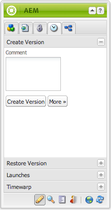
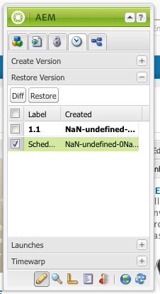

# Uso de versiones de página  {#working-with-page-versions}

Al generar una versión se crea una &quot;instantánea&quot; de una página en un punto específico en el tiempo. Con el control de versiones, puede realizar las siguientes acciones:

* Cree una versión de una página.
* Restaurar una página a una versión anterior para deshacer un cambio realizado en una página, por ejemplo.
* Compare la versión actual de una página con una versión anterior, resaltando las diferencias en el texto y las imágenes.

## Creación de una nueva versión   {#creating-a-new-version}

Para crear una nueva versión de una página:

1. En el explorador, abra la página para la que desee crear una nueva versión.
1. En la barra de tareas, seleccione la **Versiones** y, a continuación, la pestaña **Crear versión** subpestaña .

   

1. Escriba un **Comentario** (opcional).
1. Para establecer una etiqueta en la versión (opcional), haga clic en el botón **Más >>** y configure la variable **Etiqueta** para asignar un nombre a la versión. Si no se establece la etiqueta, la versión se incrementa automáticamente.
1. Haga clic en **Crear versión**. Se muestra un mensaje atenuado en la página; por ejemplo: Versión 1.2 creada para: Camisas.

>[!NOTE]
>
>Se crea una versión automáticamente cuando se activa la página.

## Restaurar una versión de página desde la barra de tareas {#restoring-a-page-version-from-sidekick}

Para restaurar la página a una versión anterior:

1. Abra la página para la que desee restaurar una versión anterior.
1. En la barra de tareas, seleccione la **Versiones** y, a continuación, la pestaña **Restaurar versión** subpestaña .

   

1. Seleccione la versión que desee restaurar y seleccione **Restaurar**.

## Restauración de una versión de página desde la consola {#restoring-a-page-version-from-the-console}

Este método se puede usar para restaurar una versión de página. También se puede usar para restaurar páginas que se hayan eliminado anteriormente:

1. En el **Sitios web** , vaya a la página que desee restaurar y selecciónela.
1. En el menú superior, seleccione **Herramientas**, luego **Restaurar**:

   

1. Selección **Restaurar versión...** enumera las versiones de los documentos de la carpeta actual. Incluso si se ha eliminado una página, se enumerará la última versión:

   

1. Seleccione la versión que desee restaurar y haga clic en **Restaurar**. AEM restaura las versiones (o árboles) que seleccione.

### Restauración de un árbol desde la consola {#restoring-a-tree-from-the-console}

Este método se puede usar para restaurar una versión de página. También se puede usar para restaurar páginas que se hayan eliminado anteriormente:

1. En el **Sitios web** , vaya a la carpeta que desee restaurar y selecciónela.
1. En el menú superior, seleccione **Herramientas**, luego **Restaurar**.
1. Selección **Restaurar árbol...** abre el cuadro de diálogo para permitirle seleccionar el árbol que desea restaurar:

   

1. Haga clic en **Restaurar**. AEM restaura el árbol seleccionado.

## Comparación con una versión anterior {#comparing-with-a-previous-version}

Para comparar la versión actual de la página con una versión anterior:

1. En el explorador, abra la página que desee comparar con una versión anterior.
1. En la barra de tareas, seleccione la **Versiones** y, a continuación, la pestaña **Restaurar versión** en la subpestaña .

   

1. Seleccione la versión que desee comparar y haga clic en el botón **Diff** botón.
1. Las diferencias entre la versión actual y la seleccionada se muestran de la siguiente manera:

   * El texto que se ha eliminado aparece en rojo y tachado.
   * El texto que se ha añadido aparece en verde y resaltado.
   * Las imágenes que se han añadido o eliminado tienen un marco verde.

   

1. En la barra de tareas, seleccione la **Restaurar versión** y haga clic en la pestaña **&lt;&lt;back span=&quot;&quot; id=&quot;3&quot; translate=&quot;no&quot; /> para mostrar la versión actual.**

## Deformación de tiempo   {#timewarp}

Deformación de tiempo es una función diseñada para simular el estado ***publicado*** de una página en periodos específicos en el pasado.

El propósito es permitirle realizar un seguimiento del sitio web publicado en el punto temporal seleccionado. Se utilizan las activaciones de página para determinar el estado del entorno de publicación.

Para ello:

* El sistema busca la versión de la página que estaba activa en el momento seleccionado.
* Esto significa que la versión mostrada se creó o activó *antes del* punto temporal seleccionado en Deformación de tiempo.
* Al navegar a una página que se haya eliminado, también se procesará, siempre que las versiones antiguas de la página sigan estando disponibles en el repositorio.
* Si no se encuentra ninguna versión publicada, Deformación de tiempo volverá al estado actual de la página en el entorno de creación (para evitar un error/página 404, lo que significaría que ya no puede examinarla).

>[!NOTE]
>
>Si las versiones se eliminan del repositorio, Deformación de tiempo no puede mostrar la vista correcta. Además, si los elementos (como código, css, imágenes, etc.) para procesar el sitio web han cambiado, la vista será diferente de la original, ya que no hay versiones de esos elementos en el repositorio.

### Uso del calendario de Deformación de tiempo {#using-the-timewarp-calendar}

Deformación de tiempo está disponible en la barra de tareas.

La versión del calendario se utiliza si tiene un día específico para ver:

1. Abra el **Versiones** y, a continuación, haga clic en **Deformación de tiempo** (cerca de la parte inferior de la barra de tareas). Se mostrará el cuadro de diálogo siguiente:

   

1. Con los selectores de fecha y hora, especifique la fecha y la hora que desee y haga clic en **Ir**.

   Deformación de tiempo mostrará la página en su estado de publicación antes de la fecha o en la fecha seleccionada.

   >[!NOTE]
   >
   >Deformación de tiempo solo funcionará completamente si ha publicado la página anteriormente. En caso contrario, Deformación de tiempo mostrará la página actual en el entorno de creación.

   >[!NOTE]
   >
   >Si se desplaza a una página que se ha eliminado del repositorio, se procesará correctamente si aún hay versiones antiguas de la página en el repositorio.

   >[!NOTE]
   >
   >No puede editar la versión antigua de la página. Tan solo pueden visualizarse. Si desea restaurar la versión anterior, deberá hacerlo manualmente mediante la [restauración](/help/sites-classic-ui-authoring/classic-page-author-work-with-versions.md#restoring-a-page-version-from-sidekick).

1. Cuando haya terminado de ver la página, haga clic en:

   * **Deformación de tiempo de salida** para salir y volver a la página de creación actual.
   * [Mostrar línea de tiempo](#using-the-timewarp-timeline) para ver la línea de tiempo.

   

### Uso de la línea de tiempo de Deformación de tiempo {#using-the-timewarp-timeline}

La versión de la cronología se utiliza si desea ver una descripción general de las actividades de publicación en la página.

Si desea ver la línea de tiempo del documento:

1. Para mostrar la línea de tiempo, puede:

   1. Abra el **Versiones** y, a continuación, haga clic en **Deformación de tiempo** (cerca de la parte inferior de la barra de tareas).

   1. Utilice el cuadro de diálogo de la barra de tareas que se muestra después de [uso del calendario de Deformación de tiempo](#using-the-timewarp-calendar).

1. Haga clic en **Mostrar línea de tiempo** - aparecerá la cronología del documento; por ejemplo:

   

1. Seleccione y mueva (mantenga presionada y arrastre) la línea de tiempo para moverse por la línea de tiempo del documento.

   * Todas las líneas indican versiones publicadas.
Cuando se activa una página, se inicia una línea nueva. Cada vez que se edita el documento, aparece un color nuevo.
En el siguiente ejemplo, la línea roja indica que la página se editó durante el periodo de tiempo de la versión verde inicial y la línea amarilla indica que la página se editó en algún momento de la versión roja, etc.

   

1. Hacer clic:

   1. **Ir** para mostrar el contenido de la página publicada en el punto temporal seleccionado.
   1. Al mostrar ese contenido, utilice **Deformación de tiempo de salida** para salir y volver a la página de creación actual.

### Limitaciones de Deformación de tiempo {#timewarp-limitations}

Deformación de tiempo realiza el mejor esfuerzo para reproducir una página en un punto temporal seleccionado. Sin embargo, debido a las complejidades de la creación continua de contenido en AEM, esto no siempre es posible. Estas limitaciones deben tenerse en cuenta al utilizar Deformación de tiempo.

* **Deformación de tiempo funciona dependiendo de las páginas publicadas**: Deformación de tiempo solo funciona a la perfección si ya ha publicado la página. En caso contrario, Deformación de tiempo mostrará la página actual en el entorno de creación.
* **Deformación de tiempo emplea las versiones de página**: si se desplaza a una página que se ha eliminado del repositorio, se procesa correctamente si aún hay versiones antiguas de la página en el repositorio.
* **Las versiones eliminadas afectan a la función Deformación de tiempo**: si las versiones se eliminan del repositorio, Deformación de tiempo no puede mostrar resultados correctos.

* **Deformación de tiempo es de solo lectura**: no se puede editar la versión antigua de la página. Tan solo pueden visualizarse. Si desea restaurar la versión anterior, deberá hacerlo manualmente mediante la [restauración](#main-pars-title-1).

* **Deformación de tiempo se basa únicamente en el contenido de la página**: si los elementos para procesar el sitio web (código, CSS, recursos e imágenes, etc.) cambian, la vista será diferente de la original, ya que no hay versiones de dichos elementos en el repositorio.

>[!CAUTION]
>
>Deformación de tiempo está diseñada como una herramienta para ayudar a los autores a comprender y crear su contenido. No se trata de un registro de auditoría ni de un registro jurídico.
