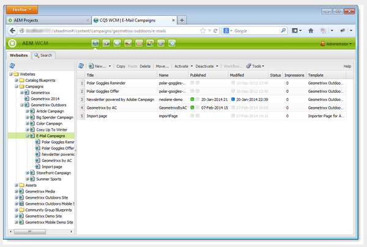
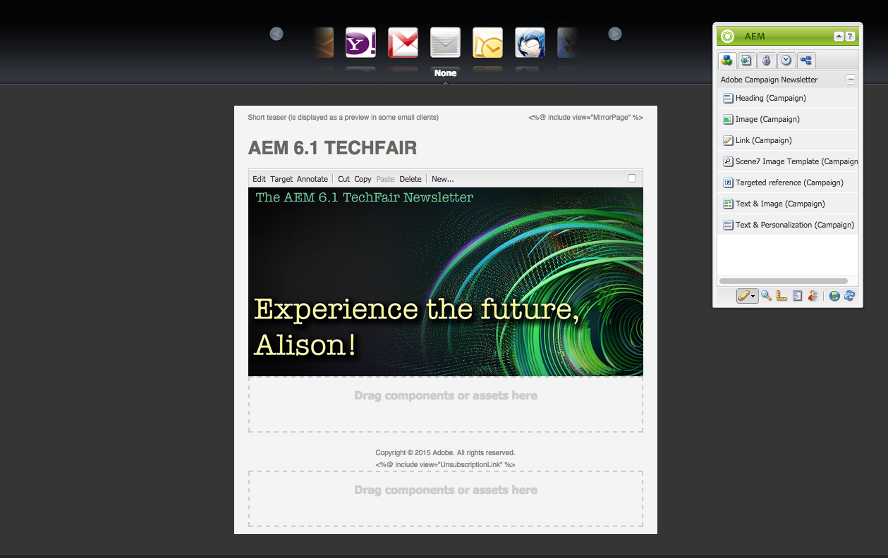

# Trabajo con Adobe Campaign 6.1 y Adobe Campaign Standard{#working-with-adobe-campaign-and-adobe-campaign-standard}

Puede crear contenido de correo electrónico en AEM y procesarlo en los mensajes de correo electrónico de Adobe Campaign. Para ello, debe hacer lo siguiente:

1. Cree una newsletter nueva en AEM a partir de una plantilla específica de Adobe Campaign.
1. Seleccione [un servicio de Adobe Campaign](#selectingtheadobecampaigncloudservice) antes de editar el contenido para acceder a toda la funcionalidad.
1. Edite el contenido.
1. Valide el contenido.

A continuación, el contenido se puede sincronizar con un envío en Adobe Campaign. Las instrucciones detalladas se describen en este documento.

>[!NOTE]
>
>Antes de poder usar esta funcionalidad, debe configurar AEM para integrarse con [Adobe Campaign](/help/sites-administering/campaignonpremise.md) o [Adobe Campaign Standard](/help/sites-administering/campaignstandard.md).

## Enviar el contenido de correo electrónico a través de Adobe Campaign {#sending-email-content-via-adobe-campaign}

Después de configurar AEM y Adobe Campaign, puede crear contenido de envío de correo electrónico directamente en AEM y, a continuación, procesarlo en Adobe Campaign.

Al crear contenido de Adobe Campaign en AEM, debe establecer un vínculo a un servicio de Adobe Campaign antes de editar el contenido para acceder a todas las funciones.

Existen dos casos posibles:

* El contenido se puede sincronizar con un envío de Adobe Campaign. Esto le permite utilizar el contenido de AEM en un envío.
* (solo instalación local de Adobe Campaign) El contenido se puede enviar directamente a Adobe Campaign, que genera automáticamente un nuevo envío de correo electrónico. Este modo tiene limitaciones.

Las instrucciones detalladas se describen en este documento.

### Creación de nuevo contenido de correo electrónico {#creating-new-email-content}

>[!NOTE]
>
>When adding email templates, be sure to add them under **/content/campaigns** to make them available.

1. In AEM, select the **Websites** folder then browse your explorer to find where your email campaigns are managed. In the following example, the node concerned is **Websites** > **Campaigns** > **Geometrixx Outdoors** > **Email Campaigns**.

   >[!NOTE]
   >
   >[Los ejemplos de correo electrónico solo están disponibles en Geometrixx](/help/sites-developing/we-retail.md#weretail). Descargue el contenido de ejemplo de Geometrixx de Uso compartido de paquetes.

   

1. Select **New** > **New Page** to create new email content.
1. Seleccione una de las plantillas disponibles específicas de Adobe Campaign y rellene las propiedades generales de la página. De forma predeterminada, están disponibles tres plantillas:

   * **Correo electrónico de Adobe Campaign (AC 6.1)**: permite agregar contenido a una plantilla predefinida antes de enviarla a Adobe Campaign 6.1 para su envío.
   * **Correo electrónico de Adobe Campaign (ACS)**: permite agregar contenido a una plantilla predefinida antes de enviarla a Adobe Campaign Standard para su envío.
   

1. Click **Create** to create your email or newsletter.

### Selección del servicio de nube y de la plantilla de Adobe Campaign {#selecting-the-adobe-campaign-cloud-service-and-template}

Para integrar con Adobe Campaign, debe añadir un servicio de nube de Adobe Campaign a la página. Al hacerlo, tendrá acceso a la personalización y a otro tipo de información de Adobe Campaign.

Además, puede que deba seleccionar la plantilla de Adobe Campaign, cambiar el asunto y añadir contenido con texto sin formato para aquellos usuarios que no puedan ver el correo electrónico en HTML.

1. Select the **Page** tab in the sidekick, then select **Page properties.**
1. In the **Cloud services** tab in the pop-up window, select **Add Service** to add the Adobe Campaign service and click **OK**.

   

1. Select the configuration that matches your Adobe Campaign instance from the drop-down list, then click **OK**.

   >[!NOTE]
   >
   >Asegúrese de tocar o de hacer clic en **OK** o **Aplicar** después de añadir el servicio de nube. Esto permite que la pestaña **Adobe Campaign** funcione correctamente.

1. If you would like to apply a specific email delivery template (from Adobe Campaign), other than the default **mail** template, select **Page properties** again. In the **Adobe Campaign** tab, enter the email delivery template&#39;s internal name in the related Adobe Campaign instance.

   En Adobe Campaign Standard, la plantilla es **Envío con contenido de AEM**. En Adobe Campaign 6.1, la plantilla es **Envío de correo electrónico con contenido de AEM**.

   When you select the template, AEM automatically enables the **Adobe Campaign Newsletter** components.

### Edición del contenido de correo electrónico {#editing-email-content}

Puede editar el contenido de correo electrónico en la interfaz de usuario clásica o en la interfaz de usuario táctil.

1. Enter the subject and the text version of the email by selecting **Page properties** > **Email** from the toolbox.

   

1. Para editar el contenido del mensaje de correo electrónico, añada los elementos que desee de los que se encuentran disponibles en la barra de tareas. Para ello, arrástrelos y colóquelos. A continuación, haga doble clic en el elemento que desee editar.

   Por ejemplo, puede añadir texto que contenga campos de personalización.

   

   Consulte [Componentes de Adobe Campaign](/help/sites-classic-ui-authoring/classic-personalization-ac-components.md) para obtener una descripción de los componentes disponibles para las newsletters o las campañas de correo electrónico de Adobe Campaign.

   

### Inserción de personalización {#inserting-personalization}

Al editar el contenido, puede insertar:

* Campos de contexto de Adobe Campaign. Estos son campos que puede insertar en el texto y que se adaptarán según los datos del destinatario (por ejemplo, nombre, apellidos o cualquier dato de la dimensión de destino).
* Bloques de personalización de Adobe Campaign. Son bloques de contenido predefinido que no están relacionados con los datos del destinatario, como un logotipo de marca o un vínculo a una página reflejada.

Consulte [Componentes de Adobe Campaign](/help/sites-classic-ui-authoring/classic-personalization-ac-components.md) para obtener una descripción exhaustiva de los componentes de Campaign.

>[!NOTE]
>
>* Solo se tienen en cuenta los campos de la dimensión objetivo **Perfiles** de Adobe Campaign.
>* When viewing Properties from **Sites**, you do not have access to the Adobe Campaign context fields. Puede acceder a ellos directamente desde el correo electrónico durante la edición.
>

1. Insert a new **Newsletter** > **Text &amp; Personalization (Campaign)** component.
1. Haga doble clic en el componente para abrirlo. La ventana **Editar** tiene una funcionalidad que le permite insertar los elementos de personalización.

   >[!NOTE]
   >
   >Los campos de contexto disponibles corresponden a la dimensión objetivo **Perfiles** de Adobe Campaign.
   >
   >See [Linking an AEM page to an Adobe Campaign email](/help/sites-classic-ui-authoring/classic-personalization-ac-campaign.md#linkinganaempagetoanadobecampaignemail).

   

1. Select **Client Context** in the sidekick to test the personalization fields using the data in the persona profiles.

   

1. Aparece una ventana en que puede seleccionar el perfil que desee. Los datos del perfil seleccionado sustituyen automáticamente los campos de personalización.

   

### Vista previa de un formulario {#previewing-a-newsletter}

Puede previsualizar el aspecto que tendrá la newsletter, así como la personalización.

1. Abra la newsletter que desee previsualizar y haga clic en Vista previa (lupa) para reducir el tamaño de la barra de tareas.
1. Haga clic en uno de los iconos del cliente de correo electrónico para ver el aspecto que tendrá la newsletter en cada cliente de correo electrónico.

   

1. Expanda la barra de tareas para volver a comenzar a editar.

### Aprobación de contenido en AEM {#approving-content-in-aem}

Una vez terminado el contenido, puede iniciar el proceso de aprobación. Go to the **Workflow** tab of the toolbox and select the **Approve for Adobe Campaign** workflow.

Este flujo de trabajo listo para usar tiene dos pasos: revisión y aprobación, o revisión y rechazo. Sin embargo, este flujo de trabajo puede ampliarse y adaptarse a un proceso más complejo.

Para aprobar contenido para Adobe Campaign, seleccione **Flujo de trabajo** en la barra de tareas, después **Aprobar para Adobe Campaign** y haga clic en **Iniciar flujo de trabajo para aplicarlo**. Siga los pasos y apruebe el contenido. También puede rechazar el contenido. Para ello, seleccione **Rechazar** en lugar de **Aprobar** en el último paso del flujo de trabajo.

Una vez aprobado el contenido, aparece como aprobado en Adobe Campaign. A continuación, se puede enviar el correo electrónico.

En Adobe Campaign Standard:

En Adobe Campaign 6.1:

>[!NOTE]
>
>El contenido no aprobado se puede sincronizar con un envío en Adobe Campaign, pero el envío no se puede ejecutar. Solo se puede enviar contenido aprobado a través de envíos de Campaign.

## Vinculación de AEM con Adobe Campaign Standard y Adobe Campaign 6.1 {#linking-aem-with-adobe-campaign-standard-and-adobe-campaign}

>[!NOTE]
>
>See [Linking AEM with Adobe Campaign Standard and Adobe Campaign 6.1](/help/sites-authoring/campaign.md#linking-aem-with-adobe-campaign-standard-and-adobe-campaign-classic) under [Working with Adobe Campaign 6.1 and Adobe Campaign Standard](/help/sites-authoring/campaign.md) in the standard authoring docurmentation for details.

