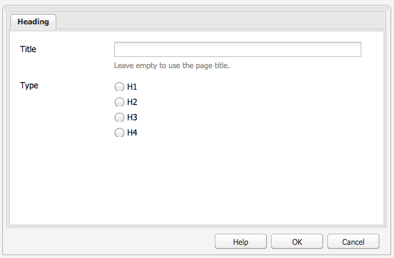
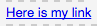
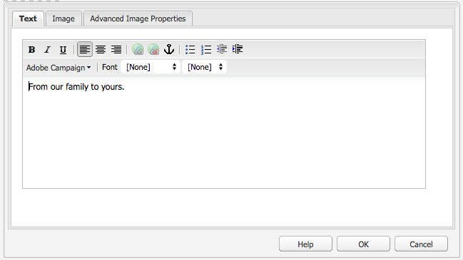
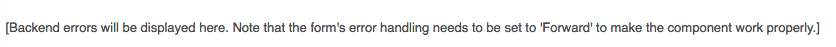

# Componentes de Adobe Campaign{#adobe-campaign-components}

Cuando integre un elemento con Adobe Campaign, tendrá componentes disponibles para cuando trabaje con boletines y formularios. Ambas opciones se describen en este documento.

>[!CAUTION]
>
>Los componentes de correo electrónico AEM han quedado obsoletos. Debido a la naturaleza del correo electrónico, que combina contenido y estilo, los componentes de correo electrónico proporcionados de forma predeterminada por AEM se vuelven de uso limitado para los clientes debido a la necesidad de implementar estilos personalizados en los componentes que sean necesarios para los proyectos.
>
>Los componentes de correo electrónico se pueden implementar a nivel de proyecto y los componentes de correo electrónico AEM obsoletos ilustran cómo se puede lograr. Sin embargo, estos componentes desaprobados no deben usarse en proyectos.

## Componentes del boletín de Adobe Campaign {#adobe-campaign-newsletter-components}

Todos los componentes de Campaign siguen las prácticas recomendadas que se describen en [Plantillas de prácticas recomendadas para el correo electrónico](/help/sites-administering/best-practices-for-email-templates.md) y se basan en el lenguaje de marcado [HTL](https://helpx.adobe.com/experience-manager/htl/using/overview.html) de Adobe.

Cuando abra un boletín o mensaje de correo que esté configurado para ser integrado con Adobe Campaign, debe comprobar los siguientes componentes de la sección **Boletín de Adobe Campaign**:

* Encabezado (Campaign)
* Imagen (Campaign)
* Vínculo (Campaign)
* Plantilla de imagen de Scene7 (Campaign)
* Referencia de destino (Campaign)
* Texto e imagen (Campaign)
* Texto y personalización (Campaign)

Una descripción de estos componentes se encuentra en la sección siguiente.

### Encabezado (Campaign) {#heading-campaign}

El componente Encabezado puede:

* Mostrar el nombre de la página actual; para ello, deje en blanco el campo **Título**.
* Mostrar un texto especificado en el campo **Título**.

Edite el componente **Encabezado (Campaign)** directamente. Déjelo vacío para utilizar el título de página.

Puede configurar lo siguiente:

* **Título** Si quiere utilizar un nombre distinto al del título de la página, introdúzcalo aquí.

* **Nivel de encabezado (1, 2, 3, 4)** Nivel de encabezado basado en los tamaños 1-4 del encabezado HTML.

En el siguiente ejemplo se muestra el componente Encabezado (Campaign) que se está visualizando.

### Imagen (Campaign) {#image-campaign}

El componente de imagen (Campaign) muestra una imagen y un texto de acompañamiento en función de los parámetros especificados.

Puede cargar una imagen y luego editarla y manipularla (por ejemplo, recortar, rotar y añadir un vínculo/título/texto).

Puede cargar una imagen y luego editarla y manipularla (por ejemplo, recortar, rotar y añadir un vínculo/título/texto). Es posible arrastrar y soltar una imagen del [Buscador de contenido](/help/sites-authoring/author-environment-tools.md#thecontentfinderclassicui) directamente en el componente o en su cuadro de diálogo de edición. También es posible hacer doble clic en la zona central del cuadro de diálogo de edición para explorar el sistema de archivos local y cargar una imagen. Las dos pestañas del cuadro de diálogo de edición también controlan las definiciones y la manipulación de la imagen:

Al cargar una imagen, se pueden configurar los aspectos siguientes:

* **Planificar**
Para planificar una imagen, seleccione Planificar. Es posible especificar cómo será el mapa de imagen (un rectángulo, un polígono, etc.) y hacia dónde debe apuntar la zona.

* **Recortar**
Seleccione Recortar para recortar una imagen. Utilice el ratón para recortar la imagen.

* **Rotar**
Para rotar una imagen, seleccione Rotar. Utilícelo repetidamente hasta que la imagen rote hacia el lado que prefiera.

* **Borrar** Eliminar la imagen actual.

* Barra de zoom (solo clásica) Para hacer zoom en una imagen, utilice la barra desplegable debajo de la imagen (encima de los botones de Aceptar y Cancelar).
* **Título** Título de la imagen.

* **Texto alternativo** Texto alternativo para utilizar cuando se crea contenido accesible.

* **Vínculo a** Cree un vínculo a recursos u otras páginas en su página web.

* **Descripción** Descripción de la imagen.

* **Tamaño** Configure la altura y la anchura de la imagen.

>[!NOTE]
>
>Debe introducir la información en el campo **Texto alternativo** de la ficha **Avanzado**, o la imagen no se podrá guardar y verá el siguiente mensaje de error:
>
>`Validation failed. Verify the values of the marked fields.`

En el siguiente ejemplo se muestra el componente Imagen (Campaign) que se está visualizando.

### Vínculo (Campaign) {#link-campaign}

El componente Vínculo (Campaign) le permite añadir un vínculo al boletín. Este componente solo está disponible en la interfaz de usuario clásica, aunque se puede añadir uno en la interfaz de usuario optimizada para funciones táctiles y abrirlo en el modo de compatibilidad.

Puede configurar lo siguiente en las fichas **Visualización**, **Información de la dirección URL** o **Avanzado**:

* **Pie de ilustración del vínculo** Es el pie de ilustración del vínculo. Este es el texto que los usuarios ven.

* **Información sobre herramientas del vínculo** Añade información adicional sobre cómo utilizar el vínculo.

* ****
LinkTypeEn la lista desplegable, seleccione entre una 
**Dirección** URL personalizada y un Documento **** adaptable. Este campo es obligatorio. Si selecciona una dirección URL personalizada, puede proporcionar la URL del vínculo. Si selecciona el documento adaptable, puede proporcionar la ruta de acceso del documento.

* **Parámetro de URL adicional** Añada cualquier parámetro de URL adicional. Haga clic en Añadir elemento para añadir varios elementos.

>[!NOTE]
>
>Debe introducir información en el campo **Tipo de vínculo** de la ficha **Información de URL**, o bien el componente no puede guardar y verá el siguiente mensaje de error:
>
>`Validation failed. Verify the values of the marked fields.`

En el siguiente ejemplo se muestra el componente Vínculo (Campaign) que se está visualizando.

### Referencia de destino (Campaign) {#targeted-reference-campaign}

El componente Referencia de destino (Campaign) le permite crear una referencia de un párrafo de destino.

En este componente, deberá ir al párrafo de destino para seleccionarlo.

Haga clic en el menú desplegable para desplazarse al párrafo al que desea hacer referencia. Cuando termine, haga clic en **Aceptar**.

### Texto e imagen (Campaign) {#text-image-campaign}

El componente Texto e imagen (Campaign) añade un bloque de texto y una imagen.

Al igual que con los componentes de texto y personalización (Campaign) e imagen (Campaign), puede configurar:

* **Texto**
Introduzca el texto. Utilice la barra de herramientas para modificar el formato, crear listas y añadir vínculos.

* **Imagen**
Arrastre una imagen desde el buscador de contenido o haga clic para echar una ojeada a la imagen. Recorte o gire, según sea necesario.

* **Propiedades de la imagen** (**Propiedades avanzadas de la imagen**)
Permite especificar lo siguiente:

   * **Título** El título del bloque se mostrará al pasar el cursor por encima.

   * **Texto alternativo** El texto alternativo que aparecerá si la imagen no se puede mostrar. 

   * **Vínculo a** Cree un vínculo a los recursos u otras páginas en su página web.

   * **Descripción** Descripción de la imagen.

   * **Tamaño** Configure la altura y la anchura de la imagen.

>[!NOTE]
>
>El campo **Texto alternativo** de la ficha **Avanzado** es necesario; de lo contrario, no se podrá guardar el componente y verá el siguiente mensaje de error:
>
>`Validation failed. Verify the values of the marked fields.`

En el siguiente ejemplo se muestra el componente Texto e imagen (Campaign) que se está visualizando.

### Texto y personalización (Campaign) {#text-personalization-campaign}

El componente Texto y personalización (Campaña) permite introducir un bloque de texto mediante un editor WYSIWYG, con funcionalidad proporcionada por el [editor de texto enriquecido](/help/sites-authoring/rich-text-editor.md). Además, este componente le permite utilizar los campos de contexto y los bloques de personalización disponibles en Adobe Campaign; consulte también [Insertar personalizaciones](/help/sites-classic-ui-authoring/classic-personalization-ac-campaign.md#inserting-personalization).

Una selección de iconos le permitirá dar formato a su texto, incluyendo las características de la fuente, la alineación, los vínculos, las listas y la sangría. 

Añada texto como lo hace habitualmente en el editor de texto enriquecido. Añada elementos personalizados; para ello, seleccione el menú desplegable de Adobe Campaign y seleccione los campos que desee.

Añada los campos de texto y contexto o los bloques de personalización para crear el contenido. A continuación, seleccione Client Context para probar los datos de los perfiles de los usuarios. Después de seleccionar una persona, los campos de personalización se sustituyen automáticamente con datos del perfil seleccionado.

>[!NOTE]
>
>Solo los campos definidos en **nms:seedMember** o en una de sus extensiones se tienen en cuentan. Los atributos de las tablas vinculadas a `nms:seedMember` no están disponibles.

## Componentes del formulario de Adobe Campaign {#adobe-campaign-form-components}

Utilice componentes de Adobe Campaign para crear un formulario que los usuarios deberán rellenar para suscribirse al boletín, cancelar la suscripción al mismo o actualizar sus perfiles. Consulte [Crear formularios de Adobe Campaign](/help/sites-classic-ui-authoring/classic-personalization-ac-forms.md) para obtener más información.

Cada campo del componente se puede vincular al campo de una base de datos de Adobe Campaign. Los campos disponibles varían según el tipo de datos que contienen, tal como se describe en la sección [Componentes y tipo de datos](#components-and-data-type). Si amplía el esquema de destinatarios en Adobe Campaign, los campos nuevos estarán disponibles en los componentes cuyos tipos de datos coincidan.

Al abrir un formulario configurado para integrarse con Adobe Campaign, verá los siguientes componentes en la sección **Adobe Campaign**:

* Casilla (Campaign)
* Campo de fecha (Campaign) y Campo de fecha/HTML 5 (Campaign)
* Clave principal cifrada (Campaign)
* Visualización de error (Campaign)
* Clave de reconciliación oculta (Campaign)
* Campo numérico (Campaign)
* Campo de opciones (Campaign)
* Lista de comprobación de suscripciones (Campaign)
* Campo de texto (Campaign)

En esta sección se describe cada componente detalladamente.

### Componentes y tipos de datos  {#components-and-data-type}

En la tabla siguiente se describen los componentes que pueden visualizar y modificar los datos de perfil de Adobe Campaign. Cada componente se puede asignar a un campo del perfil de Adobe Campaign para mostrar su valor y así actualizar el campo cuando se envíe el formulario. Los distintos componentes solo pueden coincidir con los campos de un tipo de datos determinado.

<table>
 <tbody>
  <tr>
   <td>
<strong>Componente</strong>
 </td>
   <td>
<strong>Tipo de datos del campo Adobe Campaign</strong>
 </td>
   <td>
<strong>Campo de ejemplo</strong>
 </td>
  </tr>
  <tr>
   <td>
Casilla (Campaign)
 </td>
   <td>
boolean
 </td>
   <td>
Ya no hay contacto (por cualquier canal)
 </td>
  </tr>
  <tr>
   <td>
Campo de fecha (Campaign)
 
Campo de fecha/HTML 5 (Campaign)
 </td>
   <td>
date
 </td>
   <td>
Fecha de nacimiento
 </td>
  </tr>
  <tr>
   <td>
Campo numérico (Campaign)
 </td>
   <td>
numérico (byte, corto, largo, doble)
 </td>
   <td>
Edad
 </td>
  </tr>
  <tr>
   <td>
Campo de opciones (Campaign)
 </td>
   <td>
byte con valores asociados
 </td>
   <td>
Sexo
 </td>
  </tr>
  <tr>
   <td>
Campo de texto (Campaign)
 </td>
   <td>
Cadena
 </td>
   <td>
Correo electrónico
 </td>
  </tr>
 </tbody>
</table>

### Configuración común de la mayoría de componentes {#settings-common-to-most-components}

Los componentes de Adobe Campaign tienen opciones de configuración que son comunes en todos los componentes (excepto la clave principal cifrada y los componentes de la clave de reconciliación oculta).

En la mayoría de los componentes puede configurar lo siguiente:

#### Título y texto  {#title-and-text}

* **Título** Si quiere utilizar un nombre distinto al del elemento, introdúzcalo aquí.

* **Ocultar título** Seleccione esta casilla de verificación si no quiere que el título sea visible.

* **Descripción** Añada una descripción en el campo para proporcionar más información para los usuarios.

* **Mostrar solo el valor** Únicamente muestra el valor, si hubiera uno

#### Adobe Campaign {#adobe-campaign}

Puede configurar lo siguiente:

* **Asignar** Seleccione un campo de personalización de Adobe Campaign, si es necesario.

* **Clave de reconciliación** Seleccione esta casilla si este campo forma parte de la clave de reconciliación.

#### Restricciones {#constraints}

* **Requerido** : seleccione esta casilla de verificación para que este componente sea necesario; es decir, los usuarios deben introducir un valor.
* **Mensaje**  requerido: si lo desea, agregue un mensaje que indique que el campo es obligatorio.

#### Estilo {#styling}

* **CSS** Incorpore las clases CSS que quiera utilizar para este componente.

### Casilla (Campaign) {#checkbox-campaign}

El componente Casilla (Campaign) permite al usuario modificar los campos de perfil de Adobe Campaign cuyo tipo de datos sea booleano. Por ejemplo, podría tener un componente Casilla (Campaign) que permite al destinatario especificar que no desea que nos pongamos en contacto con él a través de ningún canal.

Puede [configurar las opciones comunes a la mayoría de componentes de Adobe Campaign](#settings-common-to-most-components) en el componente Casilla (Campaign).

En el siguiente ejemplo se muestra el componente Casilla (Campaign) que se está visualizando.

### Campo de fecha (Campaign) y Campo de fecha/HTML 5 (Campaign) {#date-field-campaign-and-date-field-html-campaign}

Utilice el campo de fecha para permitir que los destinatarios especifiquen una fecha; por ejemplo, puede permitir que los destinatarios especifiquen sus fechas de nacimiento. El formato de la fecha coincide con el formato utilizado en la instancia de Adobe Campaign.

Además de [realizar la configuración común en la mayoría de los componentes de Adobe Campaign](#settings-common-to-most-components), puede configurar lo siguiente:

* **Restricciones: Restricción** : se puede seleccionar  **** Fecha no  **** original para agregar la restricción de una fecha o ninguna restricción. Si selecciona la fecha, la respuesta que los usuarios escriban en el campo debe estar en un formato de fecha.

* **Mensaje**  de restricción: además, puede agregar un mensaje de restricción para que los usuarios sepan cómo dar un formato correcto a sus respuestas.
* **Estilo - Anchura**  - Ajuste la anchura del campo haciendo clic o tocando los  **+** y  **-** iconos o introduciendo un número.

En el siguiente ejemplo se muestra el componente Campo de fecha (Campaign) con el ancho ajustado que se está visualizando.

### Clave principal cifrada (Campaign) {#encrypted-primary-key-campaign}

Este componente define el nombre del parámetro de URL que contendrá el identificador de un perfil de Adobe Campaign (**identificador del recurso principal** o **clave principal cifrada** en Adobe Campaign Standard y 6.1, respectivamente).

Cada formulario que muestra y modifica los datos de perfil de Adobe Campaign **debe** incluir un componente de clave principal cifrada.

Puede configurar lo siguiente en el componente Clave principal cifrada (Campaign):

* **Título y texto - Nombre**  del elemento- Predeterminado en encryptPK. Solo debe cambiar el nombre del elemento cuando esté en conflicto con el nombre de otro elemento del formulario. Dos campos de formulario no pueden tener el mismo nombre de elemento.
* **Adobe Campaign - parámetro**  URL - Añada el parámetro de URL para el EPK. Por ejemplo, puede utilizar el valor **EPK**.

En el siguiente ejemplo se muestra el componente Clave principal cifrada (Campaign) que se está visualizando.

### Visualización de error (Campaign) {#error-display-campaign}

Este componente le permite mostrar los errores de back-end. El control de errores del formulario debe establecerse en Reenviar para que el componente funcione correctamente.

En el siguiente ejemplo se muestra el componente Visualización de error (Campaign) que se está visualizando.

### Clave de reconciliación oculta (Campaign) {#hidden-reconciliation-key-campaign}

El componente Clave de reconciliación oculta (Campaña) permite agregar campos ocultos como parte de la clave de reconciliación a un formulario.

Puede configurar lo siguiente en el componente Clave de reconciliación oculta (Campaign):

* **Título y texto - Nombre**  del elemento- Predeterminado para reconcilKey. Solo debe cambiar el nombre del elemento cuando esté en conflicto con el nombre de otro elemento del formulario. Dos campos de formulario no pueden tener el mismo nombre de elemento.
* **Adobe Campaign - Asignación** - Asignación a un campo de personalización de Adobe Campaign.

En el siguiente ejemplo se muestra el componente Clave de reconciliación oculta (Campaign) que se está visualizando.

### Campo numérico (Campaign) {#numeric-field-campaign}

Utilice el campo numérico para permitir que los destinatarios introduzcan números como, por ejemplo, su edad.

Además de [realizar la configuración común en la mayoría de los componentes de Adobe Campaign](#settings-common-to-most-components), puede configurar lo siguiente:

* **Restricciones:** Lista desplegable de restricciones Puede seleccionar - **** No  **numérico o** Numérico-para agregar la restricción de un número o de ninguna restricción. Si selecciona el número, la respuesta que los usuarios escriban en el campo debe ser numérica.

* **Mensaje**  de restricción: además, puede agregar un mensaje de restricción para que los usuarios sepan cómo dar un formato correcto a sus respuestas.
* **Estilo - Anchura**  - Ajuste la anchura del campo haciendo clic o tocando los  **+** y  **-** iconos o introduciendo un número.

En el siguiente ejemplo se muestra el componente Campo numérico (Campaign) con el ancho configurado que se está visualizando.

### Campo de opciones (Campaign) {#option-field-campaign}

Esta lista desplegable le permite seleccionar una opción; por ejemplo, el sexo o el estado de un destinatario.

Puede [configurar las opciones comunes a la mayoría de componentes de Adobe Campaign](#settings-common-to-most-components) en el componente Campo de opciones (Campaign). Para rellenar la lista desplegable, seleccione el campo correspondiente en los campos de personalización de Adobe Campaign; para ello, haga clic o pulse el símbolo de Adobe Campaign y desplácese hasta el campo.

En el siguiente ejemplo se muestra el componente Campo de opciones (Campaign) que se está visualizando.

### Lista de comprobación de suscripciones (Campaign) {#subscriptions-checklist-campaign}

Utilice el componente **Lista de comprobación de suscripciones (Campaign)** para modificar las suscripciones asociadas a un perfil de Adobe Campaign.

Cuando se añade a un formulario, este componente muestra todas las suscripciones disponibles a modo de casillas, y permite al usuario seleccionar las suscripciones que desee. Cuando los usuarios envían el formulario, este componente suscribe o cancela la suscripción del usuario a los servicios seleccionados en función del tipo de acción del formulario (**Adobe Campaign: Suscríbase a Servicios** o **Adobe Campaign: Cancele la suscripción a Servicios**).

>[!NOTE]
>
>El componente no comprueba a qué servicios está suscrito el usuario ni de cuáles canceló la suscripción.

Puede [configurar las opciones comunes a la mayoría de componentes de Adobe Campaign](#settings-common-to-most-components) en el componente Lista de comprobación de suscripciones (Campaign). (No hay ninguna configuración de Adobe Campaign disponible para este componente).

En el siguiente ejemplo se muestra el componente Lista de comprobación de suscripciones (Campaign) que se está visualizando.

### Campo de texto (Campaign) {#text-field-campaign}

El componente Campo de texto (Campaign) que le permite introducir referencias de tipo cadena, como el nombre, el apellido, la dirección, la dirección de correo electrónico, etc.

Además de [realizar la configuración común en la mayoría de los componentes de Adobe Campaign](#settings-common-to-most-components), puede configurar lo siguiente:

* **Restricciones: Restricción**  desplegable: Puede seleccionar:  **Ninguno**,  **Correo electrónico**,  **Nombre**  (sin puntos suspensivos) para agregar la restricción de una dirección de correo electrónico, un nombre o ninguna restricción. Si selecciona el correo electrónico, la respuesta que los usuarios escriban en el campo debe ser una dirección de correo electrónico. Si selecciona el nombre, la respuesta debe ser un nombre (la diéresis no se admite).

* **Mensaje**  de restricción: además, puede agregar un mensaje de restricción para que los usuarios sepan cómo dar un formato correcto a sus respuestas.
* **Estilo - Anchura**  - Ajuste la anchura del campo haciendo clic o tocando los  **+** y  **-** iconos o introduciendo un número.

En el siguiente ejemplo se muestra el componente Campo de texto (Campaign) que se está visualizando.

