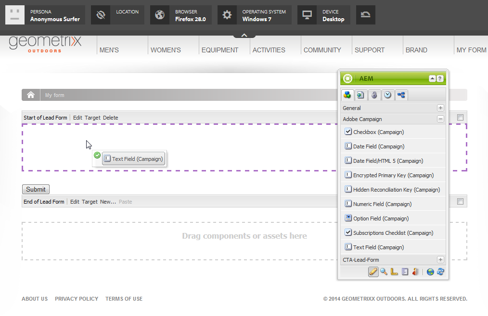

# Crear formularios de Adobe Campaign en AEM{#creating-adobe-campaign-forms-in-aem}

AEM permite crear y utilizar formularios que interactúan con Adobe Campaign en el sitio web. Hay campos específicos que se pueden insertar en los formularios y asignar a la base de datos de Adobe Campaign.

Puede administrar nuevas suscripciones de contacto, cancelaciones de suscripciones y datos de perfiles de usuarios, a la vez que integra todos esos datos en la base de datos de Adobe Campaign.

Para utilizar los formularios de Adobe Campaign en AEM, tiene que seguir estos pasos que se describen en este documento:

1. Consiga que una plantilla esté disponible.
1. Cree un formulario.
1. Edite el contenido del formulario.

De forma predeterminada, existen tres tipos de formularios disponibles específicos de Adobe Campaign:

* Guardar un perfil
* Suscribirse a un servicio
* Cancelar la suscripción a un servicio

Estos formularios definen un parámetro de URL que acepte la clave principal cifrada de un perfil de Adobe Campaign. Según este parámetro de URL, el formulario actualiza los datos del perfil de Adobe Campaign asociado.

Aunque cree estos formularios de forma independiente, al usarlos se genera un vínculo personalizado a una página de formularios dentro del contenido del boletín, de modo que los destinatarios puedan abrir el vínculo y realizar los ajustes necesarios en los datos del perfil (para cancelar la suscripción, suscribirse o actualizar el perfil).

El formulario se actualiza automáticamente en función del usuario. Consulte [Editar el contenido de los formularios](#editing-form-content) para obtener más información.

## Hacer que una plantilla esté disponible {#making-a-template-available}

Antes de poder crear formularios específicos de Adobe Campaign, debe realizar las plantillas diferentes que hay en su aplicación de AEM.

Para ello, consulte la [documentación de plantillas](/help/sites-developing/page-templates-static.md#templateavailability).

En primer lugar, compruebe la conexión entre el autor y las instancias de publicación y que Adobe Campaign funciona correctamente. Consulte [Integrar con Adobe Campaign Standard](/help/sites-administering/campaignstandard.md) o [Integrar con Adobe Campaign 6.1](/help/sites-administering/campaignonpremise.md).

>[!NOTE]
>
>Asegúrese de que la propiedad **acMapping** en el nodo **jcr:content** de la página está establecida en **mapRecipient** o en **profile** al usar Adobe Campaign 6.1.x o Adobe Campaign Standard, respectivamente.

### Crear un formulario {#creating-a-form}

1. Empiece en siteadmin.
1. Desplácese por la estructura de árbol hasta llegar al lugar donde desea crear el formulario en la página web seleccionada.
1. Seleccione **Nueva** > **Nueva página...**.
1. Seleccione la plantilla **Perfil de Adobe Campaign (AC 6.1)** o **Perfil de Adobe Campaign (ACS)** e introduzca las propiedades de la página.

   >[!NOTE]
   >
   >Si la plantilla no está disponible, consulte la sección [Hacer que una plantilla esté disponible](/help/sites-classic-ui-authoring/classic-personalization-ac.md#activatingatemplate).

1. Haga clic en **Crear** para crear el formulario.

   

   A continuación podrá [editar y configurar el contenido del formulario](#editing-form-content).

## Editar el contenido del formulario  {#editing-form-content}

Los dedicados a Adobe Campaign tienen componentes específicos. Estos componentes tienen una opción para permitir que se vincule cada campo del formulario a un campo de la base de datos de Adobe Campaign.

>[!NOTE]
>
>Si la plantilla deseada no está disponible, consulte [Disponibilidad de una plantilla](/help/sites-classic-ui-authoring/classic-personalization-ac.md#activatingatemplate).

En esta sección se detallan únicamente los vínculos específicos de Adobe Campaign. Para obtener más información sobre una descripción general más general de cómo utilizar formularios en Adobe Experience Manager, consulte [Componentes de Editmode](/help/sites-classic-ui-authoring/classic-page-author-edit-mode.md).

1. Desplácese hasta el formulario que quiera editar.
1. En el cuadro de herramientas, seleccione **Página** > **Propiedades de la página...** luego vaya a la ficha **Cloud Services** de la ventana emergente.
1. Añada el servicio de Adobe Campaign haciendo clic en **Añadir servicio** y, a continuación, seleccionando la configuración que corresponde a la instancia de Adobe Campaign en la lista desplegable del servicio. Se realiza esta configuración al configurar la conexión entre instancias. Para obtener más información, consulte [Conexión de AEM a Adobe Campaign](/help/sites-administering/campaignonpremise.md#connecting-aem-to-adobe-campaign).

   >[!NOTE]
   >
   >Si es necesario, desbloquee la configuración haciendo clic en el icono del candado para poder añadir el servicio de Adobe Campaign.

1. Acceda a los parámetros generales del formulario mediante el botón **Editar** que se encuentra en el inicio del formulario. La ficha **Formulario** permite seleccionar una página de agradecimiento a la que se redirigirá al usuario después de haber validado el formulario.

   El formulario **Avanzado** permite seleccionar el tipo de formulario. El campo **Opciones de anuncio** le permite elegir entre tres tipos de formularios Adobe Campaign:

   * **Adobe Campaign: Guardar perfil**: permite crear o actualizar un destinatario en Adobe Campaign (valor predeterminado).
   * **Adobe Campaign: Suscribirse a servicios**: permite gestionar las suscripciones de un destinatario en Adobe Campaign.
   * **Adobe Campaign: Cancelar suscripción a los servicios**: permite cancelar las suscripciones de un destinatario en Adobe Campaign.

   El campo **Configuración de la acción** permite especificar si desea o no crear el perfil de destinatario en la base de datos de Adobe Campaign si aún no existe. Para ello, marque la opción **Crear usuario si no existe**.

1. Añada los componentes seleccionados; para ello, arrástrelos del cuadro de herramientas y situándolos en el formulario. Para obtener más información sobre los componentes específicos que están disponibles en Adobe Campaign, consulte [Componentes de formulario de Adobe](/help/sites-classic-ui-authoring/classic-personalization-ac-components.md).

   

1. Configure los campos añadidos al hacer doble clic en ellos. La ficha **Adobe Campaign** permite vincular el campo a un campo de la tabla de destinatario de Adobe Campaign. También puede especificar si el campo forma parte de la clave de reconciliación, la cual permite reconocer a los destinatarios que ya se encuentran en la base de datos de Adobe Campaign.

   >[!CAUTION]
   >
   >El **nombre del elemento** debe ser diferente para cada campo de formulario. Cambiar si es necesario.
   >
   >Cada formulario debe contener un componente **Clave principal cifrada** para administrar correctamente los destinatarios en la base de datos de Adobe Campaign.

1. Active la página seleccionando **Página** > **Activar página** en el cuadro de herramientas. La página se activa en el sitio. Puede verlo en la instancia de publicación de AEM. Los datos de la base de datos de Adobe Campaign se actualizan una vez que se valide un formulario.

## Probar un formulario  {#testing-a-form}

Después de crear un formulario y editar el contenido, es posible que desee probar de forma manual que el formulario funciona correctamente.

>[!NOTE]
>
>Debe tener un componente **Clave principal cifrada** en cada formulario. En Componentes, seleccione Adobe Campaign para que solo esos componentes estén visibles.
>
>Aunque en este procedimiento escriba el número de EPK manualmente, en la práctica, los usuarios recibirán un vínculo a la página (para cancelar la suscripción, suscribirse o actualizar el perfil) en un boletín. De acuerdo con el usuario, la EPK se actualiza automáticamente.
>
>Para crear ese vínculo, utilice la variable **Identificador de recursos principal**(Adobe Campaign Standard) o **Identificador cifrado** (Adobe Campaign 6.1) (por ejemplo, en un componente **Texto y personalización (Campaña)**), que se vincula a la página en Adobe Campaign.

Para hacer esto, debe obtener manualmente la EPK de un perfil de Adobe Campaign y añadirlo a la dirección URL:

1. Para obtener la clave principal de cifrado (EPK) de un perfil de Adobe Campaign:

   * En Adobe Campaign Standard: vaya a **Perfiles y Audiencias** > **Perfiles**, que lista los perfiles existentes. Asegúrese de que la tabla muestra el campo **Identificador de recursos principal** en una columna (esto se puede configurar haciendo clic o tocando **Configurar lista**). Copie el identificador del recurso principal del perfil deseado.
   * En Adobe Campaign 6.11, vaya a **Perfiles y Destinatarios** > **Destinatarios**, que lista los perfiles existentes. Asegúrese de que la tabla muestra el campo **Identificador cifrado** en una columna (esto se puede configurar haciendo clic con el botón derecho en una entrada y seleccionando **Configurar lista...**). Copie el identificador cifrado del perfil deseado.

1. En AEM, abra la página de formulario en la instancia de publicación y anexe el EPK del paso 1 como parámetro de URL: utilice el mismo nombre que definió anteriormente en el componente EPK al crear el formulario (por ejemplo: `?epk=...`)
1. El formulario se puede utilizar para modificar los datos y las suscripciones asociados al perfil vinculado de Adobe Campaign. Después de modificar algunos campos y enviar el formulario, podrá comprobar en Adobe Campaign que se actualizaron los datos adecuados.

Los datos de la base de datos de Adobe Campaign se actualizan una vez que se valide un formulario.
