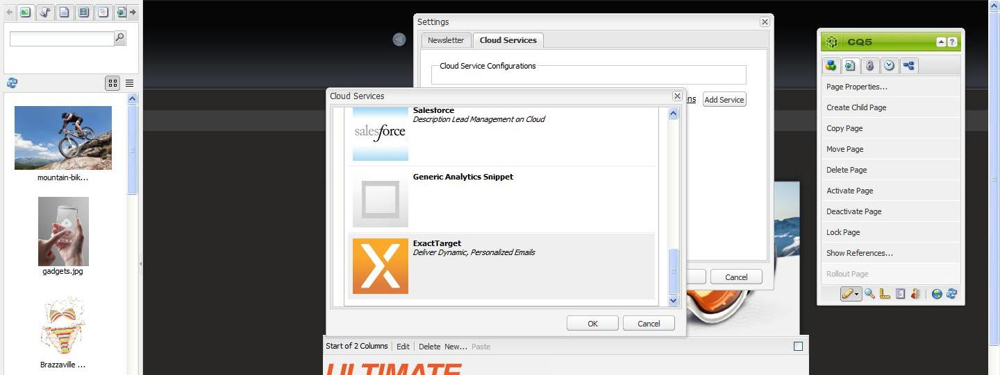

# Publicar un mensaje de correo electrónico para los proveedores de servicios de correo electrónico{#publishing-an-email-to-email-service-providers}

Puede publicar boletines en servicios de correo electrónico, como ExactTarget y Silverpop Engage. En este documento se describe la forma de configurar AEM para publicar un boletín en esos servicios de correo electrónico.

>[!NOTE]
>
>Debe configurar el proveedor de servicios antes de crear y publicar un mensaje de correo electrónico. Consulte [Configuración de ExactTarget](/help/sites-administering/exacttarget.md) y [Configuración del compromiso de Silverpop](/help/sites-administering/silverpop.md) para obtener más información.

Para publicar el correo electrónico en el proveedor de servicios de correo electrónico, debe realizar los pasos siguientes:

1. Cree un mensaje de correo electrónico.
1. Aplique la configuración del servicio de correo electrónico a la dirección de correo electrónico.
1. Publicar el correo electrónico.

>[!NOTE]
>
>Si actualiza los proveedores de correo electrónico, haga una prueba piloto o envíe un boletín; estas operaciones fallarán si el boletín no está publicado en la instancia Publicar o si esta instancia no está disponible. Asegúrese de publicar el boletín y de que la instancia Publicar funciona correctamente.

## Crear un correo electrónico {#creating-an-email}

Se puede crear un correo electrónico o una newsletter que desee publicar en un servicio de correo electrónico en una campaña con la plantilla **Newsletter de Geometrixx**. También puede usar la plantilla **Correo electrónico de Geometrixx Outdoors**. Hay disponible un ejemplo de correo electrónico o newsletter basado en la plantilla **Correo electrónico de Geometrixx Outdoors** en `https://<hostname>:<port>/cf#/content/campaigns/geometrixx-outdoors/e-mails.html`.

Para crear un nuevo correo electrónico que se publique en el servicio de correo electrónico configurado:

1. Vaya a **Sitios web** y luego **Campañas**. Seleccione una campaña.
1. Haga clic en **Nuevo** para abrir la ventana **Crear página**.
1. Especifique el título y nombre y seleccione la plantilla **Boletín de Geometrixx** de la lista de plantillas disponibles.
1. Haga clic en **Crear**.
1. Abra el correo electrónico que ha creado.
1. Cambie al modo de diseño para seleccionar los componentes que desee mostrar en la barra de tareas.
1. Cambie al modo de edición y empiece a añadir contenido (texto, imágenes, [herramientas de correo electrónico](#adding-exacttarget-email-tools-to-your-email), [variables de personalización](#adding-text-and-personalization-tool-to-your-e-mail), etc.) al boletín.

### Añadir herramientas de correo electrónico de ExactTarget al correo electrónico {#adding-exacttarget-email-tools-to-your-email}

>[!NOTE]
>
>Esta sección es específica del servicio de ExactTarget.

El componente **Herramientas de correo electrónico** de ExactTarget puede añadir más funcionalidades de correo electrónico al mensaje o al boletín.

1. Abra el correo electrónico que quiera publicar en ExactTarget.
1. Añada el componente **ET: herramientas de correo electrónico** a la página mediante la barra de tareas. Abra el componente en el modo de edición.

   

1. Seleccione una opción del menú **Opciones**:

<table>
 <tbody>
  <tr>
   <td>Dirección física de envío (obligatoria)</td>
   <td>Este componente inserta la dirección de correo física de su organización en el correo electrónico.</td>
  </tr>
  <tr>
   <td>Centro de perfiles (obligatorio)</td>
   <td>El centro de perfiles es una página web en la que los suscriptores pueden introducir y mantener la información personal que usted retiene sobre ellos.</td>
  </tr>
  <tr>
   <td>Ver correo electrónico como página Web</td>
   <td>Este componente permite al usuario ver el correo electrónico como una página web.</td>
  </tr>
  <tr>
   <td>Política de privacidad</td>
   <td>Este componente inserta el vínculo a la política de privacidad en el correo electrónico.  </td>
  </tr>
  <tr>
   <td>Centro de cancelación de suscripciones</td>
   <td>Permite al usuario cancelar la suscripción a su lista de correo.</td>
  </tr>
  <tr>
   <td>Centro de suscripciones</td>
   <td>Un centro de suscripción es una página web en la que un suscriptor puede controlar los mensajes que recibe de su organización.</td>
  </tr>
  <tr>
   <td>Seguimiento de aperturas de correo electrónico</td>
   <td>Componente oculto que le permite utilizar la función de seguimiento de ExactTarget.  </td>
  </tr>
 </tbody>
</table>

>[!NOTE]
>
>El menú desplegable **Opciones** solo se rellenará si se aplica la configuración ExactTarget al correo electrónico. Consulte [Aplicación de la configuración del servicio de correo electrónico a la configuración del correo electrónico](#applying-e-mail-service-configuration-to-e-mail-settings) para obtener más información.

1. Publicar el correo electrónico en ExactTarget.

   El mensaje que tiene las herramientas de correo electrónico estará disponible en la cuenta configurada de ExactTarget.

>[!NOTE]
>
>* Las direcciones URL dentro de las herramientas de correo electrónico se reemplazan (en el correo electrónico recibido) por sus valores reales únicamente cuando se envía un correo electrónico mediante **Envío simple** o **Envío guiado** pero no **Envío de prueba**.
   >
   >
* Se requieren dos de las herramientas de correo electrónico: **Dirección física de envío (obligatoria)** y **Centro de perfiles (obligatorio)**. Cuando se publica el correo electrónico en ExactTarget, se añaden estas dos herramientas de correo electrónico de forma predeterminada en la parte inferior de cada mensaje.

>

### Añadir la herramienta de texto y personalización al correo electrónico  {#adding-text-and-personalization-tool-to-your-e-mail}

Puede añadir campos personalizados en un correo electrónico; para ello, añada el componente **Texto y personalización** a la página:

1. Abra el correo electrónico que se publicará en el servicio de correo electrónico.
1. Para activar el campo personalización del servicio de correo electrónico, añada la configuración del marco mientras configura el servicio de correo electrónico. Consulte [configuración de Silverpop Engage](/help/sites-administering/silverpop.md) y [configuración de Exact Destinatario](/help/sites-administering/exacttarget.md) para obtener más información.
1. Añada el componente **Texto y personalización** de la barra de tareas. Este componente forma parte del grupo del boletín. Abra este componente en el modo de edición.

   

1. Añada el campo personalizado requerido al texto; para ello, seleccione el campo en el menú desplegable y haga clic en **Insertar**.
1. Haga clic en **Aceptar** para finalizar.

## Aplicar la configuración del servicio de correo electrónico a los mensajes de correo electrónico {#applying-e-mail-service-configuration-to-e-mail-settings}

Para aplicar la configuración del servicio de correo electrónico a un boletín:

1. Cree una configuración de servicio de correo electrónico.
1. Abra el correo electrónico o el boletín.
1. Abra la configuración de correo electrónico o newsletter haciendo clic en **Configuración** o en **Propiedades de la página en** la barra de tareas.
1. Haga clic en **Añadir servicio** en la ficha **Servicios de nube**. Verá la lista de servicios. Seleccione la configuración necesaria (**ExactTarget** o **Silverpop**) de la lista que encontrará en la lista desplegable.

   

1. Haga clic en **Aceptar**.

## Publicar mensajes de correo electrónico en el servicio de correo electrónico {#publishing-emails-to-email-service}

Los mensajes de correo electrónico y los boletines se pueden publicar en el servicio de correo electrónico, si sigue estos pasos:

1. Abra el correo electrónico.
1. Antes de publicar un correo electrónico, compruebe que haya aplicado la configuración correcta al correo.
1. Haga clic en **Publicar**. Esta opción abrirá la ventana **Publicar boletín en el proveedor de servicios de correo electrónico.**
1. Rellene el campo **Nombre del boletín**. El correo electrónico o el boletín se publicó en el proveedor de servicios de correo electrónico con este nombre. Si no se especifica ningún nombre, el correo electrónico se publicará con el nombre de la página del boletín en AEM.
1. Haga clic en **Publicar**.

   

   Si la operación es correcta, AEM confirmará que se puede ver el correo electrónico en ExactTarget o Silverpop Engage.

   En el caso de ExactTarget, el correo electrónico publicado se puede ver haciendo clic en **Correo electrónico publicado de Vista**. Esto lo lleva directamente a la newsletter publicada en ExactTarget ([https://members.exacttarget.com/](https://members.exacttarget.com/).).

>[!NOTE]
>
>Si un boletín se publica con el mismo nombre que un correo electrónico o boletín publicado recientemente, no se reemplazará el correo o boletín anterior. En cambio, se creará un nuevo correo electrónico o boletín con el mismo nombre (aunque los ID de los dos boletines serán diferentes).
>
>Al publicar mensajes de correo electrónico y boletines en el proveedor de servicios de correo electrónico, también se publican en la instancia de publicación de AEM.

### Actualizar un correo electrónico publicado {#updating-a-published-e-mail}

El botón **Actualizar** del cuadro de diálogo Publicar permite actualizar una newsletter ya publicada a un Proveedor de servicio de correo electrónico. Si todavía no se ha publicado el boletín y hace clic en el botón **Actualizar**, se mostrará el mensaje **No se publicó el boletín**.

Para actualizar un correo electrónico publicado:

1. Abra el correo electrónico o el boletín que ya se haya publicado en un proveedor de servicios de correo electrónico, y que quiera volver a publicar después de realizar cambios en él.
1. Haga clic en **Publicar**. Se abre la ventana **Publicar newsletter en Proveedor de servicio de correo electrónico**. Haga clic en **Actualizar**.

   Para comprobar si el correo electrónico o la newsletter se han actualizado en ExactTarget, haga clic en **Correo electrónico publicado de Vista**. Esto le llevará al correo electrónico publicado en ExactTarget.

   Para comprobar si el correo electrónico o el boletín se ha actualizado en el servicio de correo electrónico de Silverpop, consulte el sitio Silverpop Engage.

