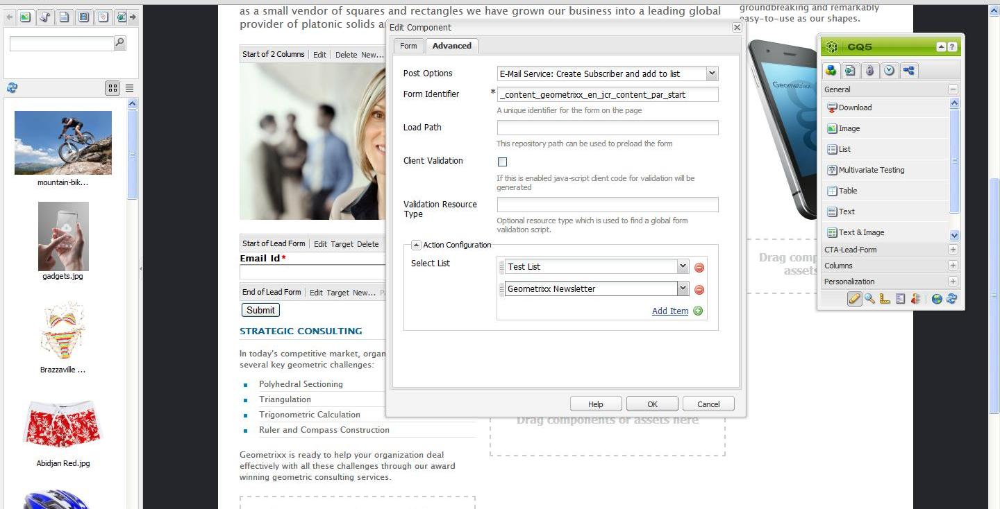

# Administración de suscripciones{#managing-subscriptions}

>[!NOTE]
>
>El Adobe no tiene previsto mejorar esta capacidad (administración de posibles clientes y listas).
>La recomendación es aprovechar [Adobe Campaign AEM y su integración con la](/help/sites-administering/campaign.md).

Se puede pedir a los usuarios que se suscriban a **Proveedor de servicio de correo electrónico** listas de correo con la ayuda de **Form** AEM Componente utilizado en una página web de. AEM AEM Para preparar una página de con un formulario de suscripción para suscribirse a las listas de correo del servicio de correo electrónico, debe aplicar la configuración del servicio correspondiente a la página de la página que visitará el suscriptor potencial.

## Aplicación de la configuración del servicio de correo electrónico a una página {#applying-email-service-configuration-to-a-page}

AEM Para configurar una página de:

1. Vaya a **Sitios web** pestaña.
1. Seleccione la página que debe configurarse para el servicio. Haga clic con el botón derecho en la página y seleccione **Propiedades**.

1. Seleccionar **Cloud Services** entonces **Añadir servicio**. Seleccione una configuración de la lista de configuraciones disponibles.

   

1. Haga clic en **Aceptar**.

## AEM Creación de un formulario de suscripción en una página de la para suscribirse o cancelar la suscripción a listas {#creating-a-sign-up-form-on-an-aem-page-for-subscribing-unsubscribing-to-lists}

Para crear un formulario de registro y configurarlo para suscripciones a las listas de correo del proveedor de servicios de correo electrónico:

1. AEM Abra la página de la que visitará el usuario.
1. Aplique la configuración del proveedor de servicios de correo electrónico a la página.

1. Añadir un **Form** a la página arrastrando el componente desde la barra de tareas. Si el componente no está disponible, cambie al modo de diseño y habilite **Form** grupo.
1. Clic **Editar** en el **Inicio de formulario** y vaya a la **Avanzadas** pestaña.
1. En el **Form** menú desplegable, seleccione **Servicio de correo electrónico: crear suscriptor** y añadir a la lista.
1. En la parte inferior del cuadro de diálogo, abra el **Configuración de acción** , que le permite seleccionar una o más listas de suscripción.
1. En el **Seleccionar lista**, seleccione la lista a la que desea que se suscriban los usuarios. Puede agregar varias listas utilizando el botón &quot;+&quot; (**Agregar elemento**).

   

   >[!NOTE]
   >
   >El cuadro de diálogo puede variar según el proveedor de servicios de correo electrónico.

1. En el **Form** , seleccione la página de agradecimiento a la que desee que vayan los usuarios después de enviar el formulario (si se deja en blanco, el formulario se vuelve a mostrar tras el envío). Haga clic en **Aceptar**. Un **ID de correo electrónico** Este componente aparece en el formulario, lo que le permite crear un formulario en el que los usuarios pueden enviar sus direcciones de correo electrónico para suscribirse o cancelar la suscripción a una lista de correo.
1. Añada el **Enviar** componente de botón del **Form** sección de la barra de tareas.

   El formulario está listo. Publique la página configurada en los pasos anteriores junto con el **gracias** a la instancia de publicación. Cualquier suscriptor potencial que visite la página puede rellenar el formulario y suscribirse a la lista proporcionada en la configuración.

   >[!NOTE]
   >
   >Para que la suscripción al formulario funcione correctamente, [las claves de cifrado del autor deben exportarse e importarse en la instancia de publicación](#exporting-keys-from-author-and-importing-on-publish).

## Exportación de claves de autor e importación en publicación {#exporting-keys-from-author-and-importing-on-publish}

Para que el servicio de correo electrónico pueda suscribirse y cancelar la suscripción a través del formulario de registro en la instancia de publicación, debe seguir estos pasos:

1. En la instancia de autor de, vaya al Administrador de paquetes.
1. Cree un nuevo paquete. Definir el filtro como `/etc/key`.
1. Genere y descargue el paquete.
1. Vaya al Administrador de paquetes en la instancia de publicación y cargue este paquete.
1. Vaya a la consola OSGI de publicación y reinicie el paquete llamado **Adobe Granite Crypto Support**.

## Cancelar la suscripción de usuarios a listas {#unsubscribing-users-from-lists}

Para cancelar la suscripción de usuarios a listas:

1. AEM Abra las propiedades de la página de la página de la página de la que tiene el formulario de registro para cancelar la suscripción de un posible cliente.
1. Aplique la configuración del servicio a la página.
1. Cree un formulario de registro en la página.
1. Al configurar el componente, seleccione la acción **Servicio de correo electrónico**: **Cancelar la suscripción del usuario a la lista.**
1. En el menú desplegable, seleccione la lista adecuada de la que se eliminará el usuario al cancelar la suscripción.

   

1. Exporte las claves del autor para publicarlas.

## Configuración de correos electrónicos de respuesta automática para el servicio de correo electrónico {#configuring-auto-responder-emails-for-email-service}

Para configurar un correo electrónico de respuesta automática para un suscriptor:

1. AEM Abra las propiedades de la página de la página de la página de la que tenga el formulario de registro para configurar el respondedor automático de un posible cliente.
1. Aplique la configuración de ExactTarget a la página.

1. Añadir un **Form** a la página arrastrando el componente desde la barra de tareas. Si el componente no está disponible, cambie al modo de diseño y habilite el **Form** grupo.
1. Clic **Editar** en el **Inicio de formulario** y vaya a la **Avanzadas** pestaña.
1. En el **Form** menú desplegable, seleccione **Servicio de correo electrónico: enviar correo electrónico de respuesta automática.**
1. **Seleccionar un correo electrónico** (este es el correo electrónico que se envía como correo electrónico de respuesta automática).

1. **Seleccionar clasificación** (esta clasificación se utiliza para enviar el correo electrónico).
1. Seleccione el **Gracias.** página (la página a la que se dirige a los usuarios una vez que envían el formulario).

   En el **Form** , seleccione la página de agradecimiento a la que desee que vayan los usuarios después de enviar el formulario. (Si se deja en blanco, el formulario se vuelve a mostrar tras el envío). Haga clic en **Aceptar**.

1. Exporte las claves del autor para publicarlas.
1. Añada el **Enviar** componente de botón del **Form** sección de la barra de tareas.

   El formulario de registro está listo. Publique la página configurada en los pasos anteriores junto con el **gracias** a la instancia de publicación. Cualquier suscriptor potencial que visite la página puede rellenar el formulario y, al enviarlo, el visitante recibirá un correo electrónico de respuesta automática con el ID de correo electrónico rellenado en el formulario.

   >[!NOTE]
   >
   >Para que la suscripción al formulario de registro funcione correctamente, [las claves de cifrado del autor deben exportarse e importarse en la instancia de publicación](#exporting-keys-from-author-and-importing-on-publish).

   
