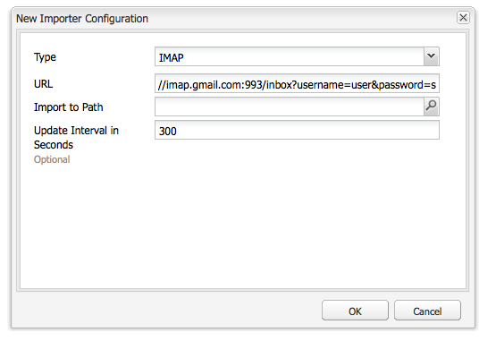

# Seguimiento de correos electrónicos devueltos{#tracking-bounced-emails}

>[!NOTE]
>
>Adobe no planea mejorar aún más el seguimiento de los correos electrónicos abiertos o devueltos por AEM servicio SMTP.
>
>La recomendación es [aprovechar Adobe Campaign y su integración AEM](/help/sites-administering/campaign.md).

Cuando envíe una newsletter a varios usuarios, normalmente habrá direcciones de correo electrónico no válidas en la lista. Si se envían newsletters a estas direcciones, se devolverán. AEM puede administrar el correo devuelto y dejar de enviar newsletters a dichas direcciones cuando se supera el contador de devoluciones. De forma predeterminada, la tasa de devolución es de 3, pero puede configurarse.

Para configurar AEM de modo que realice el seguimiento de los correos electrónicos devueltos, deberá configurar AEM para que sondee un buzón de correo existente en el que se recibirán los correos devueltos (normalmente, será la dirección de correo electrónico remitente que especifique al enviar la newsletter). AEM sondea esta bandeja de entrada e importa todos los correos electrónicos por debajo de la ruta especificada en la configuración de sondeo. A continuación, se activa un flujo de trabajo para buscar las direcciones de correo electrónico devueltas dentro de los usuarios y actualiza el valor de la propiedad bounceCounter del usuario en consecuencia. Tras superar el número máximo de devoluciones configurado, el usuario se eliminará de la lista de newsletter.

## Configuración de Feed Importer {#configuring-the-feed-importer}

Feed Importer le permite importar varias veces contenido de fuentes externas en su repositorio. Con esta configuración de Feed Importer, AEM comprueba si hay correos electrónicos devueltos en el buzón de correo del remitente.

Para configurar Feed Importer para que realice el seguimiento de los correos electrónicos devueltos:

1. En **Herramientas**, seleccione Feed Importer.

1. Haga clic en **Añadir** para crear una configuración nueva.

   

1. Para añadir una configuración nueva, seleccione el tipo y añada información a la URL de sondeo para configurar el host y el puerto. Asimismo, debe añadir parámetros de correo y protocolo a la consulta URL. Establezca la configuración de forma que se sondee al menos una vez al día.

   Todas las configuraciones necesitan información sobre lo siguiente en la URL de sondeo:

   `username`: Nombre de usuario que se utilizará para la conexión

   `password`: Contraseña que se utilizará para la conexión

   Asimismo, según el protocolo, puede configurar ciertos ajustes.

   **Propiedades de configuración POP3:**

   `pop3.leave.on.server`: Define si los mensajes se dejarán en el servidor o no. Configúrelo en true para dejar mensajes en el servidor o false para borrarlos. La opción predeterminada es true.

   **Ejemplos de POP3:**

   | pop3s://pop.gmail.com:995/INBOX?username=user&amp;password=secret | Se utiliza pop3 en SSL para conectar con GMail en el puerto 995 con user/secret, dejando mensajes en el servidor de forma predeterminada |
   |---|---|
   | pop3s://pop.gmail.com:995/INBOX?username=user&amp;password=secret&amp;pop3.leave.on.server=false | pop3s://pop.gmail.com:995/INBOX?username=user&amp;password=secret&amp;pop3.leave.on.server=false |

   **Propiedades de configuración IMAP:**

   Permite configurar indicadores de búsqueda.

   `imap.flag.SEEN`:Configurar false para los mensajes nuevos o no vistos y true para los mensajes ya leídos

   Consulte [https://java.sun.com/products/javamail/javadocs/javax/mail/Flags.Flag.html](https://java.sun.com/products/javamail/javadocs/javax/mail/Flags.Flag.html) para obtener la lista completa de los indicadores.

   **Ejemplos de IMAP:**

   | imaps://imap.gmail.com:993/inbox?username=user&amp;password=secret | Se utiliza IMAP en SSL para conectar con GMail en el puerto 993 con user/secret. De forma predeterminada, solo se ven los mensajes nuevos. |
   |---|---|
   | imaps://imap.gmail.com:993/inbox?username=user&amp;password=secret&amp;imap.flag.SEEN=true | Se utiliza IMAP en SSL para conectar con GMail 993 con user/secret, solo se ven los mensajes ya leídos. |
   | imaps://imap.gmail.com:993/inbox?username=user&amp;password=secret&amp;imap.flag.SEEN=true&amp;imap.flag.SEEN=false | Se utiliza IMAP en SSL para conectar con GMail 993 con user/secret, solo se ven los mensajes leídos O los nuevos. |

1. Guarde la configuración.

## Configuración del componente de servicio de la newsletter  {#configuring-the-newsletter-service-component}

Tras configurar Feed Importer, debe configurar la dirección De y el contador de devoluciones.

Para configurar el servicio de newsletter:

1. En la consola OSGi en `<host>:<port>/system/console/configMgr` y vaya a **Newsletter de MCM**.

1. Configure el servicio y guarde los cambios cuando haya terminado.

   

   Se pueden ajustar las configuraciones siguientes para cambiar el comportamiento:

   | Bounce Counter Maximum (max.bounce.count) | Define el número de devoluciones para que se omita un usuario al enviar una newsletter. Si este valor se configura en 0, se deshabilita totalmente la comprobación de devoluciones. |
   |---|---|
   | Activity No Cache (sent.activity.nocache) | Define la configuración de caché que se utilizará para la actividad de newsletter enviada |

   Cuando se haya guardado, el servicio de MCM newsletter realiza las acciones siguientes:

   * Escribe una actividad en el flujo oculto del usuario tras enviar la newsletter correctamente.
   * Escribe una actividad si se detecta una devolución y cambia el contador de devoluciones del usuario.
