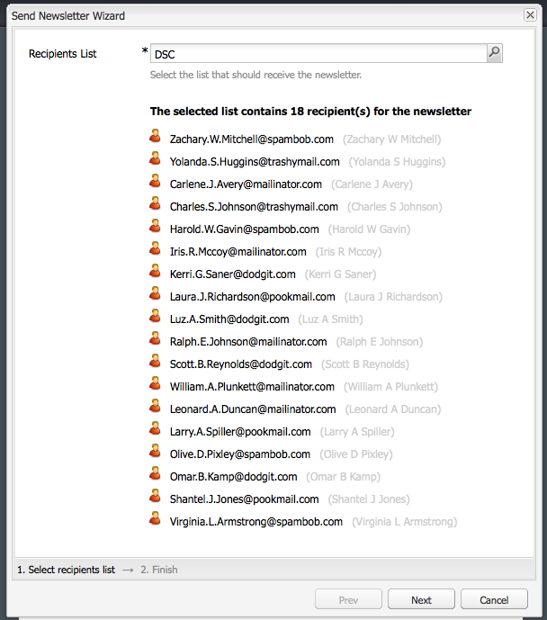

# Marketing por correo electrónico{#e-mail-marketing}

>[!NOTE]
>
>Adobe no tiene previsto mejorar aún más la función de seguimiento de correo electrónico abierto/devuelto (no entregable) enviado por el servicio SMTP de AEM.
>La recomendación es [ aprovechar Adobe Campaign y la integración a AEM](/help/sites-administering/campaign.md).

El marketing por correo electrónico (por ejemplo, boletines), constituye una parte importante de cualquier campaña de marketing, ya que se emplea para destacar contenidos con el fin de que estos lleguen a sus posibles clientes. En AEM, es posible crear boletines a partir de contenido existente de AEM, así como añadir contenido nuevo, específico para los boletines.

Una vez creados, puede enviar los boletines a un grupo específico de usuarios de forma inmediata o en otro momento planificado (mediante el uso de un flujo de trabajo). Asimismo, los usuarios pueden suscribirse a boletines en el formato que seleccionen.

Asimismo, AEM permite administrar la funcionalidad de la newsletter, incluyendo el mantenimiento de temas, archivando newsletters y viendo estadísticas de la newsletter.

>[!NOTE]
>
>En Geometrixx, la plantilla de newsletter se abre automáticamente en el editor de correo electrónico. El editor de correo electrónico se puede emplear en otras plantillas en las que desee enviar los correos; por ejemplo, invitaciones. El editor de correo electrónico se muestra siempre que una página se hereda de **mcm/components/newsletter/page**.

En este documento se describen los conceptos básicos para crear boletines en AEM. Para obtener más información sobre cómo trabajar con estrategias de marketing por correo electrónico, consulte los siguientes documentos:

* [Crear una página de aterrizaje del boletín eficaz](/help/sites-classic-ui-authoring/classic-personalization-campaigns-email-landingpage.md)
* [Administración de suscripciones](/help/sites-classic-ui-authoring/classic-personalization-campaigns-email-subscriptions.md) 
* [Publicar un mensaje de correo electrónico para los proveedores de servicios de correo electrónico](/help/sites-classic-ui-authoring/classic-personalization-campaigns-email-newsletters.md)
* [Seguimiento de correos electrónicos devueltos](/help/sites-classic-ui-authoring/classic-personalization-campaigns-email-tracking-bounces.md)

>[!NOTE]
>
>Si actualiza los proveedores de correo electrónico, haga una prueba piloto o envíe un boletín; estas operaciones fallarán si el boletín no está publicado en la instancia Publicar o si esta instancia no está disponible. Asegúrese de publicar el boletín y de que la instancia Publicar funciona correctamente.

## Crear una experiencia de boletín {#creating-a-newsletter-experience}

>[!NOTE]
>
>Las notificaciones por correo electrónico deben configurarse mediante la configuración de OSGI. Consulte [Configurar las notificaciones por correo electrónico.](/help/sites-administering/notification.md)

1. Seleccione la campaña nueva en el panel izquierdo o haga doble clic en el panel derecho.

1. Seleccione la vista de lista con el icono:

   

1. Haga clic en **Nuevo...**

   Puede especificar el **Título**, **Nombre** y tipo de experiencia que se va a crear; en este caso, Newsletter.

   

1. Haga clic en **Crear**.

1. Se abrirá un nuevo cuadro de diálogo inmediatamente. Aquí podrá especificar las propiedades del boletín.

   La **Lista de destinatarios predeterminada** es un campo obligatorio ya que constituye el touchpoint del boletín (consulte [Uso de listas](/help/sites-classic-ui-authoring/classic-personalization-campaigns.md#workingwithlists) para obtener más información sobre las listas).

   

   * **Nombre De** Nombre que aparecerá como remitente de la newsletter.

   * **Dirección De** Dirección de correo que aparecerá como remitente de la newsletter.

   * **Asunto** Asunto de la newsletter.

   * **Responder a** Dirección de correo que enviará las respuestas de la newsletter enviada.

   * **Descripción** Descripción de la newsletter.

   * **Tiempo de activación** Tiempo de activación para enviar la newsletter.

   * **Lista de destinatarios predeterminada** Lista predeterminada de usuarios que deben recibir la newsletter.
   Pueden actualizarse posteriormente desde el cuadro de diálogo **Propiedades...**.

1. Haga clic en **Aceptar** para guardar.

## Añadir contenido a boletines {#adding-content-to-newsletters}

Puede añadir contenido, incluyendo contenido dinámico, al boletín tal y como lo haría en cualquier componente de AEM. En Geometrixx, la plantilla de la newsletter dispone de determinados componentes disponibles para añadir y modificar el contenido de las newsletters.

1. En, haga clic en la ficha **Campaigns** y haga doble clic en la newsletter que desee editar o a la que quiera añadir contenido. La newsletter se abre.

1. Si los componentes no se pueden ver, vaya a la vista Diseño y active los componentes necesarios (por ejemplo, los componentes de Newsletter) antes de comenzar la edición.
1. Introduzca cualquier nuevo texto, imagen y otros componentes, según sea necesario. En el ejemplo de Geometrixx, hay 4 componentes disponibles: Texto, Imagen, Encabezado y 2 columnas. El boletín puede tener más o menos componentes en función de su configuración.

   >[!NOTE]
   >
   >Los boletines se personalizan mediante el uso de variables. En el boletín de Geometrixx, las variables están disponibles en el componente Texto. Los valores para las variables se heredan de la información del perfil de usuario.

   

1. Para insertar variables, seleccione la variable de la lista y haga clic en **Insertar**. Las variables se rellenan desde el perfil.

## Personalizar los boletines {#personalizing-newsletters}

Los boletines se personalizan insertando variables predefinidas en el componente Texto de los boletines en Geometrixx. Los valores para las variables se heredan de la información del perfil de usuario.

También puede simular el modo en que se personaliza una newsletter, utilizando ClientContext y cargando un archivo.

Para personalizar una newsletter y simular su aspecto:

1. En MCM, abra la newsletter para la que desee personalizar la configuración.

1. Abra el componente Texto que desee personalizar.

1. Sitúe el cursor donde desee que aparezca la variable y seleccione una variable en la lista desplegable y haga clic en **Insertar**. Realice esta operación para tantas variables como sea necesario y haga clic en **Aceptar**.

   

1. Para simular el aspecto que tendrá la variable cuando se envíe, presione Ctrl+ALT+C para abrir ClientContext y seleccione **Cargar**. Seleccione el usuario de la lista cuyo perfil desee cargar y haga clic en **Aceptar**.

   La información del perfil cargado ha rellenado las variables.

   

## Probar boletines en diferentes clientes de correo electrónico {#testing-newsletters-in-different-e-mail-clients}

>[!NOTE]
>
>Antes de enviar newsletters, compruebe la configuración de OSGi para Day CQ Link Externalizer en `https://localhost:4502/system/console/configMgr`.
>
>De forma predeterminada, el valor del parámetro es `localhost:4502` y la operación no podrá completarse si se cambia el puerto de ejecución de la instancia.

Cambie entre clientes de correo electrónico comunes para ver el aspecto que tendrá el boletín para los posibles clientes. De forma predeterminada, el boletín no se abre con ninguno de los clientes de correo electrónico seleccionados.

Actualmente, puede ver los boletines en los siguientes clientes de correo electrónico:

* Correo de Yahoo
* Gmail
* Hotmail
* Thunderbird
* Microsoft Outlook 2007
* Apple Mail

Para alternar entre clientes, haga clic en el icono correspondiente para ver el boletín en ese cliente de correo electrónico:

1. En MCM, abra la newsletter para la que desee personalizar la configuración.

1. Haga clic en un cliente de correo electrónico en la barra superior para ver qué aspecto tendría la newsletter en ese cliente.

   

1. Repita este paso para cualquier cliente de correo electrónico adicional que desee ver.

   

## Personalizar la configuración del boletín {#customizing-newsletter-settings}

Aunque solo los usuarios autorizados pueden enviar un boletín, se debe personalizar lo siguiente:

* La línea de asunto, para que los usuarios deseen abrir el correo y también garantizar que el boletín no termine marcado como correo no deseado.
* La dirección De; por ejemplo, noreply@geometrixx.com, para que los usuarios reciban el correo electrónico desde una dirección especificada.

Para personalizar la configuración de la newsletter:

1. En MCM, abra la newsletter para la que desee personalizar la configuración.

   

1. En la parte superior de la newsletter, haga clic en **Ajustes**.

   
1. Indique la dirección de correo electrónico **De**.

1. Modifique el **Asunto** del correo, si es necesario.

1. Seleccione una **Lista de destinatarios predeterminada** de la lista desplegable.

1. Haga clic en **Aceptar**.

   Cuando pruebe o envíe el boletín, los destinatarios recibirán correos electrónicos con el asunto y la dirección especificados.

## Prueba de envío de boletines {#flight-testing-newsletters}

Aunque la prueba de envío no es obligatoria, antes de enviar una, puede que desee probarla para asegurarse de que aparezca del modo deseado.

La prueba de envío permite lo siguiente:

* Ver el boletín en [todos los clientes de destino](#testing-newsletters-in-different-e-mail-clients).
* Validar que el servidor de correo está configurado correctamente.
* Determinar si el correo se marca como no deseado. (Asegúrese de incluirse a sí mismo en la lista de destinatarios).

>[!NOTE]
>
>Si actualiza los proveedores de correo electrónico, haga una prueba piloto o envíe un boletín; estas operaciones fallarán si el boletín no está publicado en la instancia Publicar o si esta instancia no está disponible. Asegúrese de publicar el boletín y de que la instancia Publicar funciona correctamente.

Para probar los boletines:

1. En MCM, abra la newsletter que desee probar y enviar.

1. En la parte superior de la newsletter, haga clic en **Probar** para realizar la prueba antes del envío.

   

1. Especifique la dirección de correo de prueba donde desee enviar el boletín y haga clic en **Enviar**. Si desea cambiar el perfil, cargue otro en ClientContext. Para ello, presione Ctrl+ALT+C y seleccione Cargar para cargar el perfil.

## Enviar boletines {#sending-newsletters}

>[!NOTE]
>
>Adobe no tiene previsto mejorar aún más la función de seguimiento de correo electrónico abierto/devuelto (no entregable) enviado por el servicio SMTP de AEM.
>La recomendación es [ aprovechar Adobe Campaign y la integración a AEM](/help/sites-administering/campaign.md).

El boletín se puede enviar desde el propio boletín o desde la lista. Se describen ambos procedimientos.

>[!NOTE]
>
>Antes de enviar newsletters, compruebe la configuración de OSGi para Day CQ Link Externalizer en `https://localhost:4502/system/console/configMgr`.
>
>De forma predeterminada, el valor del parámetro es `localhost:4502` y la operación no podrá completarse si se cambia el puerto de ejecución de la instancia.

>[!NOTE]
>
>Si actualiza los proveedores de correo electrónico, haga una prueba piloto o envíe un boletín; estas operaciones fallarán si el boletín no está publicado en la instancia Publicar o si esta instancia no está disponible. Asegúrese de publicar el boletín y de que la instancia Publicar funciona correctamente.

### Enviar boletines desde una campaña  {#sending-newsletters-from-a-campaign}

Para enviar un boletín desde la campaña:

1. En MCM, abra el boletín que desee enviar.

   >[!NOTE]
   >
   >Antes de realizar el envío, compruebe que haya personalizado el asunto del boletín y originado una dirección de correo electrónico; para ello, debe [personalizar su configuración](#customizing-newsletter-settings).
   >
   >
   >Se recomienda llevar a cabo la [prueba de envío ](#flight-testing-newsletters)de boletines antes de enviar nada.

1. En la parte superior del boletín, haga clic en **Enviar**. Se abrirá el asistente para newsletters.

1. En la lista de destinatarios, seleccione la lista que desee que reciba la newsletter y haga clic en **Siguiente**.

   

1. El final de la configuración se ha confirmado. Haga clic en **Enviar** para mandar realmente el boletín.

   

   >[!NOTE]
   >
   >Asegúrese de ser uno de los destinatarios para que pueda comprobar la recepción de la newsletter.

### Envío de newsletters desde una lista  {#sending-newsletters-from-a-list}

Para enviar un boletín desde una lista:

1. En MCM, haga clic en **Listas** en el panel izquierdo.

   >[!NOTE]
   >
   >Antes de realizar el envío, compruebe que haya personalizado el asunto del boletín y originado una dirección de correo electrónico; para ello, debe [personalizar su configuración](#customizing-newsletter-settings). No es posible probar un boletín si se envía desde la lista; puede [probarlo](#flight-testing-newsletters) si lo envía desde el propio boletín.

1. Active la casilla de verificación situada junto a la lista de posibles clientes a los que desee enviar la newsletter.

1. En el menú **Herramientas**, seleccione **Enviar boletín**. Se abrirá la ventana **Enviar boletín**.

   

1. En el campo **Newsletter**, elija la newsletter que desee enviar y haga clic en **Siguiente**.

   

1. El final de la configuración se ha confirmado. Haga clic en **Enviar** para enviar el boletín seleccionado a la lista especificada de posibles clientes.

   

   La newsletter se enviará a los destinatarios seleccionados.

## Suscripción al boletín {#subscribing-to-a-newsletter}

En esta sección se describe cómo suscribirse a un boletín.

### Suscripción al boletín  {#subscribing-to-a-newsletter-1}

Para suscribirse a una newsletter (usando el sitio web de Geometrixx como ejemplo):

1. Haga clic en **Sitios web** y desplácese a la **Barra de herramientas** de Geometrixx y ábrala.

   

1. En el campo **Registrarse** del boletín de Geometrixx, introduzca la dirección de correo electrónico y haga clic en **Registrarse**. Ahora está suscrito a la newsletter.
