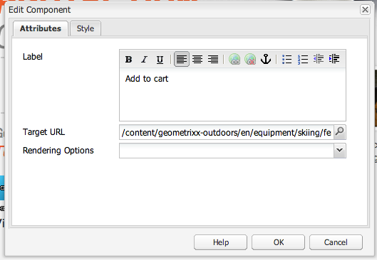

# Páginas de aterrizaje{#landing-pages}

La función de páginas de aterrizaje le permite importar fácil y rápidamente un diseño y contenido en una página de AEM. Un desarrollador de web puede preparar el HTML y los recursos adicionales que se pueden importar como página completa o solo parte de una página. Esta funcionalidad es útil para crear páginas de aterrizaje de marketing que solo estarán activas durante un periodo limitado y que deben crearse con rapidez.

En esta página se describe lo siguiente:

* el aspecto de las páginas de aterrizaje en AEM y los componentes disponibles
* cómo crear una página de aterrizaje y cómo importar un paquete de diseño
* cómo trabajar con páginas de aterrizaje en AEM
* cómo configurar páginas de aterrizaje móviles

El modo de preparar el paquete de diseño para su importación se explica en [Ampliar y configurar el importador de diseños](/help/sites-administering/extending-the-design-importer-for-landingpages.md). La integración con Adobe Analytics se explica en las [páginas de aterrizaje de la integración con Adobe Analytics.](/help/sites-administering/integrating-landing-pages-with-adobe-analytics.md)

>[!CAUTION]
>
>El Importador de diseños que se usa para importar páginas de aterrizaje [está en desuso en AEM 6.5](/help/release-notes/deprecated-removed-features.md#deprecated-features).

>[!CAUTION]
>
>Dado que el Importador de diseños requiere acceso a `/apps`, no funcionará en entornos de nube contenedores donde `/apps` es inmutable.

## ¿Qué son las Páginas de aterrizaje? {#what-are-landing-pages}

Las páginas de aterrizaje son sitios de una o varias páginas que constituyen el &quot;punto de conexión&quot; de un contacto de marketing; por ejemplo, mediante correo electrónico, adwords/titulares, redes sociales. Una página de aterrizaje puede tener varios propósitos, pero todas tienen una cosa en común: el visitante debería realizar una tarea, lo que define el éxito de una página de aterrizaje.

La función Páginas de aterrizaje en AEM permite a los expertos en marketing trabajar con diseñadores web en agencias o equipos creativos externos para crear diseños de páginas que se pueden importar fácilmente en AEM y que los expertos en marketing pueden editar y publicar en el mismo lugar que los sitios impulsados por AEM.

Para crear páginas de aterrizaje en AEM, siga los pasos siguientes:

1. Cree una página en AEM que contenga el lienzo de las páginas de aterrizaje. AEM se envía con una muestra denominada **Página importadora**.

1. [Prepare el HTML y los recursos.](/help/sites-administering/extending-the-design-importer-for-landingpages.md) 
1. Empaquete los recursos en un archivo comprimido (.zip) denominado Paquete de diseño.
1. Importe el paquete de diseño en la página del importador. 
1. Modifique y publique la página.

### Páginas de aterrizaje de escritorio {#desktop-landing-pages}

A continuación se muestra un ejemplo de una página de aterrizaje en AEM:

### Páginas de aterrizaje móviles {#mobile-landing-pages}

Una página de aterrizaje también puede tener una versión móvil. Para tener una versión móvil independiente de la página de aterrizaje, el diseño de importación debe tener dos archivos html: *index.htm(l)* y *mobile.index.htm(l)*.

El procedimiento de importación de la página de aterrizaje es el mismo que el de una página de aterrizaje normal pero el diseño de página de aterrizaje tiene un archivo HTML adicional que corresponde a la página de aterrizaje móvil. Este archivo HTML también debe tener un lienzo `div` con `id=cqcanvas`, como el HTML de la página de aterrizaje de escritorio, y admitirá todos los componentes editables descritos para la página de aterrizaje de escritorio.

La página de aterrizaje móvil se crea como una página secundaria de la página de aterrizaje de escritorio. Para abrirla, desplácese a la página de aterrizaje en Sitios web y abra la página secundaria.

>[!NOTE]
>
>La página de aterrizaje móvil se eliminará o desactivará junto con la de escritorio si se elimina o desactiva la página de aterrizaje de escritorio.

## Componentes de la página de aterrizaje  {#landing-page-components}

Para que partes del HTML importado se puedan editar en AEM, puede asignar contenido en el HTML de las páginas de aterrizaje a componentes de AEM directamente. El importador de diseños entiende los componentes siguientes de forma predeterminada:

* Texto, para cualquier texto
* Título, para contenido en etiquetas H1-6
* Imagen, para imágenes que debería poderse intercambiar
* Llamadas a acción:

   * Vínculo de pulsaciones
   * Vínculo gráfico

* Formulario CTA de posibles clientes, para capturar información sobre usuarios
* Sistema de párrafos (Parsys), para que se pueda añadir cualquier componente o convertir el componente superior

Asimismo, es posible ampliarlo y admitir componentes personalizados. Esta sección describe los componentes detalladamente.

### Texto {#text}

El componente Texto permite introducir un bloque de texto utilizando un editor WYSIWYG. Consulte [Componente de texto](/help/sites-authoring/default-components.md#text) para obtener más información.

A continuación se muestra un ejemplo de un componente de texto en una página de aterrizaje:

#### Título {#title}

El componente de título le permite mostrar un título y configurar su tamaño (h1-6). Consulte [Componente de título](/help/sites-authoring/default-components.md#title) para obtener más información.

A continuación se muestra un ejemplo de un componente de título en una página de aterrizaje:

#### Imagen {#image}

El componente de imagen muestra una imagen que puede arrastrar y soltar desde el Content Finder o en la que puede hacer clic para cargar. Consulte [Componente de imagen](/help/sites-authoring/default-components.md) para obtener más información.

A continuación se muestra un ejemplo de un componente de imagen en una página de aterrizaje:

#### Llamada a acción (CTA) {#call-to-action-cta}

El diseño de una página de aterrizaje puede tener varios vínculos; ciertos vínculos pueden considerarse “Llamadas a acción”.

La Llamada a acción (CTA) se utiliza para que el visitante realice una acción inmediata en la página de aterrizaje, como &quot;Suscribirme ahora&quot;, &quot;Ver este vídeo&quot;, &quot;Por un periodo limitado&quot;, etc.

* Vínculo de pulsaciones: le permite añadir un vínculo de texto que dirigirá al visitante a la URL de destino cuando haga clic en él.
* Vínculo gráfico: le permite añadir una imagen que dirigirá al visitante a una URL de destino cuando haga clic en ella.

Ambos componentes de llamada a acción tienen opciones similares. El vínculo de pulsaciones tiene opciones de texto enriquecido adicionales. Los componentes se describen detalladamente en los párrafos siguientes.

#### Vínculo de pulsaciones {#click-through-link}

Este componente de llamada a acción puede utilizarse para añadir un vínculo de texto en la página de aterrizaje. Se puede hacer clic en el vínculo para dirigir al usuario a la URL de destino especificada en las propiedades del componente. Forma parte del grupo &quot;Llamada a acción&quot;.

**** EtiquetaTexto que ven los usuarios. Puede modificar el formato con el editor de texto enriquecido.

**URL de destinatarioIntroduzca el** URI que desea que visiten los usuarios si hacen clic en el texto.

**Opciones** de procesamientoDescribe las opciones de procesamiento. Puede seleccionar entre las siguientes opciones:

* Cargar página en una nueva ventana del navegador
* Cargar página en la ventana actual
* Cargar página en el marco principal
* Cancelar todos los marcos y cargar la página en una ventana de navegador completa

**** CSSOen la ficha Estilo, introduzca una ruta de acceso a la hoja de estilo CSS.

**** IDOen la ficha Estilo, introduzca un ID para que el componente lo identifique de forma exclusiva.

A continuación se muestra un ejemplo de un vínculo de pulsaciones:

#### Vínculo gráfico {#graphical-link}

Este componente de llamada a acción puede utilizarse para añadir imágenes gráficas con un vínculo en la página de aterrizaje. La imagen puede ser un botón simple o cualquier imagen gráfica como fondo. Cuando se hace clic en la imagen, se dirigirá al usuario a la URL de destino especificada en las propiedades del componente. Forma parte del grupo **Llamada a acción**.

**** EtiquetaTexto que los usuarios ven en el gráfico. Puede modificar el formato con el editor de texto enriquecido.

**URL de destinatarioIntroduzca el** URI que desea que visiten los usuarios si hacen clic en la imagen.

**Opciones** de procesamientoDescribe las opciones de procesamiento. Puede seleccionar entre las siguientes opciones:

* Cargar página en una nueva ventana del navegador
* Cargar página en la ventana actual
* Cargar página en el marco principal
* Cancelar todos los marcos y cargar la página en una ventana de navegador completa

**** CSSOen la ficha Estilo, introduzca una ruta de acceso a la hoja de estilo CSS.

**** IDOen la ficha Estilo, introduzca un ID para que el componente lo identifique de forma exclusiva.

A continuación se muestra un ejemplo de un vínculo gráfico:

### Llamada a acción: formulario de posibles clientes {#call-to-action-cta-lead-form}

Los formularios de posibles clientes se utilizan para recopilar información de perfil de un visitante o posible cliente. Dicha información puede guardarse y utilizarse posteriormente para realizar campañas de marketing eficaces basadas en la información. Este información suele incluir título, nombre, correo electrónico, fecha de nacimiento, dirección, intereses, etc. Forma parte del grupo **Llamada a acción: formulario de posibles clientes**.

A continuación se muestra un ejemplo de llamada a acción: formulario de posibles clientes:

Los formularios de Llamada a acción: formularios de posibles clientes acción incluyen diferentes componentes:

* **Formulario de posibles clientes**
El componente Formulario de posibles clientes define el principio y el fin de un nuevo formulario en una página. Otros componentes se pueden situar entre estos elementos, como ID de correo electrónico, nombre, etc.

* **Campos y elementos de formulario**
Los campos y elementos de formulario pueden incluir cuadros de texto, botones de opción, imágenes, etc. El usuario suele finalizar una operación en un campo de formulario, como la introducción de texto. Consulte los elementos independientes de formulario para obtener más información.

* **Componentes de perfil** Los componentes de perfil se refieren a perfiles de usuarios que se utilizan para colaboración social y otras áreas donde la personalización de los usuarios es obligatoria.

El ejemplo anterior muestra un formulario; consta del componente **Formulario de posibles clientes** (inicio y final), con los campos **Nombre** y **Id. de correo electrónico** utilizados para la introducción de datos y un campo **Enviar**

Desde la barra de tareas, hay disponibles los componentes siguientes para Llamada a acción: formulario de posibles clientes:

#### Configuración común de muchos componentes del formulario de posibles clientes {#settings-common-to-many-lead-form-components}

Aunque cada uno de los componentes del formulario de posibles clientes tiene un propósito diferente, muchos están compuestos de opciones y parámetros similares.

Al configurar cualquiera de los componentes de formulario, estarán disponibles las fichas siguientes en el cuadro de diálogo:

* **Título y texto**
Aquí deberá especificar la información básica, como el título del componente y el texto que lo acompañe, si lo hay. Si es apropiado, también le permite definir otros tipos de información clave, como si se pueden realizar varias selecciones en el campo y si se pueden seleccionar elementos.

* **Valores iniciales** Permite especificar un valor por defecto.

* **Restricciones** Permite especificar si un campo es obligatorio y las restricciones de ese campo (por ejemplo, si debe ser numérico, etc.).

* **Estilo** Indica el tamaño y el estilo de los campos.

>[!NOTE]
>
>Los campos que se ven dependen del componente individual.
>
>No están disponibles todas las opciones en todos los componentes del formulario de posibles clientes. Consulte Formularios para ver más información sobre esta [configuración común](/help/sites-authoring/default-components.md#formsgroup).

#### Componentes del formulario de posibles clientes  {#lead-form-components}

En la sección siguiente se describen los componentes disponibles en Llamada a acción: formularios de posibles clientes.

**** AboutPermite que los usuarios agreguen información.

**Campo** de direcciónPermite a los usuarios introducir información de dirección. Al configurar este componente, debe especificar en Nombre de elemento en el cuadro de diálogo. El Nombre de elemento es el nombre del elemento del formulario. Indica en qué lugar del repositorio se almacenan los datos.

**Fecha de** nacimientoLos usuarios pueden introducir la información de fecha de nacimiento.

**ID** de correo electrónicoPermite a los usuarios introducir una dirección de correo electrónico (identificación).

**Nombre** Proporciona un campo para que los usuarios introduzcan su nombre.

**** SexoLos usuarios pueden seleccionar su sexo en una lista desplegable.

**ApellidosLos usuarios pueden introducir la información de Apellidos.** 

**Formulario** de posibles clientesAgregue este componente para agregar un formulario de posibles clientes a la página de aterrizaje. Un formulario de posibles clientes contiene los campos Inicio del formulario de posibles clientes y Fin del formulario de posibles clientes de forma predeterminada. Entre ellos, puede añadir los componentes de Formulario de posibles clientes descritos en esta sección.

El componente Formulario de posibles clientes define el inicio y el final de un formulario utilizando los elementos **Inicio de formulario** y **Fin de formulario**. Estos siempre están emparejados para garantizar que el formulario se define correctamente.

Tras añadir el formulario de posibles clientes, puede configurar el inicio o el final del formulario y hacer clic en **Editar** en la barra correspondiente.

**Inicio de formulario de posibles clientes**

Se pueden configurar dos fichas **Formulario** y **Avanzado**:

**Página de agradecimiento**
Página a la que se hace referencia para agradecer a los visitantes su contenido. Si se deja en blanco, el formulario se vuelve a mostrar tras el envío.

**Flujo de** trabajo de inicioDetermina qué flujo de trabajo se activa una vez que se envía un formulario de posibles clientes.

**Opciones** de anuncioLas siguientes opciones de anuncio están disponibles:

* Crear posible cliente
* Servicio de correo electrónico: crear suscriptor y añadir a la lista. Se utiliza con un proveedor de servicios de correo electrónico como ExactTarget.
* Servicio de correo electrónico: Enviar correo electrónico de respuesta automática: se utiliza si utiliza un proveedor de servicio de correo electrónico como ExactTarget.
* Servicio de correo electrónico: Cancelar la suscripción del usuario de la lista: se utiliza si utiliza un proveedor de servicio de correo electrónico como ExactTarget.
* Cancelar la suscripción del usuario 

**Identificador** del formularioEl identificador del formulario identifica de forma exclusiva el formulario de posibles clientes. Utilice el identificador del formulario si tiene varios formularios en una misma página; asegúrese de que tienen identificadores distintos.

**Cargar** rutaEs la ruta a las propiedades del nodo que se utiliza para cargar valores predefinidos en los campos del formulario de posibles clientes.

Se trata de un campo opcional que especifica la ruta a un nodo en el repositorio. Cuando este nodo cuenta con propiedades que coinciden con los nombres de campo, los campos apropiados del formulario se cargan previamente con el valor de estas propiedades. Si no existe coincidencia, el campo contiene el valor predeterminado.

**Validación** del clienteIndica si se requiere la validación del cliente para este formulario (la validación del servidor siempre se produce). Esto se puede lograr junto con el componente Captcha de Forms.

**Validación** Tipo de recursoDefine el tipo de recurso de validación del formulario si desea validar todo el formulario de posibles clientes (en lugar de los campos individuales).

Si va a validar el formulario completo, incluya también una de las siguientes operaciones:

* Un script para validación de cliente:
   ` /apps/<myApp>/form/<myValidation>/formclientvalidation.jsp`

* Un script para validación de servidor:
   ` /apps/<myApp>/form/<myValidation>/formservervalidation.jsp`

**Configuración** de la acciónSegún la selección en Opciones de anuncio, cambia la Configuración de la acción. Por ejemplo, cuando selecciona Crear posible cliente, puede configurar la lista a la que se añadirá el posible cliente.

* **Mostrar el botón de Enviar** Indica si se debería mostrar el botón de Enviar o no.

* **Enviar nombre** Identificador por si utiliza múltiples botones de envío en un formulario.

* **Enviar título** Nombre que aparece en el botón, como Enviar.

* **Mostrar el botón de Reiniciar** Seleccione la casilla para hacer visible el botón de Reiniciar.

* **Reiniciar título** Nombre que aparece en el botón de Reiniciar.

* **Descripción** Información que aparece debajo del botón.

## Crear una página de aterrizaje {#creating-a-landing-page}

Para crear una página de aterrizaje, debe seguir tres pasos:

1. Cree una página de importador.
1. [Prepare el HTML para su importación.](/help/sites-administering/extending-the-design-importer-for-landingpages.md) 
1. Importe el paquete de diseño.

### Uso del Importador de diseños  {#use-of-the-design-importer}

Puesto que importar páginas implica preparar el HTML y verificar y probar las páginas, el proceso de importación de páginas de aterrizaje está pensado como una tarea de administración. Como administradores, los usuarios que realicen la importación necesitan permisos de lectura, escritura, creación y eliminación en `/apps`. Si el usuario no tiene esos permisos, la importación no se podrá realizar.

>[!NOTE]
>
>Dado que el importador de diseños está diseñado como una herramienta de administración que requiere permisos de lectura, escritura, creación y eliminación en `/apps`, Adobe no recomienda usar el importador de diseños en producción.

En cambio, Adobe recomienda usar el Importador de diseños en una instancia de ensayo. En la instancia de ensayo, el desarrollador responsable de implementar el código en la instancia de producción podrá probar el proceso de importación y validarlo.

### Crear una página de importador {#creating-an-importer-page}

Antes de importar el diseño de la página de aterrizaje, debe crear una página de importador, por ejemplo, en una campaña. La plantilla de Página de importador le permite importar la página de aterrizaje completa en formato HTML. La página contiene un cuadro en el que se puede importar el paquete de diseño de la página de aterrizaje si lo arrastra y suelta.

>[!NOTE]
>
>De forma predeterminada, una página importadora solo puede crearse en campañas, pero también puede superponer esta plantilla para crear una página de aterrizaje en `/content/mysite`.

Para crear una nueva página de aterrizaje:

1. Vaya a la consola **Sitios web**.
1. Seleccione su campaña en el panel izquierdo.
1. Haga clic en **Nuevo** para abrir la ventana **Crear página**.
1. Seleccione la plantilla **Página importadora**, añada un título y, si lo desea, un nombre, y haga clic en **Crear**.

   

   Se muestra la nueva página del importador.

### Preparar el HTML para su importación  {#preparing-the-html-for-import}

Antes de importar el paquete de diseño, el HTML debe prepararse. Consulte [Ampliar y configurar el importador de diseños](/help/sites-administering/extending-the-design-importer-for-landingpages.md) para obtener más información.

### Importar el paquete de diseño  {#importing-the-design-package}

Tras crear una página importadora, puede importar un paquete de diseño en la misma. Los detalles acerca de cómo crear el paquete de diseño y su estructura recomendada se explican en [ Ampliar y configurar la importación de diseños](/help/sites-administering/extending-the-design-importer-for-landingpages.md).

Si el paquete de diseño está preparado, en los siguientes pasos se describe cómo importar el paquete de diseño en una página del importador.

1. Abra la página del importador que [creó anteriormente](#creatingablankcanvaspage).

   

1. Arrastre el paquete de diseño y colóquelo en el buzón. Verá que la flecha cambia de dirección cuando se arrastra un paquete por encima.
1. Como resultado, verá la página de aterrizaje en lugar de la página importadora. La página de aterrizaje HTML se ha importado correctamente.

   

>[!NOTE]
>
>Tras la importación, el marcado se corrige por motivos de seguridad y para evitar la importación y publicación del marcado que no sea válido. Debido a ello, el marcado que sea solo HTML y cualquier otra forma de elemento, como el SVG incorporado o los componentes web se eliminarán.

>[!NOTE]
>
>Si tiene problemas al importar el paquete de diseño, consulte [Solución de problemas](/help/sites-administering/extending-the-design-importer-for-landingpages.md#troubleshooting).

## Uso de páginas de aterrizaje  {#working-with-landing-pages}

Normalmente, un diseñador en una agencia crea el diseño y los recursos de una página de aterrizaje con herramientas como Adobe Photoshop o Adobe Dreamweaver. Cuando ha terminado el diseño, el diseñador envía un archivo comprimido con todos los recursos al equipo de marketing. La persona de contacto en marketing es responsable de transferir el archivo comprimido a AEM y publicar su contenido.

Asimismo, es posible que el diseñador tenga que modificar la página de aterrizaje tras la importación; para ello, deberá editar o eliminar contenido y configurar los componentes de llamada a acción. Por último, es posible que el experto en marketing desee previsualizar la página de aterrizaje y activar la campaña para comprobar que la página de aterrizaje se ha publicado.

Esta sección describe cómo hacer lo siguiente:

* Eliminar una página de aterrizaje
* Descargar el paquete de diseño
* Ver información de importación
* Restaurar una página de aterrizaje
* [Configurar los componentes de CTA y añadir contenido en la página](#call-to-action-cta)
* Previsualizar la página de aterrizaje
* Activar/publicar una página de aterrizaje

Cuando se importa un paquete de diseño, las opciones **Borrar diseño** y **Descargar archivo ZIP importado** están disponibles en el menú de configuración de la página:

### Descarga del paquete de diseño importado {#downloading-the-imported-design-package}

La descarga del archivo comprimido le permite registrar qué archivo comprimido se ha importado en una página de aterrizaje concreta. Tenga en cuenta que los cambios que se realicen en esta página no se añadirán al archivo comprimido.

Para descargar el paquete de diseño importado, haga clic en **Descargar archivo comprimido** en la barra de herramientas de la página de aterrizaje.

### Visualizar información de importación  {#viewing-import-information}

Puede ver información sobre la última importación en cualquier momento si hace clic en el signo de exclamación azul de la parte superior de la página de aterrizaje, en la interfaz de usuario clásica.

Si el paquete de diseño importado tiene problemas (si, por ejemplo, hace referencia a imágenes o scripts que no existen en el paquete, etc.), el importador de diseños muestra los problemas en una lista. Para ver la lista de problemas, haga clic en el vínculo de problemas de la Página de aterrizaje que está en la barra de herramientas de la interfaz de usuario clásica. En la siguiente imagen, al hacer clic en el vínculo **Problemas** se abre la ventana Problemas de importación.

### Restaurar una página de aterrizaje {#resetting-a-landing-page}

Si desea volver a importar el paquete de diseño de la página de aterrizaje tras realizar algunos cambios en ella, puede “borrarla” si hace clic en **Borrar** en la parte superior de la página de aterrizaje en la interfaz de usuario clásica o hace clic en Borrar en el menú Configuración en la interfaz de usuario táctil. Al hacer esto, se borrará la página de aterrizaje importada y se creará otra en blanco.

Al borrar la página de aterrizaje, puede eliminar los cambios de contenido. Si hace clic en **No**, se conservan los cambios de contenido, es decir, se conserva la estructura de `jcr:content/importer`y sólo se eliminan el componente de página importador y los recursos de `etc/design`. Mientras que, si hace clic en **Sí**, también se elimina el `jcr:content/importer`.

>[!NOTE]
>
>Si decide eliminar los cambios de contenido, al hacer clic en **Borrar** se perderán todos los cambios realizados en la página de aterrizaje importada, así como las propiedades de página.

### Modificar y añadir componentes en una página de aterrizaje {#modifying-and-adding-components-on-a-landing-page}

Para modificar componentes en la página de aterrizaje, haga doble clic en ellos para abrirlos y editarlos como lo haría con cualquier otro componente.

Para añadir componentes a la página de aterrizaje, arrástrelos y colóquelos en la página de aterrizaje (ya sea desde la barra de tareas en la interfaz de usuario clásica o desde el panel Componentes en la interfaz de usuario táctil) y edítelos según corresponda.

>[!NOTE]
>
>Si un componente de la página de aterrizaje no puede editarse, debe volver a importar el archivo comprimido tras [modificar el archivo HTML.](/help/sites-administering/extending-the-design-importer-for-landingpages.md) Significa que, durante la importación, las partes no editables no se convirtieron en componentes de AEM.

### Eliminar una página de aterrizaje  {#deleting-a-landing-page}

Eliminar una página de aterrizaje es como eliminar una página normal de AEM.

La única excepción es que, cuando se elimina una página de aterrizaje de escritorio, también se eliminará la página de aterrizaje móvil correspondiente (si existe) pero no al revés.

### Publicar una página de aterrizaje  {#publishing-a-landing-page}

Puede publicar la página de aterrizaje y todas sus dependencias como publicar una página normal.

>[!NOTE]
>
>La publicación de una página de aterrizaje de escritorio también publica su versión móvil correspondiente (si existe). Sin embargo, la publicación de una página de aterrizaje móvil no publica la versión de escritorio.
