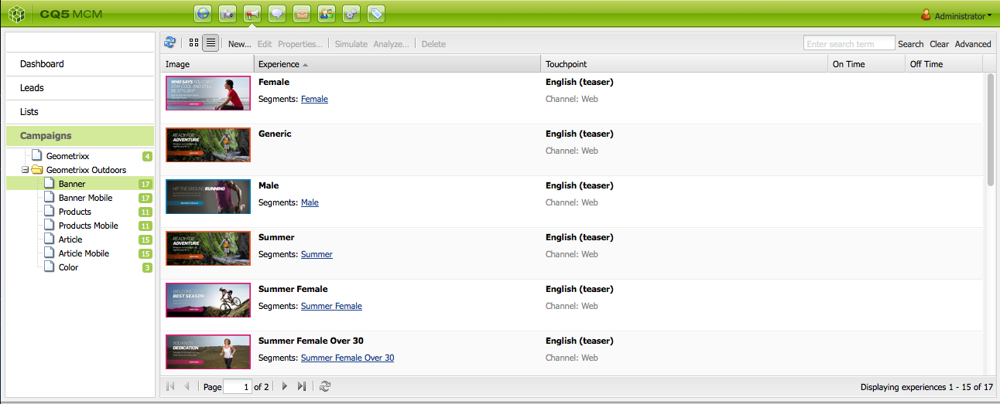

# Trabajar con el administrador de campañas de marketing{#working-with-the-marketing-campaign-manager}

AEM En la práctica, el Administrador de campañas de marketing (MCM, Marketing Campaign Manager ) es una consola que le ayuda a administrar campañas multicanal. Con este software de automatización de marketing puede administrar todas sus marcas, campañas y experiencias, así como los segmentos, las listas, los posibles clientes y los informes relacionados.

AEM Se puede acceder a MCM desde varias ubicaciones en la; por ejemplo, la pantalla de bienvenida, mediante el icono Campañas o con la dirección URL:

`https://<hostname>:<port>/libs/mcm/content/admin.html`

Por ejemplo:

`https://localhost:4502/libs/mcm/content/admin.html`

Desde el MCM puede acceder a:

* **[Tablero](#dashboard)**
Se divide en cuatro paneles:

   * [Listas](#lists)
Este panel muestra las listas que ya ha creado, junto con el número de posibles clientes de esa lista. Desde este panel puede crear una lista directamente o importar posibles clientes para crear una lista.
Si selecciona una lista específica, accederá al [Listas](#lists) sección que muestra los detalles de la lista.

   * [Segmentos](/help/sites-classic-ui-authoring/classic-personalization-campaigns.md#anoverviewofsegmentation)
Este panel muestra los segmentos que ha definido. Los segmentos le permiten caracterizar una colección de visitantes que comparten determinadas características.
Al seleccionar un segmento específico, se abre la página de definición del segmento.

   * [Informes](/help/sites-administering/reporting.md)
AEM proporciona diferentes informes para ayudarle a analizar y monitorizar el estado de la instancia. En este panel del MCM se enumeran los informes.
Al seleccionar un informe, se abre la página del informe.

   * [Campañas](#campaigns)
Este panel enumera las experiencias de campaña como [boletines](/help/sites-classic-ui-authoring/classic-personalization-campaigns.md#newsletters) y [teasers](/help/sites-classic-ui-authoring/classic-personalization-campaigns.md#teasers).

* **[Posibles clientes](#leads)**
Aquí puede administrar sus posibles clientes. Puede crear o importar posibles clientes, editar detalles específicos para posibles clientes o eliminarlos cuando ya no los necesite. También puede colocar posibles clientes en diferentes grupos, denominados Listas. **Nota:** El Adobe no tiene previsto seguir mejorando esta capacidad.
La recomendación es utilizar [Adobe Campaign AEM y la integración para la integración de los recursos](/help/sites-administering/campaign.md).

* **[Listas](#lists)**
Aquí puede administrar sus listas (de posibles clientes).**Nota:** El Adobe no tiene previsto seguir mejorando esta capacidad.
La recomendación es utilizar [Adobe Campaign AEM y la integración para la integración de los recursos](/help/sites-administering/campaign.md).

* **[Campañas](#campaigns)**
Aquí puede administrar sus marcas, campañas y experiencias.

## Panel {#dashboard}

El tablero muestra cuatro paneles que le proporcionan una visión general de sus listas (de posibles clientes), segmentos, informes y campañas. El acceso a la funcionalidad básica para estos también está disponible aquí.

### posibles clientes {#leads}

>[!NOTE]
>
>El Adobe no tiene previsto seguir mejorando esta capacidad (gestión de posibles clientes).
>La recomendación es utilizar [Adobe Campaign AEM y la integración para la integración de los recursos](/help/sites-administering/campaign.md).

AEM En MCM, puede organizar y agregar posibles clientes introduciéndolos manualmente o importando una lista separada por comas; por ejemplo, una lista de correo. Otras formas de generar posibles clientes son las suscripciones a boletines informativos o las suscripciones a la comunidad (si se configuran, pueden almacenar en déclencheur un flujo de trabajo que rellena los posibles clientes). Los posibles clientes suelen clasificarse y colocarse en una lista para que posteriormente pueda realizar acciones en toda la lista; por ejemplo, enviar un correo electrónico personalizado a una lista determinada.

En **Posibles clientes** en el panel izquierdo puede crear, importar, editar y eliminar sus posibles clientes, y luego activarlos o desactivarlos según sea necesario. Puede agregar un posible cliente a una lista o ver a qué listas pertenece.

>[!NOTE]
>
>Consulte [Uso de posibles clientes](/help/sites-classic-ui-authoring/classic-personalization-campaigns.md#workingwithleads) para obtener información detallada sobre tareas específicas.

### Listas {#lists}

>[!NOTE]
>
>El Adobe no tiene previsto mejorar esta capacidad (administración de listas).
>La recomendación es utilizar [Adobe Campaign AEM y la integración para la integración de los recursos](/help/sites-administering/campaign.md).

Las listas permiten organizar los posibles clientes en grupos. Con las listas, puede dirigir sus campañas de marketing a un grupo selecto de personas; por ejemplo, puede enviar una newsletter segmentada a una lista.

En **Listas**, puede administrar las listas creando, importando, editando, combinando y eliminando listas que puede activar o desactivar según sea necesario. También puede ver los posibles clientes dentro de esa lista, ver si la lista es miembro de otra lista o ver la descripción.

>[!NOTE]
>
>Consulte [Uso de listas](/help/sites-classic-ui-authoring/classic-personalization-campaigns.md#workingwithlists) para obtener información detallada sobre tareas específicas.

### Campañas {#campaigns}

>[!NOTE]
>
>Consulte [Teasers and Strategies](/help/sites-classic-ui-authoring/classic-personalization-campaigns.md#workingwithlists), [Configuración de la campaña](/help/sites-classic-ui-authoring/classic-personalization-campaigns.md#settingupyourcampaign) y [Newsletters](/help/sites-classic-ui-authoring/classic-personalization-campaigns.md#newsletters) para obtener información detallada sobre tareas específicas.

Para acceder a las campañas existentes, en el MCM, haga clic en **Campañas**.

* **En el panel izquierdo**: Hay una lista de todas las marcas y campañas.
Al hacer clic en una marca, se expande la lista para mostrar todas las campañas relacionadas en el panel izquierdo; esta lista también muestra el número de experiencias que existen para cada campaña. También abre la descripción general de la marca en el panel derecho.

* **En el panel derecho**: se muestran los iconos de cada marca (no se mostrarán las campañas históricas).
Puede hacer doble clic en estas opciones para abrir la descripción general de la marca.

#### Información general de marca {#brand-overview}

Desde aquí puede hacer lo siguiente:

* Consulte el número de campañas y experiencias (el número se muestra en el panel izquierdo) que existen para esta marca.
* Crear un **Nuevo...** campaña para esta marca.

* Cambie el intervalo de tiempo que se está viendo; seleccione **Semana**, **Mes** o **Trimestre**, utilice las flechas para seleccionar periodos específicos o volver a **Hoy**.

* Seleccione una campaña (en el panel derecho) para lo siguiente:

   * Edite el **Propiedades...**
   * **Eliminar** la campaña.

* Abra la información general de la campaña (haga doble clic en una campaña en el panel derecho o haga clic en el panel izquierdo).

#### Información general de Campaign {#campaign-overview}

Para las campañas individuales hay dos vistas disponibles:

1. **Vista de calendario**

   Utilice el icono:

   

   Presenta una lista de todos los puntos de contacto (gris) con un periodo de tiempo horizontal de las experiencias (verde) conectadas a ese punto de contacto:

   

   Desde aquí puede hacer lo siguiente:

   * Cambie el intervalo de tiempo que está viendo mediante las flechas o vuelva a **Hoy**.

   * Uso **Agregar Touchpoint...** para añadir un nuevo punto de contacto para una experiencia existente.

   * Haga clic en un teaser (en el panel derecho) para establecer el **Tiempo de activación** y **Tiempo de inactividad**.

1. **Vista de lista**

   Utilice el icono:

   

   Esta lista enumera todas las experiencias (por ejemplo, teasers y boletines informativos) de la campaña seleccionada:

   

   Desde aquí puede hacer lo siguiente:

   * Crear un **Nuevo...** experiencia; por ejemplo, ofertas, teasers y boletines de Adobe Target.
   * **Editar** los detalles de una página teaser o newsletter específicos (también se puede utilizar un doble clic).
   * Defina el **Propiedades...** para una página teaser o newsletter específicos.
   * **Simular** el aspecto de una experiencia (página teaser o newsletter).
Cuando se abra la página simulada, puede abrir la barra de tareas para cambiar al modo de edición de esa página.

   * **Analizar...** las impresiones generadas para una página.

   * **Eliminar** elementos cuando ya no sean necesarios.
   * **Buscar** para el texto (se busca el campo Title de la experiencia).
   * Uso **Avanzadas** buscar para aplicar filtros a la búsqueda.

### Simulación de las experiencias de Campaign {#simulating-your-campaign-experiences}

En el MCM, haga clic en **Campañas**. Asegúrese de que la vista de lista esté activa, seleccione la experiencia de campaña necesaria y haga clic en **Simular**. El punto de contacto (página de teaser o de newsletter) se abrirá para mostrar la experiencia seleccionada, tal como la verá el visitante.

Desde aquí también puede abrir la barra de tareas (haga clic en la pequeña flecha hacia abajo) para cambiar al modo de edición y actualizar la página.

### Análisis de las experiencias de Campaign {#analyzing-your-campaign-experiences}

En el MCM, haga clic en **Campañas**. Asegúrese de que la vista de lista esté activa, seleccione la experiencia de campaña necesaria y seleccione **Analizar...**. Se muestra un gráfico de las impresiones de la página a lo largo del tiempo.

