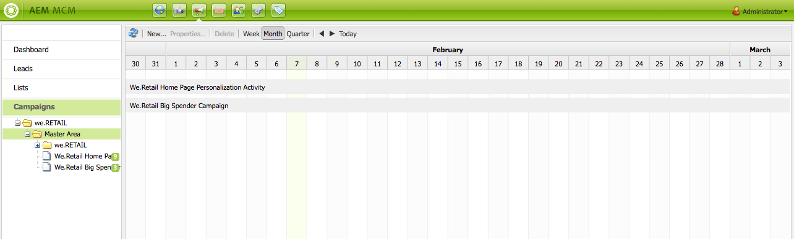

# Trabajo con Marketing Campaign Manager{#working-with-the-marketing-campaign-manager}

En AEM, Marketing Campaign Manager (MCM) es una consola que le permite administrar campañas con varios canales. Con este software de automatización de marketing podrá administrar todas sus marcas, campañas y experiencias, junto con los informes, posibles clientes, listas y segmentos relacionados.

Se puede acceder a MCM desde varias ubicaciones de AEM; por ejemplo, la pantalla de bienvenida, el icono Campañas o la dirección URL:

`https://<hostname>:<port>/libs/mcm/content/admin.html`

Por ejemplo:

`https://localhost:4502/libs/mcm/content/admin.html`

Desde MCM podrá acceder al:

* **[Tablero](#dashboard)** Se divide en cuatro paneles:

   * [Listas](#lists)En este panel se muestran las listas que ya ha creado y el número de posibles clientes de la lista. Desde este panel podrá crear una lista nueva directamente o importar posibles clientes para crear una lista nueva.
Si selecciona una lista específica, pasará a la sección [Listas](#lists), que le mostrará detalles de la lista.

   * [Segmentos](/help/sites-classic-ui-authoring/classic-personalization-campaigns.md#anoverviewofsegmentation)En este panel se muestran los segmentos que haya definido. Los segmentos le permiten agrupar una colección de visitantes que comparten ciertas características.
Si se selecciona un segmento específico, se abrirá la página de definición del segmento.

   * [Informes](/help/sites-administering/reporting.md)AEM proporciona distintos informes para ayudarlo a analizar y controlar el estado de su instancia. Este panel MCM enumera los informes.
Si se selecciona un informe, se abrirá la página de informes.

   * [Campañas](#campaigns)En este panel se enumeran sus experiencias de campaña, como [newsletters](/help/sites-classic-ui-authoring/classic-personalization-campaigns.md#newsletters) y [teasers](/help/sites-classic-ui-authoring/classic-personalization-campaigns.md#teasers).

* **[Posibles clientes](#leads)** Desde aquí, podrá administrar los posibles clientes. Puede crear o importar posibles clientes, editar detalles específicos de posibles clientes o eliminarlos cuando ya no los necesite. También puede agrupar los posibles clientes en listas. **Nota:** Adobe no tiene previsto mejorar esta capacidad.
La recomendación es [ aprovechar Adobe Campaign y la integración a AEM](/help/sites-administering/campaign.md).

* **[Listas](#lists)** Desde aquí podrá administrar sus listas (de posibles clientes).**Nota:** Adobe no tiene previsto mejorar esta capacidad.
La recomendación es [ aprovechar Adobe Campaign y la integración a AEM](/help/sites-administering/campaign.md).

* **[Campañas](#campaigns)** Desde aquí podrá administrar sus marcas, campañas y experiencias.

## Tablero {#dashboard}

El tablero muestra cuatro paneles que le ofrecen información general de sus listas (de posibles clientes), segmentos, informes y campañas. Aquí también hay disponible funcionalidad básica para estas opciones.

### Posibles clientes {#leads}

>[!NOTE]
>
>Adobe no tiene previsto mejorar aún más esta capacidad (Gestión de posibles clientes).
>La recomendación es aprovechar [Adobe Campaign y la integración en AEM](/help/sites-administering/campaign.md).

En AEM MCM, es posible organizar y añadir posibles clientes introduciéndolos manualmente o importando una lista separada por comas; por ejemplo, una lista de correo. Las formas adicionales de generar posibles clientes consisten en los registros a boletines y comunidades (si se configuran, pueden generar un flujo de trabajo que rellene los posibles clientes). Los posibles clientes se suelen categorizar y situar en una lista para que más adelante se puedan realizar operaciones en toda la lista como, por ejemplo, enviar un correo electrónico personalizado a una lista concreta.

En el panel izquierdo de **Posibles clientes** podrá crear, importar, editar y eliminar los posibles clientes y activarlos o desactivarlos según convenga. Puede agregar un posible cliente a una lista o ver a qué listas pertenece.

>[!NOTE]
>
>Consulte [Trabajo con los posibles clientes](/help/sites-classic-ui-authoring/classic-personalization-campaigns.md#workingwithleads) para obtener información detallada sobre tareas específicas.

### Listas {#lists}

>[!NOTE]
>
>Adobe no tiene previsto mejorar aún más esta capacidad (Gestión de listas).
>La recomendación es aprovechar [Adobe Campaign y la integración en AEM](/help/sites-administering/campaign.md).

Las listas permiten organizar los posibles clientes en grupos. Con las listas, puede dirigir sus campañas de marketing a un grupo determinado de usuarios; por ejemplo, puede enviar un boletín dirigido a una lista.

En **Listas**, podrá administrar sus listas mediante la creación, importación, combinación y eliminación de listas que podrá activar o desactivar según convenga. También podrá visualizar los posibles clientes de la lista, comprobar si la lista forma parte de otra lista o ver la descripción.

>[!NOTE]
>
>Consulte [Uso de listas](/help/sites-classic-ui-authoring/classic-personalization-campaigns.md#workingwithlists) para obtener información detallada sobre tareas específicas.

### Campañas {#campaigns}

>[!NOTE]
>
>Consulte [Teasers y estrategias](/help/sites-classic-ui-authoring/classic-personalization-campaigns.md#workingwithlists), [Configuración de su campaña](/help/sites-classic-ui-authoring/classic-personalization-campaigns.md#settingupyourcampaign) y [Newsletters](/help/sites-classic-ui-authoring/classic-personalization-campaigns.md#newsletters) para obtener información detallada sobre tareas específicas.

Para acceder a las campañas existentes, en MCM, haga clic en **Campaigns** (Campañas).

* **En el panel izquierdo**: hay una lista de todas las marcas y campañas.
Si hace clic en una marca:

   * la lista se ampliará para mostrar todas las campañas relacionadas en el panel izquierdo; dicha lista también muestra el número de experiencias en cada campaña.
   * se abre la información general de la marca en el panel derecho.

* **En el panel derecho**: se muestran iconos para cada marca (las campañas históricas no se mostrarán).
Puede hacer doble clic en estos iconos para abrir la información general de la marca.

#### Información general de marca {#brand-overview}

Desde aquí puede:

* Ver las campañas y experiencias (su número se muestra en el panel izquierdo) que existen para esta marca.
* Crear una **Nueva...** campaña para esta marca.

* Cambiar el periodo de tiempo visualizado; seleccionar **Semana**, **Mes** o **Trimestre**, utilizar las flechas para seleccionar periodos específicos o volver a **Hoy**.

* Seleccionar una campaña (en el panel derecho) para:

   * Editar las **Propiedades...**
   * **Eliminar** la campaña.

* Abrir la información general de la campaña (haga doble clic en una campaña o haga clic en el panel izquierdo).

#### Información general de la campaña  {#campaign-overview}

Hay dos vistas disponibles para las campañas individuales:

1. **Vista de calendario**

   Utilice el icono:

   

   Se presentará una lista de todos los touchpoints (grises) con un intervalo de tiempo horizontal de las experiencias (verdes) conectadas con dicho touchpoint:

   

   Desde aquí puede:

   * Cambiar el periodo de tiempo visualizado mediante las flechas o volver a **Hoy**.

   * Utilizar **Añadir touchpoint...** para añadir un touchpoint nuevo a una experiencia existente.

   * Hacer clic en un teaser (en el panel derecho) para configurar el **Tiempo de activación** y **Tiempo de inactividad**.

1. **Vista de lista**

   Utilice el icono:

   

   Se muestran todas las experiencias (p. ej. teasers y newsletters) para la campaña seleccionada:

   

   Desde aquí puede:

   * Crear un **Nuevo...** experiencia; por ejemplo, ofertas de Adobe Target, teasers y newsletters.
   * **Editar** los detalles de una página de teaser o newsletter específica (también se puede hacer doble clic).
   * Definir las **Propiedades...** de una página de teaser o newsletter específica.
   * **Simular** el aspecto de una experiencia (página de teaser o newsletter).
Cuando la página simulada esté abierta podrá abrir la barra de tareas para cambiar al modo de edición para dicha página.

   * **Analizar...** las impresiones generadas por una página.

   * **Eliminar** elementos que ya no se necesitan.
   * **Buscar** texto (se buscará en el campo Título de la experiencia).
   * Utilice la búsqueda **Avanzada** para aplicar filtros a la búsqueda.

### Simulación de las experiencias de su campaña.  {#simulating-your-campaign-experiences}

En MCM, haga clic en **Campañas**. Compruebe que la vista de lista esté activa, seleccione la experiencia de campaña correspondiente y haga clic en **Simular**. Se abrirá el touchpoint (página de teaser o newsletter) para mostrar la experiencia seleccionada, tal como la verá el visitante.

Desde aquí también podrá abrir la barra de tareas (haga clic en la flecha pequeña hacia abajo) para cambiar al modo de edición para actualizar la página.

### Análisis de las experiencia de su campaña  {#analyzing-your-campaign-experiences}

En MCM, haga clic en **Campañas**. Compruebe que la vista de lista esté activa, seleccione la experiencia de campaña correspondiente y seleccione **Analizar...**. Se mostrará un gráfico de las impresiones de la página en el tiempo.

